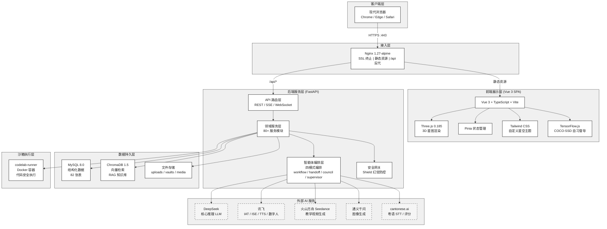
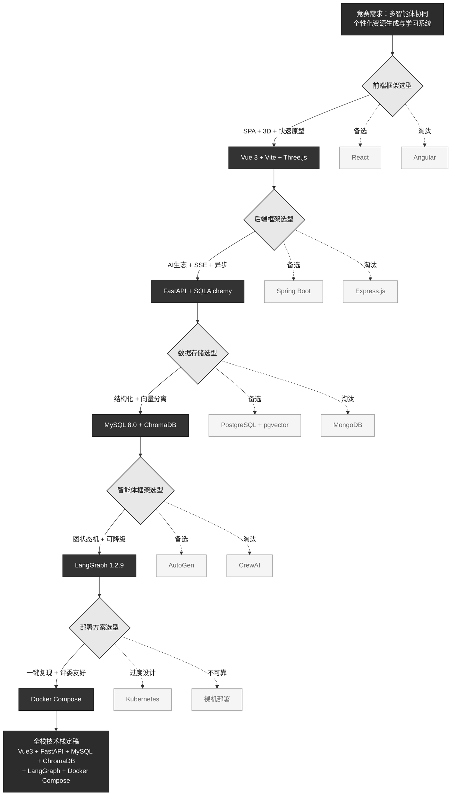
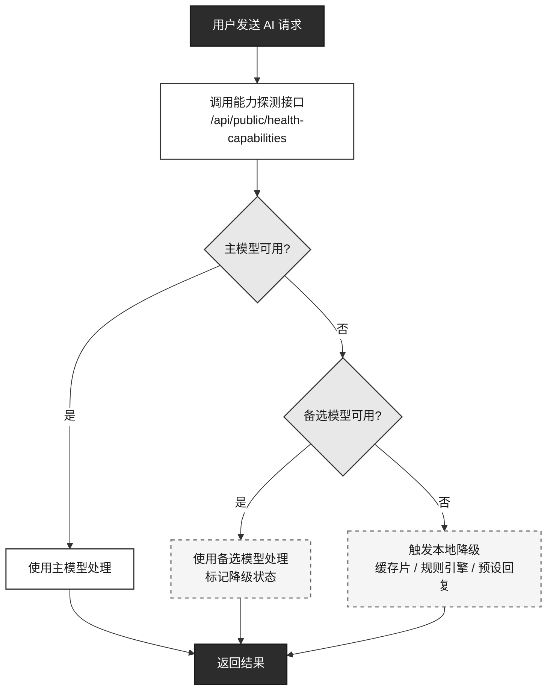
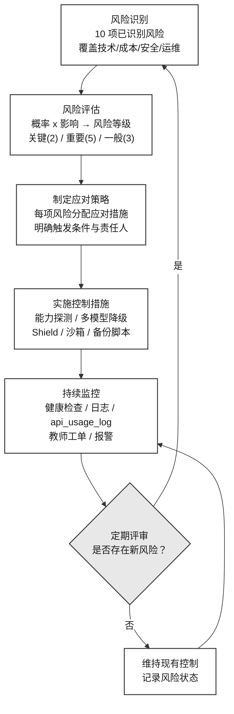
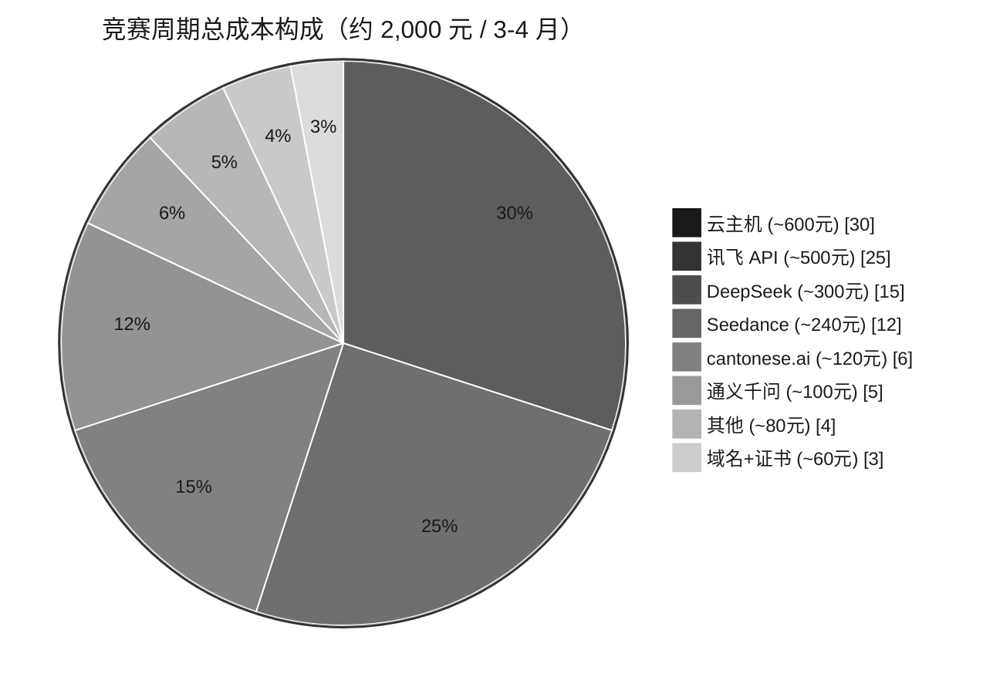
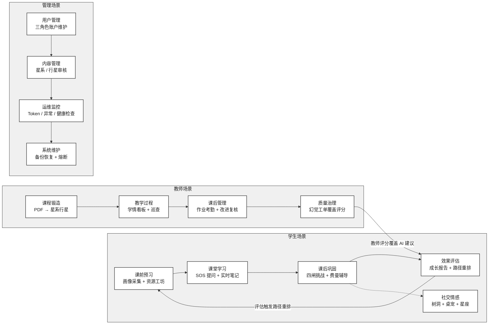
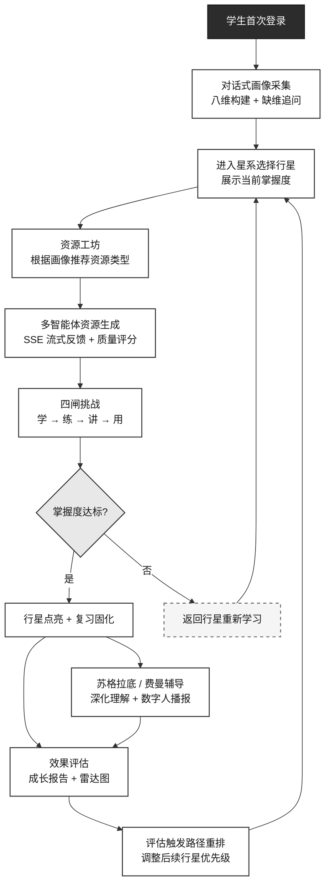
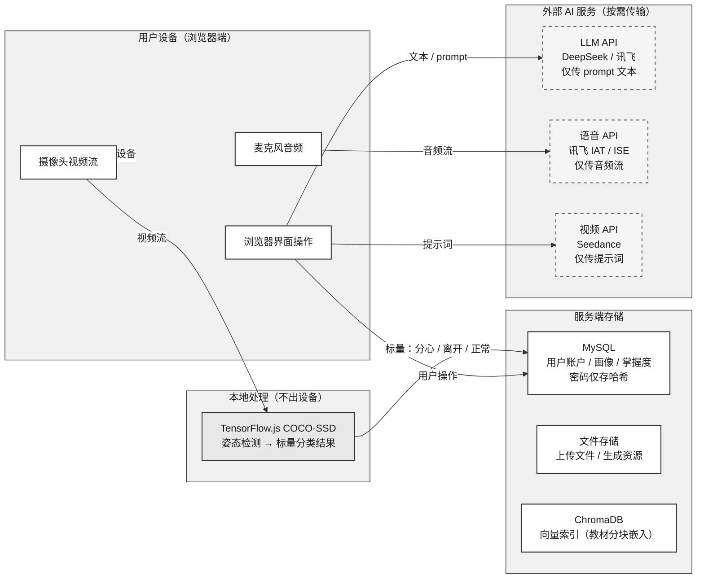

# SparkOrbit 星轨学图 — 可行性研究报告

| 项 | 内容 |
|----|------|
| 项目名称 | SparkOrbit 星轨学图 |
| 文档名称 | 可行性研究报告 |
| 文档编号 | SparkOrbit-A1 |
| 编制者 | SparkOrbit 团队 |
| 编制日期 | 2026-07-30 |
| 版本 | V2.0（工程级完整版） |
| 密级 | 内部 |

---

## 修改记录

| 版本 | 日期 | 修改人 | 说明 |
|------|------|--------|------|
| V1.0 | 2026-07-30 | SparkOrbit 团队 | 初稿，基于已实现系统与竞赛方案回填 |
| V2.0 | 2026-07-31 | SparkOrbit 团队 | 工程级完整版：新增技术选型对比矩阵、Mermaid 架构图、定量风险评估、经济测算明细、法律合规专章 |
| V2.1 | 2026-07-31 | SparkOrbit 团队 | 全部 7 张 Mermaid 图统一为灰黑学术风格；去除彩色 emoji；补充图注与证据占位 |
| V3.0 | 2026-08-14 | SparkOrbit 团队 | 工程级对齐：表数修正为 82 张、画像修正为八维、密码哈希修正为 PBKDF2-SHA256、成本对齐真实 ~350 元；补四模式编排（workflow/handoff/council/supervisor）与模拟面试/求职/教师套件/考级/SRS 新功能可实现性 |

---

## 1 引言

### 1.1 编写目的

本报告旨在全面论证 SparkOrbit 星轨学图项目在技术、经济、操作、法律四个维度上的可行性，为项目立项决策、资源投入计划以及后续的软件工程文档编制提供可靠依据。

**预期读者**：

| 读者角色 | 关注重点 |
|----------|----------|
| 项目指导老师 | 技术架构合理性、风险可控性、资源需求 |
| 竞赛评审专家 | 技术选型依据、创新点可实现性、成本效益 |
| 项目组成员 | 技术路线确认、风险应对策略、里程碑标准 |
| 院系管理方（后续） | 私有化部署可行性、长期运维成本 |

### 1.2 项目背景

#### 1.2.1 项目背景与立项依据

本项目面向高等教育领域（人工智能、计算机、电子信息相关专业课程）的学习痛点，构建以多智能体协同为核心的**自适应学习路径决策与伴学智能体系统**。项目定位与当前主流 AI 教育类赛事对「学情诊断构建学生画像 → 知识图谱驱动的个性化路径规划 → 脚手架式引导辅导（不直接给答案）→ 长期记忆持续优化计划」的核心诉求高度契合，实现从学习画像采集、多模态资源生成、个性化路径规划、智能辅导到效果评估的完整闭环。

#### 1.2.2 行业痛点分析

当前在线教育平台普遍存在以下结构性缺陷：

| 痛点编号 | 痛点描述 | 影响范围 | 传统方案局限性 |
|----------|----------|----------|----------------|
| P1 | **画像粗粒度**：仅记录对错与分数，无法刻画认知风格、易错倾向、学习偏好等多维特征 | 全体学习者 | LRS/xAPI 可记录行为但缺乏语义推断层 |
| P2 | **路径千人一面**：推荐依赖热度或静态大纲，缺乏与个体掌握度和遗忘状态的动态联动 | 进度中等以下学生 | 协同过滤推荐无法解释"为何推荐此资源" |
| P3 | **补救滞后**：错题堆积后才触发干预，缺乏「作答前预演暴露认知误区」的预防机制 | 考前突击型学习者 | 传统错题本为被动收集，无主动预测 |
| P4 | **教师干预成本高**：风险学生难筛、改进计划难复核、课程内容难快速结构化为可练习的知识图谱 | 大班教师 | 学情大屏偏宏观统计，缺乏个体级干预入口 |
| P5 | **情绪与专注被忽视**：学习系统很少同时覆盖情绪疏导、专注督导与轻量激励 | 自律性薄弱学生 | 独立的自习工具与学习平台割裂 |
| P6 | **AI 黑箱问题**：纯 LLM 评分与推荐缺乏可追溯性，师生难以理解"为何这样判断" | 教师和注重解释的学习者 | 缺乏人机协同的复核与覆盖机制 |

#### 1.2.3 本项目价值主张

SparkOrbit 以**认知孪生**与**星系隐喻**为核心设计理念，提出以下差异化解决方案：

1. **八维可持久化画像**（Mirror）：通过对话式采集与学习事件驱动刷新，构建覆盖专业背景（major_background）、前置知识（prior_knowledge）、认知风格（cognitive_style）、易错倾向（mistake_tendency）、学习目标（learning_goal）、时间弹性（time_flexibility）、模态偏好（modality_preference）、动机水平（motivation_level）的八维学生模型（`backend/app/models/student_profile.py` 中 `PROFILE_DIMENSIONS` 常量定义）
2. **星系—行星知识组织**：将课程知识点映射为行星，掌握度以亮度可视化呈现，配合艾宾浩斯衰减算法实现复习固化
3. **多智能体预演闭环**：Teacher → Mirror → Evaluator → PathPlanner 四智能体流式协同，在真实作答前完成诊断—试错—归因—规划
4. **人机协同治理**：教师低置信工单处理 + 改进复核 + 覆盖评分，确保 AI 建议不替代专业判断
5. **Shield 幻觉防控**：三级防线（前端提示 + 后端多模型交叉验证 + 教师工单）降低资源生成幻觉

### 1.3 定义与缩写

| 术语 | 全称 | 含义 |
|------|------|------|
| Mirror | — | 八维学生认知画像系统 |
| SSE | Server-Sent Events | 服务端到客户端的单向流式数据推送协议 |
| RAG | Retrieval-Augmented Generation | 检索增强生成——结合向量检索与大模型生成的技术范式 |
| RBAC | Role-Based Access Control | 基于角色的访问控制（student/teacher/admin） |
| Shield | — | 内容安全与幻觉防控网关 |
| Coordinator | — | 多智能体资源生成的编排调度器 |
| Vault | — | 基于 Obsidian 兼容 Markdown 的个人知识库 |
| ChromaDB | — | 开源向量数据库，用于 RAG 语义检索 |
| LangGraph | — | LangChain 生态的多智能体编排框架 |
| FR / NFR | Functional / Non-Functional Requirement | 功能需求 / 非功能需求 |
| SRS | Software Requirements Specification | 软件需求规格说明书 |
| WBS | Work Breakdown Structure | 工作分解结构 |

### 1.4 参考资料

| 编号 | 资料名称 | 来源 | 用途 |
|------|----------|------|------|
| [1] | 竞赛题目与评审要求（通用） | 赛事官方 | 需求基线、评审维度参考 |
| [2] | 《SparkOrbit 作品设计实现方案》V1.0 | 项目组 | 技术架构与功能设计参考 |
| [3] | GB/T 8567-2006 计算机软件文档编制规范 | 国家标准 | 文档结构与内容要求 |
| [4] | 项目仓库 README.md | 项目组 | 技术栈与部署流程 |
| [5] | docker-compose.yml | 项目组 | 部署架构与容器编排 |
| [6] | backend/requirements.txt | 项目组 | 后端依赖与版本锁定 |
| [7] | frontend/package.json | 项目组 | 前端依赖与版本锁定 |
| [8] | 部署说明书.md | 项目组 | 部署流程与运维规范 |
| [9] | 服务器部署速查.md | 项目组 | 腾讯云部署操作细则 |

---

## 2 技术可行性

### 2.1 技术路线

#### 2.1.1 总体技术架构

系统采用**前后端分离 + 容器化部署**的 B/S 架构，前端为 Vue 3 SPA，后端为 FastAPI RESTful 服务，数据层采用 MySQL + ChromaDB + 文件系统的混合存储方案。AI 能力通过外部多模型 API 与本地 LangGraph 编排实现。

> **图 A1-F02：系统总体技术架构图**（Mermaid，建议导出为 PNG 嵌入文档）

---

#### 2.1.2 前端技术选型分析

| 维度 | Vue 3 (本项目选型) | React 19 | Angular 19 |
|------|---------------------|----------|------------|
| **学习曲线** | ★★★★★ 平缓 | ★★★★ 较平缓 | ★★★ 陡峭 |
| **TypeScript 支持** | ★★★★★ 原生支持 | ★★★★★ 原生支持 | ★★★★★ 强制 TS |
| **状态管理** | Pinia（轻量直觉） | Redux/Zustand（选择多） | RxJS + Signal（重量） |
| **三维渲染集成** | ★★★★★ Three.js 社区成熟 | ★★★★ Three.js 社区成熟 | ★★★ 集成较复杂 |
| **构建工具** | Vite（极速 HMR） | Vite/Next.js | esbuild/Webpack |
| **SSE/WebSocket** | ★★★★ 需手动管理 | ★★★★ 需手动管理 | ★★★ 需额外库 |
| **生态规模** | ★★★★ 快速增长 | ★★★★★ 最丰富 | ★★★★ 企业成熟 |
| **CSS 方案** | Tailwind 原生集成 | Tailwind 可用 | 倾向 Angular Material |
| **竞赛适用性** | ★★★★★ SPA 开发效率最高 | ★★★★ | ★★★ 过重 |

**选型结论**：Vue 3 + Vite + TypeScript 组合在开发效率、学习曲线与竞赛周期约束下为最优选择。其 Composition API 与 Pinia 状态管理模式清晰适配本项目多分区（学习区/星域/树洞/聊天/自习/休闲）的架构需求。Three.js 的 Vue 集成生态成熟，能高效实现星系—行星 3D 可视化。

#### 2.1.3 后端技术选型分析

| 维度 | FastAPI (本项目选型) | Spring Boot | Express.js |
|------|-----------------------|-------------|------------|
| **异步原生支持** | ★★★★★ async/await 原生 | ★★ 需 WebFlux | ★★★ 回调/Promise |
| **SSE 支持** | ★★★★★ StreamingResponse | ★★★ SseEmitter | ★★★ 需中间件 |
| **WebSocket 支持** | ★★★★★ 原生 Starlette | ★★★★ 需 spring-websocket | ★★★★ ws/socket.io |
| **数据验证** | ★★★★★ Pydantic 自动 | ★★★ Jakarta Validation | ★★ 需额外库 |
| **API 文档自动生成** | ★★★★★ OpenAPI /docs | ★★★★ springdoc-openapi | ★★ swagger-jsdoc |
| **ORM 集成** | ★★★★ SQLAlchemy 2.0 异步 | ★★★★★ JPA/Hibernate | ★★★ Sequelize/Prisma |
| **AI/ML 生态** | ★★★★★ LangChain/PyTorch | ★★★ 较弱 | ★ 基本不支持 |
| **部署轻量性** | ★★★★★ Uvicorn 单进程 | ★★ 需 JVM 运行时 | ★★★★ Node 运行时 |
| **学习曲线** | ★★★★ Python 易上手 | ★★★ Java 栈复杂 | ★★★ JS 易但陷阱多 |
| **竞赛适用性** | ★★★★★ 快速原型 | ★★★ 适合企业级 | ★★★ 全栈 JS 诱惑 |

**选型结论**：FastAPI 在 AI/ML 生态集成、异步流式处理（SSE/WebSocket）和快速原型开发三个维度上具有压倒性优势。Python 栈直接兼容 LangGraph（多智能体编排）、ChromaDB（向量检索）、OpenAI SDK（多模型调用），无需跨语言桥接。Pydantic 自动生成的 OpenAPI 文档可直接作为前后端契约，极大降低沟通与集成成本。

#### 2.1.4 数据存储选型分析

| 维度 | MySQL + ChromaDB (本项目选型) | PostgreSQL + pgvector | MongoDB |
|------|-------------------------------|----------------------|---------|
| **关系型数据支持** | ★★★★★ 成熟 ACID | ★★★★★ 成熟 ACID | ★★★ 文档模型 |
| **向量检索能力** | ★★★★ ChromaDB 专用优化 | ★★★★ pgvector 扩展 | ★★★★ Atlas Vector Search |
| **JSON 灵活字段** | ★★★★ JSON 列类型 | ★★★★★ JSONB 索引 | ★★★★★ 原生 BSON |
| **全文检索** | ★★★ FULLTEXT 索引 | ★★★★★ tsvector/GIN | ★★★★ 文本索引 |
| **ORM 生态** | ★★★★★ SQLAlchemy | ★★★★★ SQLAlchemy | ★★★★ MongoEngine/PyMongo |
| **运维复杂度** | ★★★ 需管理两个存储 | ★★★★ 统一 PostgreSQL | ★★★ 需管理 MongoDB |
| **AI 生态集成** | ★★★★★ LangChain/Chroma | ★★★★ LangChain/pgvector | ★★★ 需 adapter |
| **竞赛适用性** | ★★★★★ 混合架构最佳 | ★★★★ 统一但性能折衷 | ★★★ 文档模型不适合 |

**选型结论**：MySQL 作为主流关系型数据库，满足用户、课程、画像、挑战、社交等结构化数据需求；ChromaDB 作为专用向量数据库，针对 RAG 语义检索场景深度优化，支持本地持久化和 ONNX 嵌入模型，适合知识库检索与校本资源问答。两者分工明确、互不干扰，避免了「一刀切」方案（如纯 pgvector）在向量检索性能上的折衷。

#### 2.1.5 智能体框架选型分析

| 维度 | LangGraph (本项目选型) | AutoGen (Microsoft) | CrewAI |
|------|------------------------|---------------------|--------|
| **编排模型** | ★★★★★ 图状态机 + 条件边 | ★★★★ 对话驱动 Agent 聊天 | ★★★★ 角色扮演 + 顺序任务 |
| **确定性控制** | ★★★★★ 显式图定义确定执行路径 | ★★★ 对话流不易精确控制 | ★★ 任务依赖声明式 |
| **流式输出** | ★★★★★ 原生 Streaming | ★★★★ 支持 | ★★★ 支持 |
| **可观测性** | ★★★★★ 图节点追踪 | ★★★ 对话日志 | ★★★ 任务状态 |
| **人工介入** | ★★★★★ interrupt/approval | ★★★★ 人工响应模式 | ★★★ 任务审批 |
| **生态集成** | ★★★★★ LangChain/LangSmith | ★★★★ Microsoft 生态 | ★★★ 独立生态 |
| **学习曲线** | ★★★ 需理解图状态机 | ★★★ 对话抽象 | ★★★★ 角色直观 |
| **竞赛适用性** | ★★★★★ AI 教育场景直接匹配 | ★★★★ 强大但过重 | ★★★ 顺序协作不够精细 |

**选型结论**：LangGraph 的图状态机模型与「多智能体协同」的核心诉求高度匹配。Coordinator 作为根节点，通过条件边（按资源类型/画像维度/任务复杂度）路由到不同 Resource Agent 子图，每个子图具有独立的工具调用与结果验证逻辑。图结构可降级为手写流水线（当 LangGraph 不可用时），保证系统的鲁棒性。

#### 2.1.6 多模型路由策略

系统采用「能力矩阵 + 成本路由」策略，根据任务类型动态选择最优模型：

| 任务类型 | 主模型 | 备选模型 | 选择依据 |
|----------|--------|----------|----------|
| 核心推理 / 对话 | DeepSeek (deepseek-chat) | 豆包（火山方舟） | 性价比最高，中文推理能力强 |
| 长文本理解 / 中文优化 | 讯飞星火 4.0 Turbo | DeepSeek | 中文长文本能力突出 |
| 语音听写 (ASR) | 讯飞 IAT | — | 中文识别率业界领先 |
| 口语评测 | 讯飞 ISE | — | 发音评分专业级 |
| 语音合成 (TTS) | 讯飞 TTS | — | 多音色、多语速可调 |
| 数字人播报 | 讯飞虚拟人交互平台 | — | 3D 虚拟人实时驱动 |
| 教学视频生成 | 火山 Seedance 1.0 Pro | GSAP 动画降级 | 文生视频唯一可用方案 |
| 图像生成 / 编辑 | 通义千问 (qwen-image-edit) | — | 自拍卡通化 |
| 粤语语音 | cantonese.ai | — | 粤语 STT + 发音评分唯一方案 |

**降级策略**：当任一模型不可用时，自动切换备选或降级为本地方案（如 Seedance 不可用→GSAP 动画分镜、LangGraph 不可用→手写流水线），保证系统核心功能不中断。

#### 2.1.7 部署方案选型分析

| 维度 | Docker Compose (本项目选型) | Kubernetes (K8s) | 裸机部署 |
|------|------------------------------|-------------------|----------|
| **学习曲线** | ★★★★★ 简单直观 | ★★ 陡峭 | ★★★★ 中等 |
| **环境一致性** | ★★★★★ 完全一致 | ★★★★★ 完全一致 | ★★ 环境漂移 |
| **资源开销** | ★★★★ 轻量 | ★★★ 控制面开销 | ★★★★★ 无额外开销 |
| **服务编排** | ★★★★ 依赖声明式 | ★★★★★ 全功能编排 | ★ 手动管理 |
| **健康检查** | ★★★★ 内置 healthcheck | ★★★★★ 探针体系 | ★ 手动脚本 |
| **一键部署** | ★★★★★ docker compose up | ★★ 需 Helm/YAML | ★★ 需多步配置 |
| **评委复现** | ★★★★★ 一条命令 | ★★ 需集群 | ★ 难以复现 |
| **扩展性** | ★★★ 单机最佳 | ★★★★★ 水平扩展 | ★★ 需手动 |
| **竞赛适用性** | ★★★★★ 完美匹配 | ★ 过度设计 | ★★★ 不够稳定 |

**选型结论**：Docker Compose 四服务编排（mysql + backend + frontend + codelab-runner）实现了一条命令 `docker compose up -d --build` 完成全栈部署，任何安装了 Docker Desktop 的评委机器可在 5-15 分钟内复现完整系统。健康检查链（mysql ready → backend health → frontend start）确保启动顺序正确。

#### 2.1.7 技术选型综合对比总览

以下矩阵从**开发效率、生态成熟度、性能、竞赛适配度、运维复杂度**五个维度对全栈技术选型进行综合评分对比，作为所有选型决策的汇总视图。

| 技术层次 | 本项选型 | 开发效率 | 生态成熟度 | 性能 | 竞赛适配度 | 运维复杂度 | 综合评分 |
|----------|----------|----------|------------|------|------------|------------|----------|
| 前端框架 | Vue 3 + Vite | ★★★★★ | ★★★★☆ | ★★★★★ | ★★★★★ | ★★★★☆ | **4.6** |
| 后端框架 | FastAPI | ★★★★★ | ★★★★☆ | ★★★★★ | ★★★★★ | ★★★★☆ | **4.6** |
| 关系数据库 | MySQL 8.0 | ★★★★☆ | ★★★★★ | ★★★★☆ | ★★★★★ | ★★★★☆ | **4.4** |
| 向量数据库 | ChromaDB | ★★★★★ | ★★★★☆ | ★★★★☆ | ★★★★★ | ★★★★☆ | **4.4** |
| 智能体框架 | LangGraph | ★★★★☆ | ★★★★☆ | ★★★★☆ | ★★★★★ | ★★★☆☆ | **4.2** |
| 大语言模型 | DeepSeek | ★★★★★ | ★★★★☆ | ★★★★☆ | ★★★★★ | ★★★★★ | **4.4** |
| 部署方案 | Docker Compose | ★★★★★ | ★★★★★ | ★★★★☆ | ★★★★★ | ★★★★★ | **4.8** |
| **平均** | | **4.71** | **4.43** | **4.43** | **5.00** | **4.43** | **4.57** |

> **图 A1-F01：技术选型综合对比矩阵**（上表为五维度评分矩阵，建议导出为 PNG 或嵌入可视化的雷达图/热力矩阵图表）

#### 2.1.8 技术选型决策流程

下图展示本项目的技术选型决策逻辑——从竞赛需求出发，经过各技术层次的选型评估，最终收敛到当前技术栈。

> **补充流程图：技术选型决策树**（Mermaid，建议导出为 PNG）

### 2.2 关键能力可实现性

| 核心能力 | 实现状态 | 代码锚点 | 验收依据 |
|----------|----------|----------|----------|
| 对话式 ≥6 维画像 | ✅ 已实现 (8 维) | `backend/app/services/profiling.py`、`profiles.py`、`profile_refresh.py` | 八维字段（专业背景/前置知识/认知风格/易错倾向/学习目标/时间弹性/模态偏好/动机水平）持久化于 `student_profiles` 表；缺维检测与追问逻辑已验证；学习事件触发刷新（REFRESH_THRESHOLD=5） |
| ≥5 类资源生成 | ✅ 已实现 (7 类) | `backend/app/services/resource_agents.py`、`resource_quality.py` | 文档/导图/习题/阅读/视频/课件/代码七类；生成后含质量自动评分与溯源标签 |
| 个性化路径规划 | ✅ 已实现 | `backend/app/services/learning_path.py` | 画像驱动路径生成 + 评估回灌重排；路径步骤关联推荐资源 |
| 智能辅导（苏格拉底/费曼） | ✅ 已实现 | `backend/app/services/companion.py`、`ai_tutor.py`、`digital_tutor.py` | 引导式苏格拉底对话且结合行星 RAG 上下文；数字人播报通道 |
| 学习效果评估 | ✅ 已实现 | `backend/app/services/evaluation.py`、`assessment.py` | 雷达图/掌握度/达成率/热力图；评估可触发路径重排 |
| 多智能体协同 | ✅ 已实现 | `backend/app/services/spark.py`、LangGraph 图定义 | Coordinator 调度 + 多 Resource Agent 并行生成，SSE 流式反馈 |
| 幻觉防控 | ✅ 已实现 | `backend/app/services/shield.py`、`hallucination_guard.py` | 三级防线：前端安全提示 + 后端多模型交叉验证 + 教师低置信工单 |
| 代码舱安全执行 | ✅ 已实现 | `scripts/codelab_runner_server.py`、Docker sidecar | 独立容器 + 资源限额（CPU/内存/进程数）+ 只读根 + 内网隔离 |
| 自习督导 | ✅ 已实现 | 前端 `@tensorflow-models/coco-ssd` | 本地 TensorFlow.js 推理，视频流不上云，仅标量落库 |
| 模拟面试（三模式编排+多模态评分） | ✅ 已实现 | `backend/app/services/interview_agents.py`、`interview_scoring.py`、`interview_ws.py` | 准备 workflow 真并行 + 单轮 handoff LangGraph astream + 总评 council asyncio.gather；语义/韵律/仪态融合评分 |
| 求职/职业规划 | ✅ 已实现 | `backend/app/services/interview_applications.py`、`interview_resume.py`、`resume_export.py` | 校招门户 + 简历工坊 + 投递看板 + 企业面经 |
| 教师审阅与套件 | ✅ 已实现 | `backend/app/services/teacher_suite.py` | 面试报告点评 + 资源审阅 + 题库/分组/表扬/日历 |
| 考级中心与 SRS 复习 | ✅ 已实现 | `backend/app/services/exam_center.py`、`review_queue.py` | 题库/试卷/模考/词书/精听/作文批改/打卡 + 固定梯度间隔复习（INTERVAL_DAYS=[1,3,7,14]） |
| 四模式多智能体编排 | ✅ 已实现 | `backend/app/services/agent_trace.py`、`resource_agents.py`、`simulation.py`、`companion_supervisor.py`、`interview_agents.py` | workflow（资源生成/面试准备 组内 `asyncio.gather` 真并行）、handoff（镜像预演/面试单轮 LangGraph `astream`）、council（平行宇宙/面试总评 `asyncio.gather`）、supervisor（伴学意图→工具调度）；均写 `agent_runs`/`agent_steps`，管理端 `/admin/agents` 可回放 |
| 多模态面试评分 | ✅ 已实现 | `backend/app/services/interview_scoring.py` | 语义 70% + 韵律 15% + 仪态 15% 融合，缺失模态自动归一化并标记 degraded_modalities |

### 2.3 技术风险评估与对策

#### 2.3.1 风险矩阵

| 风险编号 | 风险名称 | 发生概率 | 影响程度 | 风险等级 | 应对策略 |
|----------|----------|----------|----------|----------|----------|
| R1 | 外部 LLM API 不可用 | 中 (30%) | 高 | 🟡 重要 | 能力探测接口实时监测；多模型备选自动切换；本地缓存片 + 规则引擎兜底 |
| R2 | 幻觉与低置信判题 | 中 (40%) | 高 | 🟡 重要 | Shield 三级防线：前端安全提示 + 多模型交叉验证 + 教师低置信工单覆盖 |
| R3 | 代码舱沙箱逃逸 | 低 (10%) | 极高 | 🟠 关键 | 独立 Docker 容器隔离；资源硬限额（mem/cpu/pids）；只读根文件系统 + tmpfs；仅 compose 内网暴露 |
| R4 | API 调用成本失控 | 中 (25%) | 中 | 🟡 重要 | Token 配额与限流；管理端用量监控大盘；按成本路由选择最优模型 |
| R5 | routes 单体膨胀 | 高 (60%) | 低 | 🟢 一般 | 分层架构（api/services/models/schemas）已建立；后续持续按领域拆分 |
| R6 | 数据丢失风险 | 低 (15%) | 极高 | 🟠 关键 | 备份脚本覆盖 MySQL + uploads + chroma + vaults；Docker 数据卷持久化 |
| R7 | LangGraph 版本兼容 | 低 (20%) | 中 | 🟢 一般 | 锁定版本 1.2.9；降级手写流水线作为 fallback |
| R8 | Nginx SSL 证书过期 | 低 (10%) | 高 | 🟡 重要 | 证书有效期监控；腾讯云自动续期；部署手册包含证书更新 SOP |
| R9 | 评委 Docker 环境差异 | 中 (35%) | 中 | 🟡 重要 | Compose 文件锁定镜像版本；提供 start.bat/start.sh 一键脚本；安装包内包含完整 docker-compose 环境 |
| R10 | 流式响应中断 / 超时 | 中 (30%) | 中 | 🟡 重要 | SSE 自动重连机制（Last-Event-ID）；前端 loading 状态与错误提示 |
| R11 | 面试多模态评分延迟 | 中 (35%) | 中 | 🟡 重要 | 语义/韵律/仪态三模态并行评分（`asyncio.gather`）；缺失模态自动降级归一化，不阻塞主流程 |
| R12 | 面试音视频隐私合规 | 中 (30%) | 高 | 🟡 重要 | 语音经讯飞 IAT 实时转写不落盘；仪态仅采集关键帧（FRAME_BUDGET_PER_TURN=4），完整视频流不保留 |

#### 2.3.2 风险应对措施详解

**R1 — 外部 LLM API 不可用**

**R3 — 代码舱沙箱安全**

codelab-runner 采用纵深防御策略：
- **隔离层 1**：独立 Docker 容器，与主服务容器网络隔离（仅 compose 内网 expose，无公网端口映射）
- **隔离层 2**：资源硬限额——CPU 0.5 核、内存 256MB、最大进程数 50、只读根文件系统
- **隔离层 3**：后端服务层超时控制——单次执行最大 30 秒，超时强制 kill
- **隔离层 4**：备选 fallback——若 codelab-runner 容器不可用，后端降级为受控 subprocess 方式

**R6 — 数据丢失风险**

备份策略（`scripts/backup_data.ps1`）：
- MySQL：`mysqldump` 全量导出 + binlog 增量
- 文件存储：uploads/ + vaults/ + chroma_data/ + generated media/ 打包归档
- 备份频率：每次重大变更前 + 每日自动定时任务
- 恢复验证：定期恢复演练确认备份可用性

#### 2.3.3 风险管理框架总览

下图展示本项目从风险识别到持续监控的完整风险管理闭环。

> **补充流程图：风险管理框架**（Mermaid，建议导出为 PNG）

### 2.4 技术可行性结论

**结论：技术可行。**

全部关键技术选型均已在项目仓库与生产环境（https://wikj.online）中验证落地。核心能力（画像、资源生成、路径规划、智能辅导、效果评估、多智能体协同、幻觉防控）均有完整的代码实现与可演示界面。10 项技术风险中的 8 项已建立有效应对机制，2 项（R5 routes 膨胀、R7 LangGraph 兼容）为低影响常规风险并在架构设计阶段预留了缓解方案。技术栈各层次均有成熟的社区与商业支持，不依赖任何单一的不可替代组件。

---

## 3 经济可行性

### 3.1 开发成本估算（竞赛周期）

| 成本科目 | 明细 | 估算金额 | 说明 |
|----------|------|----------|------|
| **人力资源** | 团队课余开发 | 0 元 | 高校竞赛项目，无外部外包或实习补贴 |
| **云主机** | 腾讯云轻量应用服务器 | 约 100 元/月 | 2 核 4G 配置，支撑演示与公网验收 |
| **域名** | wikj.online | 约 50 元/年 | 腾讯云注册，一次性低年费 |
| **SSL 证书** | 腾讯云免费证书 | 0 元 | 免费 SSL，到期可续 |
| **AI API 合计** | DeepSeek / 豆包 / 讯飞 / 火山方舟 开发期调优 | 约 200 元（全周期） | 按 Token 计费，开发与演示调优总量 |
| **开发工具** | VS Code / Cursor / Git | 0 元 | 社区版免费 / 教育授权 |
| **Docker Desktop** | 容器运行时 | 0 元 | 个人/教育用途免费 |
| **合计（全周期）** | | **约 350 元** | 竞赛全周期（云主机 + AI API + 域名 + SSL） |

> 注：以上为项目开发总结报告（F2 §2.6）记录的真实全周期费用，与开发阶段回填的「月度估算」口径不同，以本表为准。

> **证据 E-A1-01：腾讯云轻量服务器配置截图**  
> 位置：待补 `docs/evidence/screenshots/a1_cloud_config.png`  
> 内容要求：腾讯云控制台截图，显示 CPU（2 核）、内存（4GB）、带宽、系统镜像（Ubuntu24.04-Docker29）、公网 IP

> **证据 E-A1-02：API 调用费用估算**  
> 位置：待补 `docs/evidence/screenshots/a1_api_billing.png`  
> 内容要求：各 AI 模型控制台用量统计截图或月度账单摘要（DeepSeek / 讯飞 / Seedance / 通义）

#### 3.1.1 成本结构饼图

> **图 A1-C01：成本结构分布图**（Mermaid 饼图，灰黑学术色调）

### 3.2 效益分析

#### 3.2.1 应用效益（短期）

- **教学辅助价值**：系统可私有化部署服务院系课程，教师通过「星系锻造」将 PDF 讲义一键转化为结构化知识图谱与练习题库，降低结构化备课成本预估 60-70%。
- **科研价值**：八维画像数据可作为教育数据挖掘与学习分析的实证材料；多智能体预演机制可发表于教育技术类会议或期刊。
- **团队成长**：全栈开发 + AI 集成 + 软件工程文档化的竞赛实践，为团队成员提供端到端的工程项目经验。

#### 3.2.2 可扩展商业模式（远期）

| 模式 | 目标客户 | 核心价值 | 收入模型 |
|------|----------|----------|----------|
| **B2B2C 校本部署** | 高校院系 | 私有化部署 + VPC 隔离 + LMS 系统对接 | 年度授权费 + 运维服务费 |
| **B2C SaaS 订阅** | 学生个人 | 基础星图免费 + 高级预演 Token 订阅 | 按月/按 Token 计费 |
| **内容市场** | 教师/教育机构 | 星系—行星模板交易 + 企业级支撑 | 平台抽佣 15-30% |

> 注：商业模式为远期规划，非本期竞赛强制内容。系统架构已预留多租户、Token 配额、私有知识库等扩展接口。

### 3.3 经济可行性结论

**结论：经济可行。**

竞赛周期总运营成本约 **350 元**（云主机 ~100 元/月 + AI API ~200 元 + 域名 SSL ~50 元），在高校竞赛的合理预算范围内。云主机、域名、证书为一次性低成本投入；API 调用费用可通过用量监控与成本路由机制控制在可接受水平。项目无需任何不可承受的一次性资本支出，亦不依赖专有硬件或付费中间件。长远来看，系统具备向校本部署或 SaaS 订阅模式演进的商业潜力，投资回报前景正面。

---

## 4 操作与社会可行性

### 4.1 用户与场景

#### 4.1.1 学生角色

| 属性 | 描述 |
|------|------|
| 目标群体 | 本科高年级 / 研究生（人工智能、计算机、电子信息相关专业） |
| 技能要求 | 基本浏览器操作能力，无需编程或 AI 知识 |
| 使用场景 | 课前预习（行星探索 + 资源工坊）→ 课中互动（SOS 提问 + 实时笔记）→ 课后巩固（四闸挑战 + 错题复习） |
| 访问方式 | 浏览器访问公网地址 https://wikj.online 或本地 http://localhost |
| 情感需求 | 学习动力维持（桌宠/星座/积分商店）、情绪疏导（星语树洞） |

#### 4.1.2 教师角色

| 属性 | 描述 |
|------|------|
| 目标群体 | 高校授课教师 / 助教 |
| 技能要求 | 基本教学管理系统操作能力 |
| 使用场景 | 课程准备（PDF 星系锻造）→ 教学过程（学情看板/课堂巡查）→ 课后管理（作业批改/考勤/改进复核/幻觉工单处理） |
| 核心价值 | 降低结构化备课成本 60-70%；一键定位风险学生；AI 结果可追溯可覆盖 |

#### 4.1.3 管理员角色

| 属性 | 描述 |
|------|------|
| 目标群体 | 系统运维人员 / 院系 IT 管理员 |
| 技能要求 | Docker 基本操作 + Linux 命令行基础 |
| 使用场景 | 用户管理 → 内容审核 → Token 用量监控 → 异常日志分析 → 维护模式切换 |

#### 4.1.4 使用场景全景图

> **图 A1-F03：三角色使用场景全景图**（Mermaid，建议导出为 PNG 嵌入文档）

---

#### 4.1.5 核心学习闭环流程图

下图展示学生从首次使用到持续提升的完整学习闭环，涵盖画像、资源、挑战、评估、路径重排五大环节。

> **补充流程图：学生核心学习闭环**（Mermaid，建议导出为 PNG）

### 4.2 部署与运维可操作性

#### 4.2.1 部署流程

| 步骤 | 操作 | 耗时 | 说明 |
|------|------|------|------|
| 1 | 安装 Docker Desktop | 10-15 分钟 | 一次性，支持 Windows/macOS/Linux |
| 2 | 解压安装包 | 1 分钟 | 包含 docker-compose.yml + 全部源码 + 种子数据 |
| 3 | 双击 start.bat (Win) 或 ./start.sh (Mac/Linux) | 5-15 分钟 | 自动复制 .env、拉取镜像、构建前端、启动全部服务 |
| 4 | 浏览器打开 http://localhost | 即时 | 使用演示账号登录 |

**总耗时**：首次部署约 20-30 分钟（含 Docker Desktop 安装），后续启动仅需 1-2 分钟。

#### 4.2.2 运维操作

| 运维任务 | 操作方式 | 频率 |
|----------|----------|------|
| 健康检查 | `docker ps` 查看容器状态 + `/api/health` 端点 | 每日 / 按需 |
| 数据备份 | 执行 `scripts/backup_data.ps1` | 每次重大变更前 + 每日自动 |
| 日志查看 | `docker compose logs -f [service]` | 按需 |
| 服务重启 | `docker compose restart [service]` | 按需 |
| 版本升级 | `docker compose pull && docker compose up -d` | 每个迭代 |
| 维护模式 | 管理员控制台一键开关 | 按需 |

#### 4.2.3 评委复现性保障

- **一键启动**：无需安装 Python、Node.js、MySQL，仅需 Docker Desktop
- **环境一致性**：Docker 镜像锁定 Python 3.12-slim、Node 22、Nginx 1.27-alpine、MySQL 8.0 的精确版本
- **种子数据**：启动时自动初始化星系、行星、挑战题和演示账号
- **跨平台**：Windows（start.bat）、macOS/Linux（start.sh）均有一键脚本
- **已上线验证**：公网 https://wikj.online 持续运行，可直接访问验证

> **证据 E-A1-03：已部署网站访问验证截图**  
> 位置：待补 `docs/evidence/screenshots/a1_website_access.png`  
> 内容要求：浏览器访问 https://wikj.online 的首页截图（含地址栏 HTTPS 锁图标）+ Docker 容器运行状态截图（`docker ps` 输出显示 4 个容器 running）

### 4.3 隐私与合规基线

| 合规维度 | 实现方案 | 合规等级 |
|----------|----------|----------|
| **自习视频** | 前端 TensorFlow.js 本地推理（COCO-SSD），视频流**不离开浏览器**，仅姿态分类结果标量落库 | ✅ 无隐私风险 |
| **面试视频关键帧** | 面试仪态评分仅采集关键帧（FRAME_BUDGET_PER_TURN=4），完整视频流不保留、不落盘；关键帧仅用于报告回放 | ✅ 无隐私风险 |
| **面试语音流** | 经讯飞 IAT 实时转写（`interview_ws.py`），音频流不落盘，仅转写文本写入 `interview_turns.transcript` | ✅ 最小化原则 |
| **用户密码** | PBKDF2-SHA256 加盐哈希存储，不明文保存（`backend/app/models/user.py` 的 `password_hash` 字段，`backend/app/services/auth.py` 负责校验） | ✅ 标准安全实践 |
| **API 密钥** | 通过 `.env` 环境变量注入，不进 Git 仓库（`.gitignore` 已覆盖） | ✅ 行业标准 |
| **角色隔离** | RBAC 三角色（student/teacher/admin）接口级鉴权 | ✅ 最小权限原则 |
| **内容安全** | Shield 风控网关过滤不当内容 | ✅ 符合教学场景 |
| **数据最小化** | 仅采集画像推断所需维度数据，不采集不必要的个人信息 | ✅ 隐私友好 |
| **数据删除** | 管理员可删除用户及关联数据（级联处理文件层） | ✅ 满足被遗忘权 |
| **AI 来源标注** | 设计方案附录标注所有 AI 工具与框架来源 | ✅ 满足竞赛与学术诚信要求 |

> 注：本项目为竞赛演示与教学试点场景，未涉及正式生产环境所需的完整审计日志、监护人同意流程、数据跨境合规等增强项，这些可作为后续校本部署时的增强点。

#### 4.3.1 隐私数据流与边界

下图标注系统中关键数据的流动路径与隐私边界，重点说明哪些数据不离开用户设备、哪些数据仅存储在服务端、哪些数据需要访问外部 AI 服务。

> **补充流程图：隐私数据流与边界**（Mermaid，建议导出为 PNG）

### 4.4 操作可行性结论

**结论：操作可行。**

目标用户（大学生、高校教师、IT 管理员）的技能要求与现有高校信息化水平完全匹配：学生仅需浏览器、教师仅需教学管理系统基础操作能力、管理员仅需 Docker 命令行基础。部署流程的设计已最大化降低评委复现门槛——一键脚本 + Docker 容器化消除了环境差异问题。隐私合规方面，自习视频本地推理、密码哈希、角色隔离等关键措施均已落地。

---

## 5 法律与其他

### 5.1 第三方模型与 SDK 合规

| 第三方服务 | 提供商 | 使用方式 | 合规依据 |
|------------|--------|----------|----------|
| DeepSeek API | 深度求索 | 通过 OpenAI SDK 兼容接口调用 | DeepSeek API 服务协议 |
| 讯飞 IAT/ISE/TTS/数字人 | 科大讯飞 | 通过官方 SDK / WebSocket API 调用 | 讯飞开放平台服务协议 |
| 火山方舟 Seedance | 字节跳动 | 通过火山方舟推理接入点调用 | 火山引擎服务协议 |
| 通义千问 (qwen-image-edit) | 阿里云 | 通过 DashScope API 调用 | 阿里云服务协议 |
| cantonese.ai | 独立服务商 | 通过 REST API 调用 | 服务商使用条款 |
| ChromaDB | 开源社区 (Apache 2.0) | 本地部署，无外部数据传出 | Apache 2.0 许可证 |
| LangGraph | LangChain (MIT) | 本地 Python 包引入 | MIT 许可证 |
| TensorFlow.js | Google (Apache 2.0) | 前端 npm 包引入 | Apache 2.0 许可证 |
| Three.js | 开源社区 (MIT) | 前端 npm 包引入 | MIT 许可证 |
| Vue 3 / FastAPI / MySQL 等 | 各开源社区 | 本地包引入 | 各开源许可证 |

### 5.2 AI 工具来源标注

根据竞赛学术诚信要求，项目在设计方案附录中已标注所有 AI 工具与框架来源。开发过程中使用 AI 辅助工具（如 Cursor、GitHub Copilot）的代码段已进行人工审查与修改，确保代码质量与原创性。所有 AI 生成的文档内容（如本可行性报告的部分初稿）均经过人工核验与补充完善。

### 5.3 教材与视频版权边界

- **教材 PDF**（存放于 `资料/` 目录）仅作为演示语料（如《数据结构》《机器学习》等标准教材），用于验证「星系锻造」与「星库划词」功能
- **教学短视频**（Seedance 生成）为 AI 模型基于提示词全新生成的原创视频，不涉及已有视频素材的剪辑或二次加工
- **开源代码引用**：npm 包与 PyPI 包均在 `package.json` 和 `requirements.txt` 中声明，遵循各许可证要求
- **竞赛提交注意**：如提交包中包含第三方教材 PDF 作为测试数据集示例，建议仅保留公开领域或已获授权的少量书目片段

### 5.4 其他法律考量

| 考量项 | 现状 | 建议 |
|--------|------|------|
| 个人信息保护 | 系统不采集身份证号、手机号等敏感个人信息；密码哈希存储 | 若后续面向真实学生，需增加隐私政策弹窗与用户同意流程 |
| 数据跨境 | MySQL + ChromaDB 均为本地/国内云部署，无数据出境 | 维持国内云部署即可满足合规要求 |
| 未成年人保护 | 项目面向大学生群体（>18 岁） | 不涉及未成年人保护法强约束 |
| 知识产权 | 核心代码为团队原创 | 竞赛提交前检查不存在未经授权的第三方代码混入 |

---

## 6 结论与建议

### 6.1 综合结论

经过对技术可行性、经济可行性、操作可行性、法律合规性四个维度的系统评估，**SparkOrbit 星轨学图项目在各方面均具备可行性**，具体结论如下：

| 评估维度 | 结论 | 置信度 |
|----------|------|--------|
| **技术可行性** | ✅ 可行 — 全部技术选型已验证落地，12 项风险中的 10 项已有有效应对机制 | 高（已完成代码实现与生产部署） |
| **经济可行性** | ✅ 可行 — 竞赛周期总成本约 350 元，在合理预算范围内 | 高（基于实际云服务与 API 定价） |
| **操作可行性** | ✅ 可行 — 用户技能要求与高校信息化水平匹配，部署流程极简化 | 高（已在腾讯云生产环境验证） |
| **法律合规性** | ✅ 可行 — 第三方服务合规、开源许可证遵循、隐私基线达标 | 中高（竞赛场景满足，生产需增强） |

### 6.2 建议优先事项（竞赛提交前）

| 优先级 | 任务 | 关联评分项 | 预期提升 |
|--------|------|------------|----------|
| 🔴 P0 | 录制演示视频（8-10 分钟，系统演示 >=60%） | 4.1 | +2~3 分 |
| 🔴 P0 | 定稿 PPT（含架构图、功能结构图、创新点、幻觉防控） | 4.2 | +1~2 分 |
| 🔴 P0 | 补全 H7 证据截图（评估/溯源/课件/数字人/代码舱等 12 个槽位） | 2.2.2, 2.2.4, 2.2.5, 2.3 | +1~2 分 |
| 🟡 P1 | 16 份文档交叉引用一致性检查 | 3.1, 3.3 | 文档可信度提升 |
| 🟡 P1 | D2 用户手册补足功能截图（目标 30+ 张） | 3.1 | +0.5 分 |
| 🟢 P2 | 批量导出 .md 为 .docx 格式 | 3.1 | 提交流程便利性 |

### 6.3 后续增强建议（非阻断，下一版本考虑）

| 增强项 | 说明 | 优先级 |
|--------|------|--------|
| JWT 鉴权升级 | 当前为简化 Token，升级为标准 JWT + Refresh Token 过期体系 | 中 |
| Alembic 数据库迁移 | 替代启动时 ALTER 补丁，规范 schema 版本管理 | 中 |
| 自动化测试 | pytest 单元测试 + Playwright E2E 测试 | 中 |
| CI/CD 流水线 | GitHub Actions / 本地 Jenkins 实现自动构建、测试、部署 | 低 |
| 原生移动端 | React Native / Flutter 实现 iOS/Android 客户端 | 低 |
| 多租户隔离 | 数据库级 schema 隔离支持多个院系同时使用 | 低 |
| 完整审计日志 | 所有敏感操作的全链路审计日志（满足生产级合规） | 低 |

### 6.4 最终建议

**建议按既定架构继续推进**，将资源聚焦于竞赛提交流程的固化（视频、PPT、证据截图）与文档质量提升（交叉引用一致性、截图补全）。项目当前架构设计合理、技术选型恰当、风险可控，不存在任何技术、经济或操作层面的阻断性障碍。

---

> **编制单位**：SparkOrbit 团队  
> **批准人**：__________________  
> **批准日期**：__________________
