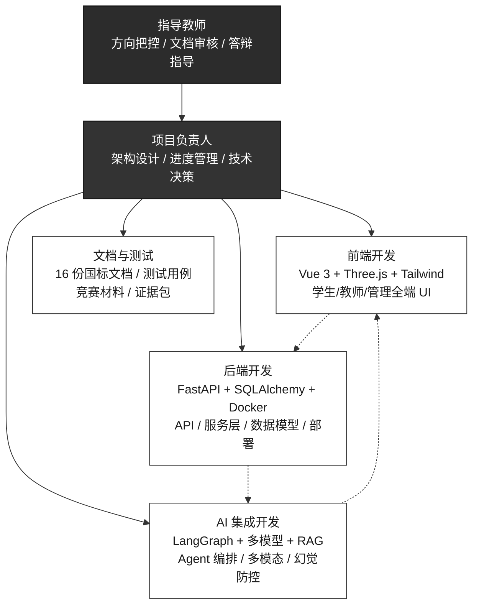
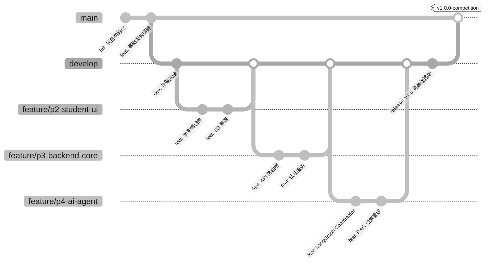
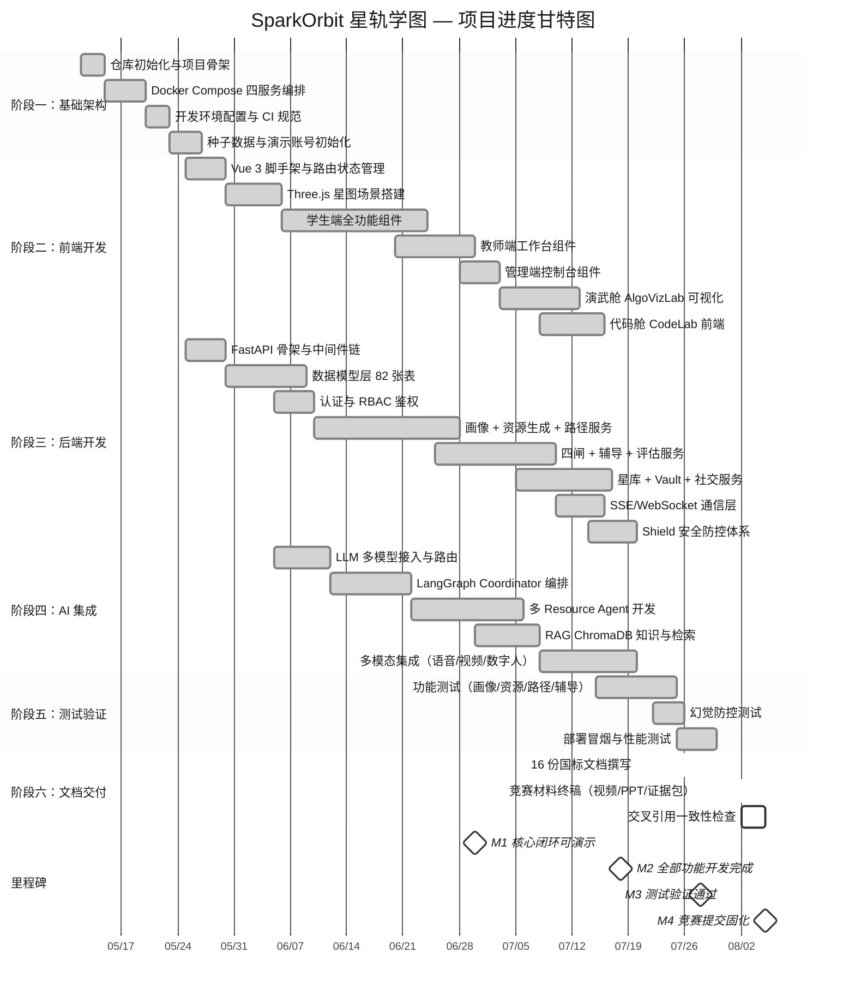
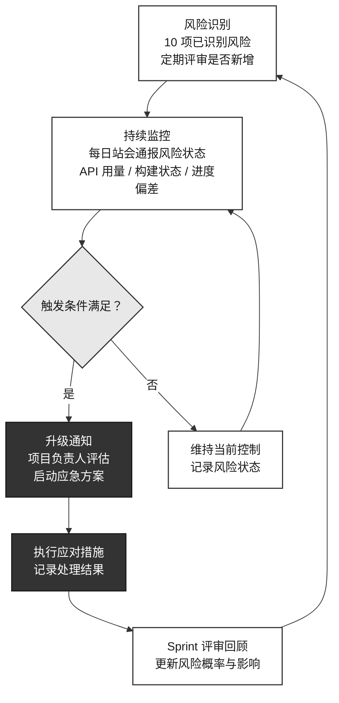
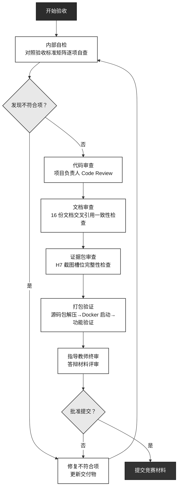

# SparkOrbit 星轨学图 — 项目开发计划

| 项 | 内容 |
|----|------|
| 项目名称 | SparkOrbit 星轨学图 |
| 文档名称 | 项目开发计划 |
| 文档编号 | SparkOrbit-A2 |
| 编制者 | SparkOrbit 团队 |
| 编制日期 | 2026-07-31 |
| 版本 | V2.0（工程级完整版） |
| 密级 | 内部 |

---

## 修改记录

| 版本 | 日期 | 修改人 | 说明 |
|------|------|--------|------|
| V1.0 | 2026-07-30 | SparkOrbit 团队 | 初稿，基于冲刺计划 v4/v5 回填 |
| V2.0 | 2026-07-31 | SparkOrbit 团队 | 工程级完整版：新增 WBS 四级分解、Mermaid 甘特图与组织架构图、定量资源估算、风险逐项应对、验收标准矩阵 |
| V3.0 | 2026-08-14 | SparkOrbit 团队 | 工程级对齐：画像修正为八维、密码哈希修正为 PBKDF2-SHA256、表数修正为 82 张、预算对齐真实 ~350 元、WBS 补 P7 面试与求职增量 |

---

## 1 引言

### 1.1 编写目的

本计划旨在为 SparkOrbit 星轨学图项目提供一套完整的项目管理基线，覆盖任务分解、组织分工、进度安排、资源预算、风险管控以及交付物验收标准六个核心维度。其目标是：

- **统一团队认知**：使全体成员对项目范围、里程碑、交付标准和自身职责有清晰一致的理解
- **建立可度量进度**：以 WBS 工作分解结构与甘特图为基准，实现进度偏差的定量跟踪
- **预判资源与风险**：在项目启动阶段识别关键资源约束与高影响风险，制定应对预案
- **对齐竞赛评审要求**：交付物清单与验收标准直接映射当前主流 AI 教育类赛事的共性评审维度（场景创新性、技术适配性、落地可行性、效果验证）

**预期读者**：

| 读者角色 | 关注重点 |
|----------|----------|
| 项目负责人 | 整体进度控制、资源调配、风险决策 |
| 开发成员 | 个人任务分配、交付时间节点、依赖关系 |
| 指导老师 | 项目合理性、进度可信度、风险管理 |
| 竞赛评审专家 | 项目管理规范性、计划与实际的符合度 |

### 1.2 项目背景

SparkOrbit 星轨学图是面向高等教育领域、以多智能体协同为核心的自适应学习路径决策与伴学智能体系统。项目要求构建以多智能体协同为核心的个性化资源生成与学习系统，实现从学习画像采集（>=6 维）、多模态资源生成（>=5 类）、个性化路径规划、智能辅导（苏格拉底/费曼）到学习效果评估的完整闭环。

项目采用「认知孪生 + 星系隐喻」设计理念，以学生八维画像（Mirror）为认知内核，以星系—行星知识图谱为组织框架，通过四闸（学→练→讲→用）掌握验证门禁体系实现从浅层浏览到深度掌握的渐进式学习闭环。技术栈覆盖 Vue 3 + FastAPI + MySQL + ChromaDB + LangGraph，并集成 DeepSeek、讯飞、火山 Seedance、通义千问等多模型矩阵。8/13–8/14 新增模拟面试、求职助手、教师审阅与套件、考级中心、SRS 复习等面向求职场景的增量模块。

### 1.3 定义与缩写

| 术语 | 全称 | 含义 |
|------|------|------|
| WBS | Work Breakdown Structure | 工作分解结构——将项目分解为可管理的工作包 |
| Mirror | — | 八维学生认知画像系统 |
| Shield | — | 内容安全与幻觉防控网关 |
| Coordinator | — | 多智能体资源生成的编排调度器 |
| RAG | Retrieval-Augmented Generation | 检索增强生成 |
| RBAC | Role-Based Access Control | 基于角色的访问控制 |
| SSE | Server-Sent Events | 服务端推送事件 |
| Sprint | — | 冲刺迭代周期（本项目约 2 周/轮） |
| P0/P1/P2 | — | 任务优先级——必须/应当/可做 |
| CI | Configuration Item | 配置项 |
| FR/NFR | Functional / Non-Functional Requirement | 功能/非功能需求 |

### 1.4 参考资料

| 编号 | 资料名称 | 来源 | 用途 |
|------|----------|------|------|
| [1] | 竞赛题目与评审要求（通用） | 赛事官方 | 需求基线、评审维度参考 |
| [2] | 《SparkOrbit 作品设计实现方案》V1.0 | 项目组 | 技术架构与功能设计 |
| [3] | 《SparkOrbit-A1-可行性研究报告》V2.1 | 项目组 | 技术/经济/操作可行性结论 |
| [4] | 《SparkOrbit-B1-软件需求说明书》V1.0 | 项目组 | 功能需求与非功能需求基线 |
| [5] | 《挑战赛冲刺计划 v4》 | 项目组 | 项目中期冲刺计划与增量定义 |
| [6] | 《挑战赛冲刺计划 v5》 | 项目组 | UI 升级与交互深化计划 |
| [7] | 《竞赛作品评分表》 | 大赛官方 | 验收标准与评分细则 |
| [8] | GB/T 8567-2006 计算机软件文档编制规范 | 国家标准 | 文档结构与内容要求 |
| [9] | `docker-compose.yml` | 项目组 | 部署架构与容器编排 |
| [10] | `backend/requirements.txt` / `frontend/package.json` | 项目组 | 依赖项版本锁定 |

---

## 2 项目概述与目标

### 2.1 项目名称与定位

| 属性 | 内容 |
|------|------|
| 项目名称 | SparkOrbit 星轨学图 |
| 项目代号 | SparkOrbit |
| 项目定位 | 高等教育个性化智能学习平台——认知孪生 + 多智能体协同 + 星系隐喻 |
| 目标用户 | 学生（本科高年级/研究生）、教师、管理员 |
| 核心场景 | 数据结构、机器学习、人工智能等计算机/电子信息专业课程 |
| 部署形态 | Docker Compose 容器化（四服务编排）；公网 https://wikj.online |
| 开发周期 | 约 14 周（2026 年 5 月中旬 — 2026 年 8 月上旬） |
| 团队规模 | 3-5 人（核心开发 3 人 + 指导教师） |

### 2.2 核心能力目标

本系统要求实现以下五大必选能力及加分项：

| 编号 | 能力要求 | 对应模块 | 目标完成度 |
|------|----------|----------|------------|
| **2.2.1** | 对话式学习画像自主构建（>=6 维） | Mirror 八维画像系统 | 100%（已实现 8 维） |
| **2.2.2** | 多智能体协同资源生成（>=5 类） | Coordinator + Resource Agents | 100%（已实现 7 类） |
| **2.2.3** | 个性化学习路径规划与资源推送 | PathPlanner + 推荐引擎 | 100%（已实现） |
| **2.2.4** | 智能辅导（苏格拉底/费曼，加分项） | Companion + AI Tutor + 数字人 | 100%（已实现） |
| **2.2.5** | 学习效果评估（加分项） | Evaluation + Assessment | 100%（已实现） |
| **附加** | 讯飞相关 AI 工具调用、私有知识库、幻觉防控、可扩展性 | Shield + RAG + ChromaDB + OpenAPI | 100%（已实现） |

### 2.3 交付物清单

#### 2.3.1 竞赛必交材料

| 编号 | 交付物 | 格式 | 说明 |
|------|--------|------|------|
| H1 | 系统设计/实现文档 | PDF/Word | 含架构图、功能结构图、技术栈、全流程案例 |
| H2 | 部署说明书 | PDF/Word | Docker Compose 一键部署 + 环境配置 |
| H3 | 测试文档 | PDF/Word | 对应 E1 测试计划 + E2 测试分析报告 |
| H4 | 源码包 + 安装包 | .tar.gz | 源码 + Docker 编排 + 种子数据 + 知识库 |
| H5 | 演示视频 | .mp4 | 8-10 分钟，系统演示 >= 60% |
| H6 | PPT | .pptx | 含架构图、功能结构、技术栈、创新点、幻觉防控专项 |
| H7 | 评分证据包 | 截图 + 案例表 | 覆盖 2.2.1~2.2.5 全部评分项 |

#### 2.3.2 软件工程文档（16 份国标）

| 类别 | 编号 | 文档名称 | 文件 |
|------|------|----------|------|
| A 可行性与计划 | A1 | 可行性研究报告 | `SparkOrbit-A1-可行性研究报告.md` |
| | A2 | 项目开发计划 | `SparkOrbit-A2-项目开发计划.md`（本文档） |
| B 需求分析 | B1 | 软件需求说明书 | `SparkOrbit-B1-软件需求说明书.md` |
| | B2 | 数据要求说明书 | `SparkOrbit-B2-数据要求说明书.md` |
| C 设计 | C1 | 概要设计说明书 | `SparkOrbit-C1-概要设计说明书.md` |
| | C2 | 详细设计说明书 | `SparkOrbit-C2-详细设计说明书.md` |
| | C3 | 数据库设计说明书 | `SparkOrbit-C3-数据库设计说明书.md` |
| D 实现 | D1 | 模块开发卷宗 | `SparkOrbit-D1-模块开发卷宗.md` |
| | D2 | 用户手册 | `SparkOrbit-D2-用户手册.md` |
| | D3 | 操作手册 | `SparkOrbit-D3-操作手册.md` |
| E 测试 | E1 | 测试计划 | `SparkOrbit-E1-测试计划.md` |
| | E2 | 测试分析报告 | `SparkOrbit-E2-测试分析报告.md` |
| F 运维总结 | F1 | 开发进度月报 | `SparkOrbit-F1-开发进度月报.md` |
| | F2 | 项目开发总结报告 | `SparkOrbit-F2-项目开发总结报告.md` |
| G 质量配置 | G1 | 软件质量保证计划 | `SparkOrbit-G1-软件质量保证计划.md` |
| | G2 | 软件配置管理计划 | `SparkOrbit-G2-软件配置管理计划.md` |

### 2.4 验收标准

验收标准直接映射竞赛评审的共性维度，并增设内部质量门槛：

| 验收维度 | 通过标准 |
|----------|----------|
| **创新价值与实用性** | 1) 三角色功能完整可演示；2) 核心闭环全链路贯通；3) 教育与技术创新点有代码锚点 |
| **功能实现与技术要求** | 1) 画像 >=6 维且可对话更新；2) 资源生成 >=5 类且含质量评分；3) 个性化路径含 3+ 案例；4) 智能辅导含 5+ 案例；5) 效果评估含 3+ 报告；6) 拓展功能 >=5 项 |
| **配套文档丰富度** | 1) 16 份国标文档完整；2) 系统效果截图 >=30 张；3) AI 技术应用细节在文档中有独立专章 |
| **演示视频与 PPT** | 1) 视频清晰度 >=1080p 且解说逻辑清晰；2) 系统操作演示占比 >=60%；3) PPT 含全部必要章节且 AI 味低 |
| **附加能力** | 1) 讯飞技术深度集成；2) 私有知识库可演示；3) 幻觉防控三级体系；4) API 可扩展文档化 |

> **内部质量线**：所有核心功能模块须通过测试计划（E1）定义的测试用例；所有代码须通过人工 Code Review；所有文档须通过交叉引用一致性检查。

---

## 3 任务分解（WBS）

### 3.1 WBS 结构图

```mermaid
%%{init: {'theme':'base','themeVariables':{'primaryColor':'#ffffff','primaryTextColor':'#1a1a1a','primaryBorderColor':'#333333','lineColor':'#333333','secondaryColor':'#e8e8e8','tertiaryColor':'#f5f5f5','background':'#ffffff','mainBkg':'#ffffff','nodeBorder':'#333333','clusterBkg':'#f0f0f0','clusterBorder':'#333333','titleColor':'#1a1a1a','edgeLabelBackground':'#ffffff'}}}%%
flowchart TD
    Root["SparkOrbit 星轨学图<br/>100%"] --> P1["P1 基础架构<br/>12%"]
    Root --> P2["P2 前端开发<br/>22%"]
    Root --> P3["P3 后端开发<br/>28%"]
    Root --> P4["P4 AI 集成<br/>18%"]
    Root --> P5["P5 测试验证<br/>10%"]
    Root --> P6["P6 文档交付<br/>10%"]

    P1 --> P1A["P1.1 仓库初始化<br/>3%"]
    P1 --> P1B["P1.2 Docker 编排<br/>4%"]
    P1 --> P1C["P1.3 CI/CD 配置<br/>2%"]
    P1 --> P1D["P1.4 种子数据<br/>3%"]

    P2 --> P2A["P2.1 UI 框架搭建<br/>4%"]
    P2 --> P2B["P2.2 学生端组件<br/>8%"]
    P2 --> P2C["P2.3 教师端组件<br/>4%"]
    P2 --> P2D["P2.4 管理端组件<br/>2%"]
    P2 --> P2E["P2.5 3D 星图<br/>4%"]

    P3 --> P3A["P3.1 API 路由层<br/>4%"]
    P3 --> P3B["P3.2 领域服务层<br/>10%"]
    P3 --> P3C["P3.3 数据模型层<br/>5%"]
    P3 --> P3D["P3.4 安全与认证<br/>4%"]
    P3 --> P3E["P3.5 SSE/WS 通信<br/>5%"]

    P4 --> P4A["P4.1 多模型接入<br/>5%"]
    P4 --> P4B["P4.2 Agent 编排<br/>6%"]
    P4 --> P4C["P4.3 RAG 知识库<br/>3%"]
    P4 --> P4D["P4.4 多模态集成<br/>4%"]

    P5 --> P5A["P5.1 功能测试<br/>4%"]
    P5 --> P5B["P5.2 幻觉测试<br/>2%"]
    P5 --> P5C["P5.3 部署冒烟<br/>1%"]
    P5 --> P5D["P5.4 性能测试<br/>3%"]

    P6 --> P6A["P6.1 国标文档<br/>5%"]
    P6 --> P6B["P6.2 竞赛材料<br/>3%"]
    P6 --> P6C["P6.3 证据截图<br/>2%"]

    P7["P7 面试与求职增量<br/>（8/13-8/14）"] --> P7A["P7.1 模拟面试<br/>三模式编排 + 多模态评分"]
    P7 --> P7B["P7.2 求职助手<br/>门户/简历/投递/面经"]
    P7 --> P7C["P7.3 教师审阅与套件<br/>面试点评/资源审阅/题库/分组/表扬/日历"]
    P7 --> P7D["P7.4 考级中心与 SRS 复习"]

    classDef root fill:#2c2c2c,stroke:#1a1a1a,color:#ffffff,stroke-width:2px
    classDef phase fill:#333333,stroke:#1a1a1a,color:#ffffff,stroke-width:1.5px
    classDef task fill:#ffffff,stroke:#333333,color:#1a1a1a,stroke-width:1px
    class Root root
    class P1,P2,P3,P4,P5,P6,P7 phase
    class P1A,P1B,P1C,P1D,P2A,P2B,P2C,P2D,P2E,P3A,P3B,P3C,P3D,P3E,P4A,P4B,P4C,P4D,P5A,P5B,P5C,P5D,P6A,P6B,P6C,P7A,P7B,P7C,P7D task
```

> **图 A2-F01：WBS 四级任务分解树形图**（Mermaid，建议导出为 PNG 嵌入文档）

### 3.2 任务清单表

#### 3.2.1 基础架构任务（P1，约 12%）

| 任务编号 | 任务名称 | 负责角色 | 工时估算 | 前置依赖 | 交付物 |
|----------|----------|----------|----------|----------|--------|
| P1.1.1 | Git 仓库初始化与分支策略配置 | 后端开发 | 4h | — | `.gitignore`、分支模型 |
| P1.1.2 | 项目目录结构搭建（frontend/backend/scripts/docs） | 全栈开发 | 3h | P1.1.1 | 目录骨架 |
| P1.1.3 | 开发环境配置文档编写 | 全栈开发 | 2h | P1.1.2 | `README.md` 开发环境章节 |
| P1.2.1 | `Dockerfile` 编写（backend/frontend/codelab-runner） | 后端开发 | 8h | P1.1.2 | 3 份 Dockerfile |
| P1.2.2 | `docker-compose.yml` 四服务编排 | 后端开发 | 6h | P1.2.1 | `docker-compose.yml` |
| P1.2.3 | Nginx 反向代理配置（SSL 终止 + /api 反代） | 后端开发 | 4h | P1.2.2 | `nginx.conf` |
| P1.2.4 | healthcheck 链配置（mysql → backend → frontend） | 后端开发 | 3h | P1.2.2 | healthcheck 配置块 |
| P1.2.5 | start.bat / start.sh 一键脚本 | 后端开发 | 3h | P1.2.2 | 启动脚本 |
| P1.3.1 | ESLint / Prettier 配置（前端） | 前端开发 | 2h | P1.1.2 | `.eslintrc`、`.prettierrc` |
| P1.3.2 | Python black / isort 配置（后端） | 后端开发 | 1h | P1.1.2 | `pyproject.toml` |
| P1.4.1 | MySQL 建表脚本与种子数据 | 后端开发 | 6h | P3.3 | `sparkorbit.sql` |
| P1.4.2 | 演示账号初始化（student001/teacher001/admin001） | 后端开发 | 2h | P1.4.1 | 种子数据脚本 |
| P1.4.3 | 默认星系-行星-挑战题初始化 | 后端开发 | 8h | P1.4.1 | 种子数据脚本 |

#### 3.2.2 前端开发任务（P2，约 22%）

| 任务编号 | 任务名称 | 负责角色 | 工时估算 | 前置依赖 | 交付物 |
|----------|----------|----------|----------|----------|--------|
| P2.1.1 | Vue 3 + Vite + TypeScript 项目脚手架 | 前端开发 | 4h | P1.1.2 | 前端项目骨架 |
| P2.1.2 | Tailwind CSS 配置与星空主题变量 | 前端开发 | 6h | P2.1.1 | `tailwind.config.ts`、主题 CSS |
| P2.1.3 | Pinia 状态管理初始化（auth/orbit/teacherClass） | 前端开发 | 4h | P2.1.1 | 3 个 Store 模块 |
| P2.1.4 | Vue Router 路由配置（三角色路由守卫） | 前端开发 | 4h | P2.1.3 | `router/index.ts` |
| P2.1.5 | API Client 封装（axios 拦截器 + 错误处理） | 前端开发 | 4h | P2.1.1 | `api/client.ts` |
| P2.2.1 | 登录/注册页面（TerminalAuthShell 科幻终端风格） | 前端开发 | 12h | P2.1.4 | `LoginGateway.vue`、`RegisterGateway.vue` |
| P2.2.2 | 学生星轨领航台六分区布局 | 前端开发 | 8h | P2.1.4 | `StudentPortal.vue` |
| P2.2.3 | 学习区组件（资源工坊/行星挑战/成长报告） | 前端开发 | 24h | P2.2.2 | `PlanetPanel.vue` 等 |
| P2.2.4 | 星域个人主页（画像/路径/成就） | 前端开发 | 16h | P2.2.2 | `SocialPanel.vue` 等 |
| P2.2.5 | 社交区组件（树洞/聊天/心愿墙） | 前端开发 | 16h | P2.2.2 | `ChatZone.vue`、`TreeHole.vue` |
| P2.2.6 | 自习区组件（3D 星图/摄像头督导） | 前端开发 | 12h | P2.5.1 | `OrbitExplorer.vue` |
| P2.2.7 | 休闲区组件（桌宠/星座/小游戏） | 前端开发 | 16h | P2.2.2 | 休闲区组件集 |
| P2.2.8 | SSE 流式资源生成前端展示 | 前端开发 | 12h | P3.5.1 | SSE 消费组件 |
| P2.2.9 | 演武舱 AlgoVizLab 可视化 | 前端开发 | 20h | P2.2.3 | `AlgoVizLab.vue`、渲染器 |
| P2.2.10 | 代码舱 CodeLab 在线编辑器 | 前端开发 | 16h | P2.2.3 | `CodeLab.vue` |
| P2.2.11 | Vault 知识库前端（Obsidian 双链编辑） | 前端开发 | 12h | P4.3.2 | Vault 前端组件 |
| P2.3.1 | 教师工作台布局 | 前端开发 | 6h | P2.1.4 | `TeacherLayout.vue` |
| P2.3.2 | 学情看板（班级概览/风险学生/热力图） | 前端开发 | 16h | P2.3.1 | 看板组件 |
| P2.3.3 | 作业考勤管理 | 前端开发 | 8h | P2.3.1 | 作业考勤组件 |
| P2.3.4 | 改进复核与幻觉工单处理 | 前端开发 | 12h | P2.3.1 | 工单处理组件 |
| P2.3.5 | 星系锻造（PDF 上传/解析） | 前端开发 | 8h | P2.3.1 | 锻造向导组件 |
| P2.3.6 | 时空扭曲沙盘（仿真预演） | 前端开发 | 12h | P2.3.1 | `TimeWarpSandbox.vue` |
| P2.4.1 | 管理控制台布局 | 前端开发 | 4h | P2.1.4 | `AdminLayout.vue` |
| P2.4.2 | 用户管理界面 | 前端开发 | 6h | P2.4.1 | `AdminUsers.vue` |
| P2.4.3 | 内容管理与用量监控 | 前端开发 | 6h | P2.4.1 | `AdminContent.vue`、`AdminUsage.vue` |
| P2.4.4 | 维护模式开关 | 前端开发 | 3h | P2.4.1 | `AdminMaintenance.vue` |
| P2.5.1 | Three.js 场景初始化（星云/粒子/光照） | 前端开发 | 12h | P2.1.1 | `three/` 模块 |
| P2.5.2 | 行星网格生成与交互（缩放/旋转/点击） | 前端开发 | 16h | P2.5.1 | `planet-interaction.ts` |
| P2.5.3 | 掌握度可视化（亮度/特效映射） | 前端开发 | 8h | P2.5.2 | 行星材质模块 |
| P2.5.4 | 星座粒子特效与轨道导航器 | 前端开发 | 8h | P2.5.1 | `orbit-navigator.ts` |

#### 3.2.3 后端开发任务（P3，约 28%）

| 任务编号 | 任务名称 | 负责角色 | 工时估算 | 前置依赖 | 交付物 |
|----------|----------|----------|----------|----------|--------|
| P3.1.1 | FastAPI 应用骨架与中间件链 | 后端开发 | 6h | P1.1.2 | `main.py`、CORS/日志中间件 |
| P3.1.2 | RESTful API 路由注册（按领域分组） | 后端开发 | 8h | P3.1.1 | 路由模块集 |
| P3.1.3 | Pydantic Schema 定义（请求/响应模型） | 后端开发 | 8h | P3.1.1 | `schemas/` 模块 |
| P3.1.4 | 统一异常处理与错误响应格式 | 后端开发 | 4h | P3.1.1 | 异常处理器 |
| P3.2.1 | 认证服务（注册/登录/Token/RBAC） | 后端开发 | 12h | P3.3.1 | `auth.py` |
| P3.2.2 | 画像服务（profiling/profiles/profile_refresh） | 后端开发 | 20h | P3.3.2 | 3 个画像服务模块 |
| P3.2.3 | 资源生成服务（resource_agents/resource_quality） | 后端开发 | 30h | P4.2.1 | 资源生成模块 |
| P3.2.4 | 学习路径服务（learning_path） | 后端开发 | 16h | P3.2.2 | `learning_path.py` |
| P3.2.5 | 挑战与四闸服务（challenge/mastery_gates/gate_policy） | 后端开发 | 24h | P3.3.3 | 闸门服务模块 |
| P3.2.6 | 智能辅导服务（companion/ai_tutor/digital_tutor） | 后端开发 | 24h | P4.1.1 | 辅导服务模块 |
| P3.2.7 | 评估服务（evaluation/assessment） | 后端开发 | 12h | P3.2.5 | 评估模块 |
| P3.2.8 | Shield 幻觉防控（shield/hallucination_guard/hallucination_tickets） | 后端开发 | 16h | P4.1.1 | 安全防控模块 |
| P3.2.9 | 教师端服务（teacher/teacher_extras/improvement） | 后端开发 | 20h | P3.2.2 | 教师服务模块 |
| P3.2.10 | 管理端服务（admin） | 后端开发 | 8h | P3.2.1 | `admin.py` |
| P3.2.11 | 社交服务（chat_service/tree_hole_service/social） | 后端开发 | 16h | P3.3.4 | 社交服务模块 |
| P3.2.12 | 星库服务（starlib/galaxy_forge/galaxy_service） | 后端开发 | 20h | P3.2.3 | 星库模块 |
| P3.2.13 | 笔记服务（note_service/vault_service） | 后端开发 | 16h | P3.3.4 | 笔记模块 |
| P3.2.14 | 代码舱服务（codelab/codelab_runner） | 后端开发 | 12h | P1.2.1 | 代码执行模块 |
| P3.2.15 | 自习督导服务（TensorFlow.js 标量落库） | 后端开发 | 4h | P2.2.6 | 督导 API |
| P3.2.16 | 记忆衰减服务（memory_decay） | 后端开发 | 8h | P3.2.5 | `memory_decay.py` |
| P3.3.1 | 用户与权限模型（User/UserRole/SchoolClass 等） | 后端开发 | 8h | P3.1.1 | 5-7 个 Model |
| P3.3.2 | 知识宇宙模型（Galaxy/Planet/PlanetMastery 等） | 后端开发 | 8h | P3.3.1 | 4-5 个 Model |
| P3.3.3 | 资源与学习模型（GeneratedResource/LearningPath 等） | 后端开发 | 8h | P3.3.2 | 5-7 个 Model |
| P3.3.4 | 社交与分区模型（Chat/ChatRoom/Note/Pet 等） | 后端开发 | 8h | P3.3.1 | 6-8 个 Model |
| P3.3.5 | 管理与安全模型（HallucinationTicket/ApiUsageLog 等） | 后端开发 | 4h | P3.3.1 | 3-4 个 Model |
| P3.3.6 | 数据库迁移脚本 | 后端开发 | 4h | P3.3.1-P3.3.5 | 迁移脚本 |
| P3.4.1 | PBKDF2-SHA256 密码哈希 | 后端开发 | 2h | P3.2.1 | 密码哈希模块（`backend/app/services/auth.py`） |
| P3.4.2 | RBAC 中间件（student/teacher/admin 鉴权） | 后端开发 | 4h | P3.2.1 | 鉴权中间件 |
| P3.4.3 | SQL 注入防护（SQLAlchemy 参数化查询） | 后端开发 | — | P3.3 | （架构内置） |
| P3.4.4 | API Key 环境变量隔离 | 后端开发 | 2h | P1.1.2 | `.env.example` |
| P3.5.1 | SSE 流式推送端点 | 后端开发 | 8h | P3.2.3 | SSE 路由 |
| P3.5.2 | WebSocket 连接管理 | 后端开发 | 8h | P3.1.1 | `routes/ws.py` |
| P3.5.3 | 断线重连与心跳机制 | 后端开发 | 4h | P3.5.2 | 重连逻辑 |

#### 3.2.4 AI 集成任务（P4，约 18%）

| 任务编号 | 任务名称 | 负责角色 | 工时估算 | 前置依赖 | 交付物 |
|----------|----------|----------|----------|----------|--------|
| P4.1.1 | LLM 统一调用层（DeepSeek SDK 兼容接口） | AI 开发 | 8h | P3.1.1 | `llm.py` |
| P4.1.2 | DeepSeek 接入与 Prompt 模板 | AI 开发 | 6h | P4.1.1 | DeepSeek 配置 |
| P4.1.3 | 豆包（火山方舟）备选模型接入 | AI 开发 | 4h | P4.1.1 | 豆包配置 |
| P4.1.4 | 讯飞星火 4.0 Turbo 长文本接入 | AI 开发 | 4h | P4.1.1 | 讯飞星火配置 |
| P4.1.5 | 多模型路由与降级策略 | AI 开发 | 4h | P4.1.1-P4.1.4 | 路由逻辑 |
| P4.1.6 | 能力探测接口（health-capabilities） | AI 开发 | 3h | P4.1.5 | 探测端点 |
| P4.2.1 | LangGraph Coordinator 编排器 | AI 开发 | 16h | P4.1.1 | `spark.py` + Coordinator 图 |
| P4.2.2 | Resource Agent 集（文档/导图/习题/阅读/视频/课件/代码） | AI 开发 | 24h | P4.2.1 | 7 个 Resource Agent |
| P4.2.3 | Mirror Agent（八维画像推断） | AI 开发 | 12h | P4.1.1 | profiling Agent |
| P4.2.4 | Tutor Agent（苏格拉底/费曼模式） | AI 开发 | 12h | P4.1.1 | companion Agent |
| P4.2.5 | Evaluator Agent（学习评估） | AI 开发 | 8h | P4.1.1 | evaluation Agent |
| P4.2.6 | PathPlanner Agent（路径规划） | AI 开发 | 8h | P4.2.3 | learning_path Agent |
| P4.2.7 | Agent 降级策略（LangGraph → 手写流水线） | AI 开发 | 4h | P4.2.1 | 降级逻辑 |
| P4.3.1 | ChromaDB 初始化与本地 ONNX 嵌入模型 | AI 开发 | 6h | P3.1.1 | ChromaDB 配置 |
| P4.3.2 | 文档分页切块与向量化入库 | AI 开发 | 8h | P4.3.1 | `rag.py` |
| P4.3.3 | RAG 检索增强生成流水线 | AI 开发 | 8h | P4.3.2 | RAG 检索流水线 |
| P4.3.4 | Obsidian 兼容 Markdown 知识库（Vault） | AI 开发 | 8h | P3.3.4 | `vault_service.py` |
| P4.4.1 | 讯飞 IAT 语音听写集成 | AI 开发 | 8h | P4.1.4 | `asr_service.py` |
| P4.4.2 | 讯飞 ISE 口语评测集成 | AI 开发 | 6h | P4.1.4 | `ise_service.py` |
| P4.4.3 | 讯飞 TTS 语音合成集成 | AI 开发 | 4h | P4.1.4 | `tts_service.py` |
| P4.4.4 | 讯飞虚拟人交互平台集成 | AI 开发 | 12h | P4.4.1 | `xf_digital_human.py` |
| P4.4.5 | 火山 Seedance 视频生成集成 | AI 开发 | 10h | P4.1.2 | `seedance_service.py` |
| P4.4.6 | 通义千问图像编辑集成 | AI 开发 | 4h | P4.1.1 | `avatar_service.py` |
| P4.4.7 | cantonese.ai 粤语 STT 集成 | AI 开发 | 4h | P4.1.1 | `cantonese_ai_service.py` |
| P4.4.8 | 多模态降级策略（Seedance → GSAP 动画等） | AI 开发 | 4h | P4.4.5 | 降级逻辑 |

#### 3.2.5 测试验证任务（P5，约 10%）

| 任务编号 | 任务名称 | 负责角色 | 工时估算 | 前置依赖 | 交付物 |
|----------|----------|----------|----------|----------|--------|
| P5.1.1 | 画像测试（TEST-PROF-01~05） | 测试 | 8h | P3.2.2 | 测试用例 + 截图 |
| P5.1.2 | 资源生成测试（TEST-RES-01~07） | 测试 | 12h | P3.2.3 | 测试用例 + 截图 |
| P5.1.3 | 路径规划测试（TEST-PATH-01~04） | 测试 | 6h | P3.2.4 | 测试用例 + 截图 |
| P5.1.4 | 智能辅导测试（TEST-TUT-01~05） | 测试 | 8h | P3.2.6 | 测试用例 + 截图 |
| P5.1.5 | 效果评估测试（TEST-EVAL-01~04） | 测试 | 6h | P3.2.7 | 测试用例 + 截图 |
| P5.1.6 | 闸门状态机测试 | 测试 | 6h | P3.2.5 | 测试用例 |
| P5.1.7 | 社交与休闲功能测试 | 测试 | 4h | P3.2.11 | 测试用例 |
| P5.2.1 | 低置信检测敏感性测试（TEST-HALLU-01~04） | 测试 | 6h | P3.2.8 | 测试数据 + 报告 |
| P5.2.2 | 多模型交叉验证有效性测试 | 测试 | 4h | P5.2.1 | 验证报告 |
| P5.2.3 | 工单生成与教师处理闭环测试 | 测试 | 4h | P5.2.1 | 测试用例 |
| P5.3.1 | Docker 一键启动测试（TEST-DEPLOY-01~04） | 测试 | 4h | P1.2.5 | 冒烟报告 |
| P5.3.2 | 三角色登录成功测试 | 测试 | 2h | P3.2.1 | 验证截图 |
| P5.3.3 | 维护模式开关测试 | 测试 | 1h | P3.2.10 | 验证截图 |
| P5.4.1 | SSE 并发连接数测试 | 测试 | 4h | P3.5.1 | 性能数据 |
| P5.4.2 | API 响应时间基准测试 | 测试 | 4h | P3.1.2 | 性能报告 |
| P5.4.3 | Seedance 生成超时处理测试 | 测试 | 2h | P4.4.5 | 测试记录 |

#### 3.2.6 文档交付任务（P6，约 10%）

| 任务编号 | 任务名称 | 负责角色 | 工时估算 | 前置依赖 | 交付物 |
|----------|----------|----------|----------|----------|--------|
| P6.1.1 | A1 可行性研究报告 | 文档负责人 | 12h | P5 | `A1.md` |
| P6.1.2 | A2 项目开发计划（本文档） | 文档负责人 | 8h | P6.1.1 | `A2.md` |
| P6.1.3 | B1 软件需求说明书 | 文档负责人 | 12h | P3 | `B1.md` |
| P6.1.4 | B2 数据要求说明书 | 文档负责人 | 8h | P3.3 | `B2.md` |
| P6.1.5 | C1 概要设计说明书 | 文档负责人 | 12h | P3 | `C1.md` |
| P6.1.6 | C2 详细设计说明书 | 文档负责人 | 16h | P3.2 | `C2.md` |
| P6.1.7 | C3 数据库设计说明书 | 文档负责人 | 10h | P3.3 | `C3.md` |
| P6.1.8 | D1 模块开发卷宗 | 文档负责人 | 8h | P3.2 | `D1.md` |
| P6.1.9 | D2 用户手册 | 文档负责人 | 16h | P2, P3 | `D2.md` |
| P6.1.10 | D3 操作手册 | 文档负责人 | 8h | P1.2 | `D3.md` |
| P6.1.11 | E1 测试计划 | 文档负责人 | 8h | P5 | `E1.md` |
| P6.1.12 | E2 测试分析报告 | 文档负责人 | 8h | P5 | `E2.md` |
| P6.1.13 | F1 开发进度月报 | 文档负责人 | 4h | P6.1.12 | `F1.md` |
| P6.1.14 | F2 项目开发总结报告 | 文档负责人 | 6h | P6.1.12 | `F2.md` |
| P6.1.15 | G1 软件质量保证计划 | 文档负责人 | 6h | P6.1.5 | `G1.md` |
| P6.1.16 | G2 软件配置管理计划 | 文档负责人 | 6h | P6.1.15 | `G2.md` |
| P6.2.1 | H1 系统设计/实现文档（最终版） | 全栈开发 | 8h | P3, P4 | 设计实现方案 |
| P6.2.2 | H5 演示视频录制（8-10 分钟） | 全栈开发 | 12h | P5 | 演示视频 .mp4 |
| P6.2.3 | H6 PPT 定稿 | 全栈开发 | 8h | P6.2.2 | PPT .pptx |
| P6.2.4 | 60 秒路演讲稿 | 全栈开发 | 2h | P6.2.2 | `pitch_60s.md` |
| P6.3.1 | 评分证据截图补全（12 个槽位） | 全栈开发 | 8h | P5 | 截图文件集 |
| P6.3.2 | 案例表补全（资源/路径/辅导/评估） | 全栈开发 | 4h | P5 | 案例 .md 文件 |
| P6.3.3 | H4 源码包 + 安装包打包验证 | 全栈开发 | 4h | P6.3.1 | 打包 .tar.gz |
| P7.1 | 模拟面试子系统（三模式编排 + 多模态评分） | 全栈开发 | 24h | P6 | interview_agents/scoring/service/ws |
| P7.2 | 求职助手（门户/简历/投递/面经） | 全栈开发 | 16h | P7.1 | interview_applications/resume/export |
| P7.3 | 教师审阅与套件（面试点评/资源审阅/题库/分组/表扬/日历） | 全栈开发 | 12h | P7.1 | teacher_suite |
| P7.4 | 考级中心与 SRS 复习 | 全栈开发 | 12h | P6 | exam_center / review_queue |

---

## 4 组织与分工

### 4.1 团队组织结构图

> **图 A2-F03：团队组织结构图**（Mermaid，建议导出为 PNG 嵌入文档）

### 4.2 角色与职责明细表

| 角色 | 人数 | 职责范围 | 对接外部接口 | 关键技能要求 |
|------|------|----------|-------------|-------------|
| **指导教师** | 1 | 方向把控、文档审核、答辩演练指导 | 大赛组委会 | 高等教育学、项目管理 |
| **项目负责人** | 1 | 架构设计、进度管理、技术决策、代码审查、风险管控 | 全部角色 | 全栈视野、系统架构、沟通协调 |
| **前端开发** | 1 | Vue 3 组件开发、Three.js 3D 星图、Tailwind 主题、SSE 消费 | 后端开发（API 契约）、AI 集成（流式展示） | Vue 3、TypeScript、Three.js、Canvas/SVG |
| **后端开发** | 1 | FastAPI 服务层、SQLAlchemy 模型、Docker 编排、认证安全 | 前端开发（API）、AI 集成（LLM 调用层） | Python、SQL、Docker、RESTful 设计 |
| **AI 集成开发** | 1 | LangGraph Agent 编排、多模型路由、RAG 知识库、多模态集成 | 后端开发（服务接口）、前端开发（效果展示） | LLM 工程、向量检索、Prompt Engineering |
| **文档与测试** | 1（可兼） | 16 份国标文档撰写、测试用例编写与执行、竞赛材料筹备 | 全部角色（收集素材） | 技术写作、软件测试、竞赛规范 |

### 4.3 协作沟通机制

#### 4.3.1 Git 分支策略

> **补充流程图：Git 分支模型与合并流程**（Mermaid gitGraph）

**分支约定**：

| 分支类型 | 命名格式 | 用途 | 合并目标 |
|----------|----------|------|----------|
| `main` | — | 稳定发布分支，仅接收来自 release 的合并 | — |
| `develop` | — | 开发主线，集成各 feature 分支 | main（通过 release） |
| `feature/*` | `feature/p2-student-ui` | 功能开发分支，按 WBS 阶段命名 | develop |
| `release/*` | `release/v1.0` | 发布候选分支，冻结功能仅修 Bug | main + develop |
| `hotfix/*` | `hotfix/xxx` | 紧急修复分支 | main + develop |

**Commit Message 约定**：采用 `type(scope): message` 格式。

| Type | 含义 |
|------|------|
| `feat` | 新功能 |
| `fix` | Bug 修复 |
| `docs` | 文档变更 |
| `refactor` | 代码重构 |
| `test` | 测试相关 |
| `chore` | 构建/工具链变更 |

#### 4.3.2 日常沟通

| 机制 | 频率 | 参与者 | 内容 |
|------|------|--------|------|
| 每日站会 | 每日 10 分钟 | 全体开发 | 昨日进展、今日计划、阻塞问题 |
| Sprint 评审 | 每 2 周 | 全体 + 指导老师 | 演示已完成功能、评审交付物 |
| Code Review | 每次 PR | 项目负责人 + 作者 | 代码质量、架构一致性、安全审查 |
| 文档交叉审查 | 每份文档定稿前 | 文档负责人 + 领域专家 | 技术准确性、引用一致性、格式合规 |

---

## 5 进度计划

### 5.1 甘特图

> **图 A2-F02：项目进度甘特图**（Mermaid，建议导出为 PNG 嵌入文档）

### 5.2 冲刺计划

项目采用 2 周为单位的冲刺节奏，共 7 个 Sprint：

| Sprint | 起止日期 | 主题 | 核心交付 |
|--------|----------|------|----------|
| **Sprint 0** | 05/12 — 05/24 | 项目启动 | 仓库就绪、Docker 编排、种子数据、开发环境 |
| **Sprint 1** | 05/25 — 06/08 | 骨架搭建 | Vue 3 骨架 + FastAPI 骨架 + Three.js 场景 + 数据模型全表 |
| **Sprint 2** | 06/09 — 06/22 | 核心服务 | 画像/资源/路径服务 + 学生端主界面 + LLM 接入 |
| **Sprint 3** | 06/23 — 07/06 | AI 引擎 | LangGraph 编排 + Resource Agents + RAG + 星库 |
| **Sprint 4** | 07/07 — 07/19 | 闭环贯通 | 四闸/辅导/评估/Shield + 教师端 + 管理端 |
| **Sprint 5** | 07/20 — 07/29 | 测试与 UI 升级 | 全链路测试 + v5 交互升级（宽面板/演武舱/思维导图） |
| **Sprint 6** | 07/30 — 08/05 | 交付固化 | 文档终稿 + 视频录制 + PPT 定稿 + 打包验证 |

### 5.3 关键里程碑

| 里程碑 | 日期 | 事件 | 交付物 | 状态 |
|--------|------|------|--------|------|
| **M1** | 2026-06-30 | 核心闭环可演示 | 画像→资源→挑战→评估 全链路可走通 | ✅ 已达成 |
| **M2** | 2026-07-18 | 全部功能开发完成 | 三角色全部功能模块的代码锚点完备 | ✅ 已达成 |
| **M3** | 2026-07-28 | 测试验证通过 | 十一大测试族全部用例执行、缺陷汇总 | ✅ 已达成 |
| **M4** | 2026-08-05 | 竞赛提交固化 | 源码包 + 安装包 + 16 份文档 + 视频 + PPT + 证据包 | 🔴 进行中 |
| **M5** | 2026-08-14 | 面试与求职增量合入 | 模拟面试三模式编排 + 求职助手 + 教师审阅/套件 + 考级与 SRS 复习 | ✅ 已达成 |

---

## 6 资源计划

### 6.1 硬件资源

| 资源项 | 规格 | 用途 | 来源 |
|--------|------|------|------|
| 开发机 ×3 | 16G RAM + SSD | 本地编码、调试、前端构建 | 团队成员自有 |
| 腾讯云轻量服务器 | 2 核 4G、80G SSD、6Mbps | 生产部署、公网演示、API 代理 | 已购（约 60-120 元/月） |
| 域名 | wikj.online | HTTPS 公网访问 | 已购（约 50 元/年） |

### 6.2 软件资源

| 资源项 | 版本/规格 | 用途 | 许可 |
|--------|-----------|------|------|
| VS Code / PyCharm | 最新社区版 | 主要 IDE | 免费 / 教育授权 |
| Docker Desktop | 4.x+ | 容器运行时与编排 | 个人/教育免费 |
| Git | 2.x+ | 版本控制 | 免费 |
| Node.js | 22 LTS | 前端构建 | 开源 |
| Python | 3.12 | 后端运行时 | 开源 |
| MySQL | 8.0 | 关系型数据库 | 开源 GPL |
| ChromaDB | 1.5.x | 向量数据库 | Apache 2.0 |

### 6.3 数据资源

| 资源项 | 内容 | 用途 | 来源 |
|--------|------|------|------|
| 数据结构教材 PDF | 《数据结构》等标准教材 | 星系锻造验证、星库划词演示 | 公开领域教材 |
| 机器学习教材 PDF | 《机器学习》等标准教材 | 同上 | 公开领域教材 |
| 演武舱种子轨迹 | 二叉树/排序/图算法 VizTrace JSON | AlgoVizLab 零幻觉演示 | 团队预制 |
| 挑战题库 | 选择题 + 辨析题 + 情景应用题 | 四闸练习与验证 | 团队编写 + AI 辅助 |
| 演示视频素材 | Seedance 生成 + B 站推荐 | 多模态资源验证 | AI 生成 + 网络公开 |

### 6.4 预算估算

| 费用科目 | 金额 | 说明 |
|----------|------|------|
| 云主机 | 约 100 元/月 | 腾讯云轻量 2 核 4G |
| AI API | 约 200 元（全周期） | DeepSeek/豆包/讯飞/火山方舟 开发期调优 |
| 域名 + SSL | 约 50 元/年 | wikj.online |
| **合计** | **约 350 元** | 竞赛全周期（与 F2 §2.6 口径一致） |

> 注：本表为项目开发总结报告（F2）记录的真实全周期费用，与开发阶段回填的「月度估算」口径不同，以本表为准。

---

## 7 风险计划

### 7.1 风险识别表

| 风险编号 | 风险名称 | 类别 | 概率 | 影响 | 等级 | 触发条件 | 责任人 |
|----------|----------|------|------|------|------|----------|--------|
| R1 | 外部 LLM API 不可用 | 技术 | 30% | 高 | 🟡 重要 | DeepSeek/讯飞服务宕机或限流 | AI 集成开发 |
| R2 | 资源生成幻觉超标 | 质量 | 40% | 高 | 🟡 重要 | QA 评分与人工评分一致性 < 70% | AI 集成开发 |
| R3 | 代码舱沙箱逃逸 | 安全 | 10% | 极高 | 🟠 关键 | 恶意代码突破 Docker 隔离 | 后端开发 |
| R4 | API 调用成本超预算 | 经济 | 25% | 中 | 🟡 重要 | 月度账单 > 预算 150% | 项目负责人 |
| R5 | 进度延期导致冲刺不足 | 进度 | 35% | 高 | 🟠 关键 | 任一里程碑延迟 > 5 天 | 项目负责人 |
| R6 | 评委 Docker 环境差异 | 交付 | 35% | 中 | 🟡 重要 | 评委机器无法复现部署 | 后端开发 |
| R7 | 演示视频录制质量不足 | 交付 | 20% | 高 | 🟡 重要 | 录屏清晰度或解说质量不达标 | 全栈开发 |
| R8 | 文档证据截图缺失 | 文档 | 50% | 中 | 🟢 一般 | H7 槽位未在提交前补全 | 文档负责人 |
| R9 | LangGraph 版本兼容问题 | 技术 | 20% | 中 | 🟢 一般 | 依赖升级导致图编译失败 | AI 集成开发 |
| R10 | 种子数据与实际代码不一致 | 数据 | 15% | 中 | 🟢 一般 | 数据库迁移后种子数据报错 | 后端开发 |

### 7.2 风险应对策略

| 风险编号 | 应对策略 | 具体措施 | 应急方案 |
|----------|----------|----------|----------|
| **R1** | 缓解 | 能力探测接口实时监控；多模型备选自动切换（DeepSeek → 豆包 → 本地缓存） | 演示时预缓存关键 LLM 响应片段 |
| **R2** | 缓解 + 转移 | Shield 三级防线（前端提示 + 多模型交叉验证 + 教师工单）；低置信内容自动标记溯源 | 高幻觉类型降级为教师预设模板 |
| **R3** | 规避 | 独立 Docker 容器；资源硬限额（CPU 0.5 核/内存 256MB/PIDs 50）；只读根文件系统；仅 compose 内网暴露 | 禁用代码舱执行，降级为静态代码展示 |
| **R4** | 缓解 | Token 配额与限流；管理端用量监控面板；按成本选择最优模型路由 | 暂停非核心模型调用，仅保留 DeepSeek |
| **R5** | 缓解 | 每日站会跟踪偏差；甘特图每周更新；P2 功能可裁剪 | 启动「竞赛模式」——仅保留 P0 任务，P1/P2 转为文档说明 |
| **R6** | 缓解 | Docker 镜像版本锁定；提供 start.bat/start.sh；安装包内包含完整环境 | 准备在线演示环境作为备选（wikj.online） |
| **R7** | 规避 | 提前录制样片送审；解说脚本逐字对齐；系统操作占比计时 | 准备分镜版（片段拼接 + 字幕）作为降级方案 |
| **R8** | 缓解 | 建立截图槽位追踪表；每次功能测试同步截图；P0/P1 优先级分类 | 以文字描述 + 架构图替代缺失的功能截图 |
| **R9** | 缓解 | 锁定 LangGraph 1.2.9 版本；手写流水线作为降级 fallback | 切换为纯函数式 Agent 调用链 |
| **R10** | 规避 | `verify_star_assets.py` 校验脚本；每次模型变更后执行种子数据一致性检查 | 启动时跳过失败记录，仅记录日志 |

### 7.3 风险监控机制

> **补充流程图：风险监控闭环**（Mermaid，建议导出为 PNG）

---

## 8 交付物与验收标准

### 8.1 交付物清单

| 编号 | 交付物 | 格式 | 版本 | 计划交付日 | 责任人 | 状态 |
|------|--------|------|------|------------|--------|------|
| **D-A1** | 可行性研究报告 | .md + .docx | V2.1 | 2026-07-31 | 文档负责人 | ✅ 已完成 |
| **D-A2** | 项目开发计划 | .md + .docx | V2.0 | 2026-07-31 | 文档负责人 | ✅ 已完成 |
| **D-B1** | 软件需求说明书 | .md + .docx | V1.0 | 2026-07-28 | 文档负责人 | ✅ 已完成 |
| **D-B2** | 数据要求说明书 | .md + .docx | V1.0 | 2026-07-29 | 文档负责人 | ✅ 已完成 |
| **D-C1** | 概要设计说明书 | .md + .docx | V1.0 | 2026-07-29 | 文档负责人 | ✅ 已完成 |
| **D-C2** | 详细设计说明书 | .md + .docx | V1.0 | 2026-07-30 | 文档负责人 | ✅ 已完成 |
| **D-C3** | 数据库设计说明书 | .md + .docx | V1.0 | 2026-07-30 | 文档负责人 | ✅ 已完成 |
| **D-D1** | 模块开发卷宗 | .md + .docx | V1.0 | 2026-07-30 | 文档负责人 | ✅ 已完成 |
| **D-D2** | 用户手册 | .md + .docx | V1.0 | 2026-07-31 | 文档负责人 | 🔴 进行中 |
| **D-D3** | 操作手册 | .md + .docx | V1.0 | 2026-07-30 | 文档负责人 | ✅ 已完成 |
| **D-E1** | 测试计划 | .md + .docx | V1.0 | 2026-07-29 | 文档负责人 | ✅ 已完成 |
| **D-E2** | 测试分析报告 | .md + .docx | V1.0 | 2026-07-31 | 文档负责人 | ✅ 已完成 |
| **D-F1** | 开发进度月报 | .md + .docx | V1.0 | 2026-07-31 | 文档负责人 | ✅ 已完成 |
| **D-F2** | 项目开发总结报告 | .md + .docx | V1.0 | 2026-08-02 | 文档负责人 | 🔴 进行中 |
| **D-G1** | 软件质量保证计划 | .md + .docx | V1.0 | 2026-07-31 | 文档负责人 | ✅ 已完成 |
| **D-G2** | 软件配置管理计划 | .md + .docx | V1.0 | 2026-07-31 | 文档负责人 | ✅ 已完成 |
| **D-H1** | 系统设计实现方案 | .pdf | 最终版 | 2026-08-03 | 全栈开发 | 🔴 进行中 |
| **D-H2** | 部署说明书 | .pdf | V1.0 | 2026-07-28 | 后端开发 | ✅ 已完成 |
| **D-H4** | 源码包 | .tar.gz | V1.0 | 2026-08-04 | 后端开发 | 🔴 待打包 |
| **D-H4** | 安装包 | .tar.gz | V1.0 | 2026-08-04 | 后端开发 | 🔴 待打包 |
| **D-H5** | 演示视频 | .mp4 | V1.0 | 2026-08-03 | 全栈开发 | 🔴 录制中 |
| **D-H6** | PPT | .pptx | V1.0 | 2026-08-03 | 全栈开发 | 🔴 定稿中 |
| **D-H7** | 评分证据包 | 截图 + 案例 | V1.0 | 2026-08-02 | 测试 | 🔴 补全中 |

### 8.2 验收标准矩阵

| 验收项 | 通过标准 | 验证方法 |
|--------|----------|----------|
| **AC-1.1** 功能实用性 | 三角色功能完整可演示；公网 HTTPS 可访问；AI 交互合理 | 浏览器实际访问 + 功能矩阵勾选 |
| **AC-1.2** 方案创新性 | 八维画像持久化；四闸闭环完整；费曼/苏格拉底辅导可演示；Shield 幻觉防控代码锚点 | 代码走查 + 演示操作 |
| **AC-1.3** 技术创新性 | LangGraph 多 Agent 编排代码可见；多模态实际生成（>=3 种模态）；技术选型有对比表 | 代码走查 + 文档审查 |
| **AC-2.1** 系统完善度 | 采集→生成→验证→反馈全链路可演示；画像/资源/路径/辅导/评估五环节完备 | 端到端演示 + 功能清单检查 |
| **AC-2.2.1** 八维画像 | 八维字段持久化；缺维检测追问逻辑可演示；学习事件触发刷新可演示 | 对话路演 + 数据库查询 |
| **AC-2.2.2** 资源生成 | 实际生成 >=5 类资源；含质量评分与溯源标签；SSE 流式反馈可见 | 资源工坊操作 + 截图证据 |
| **AC-2.2.3** 路径规划 | 3-5 条路径案例含 before/after 对比；推荐资源与画像关联可解释 | 案例表 + 截图 |
| **AC-2.2.4** 智能辅导 | 苏格拉底/费曼模式可切换；>=5 段辅导案例；数字人播报可演示 | Tutor 聊天 + 数字人面板 |
| **AC-2.2.5** 效果评估 | >=3 份不同阶段评估报告；含雷达图/掌握度/达成率；评估可触发路径重排 | 成长报告页面 + 截图 |
| **AC-2.3** 功能创新 | 拓展功能 >=5 项（数字人/演武舱/代码舱/自习督导/桌宠等） | 功能逐一演示 |
| **AC-3** 文档丰富度 | 16 份国标文档完整；系统效果截图 >=30 张；AI 技术细节有独立专章 | 文档目录审查 + 截图计数 |
| **AC-4.1** 演示视频 | 1080p 清晰度；解说逻辑清晰；系统操作 >=60% 时长 | 视频时长分析 + 内容审查 |
| **AC-4.2** PPT | 含全部必要章节（架构/功能/技术栈/创新/幻觉防控）；AI 味低 | PPT 内容逐页检查 |
| **AC-5** 附加能力 | 讯飞深度集成；ChromaDB 私有知识库可演示；OpenAPI 文档可访问；幻觉防控三级防线代码可见 | 功能演示 + API 文档访问 |

> 验收以「通过标准」达成为准，逐项自检。

### 8.3 验收流程

> **补充流程图：验收流程**（Mermaid，建议导出为 PNG）

**验收环节说明**：

| 环节 | 执行人 | 检查内容 | 通过条件 |
|------|--------|----------|----------|
| 内部自检 | 全栈开发 | 对照 8.2 验收标准矩阵逐项自查 | 全部 AC 项目评分 >= 目标分 |
| 代码审查 | 项目负责人 | 代码规范、架构一致性、安全审查 | 无阻断性问题 |
| 文档审查 | 文档负责人 | 16 份文档交叉引用一致性、格式合规、图片槽位 | 引用一致率 100% |
| 证据包审查 | 测试 | H7 截图槽位完整性、案例表内容正确性 | P0 槽位 100% 补全 |
| 打包验证 | 后端开发 | 源码包解压→Docker 启动→功能冒烟 | docker compose up 一键成功 |
| 指导教师终审 | 指导老师 | 答辩材料整体评审、视频内容审核 | 通过答辩演练 |

---

> **编制单位**：SparkOrbit 团队  
> **批准人**：__________________  
> **批准日期**：__________________
