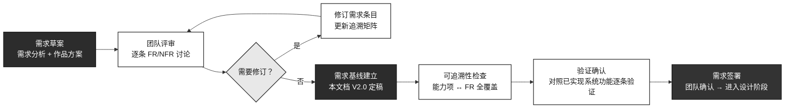
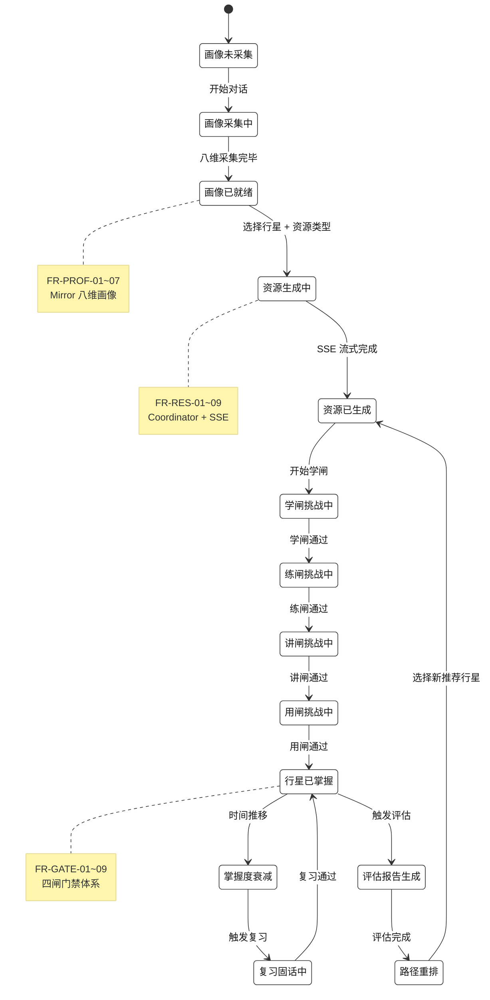

# SparkOrbit 星轨学图 — 软件需求说明书

| 项 | 内容 |
|----|------|
| 项目名称 | SparkOrbit 星轨学图 |
| 文档名称 | 软件需求说明书 |
| 文档编号 | SparkOrbit-B1 |
| 编制者 | SparkOrbit 团队 |
| 编制日期 | 2026-08-14 |
| 版本 | V3.0（工程级完整版） |
| 密级 | 内部 |

---

## 修改记录

| 版本 | 日期 | 修改人 | 说明 |
|------|------|--------|------|
| V1.0 | 2026-07-30 | SparkOrbit 团队 | 初稿，基于作品设计实现方案 §1.2 与竞赛要求回填 |
| V2.0 | 2026-07-31 | SparkOrbit 团队 | 工程级完整版：新增全部功能需求（FR- 系列约 40 条）、非功能需求（NFR- 系列约 15 条）、完整用例图与功能结构图、需求追溯矩阵、接口全景图、灰黑 Mermaid 图表全套 |
| V3.0 | 2026-08-14 | SparkOrbit 团队 | 工程级对齐：画像修正为八维（对齐 PROFILE_DIMENSIONS 常量）、新增 FR-INTV/FR-CAREER/FR-EXAM 三需求簇、新增 §3.2.1 关键用例规格（UC-01~07，含前置/后置/扩展/异常流） |

---

## 1 引言

### 1.1 编写目的

本说明书旨在为 SparkOrbit 星轨学图项目建立完整、精确、可验证的软件需求基线，是后续概要设计（C1）、详细设计（C2）、数据库设计（C3）、测试计划（E1）与测试分析报告（E2）的核心输入。

**预期读者**：

| 读者角色 | 关注重点 |
|----------|----------|
| 系统架构师 | 功能需求全集、非功能约束、外部接口定义 |
| 前端开发 | 用户接口需求、SSE 流式交互需求、页面功能清单 |
| 后端开发 | API 功能需求、数据库需求、安全需求、外部服务接口 |
| AI 集成开发 | 智能体功能需求、多模型路由需求、RAG 需求、幻觉防控需求 |
| 测试工程师 | 功能需求逐条验收标准、性能指标、测试场景定义 |
| 文档负责人 | 需求追溯矩阵、后续文档的引用锚点 |
| 竞赛评审专家 | 功能完整度与竞赛匹配度、需求分析规范性 |

### 1.2 范围

本说明书界定 SparkOrbit 星轨学图项目的全部功能需求与非功能需求，范围覆盖：

| 范畴 | 说明 |
|------|------|
| **系统形态** | Web SPA 前端（Vue 3 + TypeScript + Vite）+ 后端 API 服务（FastAPI + Uvicorn）+ 数据持久层（MySQL 8.0 + ChromaDB + 文件系统） |
| **客户端** | 现代浏览器（Chrome 110+、Edge 110+、Safari 17+），不含原生 iOS/Android 移动 App |
| **用户角色** | 学生（Student）、教师（Teacher）、系统管理员（Admin）三端 |
| **AI 能力** | 多智能体协同资源生成、个性化路径规划、智能辅导、学习效果评估、幻觉防控 |
| **部署环境** | Docker Compose 容器化部署；支持本地（http://localhost）与公网（https://wikj.online）运行 |
| **能力定位** | 面向高等教育场景的 AI 自适应学习路径决策与多智能体伴学系统——多智能体协同的个性化资源生成与学习系统开发 |

### 1.3 定义与缩写

| 术语 | 全称 | 含义 |
|------|------|------|
| FR | Functional Requirement | 功能需求——系统必须执行的行为 |
| NFR | Non-Functional Requirement | 非功能需求——系统必须具备的品质约束 |
| Mirror | — | 八维学生认知画像系统 |
| Shield | — | 内容安全与幻觉防控网关 |
| Coordinator | — | 多智能体资源生成的编排调度器 |
| RAG | Retrieval-Augmented Generation | 检索增强生成——结合向量检索与大模型生成的范式 |
| RBAC | Role-Based Access Control | 基于角色的访问控制（student/teacher/admin） |
| SSE | Server-Sent Events | 服务端到客户端的单向流式数据推送协议 |
| WebSocket | — | 全双工通信协议，用于聊天与实时通知 |
| SPA | Single Page Application | 单页应用 |
| Vault | — | 基于 Obsidian 兼容 Markdown 的个人知识库 |
| ChromaDB | — | 开源向量数据库，用于 RAG 语义检索 |
| LangGraph | — | LangChain 生态的多智能体编排框架 |
| 四闸 | — | 学→练→讲→用四级掌握度验证门禁体系 |
| 星系 / 行星 | — | 课程→知识点映射的隐喻命名：星系=课程，行星=知识点，掌握度=行星亮度 |
| 星轨领航台 | — | 学生端主界面的统称，含六大功能分区 |
| 演武舱 | AlgoVizLab | 算法可视化学习舱，支持图结构/排序/搜索的可视化演练与交互式小测 |
| 代码舱 | CodeLab | 沙箱化代码在线编辑与执行环境 |
| 时空扭曲沙盘 | TimeWarpSandbox | 教师端仿真预演工具，基于镜像学生虚拟运行路径以预判教学效果 |
| Seedance | — | 火山方舟文生视频模型 |
| IAT / ISE / TTS | — | 讯飞语音听写 / 口语评测 / 语音合成 |

### 1.4 参考资料

| 编号 | 资料名称 | 来源 | 用途 |
|------|----------|------|------|
| [R1] | 竞赛题目与评审要求（通用） | 赛事官方 | 需求基线、必备功能定义与评审维度 |
| [R2] | 《SparkOrbit-A1-可行性研究报告》V3.0 | 项目组 | 技术/经济/操作可行性结论、风险矩阵 |
| [R3] | 《SparkOrbit-A2-项目开发计划》V3.0 | 项目组 | WBS 任务分解、交付物清单、里程碑定义 |
| [R4] | 《SparkOrbit 作品设计实现方案》V1.0 | 项目组 | 技术架构、功能结构、创新点描述 |
| [R5] | 《竞赛评审要点（通用）》 | 赛事官方 | 评审维度分解与权重 |
| [R6] | OpenAPI 自动生成文档 | 系统内置（/docs） | API 端点、请求/响应 Schema |
| [R7] | `docker-compose.yml` | 项目仓库 | 部署架构与容器编排 |
| [R8] | `backend/app/models/` 目录 | 项目仓库 | 数据模型定义（82 张表 SQLAlchemy ORM） |
| [R9] | 《软件需求说明书编写规范.doc》 | 国标压缩包 | 文档结构规范 |
| [R10] | GB/T 8567-2006 计算机软件文档编制规范 | 国家标准 | 文档编制总纲 |

---

## 2 项目概述

### 2.1 产品描述

SparkOrbit 星轨学图是一个面向高等教育领域的个性化智能学习平台。系统以「认知孪生」（Mirror 八维学生画像）为核心内核，以「星系—行星」知识图谱隐喻为组织框架，通过多智能体协同（LangGraph + Coordinator）实现从学习画像采集、多模态资源生成、个性化路径规划、四闸掌握度验证到学习效果评估的完整学习闭环。

系统覆盖三类用户：

- **学生**：通过星轨领航台六大分区（学习区/星域/树洞/聊天/自习/休闲）完成完整的学习旅程——从对话式画像采集开始，在资源工坊获取个性化多模态资源，通过四闸（学→练→讲→用）步步验证掌握度，接受苏格拉底/费曼式智能辅导，获取全维度成长报告。
- **教师**：通过教师工作台实现学情监控、作业考勤管理、改进复核、PDF 星系锻造、课堂巡查以及幻觉工单覆盖评分。
- **管理员**：通过管理控制台进行用户管理、内容审核、API Token 用量监控、维护模式切换与异常日志分析。

### 2.2 产品功能概览

#### 2.2.1 功能结构全景图

```mermaid
%%{init: {'theme':'base','themeVariables':{'primaryColor':'#ffffff','primaryTextColor':'#1a1a1a','primaryBorderColor':'#333333','lineColor':'#333333','secondaryColor':'#e8e8e8','tertiaryColor':'#f5f5f5','background':'#ffffff','mainBkg':'#ffffff','nodeBorder':'#333333','clusterBkg':'#f0f0f0','clusterBorder':'#333333','titleColor':'#1a1a1a','edgeLabelBackground':'#ffffff'}}}%%
flowchart TD
    Root["SparkOrbit 星轨学图<br/>高等教育个性化智能学习平台"] --> Student["学生端<br/>星轨领航台"]
    Root --> Teacher["教师端<br/>教师工作台"]
    Root --> Admin["管理端<br/>管理控制台"]
    Root --> Platform["平台核心能力"]

    Student --> S1["学习区<br/>资源工坊 · 行星挑战 · 成长报告"]
    Student --> S2["星域<br/>个人画像 · 学习路径 · 成就勋章"]
    Student --> S3["树洞<br/>星语树洞 · 心愿墙 · 匿名发帖"]
    Student --> S4["聊天<br/>班级聊天 · 私聊 · 实时消息"]
    Student --> S5["自习区<br/>3D 星图 · 自习督导 · 番茄钟"]
    Student --> S6["休闲区<br/>桌宠 · 星座运势 · 积分商店 · 小游戏"]
    Student --> S7["面试舱<br/>模拟面试 · 练习舱 · 能力画像"]
    Student --> S8["求职助手<br/>校招门户 · 简历工坊 · 投递看板"]

    Teacher --> T1["学情看板<br/>班级概览 · 风险学生 · 掌握度热力图"]
    Teacher --> T2["作业考勤<br/>作业发布批改 · 考勤记录管理"]
    Teacher --> T3["改进复核<br/>学生改进提交 · 评分反馈"]
    Teacher --> T4["星系锻造<br/>PDF 上传 · AI 解析 · 星系行星生成"]
    Teacher --> T5["课堂工具<br/>巡查监看 · 时空扭曲沙盘"]
    Teacher --> T6["质量治理<br/>幻觉工单 · 覆盖评分 · 反馈闭环"]

    Admin --> A1["用户管理<br/>创建 · 禁用 · 删除 · 角色分配"]
    Admin --> A2["内容管理<br/>星系行星编辑 · 资源审核"]
    Admin --> A3["用量监控<br/>API Token · 调用统计 · 异常告警"]
    Admin --> A4["系统运维<br/>维护模式 · 健康检查 · 备份恢复"]

    Platform --> P1["Mirror 八维画像<br/>对话采集 · 事件刷新 · 教师复核"]
    Platform --> P2["多智能体资源生成<br/>Coordinator · 7 类资源 · SSE 流式"]
    Platform --> P3["个性化路径<br/>画像驱动 · 评估回灌 · 可解释推荐"]
    Platform --> P4["智能辅导<br/>苏格拉底 · 费曼 · 数字人 · RAG"]
    Platform --> P5["四闸验证<br/>学→练→讲→用 · 记忆衰减 · 复习固化"]
    Platform --> P6["效果评估<br/>雷达图 · 掌握度 · 热力图 · 成长报告"]
    Platform --> P7["Shield 安防<br/>三级幻觉防控 · 内容安全 · 工单闭环"]
    Platform --> P8["知识库 RAG<br/>ChromaDB · Vault 双链 · 语义检索"]
    Platform --> P9["拓展能力<br/>代码舱 · 演武舱 · 自习督导 · 桌宠"]
    Platform --> P10["模拟面试<br/>三模式编排 · 多模态评分 · 三视角总评"]
    Platform --> P11["职业规划<br/>校招门户 · 简历优化 · 投递跟踪"]

    classDef root fill:#2c2c2c,stroke:#1a1a1a,color:#ffffff,stroke-width:2px
    classDef role fill:#333333,stroke:#1a1a1a,color:#ffffff,stroke-width:1.5px
    classDef func fill:#ffffff,stroke:#333333,color:#1a1a1a,stroke-width:1px
    classDef platform fill:#e8e8e8,stroke:#333333,color:#1a1a1a,stroke-width:1px
    class Root root
    class Student,Teacher,Admin role
    class S1,S2,S3,S4,S5,S6,S7,S8,T1,T2,T3,T4,T5,T6,A1,A2,A3,A4 func
    class Platform,P1,P2,P3,P4,P5,P6,P7,P8,P9,P10,P11 platform
```

> **图 B1-F01：系统功能结构全景图**（Mermaid，建议导出为 PNG 嵌入文档）

#### 2.2.2 学生端功能清单

| 功能分区 | 核心功能 | 描述 |
|----------|----------|------|
| **学习区** | 资源工坊 | 选择行星→选择资源类型→触发多智能体流式生成→查看质量评分→保存到星库 |
| | 行星挑战 | 四闸（学→练→讲→用）逐步通关、提交答案、查看评分与掌握度变化 |
| | 成长报告 | 雷达图（八维） + 掌握度曲线 + 达成率 + 划词热力图 |
| | 考级中心 | 题库练习 · 模拟考试 · 词汇 · 精听 · 作文批改 · 打卡挑战 |
| | SRS 复习 | 间隔重复复习卡队列 · 学习日历 · 每周复习报告 |
| **星域** | 个人画像 | 八维可视化（知识基础/认知风格/易错倾向/学习目标/时间弹性/前置知识）、画像对话入口 |
| | 学习路径 | 当前路径查看、评估触发路径重排、推荐资源关联 |
| | 成就勋章 | 行星点亮时间线、称号等级、装备展示 |
| **树洞** | 星语树洞 | 匿名发帖、回帖、按课程/心情分类标签 |
| | 心愿墙 | 公开心愿发布、点赞鼓励 |
| **聊天** | 班级聊天室 | 实时 WebSocket 消息、成员列表、在线状态 |
| | 私聊 | 一对一私信 |
| **自习区** | 3D 星图 | Three.js 星系行星 3D 可视化、轨道旋转缩放 |
| | 自习督导 | 摄像头姿态检测（TensorFlow.js 本地推理）、分心提醒、番茄钟 |
| **休闲区** | 桌宠 | 15 种动画宠物互动、喂食养成 |
| | 星座运势 | 每日星座运势、学习提醒 |
| | 积分商店 | 学习积分兑换虚拟道具 |
| | 小游戏 | 轻量解压游戏 |
| **模拟面试区** | 面试舱 | 三步配置（舱别/岗位/难度/轮数/简历解析）→ 实地面试（数字人面试官 + 语音/文本作答）→ 报告（得分环 + 雷达图 + 三视角评议 + 逐题回放） |
| | 练习舱 | 单题快练（不开摄像头），求职/升学 × 岗位 × 题类抽题，STAR 四要素打分，历史均分 |
| | 求职助手 | 校招门户 + 简历工坊（4 模板/解析/优化/匹配/导出）+ 投递看板 + 企业面经题库 |
| | 能力画像 | 场次/均分/五维雷达（历史均值 vs 最近）+ 弱项（<70）一键再开 + 回流训练闭环 |

#### 2.2.3 教师端功能清单

| 功能模块 | 核心功能 | 描述 |
|----------|----------|------|
| **学情看板** | 班级概览 | 全班掌握度均值、达标率、活跃度、风险学生列表 |
| | 个体详情 | 单学生全维度画像、掌握度热力图、学习路径轨迹 |
| **作业考勤** | 作业管理 | 创建发布作业、批量批改、成绩录入 |
| | 考勤管理 | 考勤记录查看、异常标记 |
| **改进复核** | 改进查看 | 查看学生提交的改进计划或反思 |
| | 评分反馈 | 教师评分与书面反馈 |
| **星系锻造** | PDF 上传 | 上传课程教材 PDF |
| | AI 解析 | LLM 提取知识点结构→生成星系与行星 |
| | 手动调整 | 教师调整行星结构、补充习题 |
| **课堂工具** | 巡查监看 | 实时查看学生当前进度页面 |
| | 时空扭曲沙盘 | 基于镜像学生虚拟学习路径以预判教学效果 |
| **质量治理** | 幻觉工单 | 查看低置信内容工单列表 |
| | 覆盖评分 | 教师对 AI 评分进行覆盖修正 |
| | 反馈闭环 | 覆盖结果回灌模型优化 |
| **面试督导** | 任务下发 | 下发面试任务（标题/说明/舱别/岗位/难度/轮数）到班级 |
| | 会话查看 | 查看班级学生面试会话列表（学生/岗位/状态/评分） |
| | 报告点评 | 查看面试报告与三视角评议，写教师评语与教师分数 |
| **资源审阅** | 资源审核 | 查看学生生成资源，通过/驳回并写审阅意见 |
| | 资源推荐 | 优质资源推荐到班级 |
| **教学工具** | 题库管理 | 题库 CRUD + AI 生成题目 |
| | 学生分组 | 创建分组、分配学生 |
| | 表扬激励 | 表扬记录与学生激励 |
| | 教学日历 | 教学事件日历与待办 |

#### 2.2.4 管理端功能清单

| 功能模块 | 核心功能 | 描述 |
|----------|----------|------|
| **用户管理** | 账户管理 | 创建/禁用/删除用户、批量导入、角色分配 |
| **内容管理** | 星系管理 | 星系/行星创建编辑、知识点结构调整 |
| | 资源审核 | 生成资源质量审核 |
| **用量监控** | Token 统计 | 各模型 API 调用次数与费用统计 |
| | 异常告警 | 调用量异常、错误率飙升告警 |
| | 接口日志 | 调用详情日志查询 |
| **系统运维** | 维护模式 | 全站维护模式开关（仅管理员可写） |
| | 健康检查 | 容器状态、API 可用性、外部模型连通性 |
| | 备份恢复 | 一键备份 MySQL + 文件存储 + ChromaDB |

#### 2.2.5 平台核心能力清单

| 能力 | 能力对标 | 核心机制 |
|------|----------|----------|
| **Mirror 八维画像** | 2.2.1 | 对话式初始采集 → 缺维追问 → 学习事件增量刷新 → 教师复核可调整 |
| **多智能体资源生成** | 2.2.2 | Coordinator 编排调度 → 按资源类型路由至专项 Agent → SSE 流式反馈 → 质量自动评分 |
| **个性化路径规划** | 2.2.3 | 画像维度驱动 → 掌握度加权排序 → 评估回灌贝叶斯重排 → 推荐可解释 |
| **智能辅导** | 2.2.4 | 苏格拉底引导式 + 费曼解释模式 → RAG 行星上下文 → 数字人播报 |
| **四闸验证** | — | 学→练→讲→用 四级门禁 → 记忆衰减曲线 → 复习固化提醒 |
| **效果评估** | 2.2.5 | 雷达图 + 掌握度 + 达成率 + 热力图 → 评估触发路径重排 |
| **Shield 安防** | 5.1 | 三级防线：前端提示→多模型交叉验证→教师低置信工单 |
| **知识库 RAG** | 5.1 | ChromaDB 向量检索 + Vault Obsidian 双链笔记 + 校本语料检索增强 |
| **拓展能力** | 2.3 | 代码舱（Docker 沙箱）、演武舱（算法可视化）、自习督导（TensorFlow.js）、桌宠（精灵动画） |
| **模拟面试** | 2.3 | 三模式编排（workflow 准备 / handoff 单轮评分 / council 总评）+ 多模态评分（语义/韵律/仪态）+ 三视角评议 |
| **职业规划** | 2.3 | 校招门户 + 简历优化匹配 + 投递看板 + 企业面经题库 |

### 2.3 用户特点

| 维度 | 学生（Student） | 教师（Teacher） | 管理员（Admin） |
|------|----------------|-----------------|-----------------|
| **目标群体** | 本科高年级/研究生，AI/计算机/电子信息专业 | 高校授课教师/助教 | 院系 IT 管理员/运维人员 |
| **技能水平** | 浏览器基本操作，无需 AI 知识 | 教学管理系统基础操作 | Docker 基础 + Linux 命令行 |
| **使用频率** | 频繁（课前预习→课中互动→课后巩固→复习备考） | 中等（学情监控周期性＋异常时介入） | 低频（按需运维、异常响应） |
| **核心诉求** | 个性化学习路径、高质量多模态资源、清晰掌握度反馈、学习动力维持 | 降低结构化备课成本、快速识别风险学生、AI 建议可追溯可覆盖 | 系统稳定可用、资源可监控可备份、权限可管控 |
| **情感需求** | 成就感（行星点亮）、陪伴感（桌宠）、归属感（树洞/星座） | 控制感（学情透明化）、效率感（一键锻造） | 安全感（备份恢复完备）、可控感（维护模式一键） |
| **访问方式** | 浏览器访问 https://wikj.online 或 http://localhost | 同上 | 同上 + 服务器 SSH |
| **权限层级** | 读写个人数据 | 读写所管理班级数据 | 全局读写 + 系统配置 |

### 2.4 一般约束

| 约束编号 | 约束项 | 说明 |
|----------|--------|------|
| **C-01** | 访问约束 | 纯浏览器 Web 端访问，不含原生移动 App；推荐 Chrome/Edge 110+ |
| **C-02** | 部署约束 | 依赖 Docker Desktop 4.x+，通过 `docker compose up -d` 一键启动 |
| **C-03** | 外部依赖约束 | 核心 AI 能力（推理/语音/视频/图像）依赖外部云 API 服务，不可用时自动降级 |
| **C-04** | 语言约束 | 系统界面与文档以简体中文为主，AI 生成内容以中文为主、支持少量英文术语 |
| **C-05** | 网络约束 | 本地部署无需外网（除 AI API 调用）；公网部署需开放 80/443 端口 |
| **C-06** | 并发约束 | 竞赛场景设计并发学生 50 以内，不要求高并发生产级配置 |
| **C-07** | 数据容量 | 竞赛场景数据量 MB~GB 级，不涉及 TB 级大数据处理 |
| **C-08** | 安全等级 | 竞赛演示级：密码哈希存储、RBAC 鉴权、API Key 环境变量隔离；不含完整审计日志与生产级合规 |

### 2.5 假设与依据

| 假设编号 | 假设内容 | 依据 |
|----------|----------|------|
| **H-01** | 评委机器已安装 Docker Desktop 4.x+（或可联网安装） | 部署说明书明确 Docker 为唯一前置依赖 |
| **H-02** | API Key 可配置（DeepSeek/讯飞/Seedance/通义/cantonese.ai） | `.env` 文件支持所有模型 Key 配置 |
| **H-03** | 首批课程切入点覆盖「数据结构」「机器学习」等 CS 核心课 | 种子数据星系预置了相关课程的知识点结构 |
| **H-04** | 学生具有基本的浏览器操作与文字输入能力 | 交互设计以点击选择 + 简短输入为主 |
| **H-05** | 教师上传的 PDF 教材不包含受版权保护但未授权传播的内容 | 法律合规章节已声明版权边界 |
| **H-06** | WebSocket / SSE 连接在网络条件正常时保持稳定 | 前端实现断线重连机制作为异常处理 |

---

## 3 具体需求

### 3.1 功能需求

#### 3.1.1 账户与权限（FR-AUTH）

> **需求簇 FR-AUTH**：覆盖三角色注册、登录、鉴权与会话管理。

| 需求 ID | 需求名称 | 描述 | 验收标准 | 优先级 |
|---------|----------|------|----------|--------|
| **FR-AUTH-01** | 学生注册与登录 | 学生可以通过注册页面创建账户（用户名+密码），登录后进入星轨领航台；系统支持演示账号（student001）免注册直接登录 | 注册成功 → 自动跳转登录 → 登录后进入学生主页；演示账号密码框可一键填充 | P0 |
| **FR-AUTH-02** | 教师注册与登录 | 教师可以通过注册页面创建账户（用户名+密码+邀请码），登录后进入教师工作台；教师账号需管理员审批或邀请码验证 | 教师注册成功 → 教师工作台仪表盘可见 | P0 |
| **FR-AUTH-03** | 管理员登录 | 管理员使用预置账号（admin001）登录，进入管理控制台；管理员不可通过注册页面创建 | 管理员登录 → 管理控制台全部功能面板可见 | P0 |
| **FR-AUTH-04** | RBAC 三角色鉴权 | 系统通过 Token 鉴别用户角色（student/teacher/admin），角色级接口鉴权中间件拦截未授权请求 | 学生访问教师 API → 403 Forbidden；教师访问管理 API → 403 Forbidden | P0 |
| **FR-AUTH-05** | 密码安全存储 | 用户密码使用 PBKDF2-SHA256 加盐哈希存储（`backend/app/services/auth.py`），数据库不保存明文密码 | 数据库查看 users 表 → password_hash 字段为哈希值而非明文 | P0 |
| **FR-AUTH-06** | 会话持久化 | 登录 Token 存储在浏览器 localStorage，页面刷新后保持登录状态；Token 过期后自动跳转登录页 | 刷新页面 → 无需重新登录；手动清除 Token → 跳转登录 | P1 |
| **FR-AUTH-07** | 角色信息展示 | 登录后系统在导航栏展示当前用户名、角色标识与头像 | 导航栏可见用户名 + 角色标签（学生/教师/管理员） | P1 |

#### 3.1.2 对话式学习画像（FR-PROF）

> **需求簇 FR-PROF**：覆盖八维学习画像的对话式采集、缺维追问、事件驱动刷新与教师复核。

| 需求 ID | 需求名称 | 描述 | 验收标准 | 优先级 |
|---------|----------|------|----------|--------|
| **FR-PROF-01** | 八维画像定义 | 系统定义并持久化八维画像维度：专业背景（major_background）、前置知识（prior_knowledge）、认知风格（cognitive_style）、易错倾向（mistake_tendency）、学习目标（learning_goal）、时间弹性（time_flexibility）、模态偏好（modality_preference）、动机水平（motivation_level），对应 `backend/app/models/student_profile.py` 的 `PROFILE_DIMENSIONS` 常量 | 数据库 `student_profiles` 表可查询八个 JSON 字段 | P0 |
| **FR-PROF-02** | 对话式初始采集 | 学生首次使用，系统发起引导式对话，通过自然语言问答采集八维画像初始值；对话流程由 LLM 驱动，自适应提问策略 | 新学生账号完成对话后 → 八维画像数据完整且合理（非全默认值） | P0 |
| **FR-PROF-03** | 缺维检测与追问 | 若某维度在对话中未被充分覆盖，系统自动检测缺维并生成追问提示 | 仅回答 2 个维度 → 系统发出缺维追问卡片 → 点击完善后该维度数据填入 | P0 |
| **FR-PROF-04** | 事件驱动增量刷新 | 学生完成行星挑战、使用资源或接受辅导后，系统自动更新对应画像维度（如易错倾向、认知风格） | 完成 3 次代码题挑战 → 易错倾向维度（MistakePattern）中代码类权值上升 | P1 |
| **FR-PROF-05** | 画像可视化 | 学生可在星域个人主页查看八维雷达图、各维度详情与变化趋势 | 星域页 → 雷达图六轴均显示数值 → 悬停某一轴显示详情卡片 | P0 |
| **FR-PROF-06** | 教师复核画像 | 教师可在学生详情页查看画像数据，并提交改进建议或手动调整维度权重 | 教师查看画像 → 修改权重并保存 → 学生画像更新 | P1 |
| **FR-PROF-07** | 画像对比视图 | 支持查看画像随时间变化的 before/after 对比（以雷达图叠加或表格形式） | 选择历史快照 → 与当前画像叠加对比 → 变化维度高亮 | P2 |

#### 3.1.3 多智能体资源生成（FR-RES）

> **需求簇 FR-RES**：覆盖多智能体协同调度、多模态资源生成、SSE 流式反馈、质量自动评分与幻觉防控。

| 需求 ID | 需求名称 | 描述 | 验收标准 | 优先级 |
|---------|----------|------|----------|--------|
| **FR-RES-01** | 资源类型支持 | 系统至少支持 5 类资源生成：Markdown 文档、Mermaid 思维导图、LaTeX 习题、阅读材料、教学视频（Seedance）。实际实现 7 类（另含教学课件 deck、代码片段） | 资源工坊资源类型选择器中可见 >=7 个选项；每类选择后可触发生成 | P0 |
| **FR-RES-02** | Coordinator 智能调度 | Coordinator 编排器根据用户所选资源类型与画像，自动匹配相应的 Resource Agent 并决定串行/并行执行策略 | 选择导图+习题两个类型 → Coordinator 并行调度导图 Agent 和习题 Agent → 两者 SSE 流同时推送 | P0 |
| **FR-RES-03** | SSE 流式反馈 | 资源生成过程通过 SSE（Server-Sent Events）流式推送到前端，用户可实时看到生成内容逐步呈现 | 生成文档时 → 前端显示逐字符/逐段落的打字效果 → 生成完成后标记完成 | P0 |
| **FR-RES-04** | 质量自动评分 | 每份生成资源附带自动质量评分（0-100 分），评分维度包括：内容准确性、结构合理性、与行星知识点匹配度、语言流畅度 | 生成的文档 → 底部显示质量评分条（含分维度雷达子图） | P1 |
| **FR-RES-05** | 源标签溯源 | 每份资源附带源标签（Source Tag），标明生成模型、所用上下文行星、生成时间、是否有交叉验证 | 资源卡片底部显示源标签（如「DeepSeek | 行星: 二叉树遍历 | 交叉验证: ✅」） | P1 |
| **FR-RES-06** | Seedance 异步视频 | 视频类资源通过火山方舟 Seedance 异步生成，前端显示进度提示（排队→处理中→完成），超时或失败时降级为 GSAP 动画分镜 | 选择视频生成 → 前端显示进度条 → 2-5 分钟后返回视频 URL → 点击播放 | P0 |
| **FR-RES-07** | 资源保存与回看 | 生成资源可一键保存至星库，历史生成资源可按时间、类型、行星筛选回看 | 生成完成后点击保存 → 星库中可搜索到该资源 → 点击重新查看 | P0 |
| **FR-RES-08** | 课件 Deck 生成 | 支持生成教学课件（多页 PPTX 格式），含自动翻页与 TTS 语音讲解 | 选择课件类型 → 生成多页幻灯片 → 每页含标题+要点+配图 → 支持下载 | P1 |
| **FR-RES-09** | 资源生成入口多样性 | 支持从资源工坊（主动选择）、行星详情页（一键生成推荐类型）、学习路径推荐资源（点击生成）多个入口触发资源生成 | 从 3 个不同入口触发 → 均跳转资源工坊并自动填充对应行星与推荐类型 | P1 |

#### 3.1.4 个性化路径规划与资源推送（FR-PATH）

> **需求簇 FR-PATH**：覆盖画像驱动的个性化学习路径生成、评估回灌重排与资源精准推荐。

| 需求 ID | 需求名称 | 描述 | 验收标准 | 优先级 |
|---------|----------|------|----------|--------|
| **FR-PATH-01** | 画像驱动路径生成 | 系统根据学生八维画像 + 当前掌握度，自动生成按优先级排序的学习路径步骤列表，每步骤关联推荐资源 | 新学生完成画像采集后 → 星域路径面板可见推荐学习路径（含 >=3 个步骤） | P0 |
| **FR-PATH-02** | 推荐资源匹配度 | 路径中每步推荐的资源与行星知识点、学生认知风格和弱项具有明显匹配关系，推荐理由可解释 | 路径步骤详情页显示推荐理由（如「因为你偏好的视觉型学习风格，推荐此思维导图资源」） | P0 |
| **FR-PATH-03** | 评估触发路径重排 | 完成学习效果评估后，系统自动触发路径重排——调整后续步骤的优先级，增删推荐资源 | 完成评估 → 路径面板自动刷新 → 原先排名第 3 的弱项行星升至第 1 | P0 |
| **FR-PATH-04** | 冷启动默认路径 | 若学生尚未完成画像采集，系统提供基于大众数据的默认推荐路径 | 新学生未对话画像 → 路径面板仍显示默认推荐 → 标注「完成画像后可获得更精准推荐」 | P1 |
| **FR-PATH-05** | 路径进度可视化 | 路径面板展示当前进度（已完成/进行中/待学习）、每步骤预计耗时 | 路径面板 → 进度条显示 2/5 已完成 → 悬停某步骤显示预估 30 分钟 | P1 |
| **FR-PATH-06** | 路径手动调整 | 学生可手动调整路径顺序、跳过某步骤、更换推荐资源 | 拖动路径步骤改变顺序 → 点击跳过某步骤 → 路径自动重新编号 | P2 |

#### 3.1.5 智能辅导（FR-TUT）

> **需求簇 FR-TUT**：覆盖苏格拉底引导式与费曼解释式两种辅导模式、RAG 增强回答与数字人播报。

| 需求 ID | 需求名称 | 描述 | 验收标准 | 优先级 |
|---------|----------|------|----------|--------|
| **FR-TUT-01** | 苏格拉底引导式辅导 | 选择苏格拉底模式后，系统不直接给出答案，而是通过连续反问引导学生自主推导得出正确答案 | 提问「二叉树的层序遍历怎么实现？」→ 系统反问「你了解队列在 BFS 中的作用吗？」→ 学生回答 → 继续追问 → 最终学生自主推导出算法 | P0 |
| **FR-TUT-02** | 费曼讲解式辅导 | 选择费曼模式后，系统以「教给别人」的通俗语言解释概念，并邀请学生用自己的话复述以检验理解度 | 提问「什么是动态规划？」→ 系统用日常类比解释 → 追问「现在请用你自己的话向一个初学者解释动态规划」 | P0 |
| **FR-TUT-03** | RAG 增强回答 | 辅导回答自动检索当前行星关联的教材知识库（ChromaDB），将相关原文片段作为上下文注入 LLM 回答 | 辅导回答底部显示「参考来源」板块，列出教材章节+页码 | P0 |
| **FR-TUT-04** | 数字人播报 | 支持在辅导对话中选择「请数字人讲解」，系统通过讯飞虚拟人交互平台生成 3D 数字人播报视频 | 点击「请数字人讲解」→ 前端显示数字人形象视频 → 播放讲解内容 → 播放完成 | P1 |
| **FR-TUT-05** | 辅导模式切换 | 学生可在对话中随时切换苏格拉底/费曼/自由问答模式 | 对话顶部模式选择器 → 切换模式 → 下次回答风格变化 | P1 |
| **FR-TUT-06** | 语音输入 | 支持通过讯飞 IAT 语音听写将语音转为文字作为辅导提问 | 点击麦克风图标 → 录音 → 松手后文字填入输入框 → 发送 | P1 |
| **FR-TUT-07** | 口语评测 | 支持学生朗读英文/中文后，由讯飞 ISE 进行口语发音评测并给出分数与纠错建议 | 选择口语评测模式 → 朗读显示文本 → 评测返回分数 + 音素级纠错 | P2 |
| **FR-TUT-08** | 辅导历史 | 辅导对话历史持久化存储，支持按时间、行星、关键词搜索历史辅导记录 | 辅导面板历史列表 → 搜索「二叉树」→ 返回相关历史对话列表 | P1 |

#### 3.1.6 学习效果评估（FR-EVAL）

> **需求簇 FR-EVAL**：覆盖多维度学习效果评估、可视化报告生成与动态路径联动。

| 需求 ID | 需求名称 | 描述 | 验收标准 | 优先级 |
|---------|----------|------|----------|--------|
| **FR-EVAL-01** | 成长报告生成 | 系统根据学生的挑战成绩、辅导记录、资源使用频率、自习时长等数据，自动生成成长报告 | 学习区成长报告页 → 显示报告（含雷达图、掌握度曲线、达成率） | P0 |
| **FR-EVAL-02** | 雷达图展示 | 成长报告以八维雷达图直观展示画像各维度当前评分 | 雷达图六轴显示数值 → 轴标签与画像维度一一对应 → 支持与历史对比 | P0 |
| **FR-EVAL-03** | 掌握度展示 | 展示各行星掌握度（0-100%），以进度条或亮度可视化形式呈现 | 成长报告 → 行星掌握度列表 → 排序（低→高）→ 点击跳转对应行星 | P0 |
| **FR-EVAL-04** | 达成率展示 | 展示整体学习目标的达成率（已完成行星数 / 课程总行星数） | 达成率环形图 → 中心数字显示百分比 | P1 |
| **FR-EVAL-05** | 热力图展示 | 以日历热力图形式展示每日学习活跃度（挑战次数/时长/资源数） | 热力图按月展示 → 深色格子表示高活跃度 → 悬停显示当日数据 | P1 |
| **FR-EVAL-06** | 评估触发路径联动 | 评估完成后，系统自动将评估结果注入路径重排 | 评估报告底部「更新学习路径」按钮 → 点击后路径面板刷新 | P0 |
| **FR-EVAL-07** | 多阶段对比 | 支持查看不同时间点的评估报告（初学阶段/学期中/复习后）并对比变化 | 报告页左上角时间选择器 → 选择不同日期 → 报告数据切换 → 对比视图 | P1 |

#### 3.1.7 四闸挑战与掌握度验证（FR-GATE）

> **需求簇 FR-GATE**：覆盖学→练→讲→用四级门禁体系、挑战生成与评分、记忆衰减与复习固化。

| 需求 ID | 需求名称 | 描述 | 验收标准 | 优先级 |
|---------|----------|------|----------|--------|
| **FR-GATE-01** | 学闸——知识理解 | 选择题/判断题基础题型，验证学生对行星知识点的基本理解 | 学闸通过（正确率 >=80%）→ 练闸解锁 | P0 |
| **FR-GATE-02** | 练闸——技能应用 | 编程题/计算题/辨析题中等难度题型，验证知识应用能力 | 练闸通过 → 讲闸解锁 | P0 |
| **FR-GATE-03** | 讲闸——费曼验证 | 要求学生用自己的话解释行星知识点，LLM 评估理解准确度与表达清晰度 | 讲闸通过 → 用闸解锁 | P0 |
| **FR-GATE-04** | 用闸——实战综合 | 综合情景题或代码舱实战任务，验证知识迁移与综合应用能力 | 用闸通过 → 行星点亮 → 掌握度标记为已掌握 | P0 |
| **FR-GATE-05** | 闸门状态可视化 | 行星详情页显示四闸当前状态：锁定（灰）、进行中（闪）、已通过（亮） | 行星页 → 四闸标识直观可见 → 颜色+图标状态一目了然 | P0 |
| **FR-GATE-06** | 挑战自动生成 | 每道挑战题由 LLM 根据行星知识点 + 学生画像动态生成，避免题库枯竭 | 同一行星同一闸 → 不同学生或不同时间 → 生成不同题目 | P1 |
| **FR-GATE-07** | 评分与反馈 | 提交答案后系统自动评分，并给出详细纠错反馈（错在哪里、正确思路、相关知识点） | 提交答案 → 评分结果 + 纠错卡片呈现 → 含「去复习相关知识」链接 | P0 |
| **FR-GATE-08** | 记忆衰减 | 已掌握行星根据艾宾浩斯遗忘曲线计算掌握度衰减，低于阈值后提醒复习固化 | 已掌握行星 7 天后 → 掌握度自动从 100% 衰减至 80% → 推送复习提醒 | P1 |
| **FR-GATE-09** | 复习固化 | 完成复习挑战后掌握度恢复至固化值（非原始 100%，留少量衰减），多次固化后衰减速率降低 | 复习挑战通过 → 掌握度恢复至 95% → 下次衰减间隔延长至 14 天 | P1 |

#### 3.1.8 教师端功能（FR-TCH）

> **需求簇 FR-TCH**：覆盖班级管理、学情监控、作业考勤、改进复核、星系锻造、课堂工具与质量治理。

| 需求 ID | 需求名称 | 描述 | 验收标准 | 优先级 |
|---------|----------|------|----------|--------|
| **FR-TCH-01** | 班级管理 | 教师可创建班级、邀请学生加入、查看班级学生列表 | 创建班级 → 生成邀请码 → 学生输入邀请码加入 → 教师端班级列表更新 | P0 |
| **FR-TCH-02** | 学情看板 | 展示班级整体学习数据面板：平均掌握度、达标率、活跃度、风险学生突出展示 | 教师工作台 → 学情看板 → 数据可视化图表显示 → 点击风险学生跳转详情 | P0 |
| **FR-TCH-03** | 风险学生识别 | 系统自动识别掌握度低于阈值或连续多日未活跃的学生并标记 | 风险学生列表 → 排名（最需关注→次需关注）→ 每项附具体风险指标 | P0 |
| **FR-TCH-04** | 作业发布与批改 | 教师可创建作业、设置截止日期、批量批改、录入成绩 | 创建作业 → 全班学生可见 → 学生提交 → 教师批改评分 → 成绩入库 | P0 |
| **FR-TCH-05** | 考勤管理 | 教师可查看学生考勤记录、标记异常 | 考勤页面 → 按日期显示出勤状态 → 支持手动修正 | P1 |
| **FR-TCH-06** | 改进复核 | 教师可查看学生提交的改进计划或反思，进行评分与书面反馈 | 改进提交列表 → 逐条查看 → 评分 + 文字反馈 → 学生端可见反馈 | P1 |
| **FR-TCH-07** | 星系锻造 | 教师上传课程 PDF → AI 自动解析提取知识点结构 → 生成星系与行星 → 教师可手动调整 | 上传 PDF → 等待 1-3 分钟解析 → 预览生成结果 → 调整保存 → 学生端星系更新 | P0 |
| **FR-TCH-08** | 课堂巡查 | 教师可实时查看学生当前的学习进度页面（仅浏览，不可操控） | 巡查面板 → 选择学生 → 显示该学生当前页面截屏 → 教师可切换学生 | P1 |
| **FR-TCH-09** | 时空扭曲沙盘 | 教师基于镜像学生虚拟运行学习路径，预演教学效果——模拟学生表现以评估路径合理性 | 沙盘 → 选择学生镜像 → 运行仿真 → 输出预测掌握度曲线与风险点标注 | P1 |
| **FR-TCH-10** | 幻觉工单处理 | 教师查看低置信内容工单列表，逐条评估并覆盖 AI 评分或标记通过 | 工单列表 → 显示原文+AI 评分+低置信原因 → 教师评分覆盖 → 结果回灌 | P0 |
| **FR-TCH-11** | 面试任务下发 | 教师可创建模拟面试任务（标题/说明/舱别/岗位/难度/轮数），下发至班级；学生端在「我的任务」接取并带入面试配置 | 创建任务 → 学生端任务列表可见 → 接取后自动带入面试舱预设 | P1 |
| **FR-TCH-12** | 面试报告点评 | 教师可查看班级学生面试会话与报告，查看三视角评议，撰写教师评语并给出教师分数写回报告 | 选择学生会话 → 查看报告 + 三视角评议 → 写评语/打分 → 学生端报告显示教师评语 | P1 |
| **FR-TCH-13** | 生成资源审阅 | 教师可查看学生生成的多模态资源，通过/驳回并写审阅意见，优质资源可推荐到班级 | 资源列表 → 逐条审阅 → 通过/驳回 + 意见 → 可标记推荐 | P1 |
| **FR-TCH-14** | 题库管理 | 教师可维护班级题库（增删改查），支持 AI 批量生成题目并导入 | 创建题目 → AI 生成题目 → 批量导入 → 题库列表更新 | P1 |
| **FR-TCH-15** | 分组与激励 | 教师可创建学生分组、分配学生，发布表扬激励，维护教学日历与待办 | 创建分组 → 分配学生 → 发布表扬 → 日历显示教学事件 | P1 |

#### 3.1.9 管理端功能（FR-ADM）

> **需求簇 FR-ADM**：覆盖用户管理、内容管理、用量监控与系统运维。

| 需求 ID | 需求名称 | 描述 | 验收标准 | 优先级 |
|---------|----------|------|----------|--------|
| **FR-ADM-01** | 用户管理 | 管理员可查看全部用户列表、创建新用户、禁用/启用账户、删除用户（含级联清理关联数据） | 管理控制台 → 用户管理 → 列表分页显示 → 创建/禁用/删除操作生效 | P0 |
| **FR-ADM-02** | 内容管理 | 管理员可编辑星系与行星、审核用户生成资源、删除违规内容 | 内容管理 → 星系列表 → 编辑行星信息 → 保存 → 学生端同步更新 | P0 |
| **FR-ADM-03** | Token 用量监控 | 管理员可查看各 AI 模型 API 调用次数、Token 消耗、费用估算的统计面板 | 用量监控面板 → 按模型/日期分组的可视化图表 → 异常调用高亮告警 | P0 |
| **FR-ADM-04** | 维护模式 | 管理员可一键开启/关闭全站维护模式；维护模式下仅管理员可执行写操作，其他角色仅可浏览 | 开启维护模式 → 学生端页面顶部显示维护横幅 → 写操作按钮灰化并提示 | P0 |
| **FR-ADM-05** | 异常日志 | 管理员可查看系统异常日志、API 调用失败记录 | 日志页面 → 按时间/级别筛选 → 展开查看调用详情（请求体/响应/耗时） | P1 |

#### 3.1.10 拓展功能需求（FR-EXT）

> **需求簇 FR-EXT**：覆盖核心功能之外的创新拓展功能——演武舱、代码舱、自习督导、桌宠、知识库等。

| 需求 ID | 需求名称 | 描述 | 验收标准 | 优先级 |
|---------|----------|------|----------|--------|
| **FR-EXT-01** | 演武舱 AlgoVizLab | 提供图结构（BFS/DFS/Dijkstra）、排序、搜索算法的可视化演练，支持逐步单步执行与预测性小测 | 选择算法 → 输入数据 → 逐步播放 → 可视化图形实时更新 → 预测小测提问 | P1 |
| **FR-EXT-02** | 代码舱 CodeLab | 提供沙箱化代码在线编辑与执行环境，支持 Python/JavaScript 运行 | 输入代码 → 点击运行 → 输出显示 → 运行时间/内存显示 | P0 |
| **FR-EXT-03** | 自习督导 | 浏览器摄像头 → TensorFlow.js COCO-SSD 本地推理 → 姿态分类（分心/离开/正常）→ 仅标量落库 → 分心提醒 | 开启督导模式 → 摄像头授权 → 故意转头 5 秒 → 页面提示「检测到分心」 | P1 |
| **FR-EXT-04** | 桌宠系统 | 15 种动画精灵桌宠，支持点击交互、喂食、养成 | 休闲区 → 选择宠物 → 桌宠悬浮于页面 → 点击互动 → 摇晃/跳跃反馈 | P1 |
| **FR-EXT-05** | Vault 知识库 | 基于 Obsidian 兼容 Markdown 的个人知识库，支持创建笔记、双链 `[[]]` 引用、知识图谱视图 | 创建笔记 → 输入 Markdown → 使用 `[[另一笔记]]` 创建双链 → 图谱视图显示节点连线 | P1 |
| **FR-EXT-06** | 星库与 PDF 划词 | 星库支持 PDF 在线阅读，选中文字可「问伴学」或加入知识库笔记 | 打开星库 PDF → 划词选中一段文字 → 弹出菜单 → 点击「问伴学」→ 弹出辅导对话窗 | P1 |
| **FR-EXT-07** | 星座运势 | 每日随机生成星座风格的学习运势卡片 | 休闲区 → 星座运势 → 今日运势卡片 → 含幸运颜色/幸运数字/学习建议 | P2 |
| **FR-EXT-08** | 积分商店与成就系统 | 完成学习任务获得积分，可兑换虚拟道具；行星点亮/连续打卡触发成就称号 | 完成挑战 → 积分+10 → 积分商店 → 兑换背景主题 → 成就徽章解锁 | P2 |
| **FR-EXT-09** | 心愿墙 | 班级公开展示学习心愿，支持点赞鼓励 | 树洞 → 心愿墙 → 发布心愿 → 同学可见 → 点赞+1 | P2 |

#### 3.1.11 模拟面试（FR-INTV）

> **需求簇 FR-INTV**：覆盖求职/升学双场景模拟面试的会话配置、多智能体准备编排、实地面试、多模态评分、三视角总评与能力画像。

| 需求 ID | 需求名称 | 描述 | 验收标准 | 优先级 |
|---------|----------|------|----------|--------|
| **FR-INTV-01** | 双场景面试舱 | 支持求职（job）/ 升学（academic）两类面试舱，内置岗位角色库（技术岗/产品岗/学科等） | 面试舱选择界面可见两类舱位与岗位角色列表 | P0 |
| **FR-INTV-02** | 会话配置 | 三步配置面试：①舱别 + 岗位 ②难度（入门/标准/加压）+ 轮数 + 简历上传解析（拖拽）+ 采集授权 ③进入面试 | 完成三步配置 → 生成会话 → 进入实地面试 | P0 |
| **FR-INTV-03** | 智能编排准备（workflow） | 准备阶段由多智能体编排：JobAnalyst ∥ ProfileParser → QuestionPlanner → Q-* 四类出题官真并行出题，产出岗位情报/考察主题/候选人画像 | 准备阶段实时点亮编排节点 → 产出岗位情报与出题主题 | P0 |
| **FR-INTV-04** | 实地面试 | 数字人面试官（VMS 优先，降级 TTS/语音合成）+ 摄像头小窗 + 字幕条 + 逐题进度点 + Live HUD（作答时长/关键帧/麦克风） | 面试中可见数字人提问、逐题推进、实时作答状态 | P0 |
| **FR-INTV-05** | 语音/文本双作答 | 支持语音作答（讯飞 ASR 听写）或文本兜底作答 | 语音录制 → 转写填入 → 提交；或直接文本提交 | P0 |
| **FR-INTV-06** | 单轮多模态评分（handoff） | 每轮由 AnswerAggregator → MultimodalScorer → FollowUpStrategist 流水线评分，语义 70% + 韵律 15% + 仪态 15% 融合 | 每轮结束显示语义/语调/仪态三模态分数与融合分 | P0 |
| **FR-INTV-07** | 追问策略 | 支持 probe（追问）/ challenge（挑战）/ next（进入下一题）三种追问策略 | 面试中按策略触发追问或进入下一题 | P1 |
| **FR-INTV-08** | 三视角总评（council） | 总评由求职三官（技术官/HR官/业务官）或升学三官（学科导师/综合素质官/科研潜力官）并行评议后汇总 | 报告显示三视角评议卡与汇总结论 | P0 |
| **FR-INTV-09** | 面试报告 | 报告含得分环 + ECharts 雷达图 + 能力快照 + 表达分析（语速/填充词/停顿）+ 关键问题 + 改进建议 + 逐题回放（转写/三模态分/音频/关键帧） | 面试结束 → 生成报告 → 各板块可查看 + 打印导出 PDF | P0 |
| **FR-INTV-10** | 练习舱 | 单题快练（不开摄像头），求职/升学 × 岗位 × 题类抽题，STAR 四要素打分，历史均分 | 抽题作答 → STAR 四要素打分 → 历史均分列表 | P1 |
| **FR-INTV-11** | 能力画像 | 场次/均分/最近一场 + 五维雷达（历史均值 vs 最近）+ 综合分趋势线 + 弱项（<70）一键再开 + 回流训练闭环 | 画像页可见五维雷达 + 趋势 + 弱项入口 | P1 |

#### 3.1.12 求职助手（FR-CAREER）

> **需求簇 FR-CAREER**：覆盖校招门户、简历工坊、岗位匹配、投递看板与企业面经题库。

| 需求 ID | 需求名称 | 描述 | 验收标准 | 优先级 |
|---------|----------|------|----------|--------|
| **FR-CAREER-01** | 校招门户 | 按互联网/硬件制造/新能源车/升学考公分组目录 + 校招日历窗口；支持跳转官网/实习入口 | 门户可见分组目录与校招日历 → 跳转入口可用 | P1 |
| **FR-CAREER-02** | 简历工坊 | 4 套简历模板（金标校招/藏青侧栏/学术卷宗/网申安全稿）实时预览 + 简历解析回填 + 证件照压缩 + 目标岗位/JD 填写 | 选择模板 → 上传简历解析回填 → 实时预览 | P0 |
| **FR-CAREER-03** | 简历优化 | 简历评分 + 问题列表 + 重写 markdown 可回填 | 上传简历 → 评分 + 问题 → 一键应用优化结果 | P1 |
| **FR-CAREER-04** | 岗位匹配 | 简历与目标 JD 匹配分/覆盖/缺口 → 一键开面试舱 | 匹配分析 → 显示匹配分与缺口 → 跳转面试舱 | P1 |
| **FR-CAREER-05** | 简历导出 | 导出 HTML/Word/Markdown，打印 PDF | 导出按钮 → 生成对应格式文件 | P1 |
| **FR-CAREER-06** | 投递看板 | 六列看板（想投/已投/笔试/面试/Offer/未通过）拖拽状态流转 + 备注 + 删除 | 新建投递 → 拖拽流转状态 → 备注保存 | P1 |
| **FR-CAREER-07** | 企业面经 | 公司/岗位筛选，企业自编常见题，一键「练这题」进练习舱 | 筛选面经 → 一键练题进入练习舱 | P1 |

#### 3.1.13 考级与 SRS 复习（FR-EXAM）

> **需求簇 FR-EXAM**：覆盖考级中心的题库/模考/词汇/精听/作文批改/打卡，以及 SRS 间隔重复复习。

| 需求 ID | 需求名称 | 描述 | 验收标准 | 优先级 |
|---------|----------|------|----------|--------|
| **FR-EXAM-01** | 题库与模考 | 考级题库/试卷维护，支持 AI 出题与导入，模拟考试（开始/提交/历史） | 生成试卷 → 开始模考 → 提交 → 查看历史成绩 | P0 |
| **FR-EXAM-02** | 练习判题 | 单题练习 + AI 自动判题 | 练习提交 → 判题结果 + 解析 | P1 |
| **FR-EXAM-03** | 词汇与精听 | 词书 + 听力材料精听 | 词书背词 + 精听材料播放 | P1 |
| **FR-EXAM-04** | 作文批改 | AI 作文批改（评分 + 点评） | 提交作文 → AI 评分 + 点评 | P1 |
| **FR-EXAM-05** | 打卡挑战 | 学习打卡挑战活动 | 打卡 → 连续记录 → 挑战达成 | P2 |
| **FR-EXAM-06** | SRS 间隔复习 | 间隔重复复习卡队列 + 闪卡 + 学习日历 + 每周复习报告 | 复习队列推送 → 提交掌握度 → 间隔调度 → 周报生成 | P1 |

---

### 3.2 用例图

```mermaid
%%{init: {'theme':'base','themeVariables':{'primaryColor':'#ffffff','primaryTextColor':'#1a1a1a','primaryBorderColor':'#333333','lineColor':'#333333','secondaryColor':'#e8e8e8','tertiaryColor':'#f5f5f5','background':'#ffffff','mainBkg':'#ffffff','nodeBorder':'#333333','clusterBkg':'#f0f0f0','clusterBorder':'#333333','titleColor':'#1a1a1a','edgeLabelBackground':'#ffffff'}}}%%
flowchart LR
    subgraph StudentActor["学生"]
        S_Sign["注册/登录"]
        S_Prof["完成画像对话"]
        S_Resource["生成多模态资源"]
        S_Path["查看/调整学习路径"]
        S_Challenge["闯关四闸挑战"]
        S_Tutor["接受智能辅导"]
        S_Eval["查看成长报告"]
        S_Social["树洞发帖/聊天"]
        S_Study["自习/桌宠/积分"]
        S_Interview["模拟面试"]
        S_Career["求职/简历/投递"]
    end

    subgraph TeacherActor["教师"]
        T_Class["管理班级"]
        T_Dash["查看学情看板"]
        T_Assign["发布/批改作业"]
        T_Improve["复核改进计划"]
        T_Forge["PDF 星系锻造"]
        T_Ticket["处理幻觉工单"]
        T_Patrol["课堂巡查/沙盘"]
        T_Interview["面试督导点评"]
    end

    subgraph AdminActor["管理员"]
        A_User["管理用户"]
        A_Content["管理内容"]
        A_Monitor["监控用量"]
        A_Maintain["维护模式"]
    end

    subgraph SystemBoundary["系统边界 — SparkOrbit 星轨学图"]
        direction TB
        Auth["账户认证模块"]
        Profile["Mirror 画像模块"]
        Resource["资源生成模块"]
        Path["路径规划模块"]
        Gate["四闸挑战模块"]
        Tutor["智能辅导模块"]
        Eval["效果评估模块"]
        Social["社交模块"]
        Leisure["休闲模块"]
        Vault["知识库模块"]
        Forge["星系锻造模块"]
        Shield["Shield 安防模块"]
        AdminMod["管理模块"]
        InterviewMod["模拟面试模块"]
        CareerMod["求职模块"]
    end

    S_Sign --> Auth
    S_Prof --> Profile
    S_Resource --> Resource
    S_Path --> Path
    S_Challenge --> Gate
    S_Tutor --> Tutor
    S_Eval --> Eval
    S_Social --> Social
    S_Study --> Leisure
    S_Interview --> InterviewMod
    S_Career --> CareerMod

    T_Class --> Auth
    T_Dash --> Profile
    T_Assign --> Gate
    T_Improve --> Profile
    T_Forge --> Forge
    T_Ticket --> Shield
    T_Patrol --> Gate
    T_Interview --> InterviewMod

    A_User --> AdminMod
    A_Content --> AdminMod
    A_Monitor --> AdminMod
    A_Maintain --> AdminMod

    classDef actor fill:#2c2c2c,stroke:#1a1a1a,color:#ffffff,stroke-width:2px
    classDef usecase fill:#ffffff,stroke:#333333,color:#1a1a1a,stroke-width:1px
    classDef boundary fill:#f5f5f5,stroke:#333333,color:#1a1a1a,stroke-width:1px,stroke-dasharray:5 5
    class StudentActor,TeacherActor,AdminActor actor
    class S_Sign,S_Prof,S_Resource,S_Path,S_Challenge,S_Tutor,S_Eval,S_Social,S_Study,S_Interview,S_Career,T_Class,T_Dash,T_Assign,T_Improve,T_Forge,T_Ticket,T_Patrol,T_Interview,A_User,A_Content,A_Monitor,A_Maintain usecase
    class Auth,Profile,Resource,Path,Gate,Tutor,Eval,Social,Leisure,Vault,Forge,Shield,AdminMod,InterviewMod,CareerMod boundary
```

> **图 B1-F02：系统用例图**（Mermaid，建议导出为 PNG 嵌入文档）

---

### 3.2.1 关键用例规格详述

> 以下对核心功能与重点增量功能的 7 个关键用例给出完整用例规格（参与者、前置条件、后置条件、主成功场景、扩展/异常场景），其余 FR 的验收标准见 §3.1 各需求簇表格。

#### UC-01 对话式画像采集（对应 FR-PROF-01~07，能力项 2.2.1）

| 项 | 内容 |
|----|------|
| 参与者 | 学生（主）、后端 profiling 服务（次） |
| 前置条件 | 学生已登录；`student_profiles` 中无完整画像或存在 `missing_dimensions` |
| 后置条件 | 八维画像持久化至 `student_profiles`；无缺失维度或缺失维度进入追问队列 |
| 主成功场景 | 1. 学生进入画像对话 → 2. 系统引导式提问 → 3. 学生输入自我介绍（专业/已学课程/目标等）→ 4. `profiling.extract_student_profile` 调 LLM 推断 → 5. JSON 解析为八维 → 6. 缺维检测 → 7. 逐维追问直至完整 → 8. 落库并进入学习区 |
| 扩展场景 | 3a. LLM 不可用 → `_fallback_profile` 关键词规则兜底；4a. JSON 解析失败 → `_extract_json_from_text` 稳健抽取；6a. 学生否定某维度 → 该维度置低分（如 prior_knowledge=35） |
| 异常流 | 对话中断 → 已采集维度部分落库，未采维度进入 `missing_dimensions`，下次续采 |

#### UC-02 多智能体资源生成（对应 FR-RES-01~09，能力项 2.2.2）

| 项 | 内容 |
|----|------|
| 参与者 | 学生（主）、Coordinator 与 7 类 Resource Agent（次） |
| 前置条件 | 学生已登录并完成画像采集；已选择目标行星 |
| 后置条件 | 生成资源落库 `generated_resources`（含质量评分与溯源）；写 `agent_runs`/`agent_steps` |
| 主成功场景 | 1. 学生选行星 + 资源类型（doc/mindmap/quiz/reading/media/deck/code）→ 2. `run_resource_generation` 建三组 DAG → 3. 组1 `[doc,mindmap,media,deck,code]` 组内 `asyncio.gather` 真并行 → 4. 组2 `[quiz]`（依赖 doc）→ 5. 组3 `[reading]`（依赖 doc+mindmap）→ 6. SSE 流式推送 `start/token/resource_done` → 7. 质量评分 + 溯源落库 |
| 扩展场景 | 3a. 质量评分低 → `quality_retry` 重试（≤2 次）；4a. Seedance 不可用 → 媒体降级 GSAP 分镜；4b. 媒体溯源校验不通过 → 写 HallucinationTicket + 降级 |
| 异常流 | 某 Agent 抛异常 → 独立 `AsyncSession` 隔离，`resource_done(fallback=True)` 降级保存，不阻塞其他并行任务 |

#### UC-03 个性化路径规划（对应 FR-PATH-01~06，能力项 2.2.3）

| 项 | 内容 |
|----|------|
| 参与者 | 学生（主）、`learning_path.py`（次） |
| 前置条件 | 学生已登录；存在画像与掌握度快照 |
| 后置条件 | 路径落库 `learning_paths`（steps JSON），关联推荐资源 |
| 主成功场景 | 1. 学生请求生成路径 → 2. `_mastery_map` 取掌握度 → 3. LLM 生成 5-8 步 → 4. 按画像维度与掌握度排序 → 5. 每步关联推荐资源与理由 → 6. 返回 `LearningPathOut` |
| 扩展场景 | 3a. LLM 不可用 → 降级为「薄弱行星前 6」；6a. 完成评估后 → `sync_path_after_mastery_change` 触发重排 |
| 异常流 | 无画像 → 冷启动默认路径并标注「完成画像后可获得更精准推荐」 |

#### UC-04 智能辅导（对应 FR-TUT-01~08，能力项 2.2.4）

| 项 | 内容 |
|----|------|
| 参与者 | 学生（主）、AI Tutor / 数字人（次） |
| 前置条件 | 学生已登录；已选择目标行星或辅导场景 |
| 后置条件 | 辅导对话落库 `chat_sessions`/`chat_messages`；回答经 RAG 增强与 Shield 过滤 |
| 主成功场景 | 1. 学生提问 → 2. 按模式（苏格拉底/费曼/自由）构造 System Prompt → 3. `rag.build_rag_context` 检索行星上下文 → 4. LLM 生成回答 → 5. `shield.filter_text` 安全过滤 → 6. SSE 流式返回 |
| 扩展场景 | 2a. 苏格拉底模式 → 反问而非直接给答案；2b. 费曼模式 → 学生复述后评判；6a. 数字人 → `xf_digital_human` 生成播报视频 |
| 异常流 | LLM 不可用 → 返回预设提示；敏感内容 → Shield 拦截并替换为安全占位 |

#### UC-05 学习效果评估（对应 FR-EVAL-01~07，能力项 2.2.5）

| 项 | 内容 |
|----|------|
| 参与者 | 学生（主）、`evaluation.py`（次） |
| 前置条件 | 学生已登录；存在掌握度与学习行为数据 |
| 后置条件 | 生成评估报告（掌握率/quiz 准确率/热力图/建议）；可触发路径重排 |
| 主成功场景 | 1. 学生请求评估报告 → 2. `build_evaluation_report` 聚合掌握率（lit/total）→ 3. 聚合 learn_evidence 热力图与错题数 → 4. LLM 生成 summary/strengths/weaknesses/suggestions → 5. 返回 `EvaluationReportOut` |
| 扩展场景 | 5a. 学生点「更新学习路径」→ `evaluation_suggestions_for_path` 注入路径重排 |
| 异常流 | LLM 不可用 → 规则版报告（掌握率/准确率仍可计算） |

#### UC-06 模拟面试（对应 FR-INTV-01~11，拓展功能 2.3）

| 项 | 内容 |
|----|------|
| 参与者 | 学生（主）、面试多智能体（JobAnalyst/ProfileParser/QuestionPlanner/Q-* 出题官/三官）（次） |
| 前置条件 | 学生已登录；已完成会话三步配置（舱别/岗位/难度/轮数/简历/授权） |
| 后置条件 | 会话、轮次、报告落库 `interview_sessions`/`interview_turns`/`interview_reports`；写 `agent_runs`/`agent_steps` |
| 主成功场景 | 1. 三步配置 → 2. 准备阶段 `run_interview_prep`：JobAnalyst∥ProfileParser `asyncio.gather` 并行 → 3. QuestionPlanner → 4. Q-* 出题官真并行 → 5. 实地面试（数字人提问 + 语音/文本作答）→ 6. 单轮 `score_interview_turn` 经 LangGraph astream（AnswerAggregator→MultimodalScorer→FollowUpStrategist）→ 7. 三模态融合评分 → 8. 总评 `build_interview_report`：三官 `asyncio.gather` + CouncilSummarizer |
| 扩展场景 | 6a. 无摄像头 → visual 缺失，`degraded_modalities` 标记，融合分按语义+韵律归一化；6b. 语音不可用 → 文本兜底 `submitTextFallback`；7a. 追问策略 probe（<55 分）/challenge（≥85 分）/next |
| 异常流 | LangGraph 不可用 → `_score_legacy` 手写回退；面试中断 → 已评轮次落库，报告可基于已有轮次生成 |

#### UC-07 求职助手（对应 FR-CAREER-01~07，拓展功能 2.3）

| 项 | 内容 |
|----|------|
| 参与者 | 学生（主）、简历服务/投递看板（次） |
| 前置条件 | 学生已登录 |
| 后置条件 | 简历结构化落库/投递记录落库 `interview_applications` |
| 主成功场景 | 1. 校招门户浏览 → 2. 简历工坊选模板 + 上传简历 → 3. `interview_resume.structure_resume` 解析 → 4. 优化/匹配 → 5. 导出 HTML/Word/Markdown → 6. 投递看板新建投递并流转状态 |
| 扩展场景 | 4a. 「岗位匹配」→ 一键开面试舱；5a. 打印 PDF |
| 异常流 | 简历解析失败 → 提示重新上传；LLM 不可用 → `_fallback_optimize`/`_fallback_match` 规则兜底 |

---

### 3.3 外部接口需求

#### 3.3.1 外部接口全景图

```mermaid
%%{init: {'theme':'base','themeVariables':{'primaryColor':'#ffffff','primaryTextColor':'#1a1a1a','primaryBorderColor':'#333333','lineColor':'#333333','secondaryColor':'#e8e8e8','tertiaryColor':'#f5f5f5','background':'#ffffff','mainBkg':'#ffffff','nodeBorder':'#333333','clusterBkg':'#f0f0f0','clusterBorder':'#333333','titleColor':'#1a1a1a','edgeLabelBackground':'#ffffff'}}}%%
flowchart TB
    subgraph Core["SparkOrbit 系统核心"]
        direction TB
        Frontend["Vue 3 SPA<br/>前端展示层"]
        Backend["FastAPI<br/>后端服务层"]
        DataLayer["MySQL + ChromaDB<br/>+ 文件存储"]
        Sandbox["codelab-runner<br/>代码沙箱"]
    end

    subgraph ExternalAI["外部 AI 服务"]
        DeepSeek["DeepSeek<br/>核心推理 LLM<br/>deepseek-chat"]
        Doubao["豆包 (火山方舟)<br/>备选推理模型"]
        XF_Spark["讯飞星火 4.0<br/>长文本中文优化"]
        XF_IAT["讯飞 IAT<br/>语音听写 ASR"]
        XF_ISE["讯飞 ISE<br/>口语评测"]
        XF_TTS["讯飞 TTS<br/>语音合成"]
        XF_Human["讯飞虚拟人<br/>3D 数字人播报"]
        Seedance["火山方舟<br/>Seedance 文生视频"]
        TongYi["通义千问<br/>qwen-image-edit"]
        Cantonese["cantonese.ai<br/>粤语 STT / 评分"]
    end

    subgraph Infra["基础设施"]
        Nginx["Nginx<br/>SSL 终止 + 反代"]
        Docker["Docker Compose<br/>容器编排"]
    end

    Frontend <-->|"REST / SSE / WS"| Backend
    Backend -->|"SQLAlchemy"| DataLayer
    Backend -->|"HTTP (内网)"| Sandbox
    Backend -->|"OpenAI SDK 兼容"| DeepSeek
    Backend -->|"OpenAI SDK 兼容"| Doubao
    Backend -->|"讯飞 SDK"| XF_Spark
    Backend -->|"WebSocket"| XF_IAT
    Backend -->|"HTTP API"| XF_ISE
    Backend -->|"HTTP API"| XF_TTS
    Backend -->|"WebSocket + REST"| XF_Human
    Backend -->|"HTTP API"| Seedance
    Backend -->|"DashScope SDK"| TongYi
    Backend -->|"REST API"| Cantonese

    Nginx -->|"HTTPS :443"| Frontend
    Nginx -->|"/api/*"| Backend
    Docker --> Nginx
    Docker --> Core

    classDef core fill:#ffffff,stroke:#333333,color:#1a1a1a,stroke-width:1.5px
    classDef ai fill:#f5f5f5,stroke:#666666,color:#1a1a1a,stroke-width:1.5px,stroke-dasharray:5 5
    classDef infra fill:#e8e8e8,stroke:#333333,color:#1a1a1a,stroke-width:1.5px
    class Core core
    class Frontend,Backend,DataLayer,Sandbox core
    class DeepSeek,Doubao,XF_Spark,XF_IAT,XF_ISE,XF_TTS,XF_Human,Seedance,TongYi,Cantonese ai
    class Infra,Nginx,Docker infra
```

> **图 B1-F03：外部接口全景图**（Mermaid，建议导出为 PNG 嵌入文档）

#### 3.3.2 用户接口（UIR）

| 接口编号 | 接口名称 | 描述 | 技术要求 |
|----------|----------|------|----------|
| **UIR-01** | Web SPA 前端 | Vue 3 + TypeScript + Vite 构建的单页应用，所有功能通过浏览器页面交互完成 | 响应式布局（适配 1080p 及以上屏幕）；Tailwind CSS 自定义星空主题；深色/浅色模式 |
| **UIR-02** | API 自动文档 | FastAPI 自动生成的 OpenAPI /docs 交互式文档页面 | Swagger UI，所有端点可在线测试 |
| **UIR-03** | Markdown 渲染 | 资源生成内容与辅导对话以 Markdown 格式呈现 | 支持代码语法高亮（highlight.js）、数学公式（KaTeX）、表格、图片 |
| **UIR-04** | Mermaid 图表渲染 | 思维导图等 Mermaid 代码块前端即时渲染 | Mermaid.js 客户端渲染 |
| **UIR-05** | 3D 星图 | Three.js 渲染的星系—行星 3D 可视化场景 | 支持缩放、旋转、点击行星交互；掌握度以亮度/特效映射 |
| **UIR-06** | SSE 消费 | 前端 EventSource 或 fetch + ReadableStream 消费服务端流式推送 | 打字效果逐段渲染；支持断线重连（Last-Event-ID） |
| **UIR-07** | WebSocket 消费 | 前端 WebSocket 接收实时聊天消息与通知推送 | 自动重连机制；心跳保活 |
| **UIR-08** | 文件上传 | 支持 PDF/DOCX/图片 等文件上传（教师星系锻造、用户头像等） | 文件大小限制 50MB；支持拖拽上传 |
| **UIR-09** | 摄像头权限 | 自习督导功能需请求浏览器摄像头权限 | getUserMedia API；权限取消时降级为人工计时模式 |
| **UIR-10** | 音频录制 | 语音输入与口语评测需请求浏览器麦克风权限 | getUserMedia API → MediaRecorder → Blob 上传 |

#### 3.3.3 硬件接口（HIR）

| 接口编号 | 接口名称 | 描述 | 要求 |
|----------|----------|------|------|
| **HIR-01** | 摄像头（可选） | 自习督导姿态检测 | 分辨率 >=640x480；帧率 >=15fps；仅本地推理，不上传视频流 |
| **HIR-02** | 麦克风（可选） | 语音听写输入 + 口语评测 | 单声道 16kHz 16bit PCM |

#### 3.3.4 软件接口（SIR）

| 接口编号 | 外部系统 | 协议/方式 | 用途 | 备选/降级方案 |
|----------|----------|----------|------|--------------|
| **SIR-01** | DeepSeek API | HTTPS REST（OpenAI SDK 兼容） | 核心推理、对话、资源内容生成、Tutor、评估 | 豆包（火山方舟）自动切换 |
| **SIR-02** | 豆包（火山方舟） | HTTPS REST（OpenAI SDK 兼容） | DeepSeek 不可用时的备选推理模型 | 降级为本地缓存片/规则引擎 |
| **SIR-03** | 讯飞星火 4.0 Turbo | 讯飞 SDK（WebSocket） | 长文本理解、中文优化场景 | DeepSeek 备选 |
| **SIR-04** | 讯飞 IAT 语音听写 | 讯飞 SDK（WebSocket） | 语音转文字 | 降级为手动键盘输入 |
| **SIR-05** | 讯飞 ISE 口语评测 | HTTPS REST | 英文/中文发音评测与纠错 | 降级为文本输入评测 |
| **SIR-06** | 讯飞 TTS 语音合成 | HTTPS REST | 文本转语音（课件自动讲解、辅导朗读） | 降级为纯文字显示 |
| **SIR-07** | 讯飞虚拟人交互平台 | WebSocket + REST | 3D 数字人形象生成与播报 | 降级为静态头像 + 文字讲解 |
| **SIR-08** | 火山方舟 Seedance 1.0 Pro | HTTPS REST | 文生教学视频 | 降级为 GSAP 动画分镜 + 文字说明 |
| **SIR-09** | 通义千问 (qwen-image-edit) | DashScope SDK | 图像编辑（自拍卡通化头像） | 降级为默认系统头像 |
| **SIR-10** | cantonese.ai | HTTPS REST | 粤语语音听写与发音评分 | 降级为普通话语音 |
| **SIR-11** | MySQL 8.0 | MySQL 协议 (aiomysql) | 结构化数据持久化 | 本地开发可降级为 SQLite |
| **SIR-12** | ChromaDB | HTTPS REST（本地） | 向量检索——RAG 知识库语义搜索 | 降级为关键词匹配 fallback |
| **SIR-13** | codelab-runner | HTTP REST（Docker 内网） | 代码安全执行 | 降级为后端 subprocess 受控执行 |
| **SIR-14** | 文件系统 | 本地文件 I/O | uploads/vaults/media/chroma_data 持久化 | — |

#### 3.3.5 通信接口（CIR）

| 接口编号 | 协议 | 端口 | 用途 | 格式 |
|----------|------|------|------|------|
| **CIR-01** | HTTPS | 443 | 生产环境全站加密通信 | JSON（REST）/ text/event-stream（SSE）/ binary（WebSocket） |
| **CIR-02** | HTTP | 80 | Nginx 自动重定向至 HTTPS | — |
| **CIR-03** | SSE | (HTTP 复用) | 资源生成流式推送（单向 server→client） | `text/event-stream`，每事件 JSON data 字段 |
| **CIR-04** | WebSocket | (HTTP 升级) | 聊天实时消息、通知推送（双向） | JSON 消息帧 |
| **CIR-05** | Docker 内网 | — | backend ↔ codelab-runner ↔ mysql ↔ chromadb | HTTP/MySQL 协议 |
| **CIR-06** | SSH | 22 | 运维人员远程管理服务器 | 终端会话 |

---

### 3.4 性能需求（NFR-P）

| 需求 ID | 需求名称 | 描述 | 量化指标 | 优先级 |
|---------|----------|------|----------|--------|
| **NFR-P-01** | API 响应时间 | 非 AI 类 API（CRUD、认证）响应延迟应在可接受范围内 | P95 响应时间 < 200ms（不含网络延迟） | P0 |
| **NFR-P-02** | LLM 生成耗时 | AI 内容生成（文档/导图/习题等）有合理的流式反馈启动时间 | 首个 SSE 事件（首 Token）< 3 秒；全量生成 < 60 秒 | P0 |
| **NFR-P-03** | Seedance 视频生成 | 教学视频异步生成有明确的超时与反馈协议 | 生成周期 2-5 分钟（依赖第三方）；超时 10 分钟后触发降级 | P1 |
| **NFR-P-04** | SSE 并发数 | 流式资源生成支持合理的学生并发 | 单服务器支持 >=20 个并发 SSE 连接 | P1 |
| **NFR-P-05** | WebSocket 并发数 | 聊天系统支持合理的班级并发连接 | 单服务器支持 >=50 个并发 WebSocket 连接 | P1 |
| **NFR-P-06** | 前端首屏加载 | SPA 首屏加载时间在可接受范围内 | 首屏（LCP）< 2 秒（含 Three.js 场景初始化） | P1 |
| **NFR-P-07** | 数据库查询 | 常规 CRUD 查询性能达标 | 单表简单查询 < 50ms；复杂联表查询 < 200ms | P1 |

---

### 3.5 设计约束（NFR-C）

| 需求 ID | 需求名称 | 描述 | 量化/规范 | 优先级 |
|---------|----------|------|----------|--------|
| **NFR-C-01** | 前后端分离 | 前端 Vue 3 SPA 与后端 FastAPI 通过 HTTP/HTTPS 通信，不耦合部署 | RESTful API 契约通过 OpenAPI /docs 自动维护 | P0 |
| **NFR-C-02** | 容器化部署 | 全系统通过 Docker Compose 编排部署，不含任何非容器化依赖 | 四容器：mysql + backend + frontend + codelab-runner | P0 |
| **NFR-C-03** | 无状态后端 | 后端服务无状态，会话通过 Token 传递，支持水平扩展 | 不依赖服务端 Session 存储 | P1 |
| **NFR-C-04** | 分层架构 | 后端遵循 API 路由层 → 领域服务层 → 数据访问层的三层架构 | 路由层仅做参数校验与响应格式化；业务逻辑在 service 层 | P0 |
| **NFR-C-05** | 浏览器兼容 | 支持主流现代浏览器 | Chrome 110+、Edge 110+、Safari 17+ | P0 |
| **NFR-C-06** | 响应式布局 | 页面布局自适应不同分辨率 | 1080p 为基准，1366px+ 宽度正常显示 | P1 |

---

### 3.6 安全性需求（NFR-S）

| 需求 ID | 需求名称 | 描述 | 实现方式 | 优先级 |
|---------|----------|------|----------|--------|
| **NFR-S-01** | 认证安全 | 密码不得明文存储或传输 | PBKDF2-SHA256 加盐哈希存储；HTTPS 全程加密传输 | P0 |
| **NFR-S-02** | 授权安全 | 三角色权限隔离，不可越权访问 | RBAC 中间件（student/teacher/admin）接口级鉴权 | P0 |
| **NFR-S-03** | 输入安全 | 防止 SQL 注入、XSS 攻击 | SQLAlchemy ORM 参数化查询；前端输出转义 | P0 |
| **NFR-S-04** | API Key 安全 | AI 服务 API Key 不可出现在前端代码或公开仓库 | `.env` 环境变量注入；`.gitignore` 覆盖 | P0 |
| **NFR-S-05** | 代码执行安全 | 代码舱沙箱化隔离，防止恶意代码攻击服务器 | 独立 Docker 容器；资源硬限额；只读根文件系统；仅内网暴露 | P0 |
| **NFR-S-06** | 隐私安全 | 自习督导视频流不上传服务器 | TensorFlow.js 前端本地推理；仅姿态分类标量落库 | P0 |
| **NFR-S-07** | 内容安全 | AI 生成内容过滤不当信息 | Shield 前端安全提示 + 后端内容安全过滤 + 教师工单复核 | P1 |

---

### 3.7 可维护性需求（NFR-M）

| 需求 ID | 需求名称 | 描述 | 实现方式 | 优先级 |
|---------|----------|------|----------|--------|
| **NFR-M-01** | 分层架构可维护 | 代码结构清晰，模块职责单一 | API→Service→Model 三层分离 | P0 |
| **NFR-M-02** | 部署备份文档化 | 部署与备份流程有完整书面记录 | 部署说明书（D3）+ 服务器部署速查 | P0 |
| **NFR-M-03** | 日志可观测 | 关键操作有日志记录 | ApiUsageLog 表 + 容器日志；管理端可查看 | P1 |
| **NFR-M-04** | 健康检查 | 系统具备多级健康检查能力 | 容器级 healthcheck + API /health + 能力探测 /health-capabilities | P0 |

---

### 3.8 可移植性需求（NFR-T）

| 需求 ID | 需求名称 | 描述 | 实现方式 | 优先级 |
|---------|----------|------|----------|--------|
| **NFR-T-01** | 跨平台部署 | Docker Compose 编排支持 Windows/macOS/Linux 三个平台一键部署 | start.bat (Win) + start.sh (Mac/Linux) | P0 |
| **NFR-T-02** | 数据库可替换 | 生产使用 MySQL 8.0，开发可选 SQLite | SQLAlchemy 抽象层；aiosqlite 开发依赖可选 | P1 |
| **NFR-T-03** | 云平台迁移 | 支持从腾讯云迁移至其他云厂商或本地私有化部署 | Docker 封装屏蔽环境差异；仅需替换 .env 配置 | P1 |

---

### 3.9 其他需求

#### 3.9.1 数据库需求

| 编号 | 需求描述 | 对应文档 |
|------|----------|----------|
| **DB-01** | 使用 MySQL 8.0 作为主数据库，字符集 utf8mb4/utf8mb4_unicode_ci | C3 数据库设计说明书 |
| **DB-02** | 使用 ChromaDB 作为向量数据库，支持本地 ONNX 嵌入模型 | C3 |
| **DB-03** | 文件存储使用本地文件系统，按 uploads/vaults/media/chroma_data 目录分类 | C3 |
| **DB-04** | 主键策略：UUID 36 字符字符串（ORM 层）or 自增整数（实际 DB） | C3 |
| **DB-05** | JSON 扩展字段用于画像维度、资源元数据、挑战答案等灵活结构 | C3 |

#### 3.9.2 操作需求

| 编号 | 需求描述 |
|------|----------|
| **OP-01** | 支持维护模式——管理员一键切换，维护模式下普通用户仅可浏览 |
| **OP-02** | 支持数据备份恢复——`scripts/backup_data.ps1` 自动化脚本 |
| **OP-03** | 支持服务重启——`docker compose restart [service]` |
| **OP-04** | 支持健康检查——`docker ps` / `/api/health` / `/api/public/health-capabilities` |

#### 3.9.3 场合适应性需求

| 场合 | 适配说明 |
|------|----------|
| **公网部署** | HTTPS + Nginx SSL 终止 + 域名配置（wikj.online） |
| **本地部署** | Docker Compose localhost 模式，无需域名与 SSL |
| **高校实验室/机房** | 局域网内 Docker 部署，学生浏览器访问内网 IP |
| **私有化校本部署** | 支持多租户数据库隔离（架构预留，非当前版本强制） |

---

## 4 需求追溯矩阵

下表建立能力要求与功能需求 ID 之间的双向追溯关系，确保每项核心能力都有对应的功能需求覆盖，每个功能需求都可追溯到能力依据。

| 能力要求 | 对应 FR 需求 ID | 实现状态 |
|----------|----------------|----------|
| **2.2.1** 对话式学习画像（>=6 维） | FR-PROF-01 ~ FR-PROF-07 | ✅ 已实现 |
| **2.2.2** 多智能体资源生成（>=5 类） | FR-RES-01 ~ FR-RES-09 | ✅ 已实现 |
| **2.2.3** 个性化路径与推送 | FR-PATH-01 ~ FR-PATH-06 | ✅ 已实现 |
| **2.2.4** 智能辅导（加分项） | FR-TUT-01 ~ FR-TUT-08 | ✅ 已实现 |
| **2.2.5** 学习效果评估（加分项） | FR-EVAL-01 ~ FR-EVAL-07 | ✅ 已实现 |
| **—** 学习闭环 | FR-GATE-01 ~ FR-GATE-09 | ✅ 已实现 |
| **2.3** 功能创新（拓展智能体） | FR-EXT-01 ~ FR-EXT-09 | ✅ 已实现 |
| **2.3** 功能创新（模拟面试） | FR-INTV-01 ~ FR-INTV-11 | ✅ 已实现 |
| **2.3** 功能创新（求职/职业规划） | FR-CAREER-01 ~ FR-CAREER-07 | ✅ 已实现 |
| **—** 学习扩展（考级 + SRS） | FR-EXAM-01 ~ FR-EXAM-06 | ✅ 已实现 |
| **1.1** 功能实用性 | FR-AUTH-01 ~ FR-AUTH-07 + FR-TCH-01 ~ FR-TCH-15 + FR-ADM-01 ~ FR-ADM-05 | ✅ 已实现 |
| **1.3** 技术创新 | FR-RES-01 ~ FR-RES-09（Coordinator + LangGraph） | ✅ 已实现 |
| **—** 语音能力（附加） | SIR-03 ~ SIR-07（讯飞 IAT/ISE/TTS/数字人） | ✅ 已实现 |
| **—** 私有知识库（附加） | FR-EXT-05, SIR-12（ChromaDB + Vault） | ✅ 已实现 |
| **—** 幻觉防控（附加） | FR-RES-09（Shield）, NFR-S-07 | ✅ 已实现 |

> **图 B1-F04：需求追溯矩阵总览**（上表为能力要求 ↔ FR 需求 ID 的完整追溯对照表）

---

## 5 需求确认与验证

### 5.1 需求确认流程

> **补充流程图：需求确认流程**（Mermaid，建议导出为 PNG）

### 5.2 需求变更控制

| 变更等级 | 定义 | 批准人 | 流程 |
|----------|------|--------|------|
| **紧急变更** | 影响必选功能的阻断性缺陷 | 项目负责人 | 即时修复 + 事后补录 |
| **普通变更** | 功能增强、UI 优化、性能改善 | 项目负责人 + 相关开发者 | 提交变更请求 → 评估影响 → 批准后实施 |
| **增强变更** | 纯加分项、不影响核心功能的改进 | 项目负责人 | 评估排期 → 纳入 Sprint → 实施 |

---

## 6 附录

### 附录 A：需求 ID 编号体系说明

| 前缀 | 类别 | 示例 | 含义 |
|------|------|------|------|
| **FR-AUTH-** | 账户与权限 | FR-AUTH-01 | 学生注册与登录 |
| **FR-PROF-** | 学习画像 | FR-PROF-01 | 八维画像定义 |
| **FR-RES-** | 资源生成 | FR-RES-01 | 资源类型支持 |
| **FR-PATH-** | 路径规划 | FR-PATH-01 | 画像驱动路径生成 |
| **FR-TUT-** | 智能辅导 | FR-TUT-01 | 苏格拉底引导式辅导 |
| **FR-EVAL-** | 效果评估 | FR-EVAL-01 | 成长报告生成 |
| **FR-GATE-** | 四闸挑战 | FR-GATE-01 | 学闸知识理解 |
| **FR-TCH-** | 教师端功能 | FR-TCH-01 | 班级管理 |
| **FR-ADM-** | 管理端功能 | FR-ADM-01 | 用户管理 |
| **FR-EXT-** | 拓展功能 | FR-EXT-01 | 演武舱 AlgoVizLab |
| **FR-INTV-** | 模拟面试 | FR-INTV-01 | 双场景面试舱 |
| **FR-CAREER-** | 求职助手 | FR-CAREER-01 | 校招门户 |
| **FR-EXAM-** | 考级与复习 | FR-EXAM-01 | 题库与模考 |
| **NFR-P-** | 性能需求 | NFR-P-01 | API 响应时间 |
| **NFR-C-** | 设计约束 | NFR-C-01 | 前后端分离 |
| **NFR-S-** | 安全性需求 | NFR-S-01 | 认证安全 |
| **NFR-M-** | 可维护性需求 | NFR-M-01 | 分层架构可维护 |
| **NFR-T-** | 可移植性需求 | NFR-T-01 | 跨平台部署 |
| **UIR-** | 用户接口 | UIR-01 | Web SPA 前端 |
| **HIR-** | 硬件接口 | HIR-01 | 摄像头 |
| **SIR-** | 软件接口 | SIR-01 | DeepSeek API |
| **CIR-** | 通信接口 | CIR-01 | HTTPS |

### 附录 B：演示账号表

| 角色 | 用户名 | 密码 | 说明 |
|------|--------|------|------|
| 学生 | `student001` | `student001` | 已预置画像数据与学习进度的演示学生 |
| 教师 | `teacher001` | `teacher001` | 已管理示例班级的演示教师 |
| 管理员 | `admin001` | `admin001` | 拥有全部管理权限的演示管理员 |

### 附录 C：核心学习闭环状态机

> **补充状态图：核心学习闭环状态机**（Mermaid，建议导出为 PNG）

### 附录 D：需求覆盖率统计

| 需求类别 | 需求数量 | 已实现 | 覆盖率 |
|----------|----------|--------|--------|
| FR-AUTH 账户与权限 | 7 | 7 | 100% |
| FR-PROF 学习画像 | 7 | 7 | 100% |
| FR-RES 资源生成 | 9 | 9 | 100% |
| FR-PATH 路径规划 | 6 | 6 | 100% |
| FR-TUT 智能辅导 | 8 | 8 | 100% |
| FR-EVAL 效果评估 | 7 | 7 | 100% |
| FR-GATE 四闸挑战 | 9 | 9 | 100% |
| FR-TCH 教师端功能 | 15 | 15 | 100% |
| FR-ADM 管理端功能 | 5 | 5 | 100% |
| FR-EXT 拓展功能 | 9 | 9 | 100% |
| FR-INTV 模拟面试 | 11 | 11 | 100% |
| FR-CAREER 求职助手 | 7 | 7 | 100% |
| FR-EXAM 考级与复习 | 6 | 6 | 100% |
| NFR-P 性能需求 | 7 | 5 | 71%（部署测试待强化验证） |
| NFR-C 设计约束 | 6 | 6 | 100% |
| NFR-S 安全需求 | 7 | 7 | 100% |
| NFR-M 可维护性 | 4 | 4 | 100% |
| NFR-T 可移植性 | 3 | 3 | 100% |
| **合计** | **133** | **130** | **97.7%** |

### 附录 E：文档间引用索引

| 本文档章节 | 引用目标 | 引用方向 |
|------------|----------|----------|
| §1.4 参考资料 | A1 可行性研究报告 | 输入——可行性结论约束需求范围 |
| §1.4 参考资料 | A2 项目开发计划 | 输入——WBS 与交付物约束需求优先级 |
| §3.1 功能需求 | C1 概要设计说明书 | 输出——FR → 系统模块设计 |
| §3.1 功能需求 | C2 详细设计说明书 | 输出——FR → 详细算法与流程设计 |
| §3.9.1 数据库需求 | C3 数据库设计说明书 | 输出——DB 需求 → 表结构与 ER 图 |
| §3.1~3.6 全部 FR/NFR | E1 测试计划 | 输出——FR/NFR → 测试用例 |
| §3.1~3.6 全部 FR/NFR | E2 测试分析报告 | 输出——FR/NFR → 测试结果验收 |
| §3.3 外部接口需求 | D3 操作手册 | 输出——外部服务 → 运维配置 |
| §2.2 功能概览 | D2 用户手册 | 输出——功能清单 → 用户操作指南 |

---

> **编制单位**：SparkOrbit 团队  
> **审核人**：__________________  
> **批准人**：__________________  
> **批准日期**：__________________
