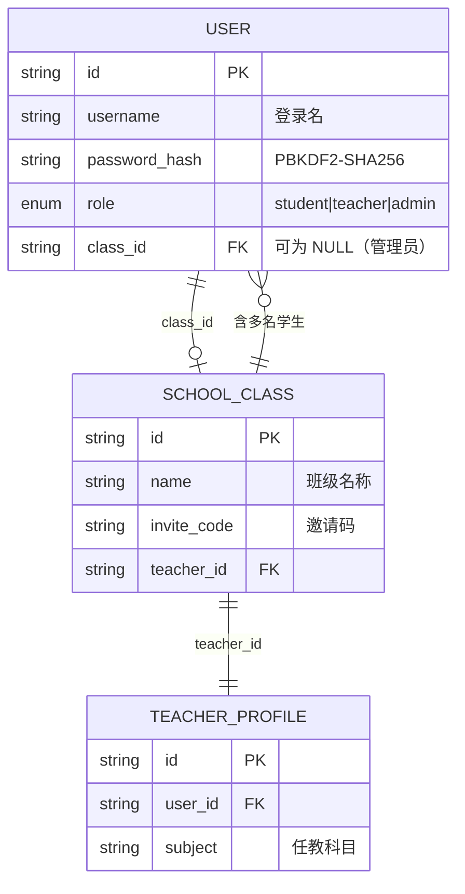
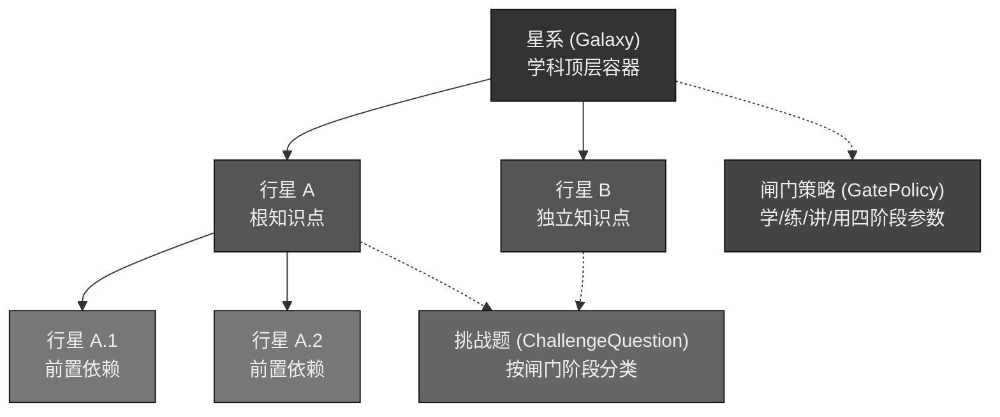
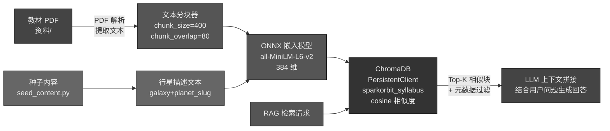
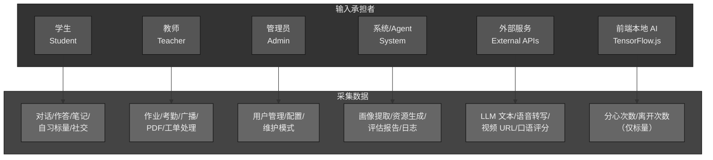
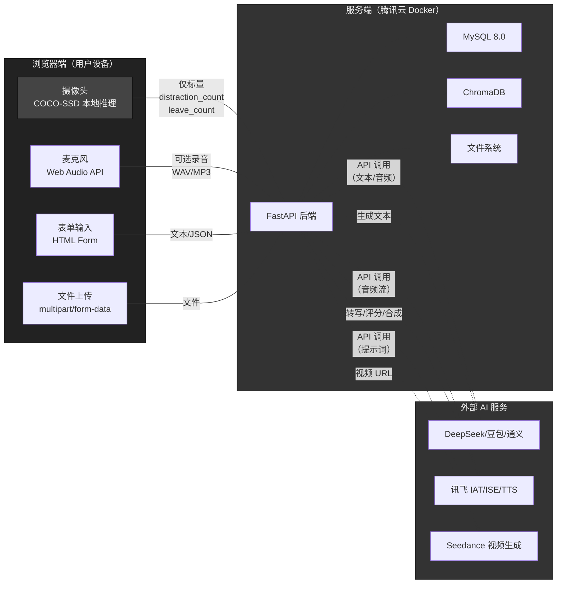
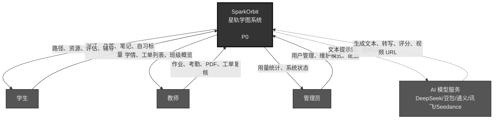
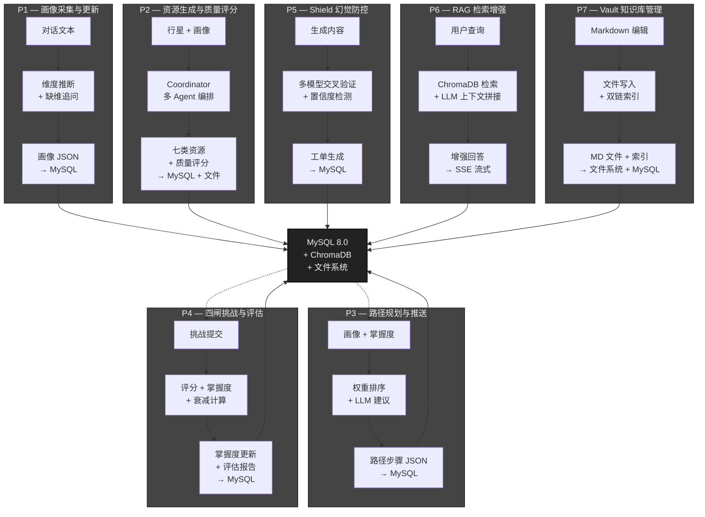
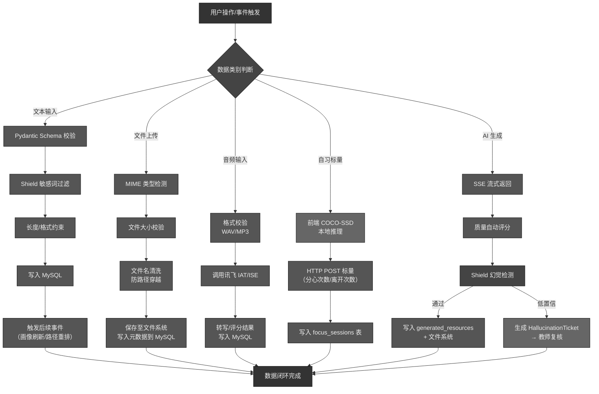

# SparkOrbit 星轨学图 — 数据要求说明书

| 项 | 内容 |
|----|------|
| 项目名称 | SparkOrbit 星轨学图 |
| 文档编号 | SparkOrbit-B2 |
| 编制者 | SparkOrbit 团队 |
| 编制日期 | 2026-08-14 |
| 版本 | V3.0（工程级完整版） |
| 规范来源 | 《数据要求说明书编写规范》（国标压缩包） |
| 密级 | 内部 |

## 修改记录

| 版本 | 日期 | 修改人 | 说明 |
|------|------|--------|------|
| V1.0 | 2026-07-30 | SparkOrbit 团队 | 初稿，按国标规范搭建框架 |
| V2.0 | 2026-07-31 | SparkOrbit 团队 | 全面重写：补全 50+ 张表级数据分类、完整数据流图 DFD、字段级采集清单、ChromaDB 向量数据规范、容量估算模型、安全分级矩阵；Mermaid 图采用严格灰黑色调 |
| V3.0 | 2026-08-14 | SparkOrbit 团队 | 工程级对齐：表数修正为 82 张；补面试/求职主数据与输入输出数据（interview_sessions/turns/reports/applications）、Agent 编排观测数据（agent_runs/agent_steps）；补面试摄像头关键帧与语音流转写隐私 |

---

## 1 引言

### 1.1 编写目的

本说明书旨在完整规定 SparkOrbit 星轨学图平台的**全部数据逻辑要求与采集约束**，为数据库设计（C3 数据库设计说明书）、接口设计（C1 概要设计说明书）、隐私合规实现与部署运维（D3 操作手册）提供统一的数据规格基线。

本文档的读者包括：

| 读者角色 | 使用方式 |
|----------|----------|
| 数据库设计师 | 依据第 2 章定义数据结构，映射至 MySQL 物理表与 ChromaDB 集合 |
| 后端开发工程师 | 依据第 2 章与附录 B 定义 API 出入参与服务层数据流 |
| 前端开发工程师 | 依据第 3 章理解数据采集边界与用户输入约束 |
| 测试工程师 | 依据附录 B 字段清单构造测试数据集 |
| 运维/部署人员 | 依据附录 C 容量估算规划存储资源 |
| 隐私合规审查 | 依据第 3 章与附录 A 审查数据采集合规性 |

### 1.2 范围

本说明书覆盖以下数据存储层：

| 存储层 | 技术载体 | 数据范围 |
|--------|----------|----------|
| 结构化业务数据 | MySQL 8.0（InnoDB，数据库名 `sparkorbit`） | 用户、课程、画像、资源、路径、挑战、评估、社交、管理、日志等 50+ 张表 |
| 非结构化向量数据 | ChromaDB（PersistentClient，Collection `sparkorbit_syllabus`） | 教材/讲义文本 chunk 嵌入向量（384 维），RAG 检索增强 |
| 文件系统媒体 | 本地文件系统（upload / vault / media / chroma_data） | 用户上传文件、AI 生成资源、Obsidian 兼容 Markdown 知识库、种子数据 |
| 前端本地推理数据 | 浏览器端 TensorFlow.js（COCO-SSD） | 自习督导分心/离开标量（视频帧不上云，仅元数据落库） |

**不包含**：外部 AI 服务（DeepSeek、讯飞、Seedance、通义、cantonese.ai）的内部数据存储，仅描述其输入/输出与本系统的数据交换边界。

### 1.3 定义与缩写

| 术语 | 全称 | 含义 |
|------|------|------|
| DFD | Data Flow Diagram | 数据流图 |
| ORM | Object-Relational Mapping | 对象关系映射（本项目使用 SQLAlchemy 2.0） |
| PK | Primary Key | 主键 |
| FK | Foreign Key | 外键 |
| UUID | Universally Unique Identifier | 通用唯一标识符（本项目 PK 策略：36 字符字符串） |
| RAG | Retrieval-Augmented Generation | 检索增强生成 |
| SSE | Server-Sent Events | 服务端推送事件（AI 生成流式反馈） |
| JSON | JavaScript Object Notation | JSON 扩展字段（画像维度、路径步骤等） |
| BLOB | Binary Large Object | 二进制大对象（**本项目策略：禁止 MySQL BLOB，文件存磁盘**） |
| ISE | Intelligent Speech Evaluation | 讯飞口语评测 |
| IAT | Intelligent Audio Transcription | 讯飞语音听写 |
| TTS | Text-to-Speech | 讯飞语音合成 |
| COCO-SSD | Common Objects in Context - Single Shot MultiBox Detector | 前端自习督导本地推理模型 |
| RBAC | Role-Based Access Control | 基于角色的访问控制 |
| 四闸 | 学/练/讲/用 | 掌握度门禁四阶段 |
| 星库 | StarAsset | 教师上传的教材/视频等参考资料资产 |
| Vault | 学生知识库 | Obsidian 兼容 Markdown 双链笔记 |

### 1.4 参考资料

| 编号 | 文档 | 路径/来源 |
|------|------|-----------|
| [1] | 软件需求说明书（B1） | `docs/software-eng/SparkOrbit-B1-软件需求说明书.md` |
| [2] | 数据库设计说明书（C3） | `docs/software-eng/SparkOrbit-C3-数据库设计说明书.md` |
| [3] | 概要设计说明书（C1） | `docs/software-eng/SparkOrbit-C1-概要设计说明书.md` |
| [4] | 存储与备份说明 | `docs/storage-and-backup.md` |
| [5] | SQLAlchemy 模型源码 | `backend/app/models/`（28 个模型文件，50+ 张表） |
| [6] | RAG 服务源码 | `backend/app/services/rag.py` |
| [7] | 路径配置源码 | `backend/app/core/paths.py` |
| [8] | 系统配置源码 | `backend/app/core/config.py` |
| [9] | Docker Compose 编排 | `docker-compose.yml` |
| [10] | 作品设计实现方案 | `docs/作品设计实现方案.md` |
| [11] | 竞赛题目与评审要求（通用） | 赛事官方要求原文 |
| [12] | 数据要求说明书编写规范 | 国标压缩包 `.doc` 规范文件 |
| [13] | 备份脚本 | `scripts/backup_data.ps1` |
| [14] | 资产校验脚本 | `scripts/verify_star_assets.py` |

---

## 2 数据的逻辑描述

> 本章按数据性质分四类展开：静态数据（配置/主数据）、动态输入数据（用户/系统实时输入）、动态输出数据（系统产出与推送）、内部生成数据（Agent/批处理中间产物）。每类数据标注存储位置、表名、关键字段与安全等级。

### 2.1 静态数据

静态数据为系统运行期间相对稳定的配置数据与主数据，变更频率低，通常由管理员或教师通过管理界面维护。

#### 2.1.1 用户与角色主数据

| 数据项 | 物理表 | 关键字段 | 变更频率 | 安全等级 | 说明 |
|--------|--------|----------|----------|----------|------|
| 用户账户 | `users` | `id(UUID PK)`, `username(UNIQUE)`, `password_hash`, `role(ENUM: student/teacher/admin)`, `class_id(FK)`, `nickname`, `avatar_url`, `pet_id`, `points`, `streak_days` | 低（注册/资料编辑时变更） | **C2-敏感** | 密码经 PBKDF2-SHA256 加盐哈希不可逆存储；密码哈希与盐值不入日志 |
| 班级信息 | `school_classes` | `id(UUID PK)`, `name`, `invite_code(UNIQUE)`, `teacher_id(FK)`, `description` | 低 | C1-内部 | 邀请码用于学生加入班级 |
| 教师档案 | `teacher_profiles` | `id`, `user_id(FK)`, `subject`, `bio` | 低 | C1-内部 | 教师专业背景与简介 |

**用户角色-班级关系图**（学生→班级 N:1，教师→班级 1:N，管理员无班级归属）：



#### 2.1.2 课程与知识图谱主数据

| 数据项 | 物理表 | 关键字段 | 变更频率 | 安全等级 | 说明 |
|--------|--------|----------|----------|----------|------|
| 星系（学科） | `galaxies` | `id(UUID PK)`, `name`, `description`, `cover_url`, `teacher_id(FK)`, `sort_order` | 低（教师锻造课程时新增） | C1-内部 | 学科顶层容器，如「数据结构」「机器学习」 |
| 行星（知识点） | `planets` | `id(UUID PK)`, `galaxy_id(FK)`, `name`, `slug`, `description`, `difficulty(1-5)`, `orbit_x/y`, `parent_planet_id(FK)`, `sort_order` | 低 | C1-内部 | 知识点节点，支持前置依赖（树形）与空间布局坐标 |
| 闸门策略 | `gate_policies` | `id`, `class_id(FK)`, `galaxy_id(FK)`, `practice_count`, `min_correct`, `decay_days` | 低 | C1-内部 | 教师可对班级自定义四闸通过阈值与记忆衰减天数 |
| 挑战题模板 | `challenge_questions` | `id`, `planet_id(FK)`, `question_type(ENUM)`, `question_text`, `answer_json`, `difficulty`, `gate_stage(ENUM: study/practice/explain/apply)` | 低（教师扩充） | C1-内部 | 教师可录入或 AI 辅助生成；答案以 JSON 存储（支持多题型答案格式） |

**星系-行星知识图谱结构**：



#### 2.1.3 系统配置数据

| 数据项 | 物理表 | 关键字段 | 变更频率 | 安全等级 | 说明 |
|--------|--------|----------|----------|----------|------|
| 系统设置 | `system_settings` | `id`, `key(UNIQUE)`, `value`, `description` | 低（管理员操作） | C2-敏感 | K-V 键值对：维护模式开关、全局参数等 |
| 星库资产元数据 | `star_assets` | `id`, `title`, `asset_type(ENUM: pdf/video/note)`, `file_url`, `bilibili_bvid`, `galaxy_id`, `planet_id`, `uploader_id` | 低（教师上传教材时新增） | C1-内部 | 教材/视频索引，**禁止 BLOB**，仅存储 `file_url` 路径 |
| 演示种子数据 | MySQL 表初始行 + `seed_content.py` | 预置演示账号、样例星系（数据结构）、初始行星、挑战题 | 极低（部署时一次性写入） | C1-内部 | 通过 `backend/app/services/seed_content.py` 插入 |

#### 2.1.4 面试与求职主数据

| 数据项 | 物理表 | 关键字段 | 变更频率 | 安全等级 | 说明 |
|--------|--------|----------|----------|----------|------|
| 面试岗位角色 | `interview_catalog.py`（代码静态） | job/academic 双场景、岗位角色列表、题类 | 低 | C1-内部 | 求职/升学岗位角色与题库目录 |
| 简历模板 | `data/career_templates.py`（代码静态） | 4 套模板（金标校招/藏青侧栏/学术卷宗/网申安全稿） | 低 | C1-内部 | 简历工坊模板 |
| 校招门户 | `data/career_portals.py`（代码静态） | 分组目录（互联网/硬件制造/新能源车/升学考公）+ 校招日历窗口 | 低 | C1-内部 | 校招门户导航 |
| 企业面经 | `data/career_questions.py`（代码静态） | 公司/岗位/常见题 | 低 | C1-内部 | 企业自编面经题库 |

#### 2.1.5 静态数据汇总

| 类别 | 涉及表数 | 预估基数 | 存储引擎 |
|------|----------|----------|----------|
| 用户与角色 | 3 张 | 10²~10³ 用户 | MySQL InnoDB |
| 课程与知识图谱 | 4 张 | 10¹~10² 行星/课 | MySQL InnoDB |
| 系统配置 | 1 张 | 10¹ K-V 键值对 | MySQL InnoDB |
| 星库资产 | 1 张 + 文件系统 | 10¹~10² 教材/视频 | MySQL + 本地文件 |
| 面试与求职主数据 | 4 类代码静态数据 | 岗位/模板/门户/面经 | 代码文件 |

### 2.2 动态输入数据

动态输入数据为系统运行期间实时产生或接收的数据，由用户交互、外部服务调用或定时批处理触发写入。

#### 2.2.1 画像采集对话数据

| 数据项 | 物理表 | 关键字段 | 来源 | 触发时机 |
|--------|--------|----------|------|----------|
| 对话会话 | `chat_sessions` | `id(UUID PK)`, `user_id(FK)`, `session_type(ENUM: profiling/tutor/chat)`, `title`, `created_at` | 学生 Web 前端 | 学生发起画像对话/辅导对话 |
| 对话消息 | `chat_messages` | `id`, `session_id(FK)`, `role(ENUM: user/assistant/system)`, `content(TEXT)`, `created_at` | 学生输入 + LLM 响应 | 每轮对话产生 2 条消息 |
| 画像提取记录 | `profile_extractions` | `id`, `user_id(FK)`, `session_id(FK)`, `dimensions(JSON)`, `raw_evidence(TEXT)`, `missing_dimensions(JSON)`, `follow_up_questions(JSON)`, `created_at` | 后端 profiling 服务 | 对话累积到触发阈值后执行提取 |
| 学习事件流水 | `profile_learning_events` | `id`, `user_id(FK)`, `planet_id(FK)`, `event_type(ENUM)`, `event_data(JSON)`, `created_at` | 学生操作触发 | 挑战通过、资源使用、自习时长等事件触发 |

**画像维度结构图**（`student_profiles.dimensions` 字段，竞赛要求六维 + 扩展两维）：

```mermaid
%%{init: {'theme':'base','themeVariables':{'primaryColor':'#ffffff','primaryTextColor':'#1a1a1a','primaryBorderColor':'#333333','lineColor':'#333333','secondaryColor':'#e8e8e8','tertiaryColor':'#f5f5f5','background':'#ffffff','mainBkg':'#ffffff','nodeBorder':'#333333','clusterBkg':'#f0f0f0','clusterBorder':'#333333','titleColor':'#1a1a1a','edgeLabelBackground':'#ffffff'}}}%%
classDiagram
    direction TB
    class Dimensions {
        JSON 根对象
        student_profiles.dimensions
    }

    class AcademicBackground {
        +string major
        +string grade
        +string[] relevant_courses
        +float confidence
    }

    class PriorKnowledge {
        +TopicLevel[] topics_mastered
        +TopicLevel[] topics_weak
        +float confidence
    }

    class CognitiveStyle {
        +enum learning_type
        +enum pace
        +enum depth_preference
        +float confidence
    }

    class ErrorTendency {
        +string[] common_mistake_types
        +float difficulty_sensitivity
        +float confidence
    }

    class LearningGoals {
        +string short_term
        +string long_term
        +string[] priority_topics
        +float confidence
    }

    class TimeFlexibility {
        +float weekly_hours
        +int preferred_session_length_minutes
        +string[] available_time_slots
        +float confidence
    }

    class ModalityPreference {
        +string[] preferred_resource_types
        +float confidence
    }

    class MotivationIntensity {
        +int intrinsic_score
        +int extrinsic_score
        +float confidence
    }

    Dimensions --> AcademicBackground : academic_background
    Dimensions --> PriorKnowledge : prior_knowledge
    Dimensions --> CognitiveStyle : cognitive_style
    Dimensions --> ErrorTendency : error_tendency
    Dimensions --> LearningGoals : learning_goals
    Dimensions --> TimeFlexibility : time_flexibility
    Dimensions --> ModalityPreference : modality_preference
    Dimensions --> MotivationIntensity : motivation_intensity
```



> **图注**：前六维（专业背景 / 前置知识 / 认知风格 / 易错倾向 / 学习目标 / 时间弹性）为竞赛最低要求；后两维（模态偏好 / 动机强度）为实际扩展实现。各维均含 `confidence` 置信度字段，供 Shield 与教师复核使用。

**字段约束说明**：

| 维度键 | 中文名 | 关键枚举 / 取值约束 |
|--------|--------|---------------------|
| `academic_background` | 专业背景 | `major`/`grade` 为字符串；`relevant_courses` 为课程名数组 |
| `prior_knowledge` | 前置知识 | `topics_*[].level` 取值 1–5 |
| `cognitive_style` | 认知风格 | `learning_type`: visual\|auditory\|reading\|kinesthetic；`pace`: fast\|moderate\|slow；`depth_preference`: deep\|broad |
| `error_tendency` | 易错倾向 | `difficulty_sensitivity` 取值 0.0–1.0 |
| `learning_goals` | 学习目标 | 短/长期目标字符串 + 优先主题列表 |
| `time_flexibility` | 时间弹性 | `weekly_hours` 为浮点；会话时长为分钟整数 |
| `modality_preference` | 模态偏好（扩展） | 资源类型：doc / mindmap / video / code / exercise |
| `motivation_intensity` | 动机强度（扩展） | `intrinsic_score` / `extrinsic_score` 取值 1–10 |

**JSON Schema 原文**（仅作字段结构参考，请勿放入 Mermaid 代码块）：

<pre>
{
  "academic_background": {
    "major": "string",
    "grade": "string",
    "relevant_courses": ["string"],
    "confidence": 0.85
  },
  "prior_knowledge": {
    "topics_mastered": [{"topic": "string", "level": "int 1-5"}],
    "topics_weak": [{"topic": "string", "level": "int 1-5"}],
    "confidence": 0.78
  },
  "cognitive_style": {
    "learning_type": "visual|auditory|reading|kinesthetic",
    "pace": "fast|moderate|slow",
    "depth_preference": "deep|broad",
    "confidence": 0.72
  },
  "error_tendency": {
    "common_mistake_types": ["string"],
    "difficulty_sensitivity": 0.65,
    "confidence": 0.70
  },
  "learning_goals": {
    "short_term": "string",
    "long_term": "string",
    "priority_topics": ["string"],
    "confidence": 0.90
  },
  "time_flexibility": {
    "weekly_hours": "float",
    "preferred_session_length_minutes": "int",
    "available_time_slots": ["string"],
    "confidence": 0.88
  },
  "modality_preference": {
    "preferred_resource_types": ["doc", "mindmap", "video", "code", "exercise"],
    "confidence": 0.75
  },
  "motivation_intensity": {
    "intrinsic_score": "int 1-10",
    "extrinsic_score": "int 1-10",
    "confidence": 0.68
  }
}
</pre>

> **注**：实际画像维度已扩展为 8 维（在原有 6 维基础上增加模态偏好、动机强度），以 `student_profiles` 表物理字段为准。六维为竞赛最低要求，八维为实际实现。

#### 2.2.2 学习行为事件数据

| 数据项 | 物理表 | 关键字段 | 来源 | 触发时机 |
|--------|--------|----------|------|----------|
| 行星掌握度 | `planet_mastery` | `id`, `user_id(FK)`, `planet_id(FK)`, `mastery_score(FLOAT)`, `gate_study/ gate_practice/ gate_explain/ gate_apply(BOOL)`, `decay_state(JSON)`, `fragments(JSON)`, `updated_at` | 后端 challenge 服务 | 挑战提交评分后更新 |
| 挑战提交 | `challenge_submissions` | `id`, `user_id(FK)`, `question_id(FK)`, `answer_json(JSON)`, `score(FLOAT)`, `feedback(TEXT)`, `submitted_at` | 学生前端 | 学生提交四闸挑战答案 |
| 作业提交 | `assignment_submissions` | `id`, `assignment_id(FK)`, `user_id(FK)`, `content(TEXT)`, `file_urls(JSON)`, `score(FLOAT)`, `teacher_feedback`, `submitted_at` | 学生前端 | 学生提交教师布置的作业 |
| 专注会话 | `focus_sessions` | `id`, `user_id(FK)`, `study_room_id(FK)`, `start_time`, `end_time`, `duration_seconds`, `distraction_count`, `leave_count` | 前端 TensorFlow.js 本地推理后上报 | 自习室开始/结束时记录 |
| 错题记录 | `mistake_records` | `id`, `user_id(FK)`, `question_id(FK)`, `wrong_answer(JSON)`, `correct_answer(JSON)`, `analysis(TEXT)`, `review_count`, `recorded_at` | 后端 challenge 服务 | 挑战回答错误时自动记录 |
| 笔记记录 | `notes` | `id`, `user_id(FK)`, `planet_id(FK)`, `resource_id(FK)`, `content_blocks(JSON)`, `tags(JSON)`, `created_at` | 学生前端 | 学习过程主动做笔记 |

#### 2.2.3 教师输入数据

| 数据项 | 物理表 | 关键字段 | 来源 | 触发时机 |
|--------|--------|----------|------|----------|
| 作业发布 | `assignments` | `id`, `class_id(FK)`, `teacher_id(FK)`, `title`, `description`, `due_date`, `created_at` | 教师前端 | 教师创建作业任务 |
| 考勤记录 | `attendance_records` | `id`, `class_id(FK)`, `student_id(FK)`, `date`, `status(ENUM: present/absent/late/leave)`, `remark` | 教师前端 | 教师记录每堂课的考勤状态 |
| 教师广播 | `teacher_broadcasts` | `id`, `teacher_id(FK)`, `class_id(FK)`, `content`, `created_at` | 教师前端 | 教师向班级群发通知 |
| 幻觉工单处理 | `hallucination_tickets` | `id`, `resource_id(FK)`, `reported_by`, `assigned_to`, `status(ENUM)`, `teacher_override_score`, `teacher_comment`, `resolved_at` | 教师前端 | 教师复核低置信度生成内容 |
| 教师评分 | `improvement_submissions` | `id`, `plan_id(FK)`, `student_id(FK)`, `content`, `ai_score`, `teacher_score`, `teacher_feedback` | 教师前端 | 教师对改进提交打分 |

#### 2.2.4 管理员输入数据

| 数据项 | 物理表 | 关键字段 | 来源 | 触发时机 |
|--------|--------|----------|------|----------|
| 维护模式切换 | `system_settings` | `key="maintenance_mode"`, `value=TRUE/FALSE` | 管理前端 | 管理员启用/关闭维护模式 |
| 用户管理 | `users` | 禁用/启用/删除用户 | 管理前端 | 管理员审核管理用户 |
| Token 配额调整 | `system_settings` | `key="api_quota_*"` | 管理前端 | 管理员调整 API 调用配额 |

#### 2.2.5 文件上传数据

| 数据项 | 存储路径 | 文件类型限制 | 来源 | 说明 |
|--------|----------|--------------|------|------|
| 用户头像 | `uploads/avatars/` | PNG/JPG/WebP ≤ 2MB | 学生/教师/管理员 | 前端裁剪后上传 |
| 笔记附件 | `uploads/notes/` | PDF/PNG/JPG ≤ 10MB | 学生 | 笔记关联附件 |
| 教师资源 | `uploads/resources/` | PDF/Video/ZIP ≤ 100MB | 教师 | 教学资源上传 |
| 树洞图片 | `uploads/treehole/` | PNG/JPG/WebP ≤ 5MB | 学生 | 树洞帖子配图 |
| 自习截图 | `uploads/supervision/` | 不存储截图（仅标量） | 无 | 本路径预留，当前为空 |
| 口语音频 | `uploads/oral/` | WAV/MP3 ≤ 10MB | 学生 | 口语评测录音 |
| 教材 PDF | `资料/`（只读挂载） | PDF ≤ 200MB | 运维人员 | Docker Compose 只读挂载 |
| AI 生成媒体 | `static/media/generated/` | PNG/MP4/PPTX | 后端 Seedance/课件服务 | Seedance 视频、教学课件 |
| 简历附件 | `uploads/resume/` | PDF/DOCX/图片 ≤ 10MB | 学生 | 简历工坊上传解析 |
| 面试语音/视频帧 | 不落盘（实时流转） | 音频流/关键帧 | 学生 | 面试 WebSocket 实时采集，评分后仅保留转写文本与关键帧 |

#### 2.2.6 面试与求职输入数据

| 数据项 | 物理表 | 关键字段 | 来源 | 触发时机 |
|--------|--------|----------|------|----------|
| 面试会话 | `interview_sessions` | `id`, `user_id(FK)`, `scenario(job/academic)`, `job_role`, `status`, `prep_intel(JSON)`, `questions(JSON)`, `resume_url`, `profile` | 学生 Web 前端 | 面试舱三步配置创建会话 |
| 面试轮次 | `interview_turns` | `id`, `session_id(FK)`, `question`, `transcript`, `semantic_score`, `prosody_score`, `visual_score`, `fused_score`, `prosody_detail(JSON)`, `feedback`, `followup` | 面试实时 + 后端评分 | 每轮作答后评分写入 |
| 面试报告 | `interview_reports` | `id`, `session_id(FK)`, `dimension_scores(JSON)`, `key_issues(JSON)`, `suggestions`, `council_views(JSON)`, `teacher_comment`, `teacher_score`, `review_status` | 后端 council 编排 | 面试结束后生成报告 |
| 练习记录 | `interview_practice_records` | `id`, `user_id(FK)`, `scenario`, `job_role`, `question`, `answer`, `star_scores(JSON)` | 学生 Web 前端 | 练习舱单题快练 |
| 投递记录 | `interview_applications` | `id`, `user_id(FK)`, `company`, `position`, `status(wishlist/applied/oa/interview/offer/rejected)`, `note`, `portal_url` | 学生 Web 前端 | 求职助手投递看板 |

### 2.3 动态输出数据

动态输出数据为系统对用户或外部系统的响应数据，以 API JSON、SSE 事件流、WebSocket 消息或文件交付。

#### 2.3.1 资源生成结果数据

| 数据项 | 物理表 | 关键字段 | 交付方式 | 说明 |
|--------|--------|----------|----------|------|
| 生成资源记录 | `generated_resources` | `id(UUID PK)`, `user_id(FK)`, `planet_id(FK)`, `resource_type(ENUM)`, `title`, `content_markdown`, `content_mermaid`, `content_exercise_json`, `video_url`, `deck_path`, `code_snippet`, `quality_score`, `source_label`, `created_at` | SSE 流式推送 + API 查询 | 每次 AI 资源生成产出一条记录 |
| 星库资产资源 | `star_assets` | `id`, `file_url`, `bilibili_bvid` | 静态文件服务 | 教师上传的教材/视频供学生查阅 |
| 教师知识库资源 | `lesson_resources` | `id`, `teacher_id`, `title`, `content`, `resource_type`, `tags` | API 查询 | 教师知识库中的教学资源 |

**资源类型枚举**（`generated_resources.resource_type`）：

| 枚举值 | 含义 | 典型内容字段 |
|--------|------|--------------|
| `doc` | Markdown 学习文档 | `content_markdown` |
| `mindmap` | 思维导图 | `content_mermaid`（Mermaid mindmap 语法） |
| `exercise` | LaTeX 习题 | `content_exercise_json`（含题干/答案/解析） |
| `reading` | 阅读材料 | `content_markdown` |
| `video` | Seedance 教学视频 | `video_url`（指向 `static/media/generated/`） |
| `deck` | 教学课件 | `deck_path`（PPTX 文件路径） |
| `code` | 代码片段/可运行示例 | `code_snippet` |
| `flashcard` | 记忆卡片（扩展类型） | `content_exercise_json` |

#### 2.3.2 学习路径数据

| 数据项 | 物理表 | 关键字段 | 交付方式 | 说明 |
|--------|--------|----------|----------|------|
| 学习路径 | `learning_paths` | `id`, `user_id(FK)`, `galaxy_id(FK)`, `steps(JSON)`, `recommended_resources(JSON)`, `estimated_hours`, `created_at`, `updated_at` | API JSON | 画像驱动生成；评估回灌后自动重排 |

**学习路径步骤 JSON Schema**：

```json
{
  "steps": [
    {
      "order": 1,
      "planet_id": "uuid",
      "planet_name": "二叉搜索树",
      "action": "study",
      "recommended_resources": ["resource_uuid_1", "resource_uuid_2"],
      "estimated_minutes": 45,
      "gate_required": "study"
    }
  ],
  "total_estimated_hours": 12.5,
  "generated_at": "2026-07-31T10:00:00Z",
  "generation_input": {
    "profile_version": "uuid",
    "mastery_snapshot": {"planet_uuid": 0.56}
  }
}
```

#### 2.3.3 评估报告数据

| 数据项 | 物理表/服务 | 关键指标 | 交付方式 | 说明 |
|--------|-------------|----------|----------|------|
| 成长报告 | 实时计算（非持久化表） | 雷达图数据、掌握度得分、达成率、热力图坐标、学习时长分布、划词次数热力 | API JSON + 前端 ECharts 渲染 | 基于 `planet_mastery`、`focus_sessions`、`challenge_submissions` 等表实时聚合 |
| 掌握度趋势 | 实时计算 | 时间序列掌握度变化、闸门通过时间线 | API JSON | 前端渲染折线图 |

#### 2.3.4 推送通知与消息数据

| 数据项 | 物理表 | 关键字段 | 交付方式 | 说明 |
|--------|--------|----------|----------|------|
| 用户通知 | `user_notifications` | `id`, `user_id(FK)`, `type(ENUM)`, `title`, `content`, `is_read`, `created_at` | API 查询 + WebSocket 实时推送（可选） | 作业提醒、工单通知、回复提醒 |
| 聊天消息 | `chat_room_messages` | `id`, `room_id(FK)`, `sender_id(FK)`, `content`, `created_at` | WebSocket 实时推送 | 班级聊天、私聊 |
| 树洞帖子 | `tree_hole_posts` | `id`, `user_id(FK)`, `content`, `image_url`, `is_anonymous`, `created_at` | API 查询 | 匿名/实名树洞发帖 |
| 心愿墙帖子 | `wish_posts` | `id`, `user_id(FK)`, `content`, `likes_count`, `created_at` | API 查询 | 学习心愿发布与点赞 |

#### 2.3.5 面试报告与求职输出数据

| 数据项 | 物理表/交付物 | 关键字段 | 交付方式 | 说明 |
|--------|--------------|----------|----------|------|
| 面试准备情报 | `interview_sessions.prep_intel` | 岗位情报/考察主题/候选人画像 | API JSON / SSE | 准备阶段编排产物 |
| 单轮评分结果 | `interview_turns` | `semantic_score`/`prosody_score`/`visual_score`/`fused_score` | WebSocket 推送 | 每轮作答后实时评分 |
| 面试报告 | `interview_reports` | `dimension_scores`/`key_issues`/`council_views`/`teacher_comment`/`teacher_score` | API JSON + 打印 PDF | 面试结束生成 |
| 能力画像 | 派生自 `interview_reports` | 五维雷达/趋势/弱项 | API JSON | 面试区画像页 |
| 简历优化结果 | `interview_resume.py` 产出 | 评分/问题列表/重写 markdown | API JSON | 简历工坊优化 |
| 岗位匹配结果 | 同上 | 匹配分/覆盖/缺口 | API JSON | 简历 vs JD 匹配 |
| 简历导出文件 | `resume_export.py` 产出 | HTML/Word/Markdown | 文件下载 | 简历导出 |

#### 2.3.6 输出数据汇总

| 类别 | 交付方式 | 典型大小 | 延迟要求 |
|------|----------|----------|----------|
| API JSON 响应 | HTTP REST | 1~50 KB | < 200ms（不含 AI 生成） |
| SSE 事件流 | HTTP SSE | 每事件 0.5~5 KB | 事件间隔 < 1s |
| WebSocket 消息 | WS | 每消息 0.1~5 KB | 实时（< 50ms） |
| 静态文件 | HTTP Nginx | 100 KB~50 MB | CDN/本地服务 |
| AI 生成媒体 | 文件下载 | 5~200 MB（视频） | 异步（Seedance 2~5 分钟） |

### 2.4 内部生成数据

内部生成数据为系统 Agent、批处理、中间件等模块产生的中间数据、日志与统计分析数据，不直接面向用户。

#### 2.4.1 审计与日志数据

| 数据项 | 物理表 | 关键字段 | 保留策略 | 说明 |
|--------|--------|----------|----------|------|
| API 用量日志 | `api_usage_logs` | `id`, `user_id(FK)`, `api_endpoint`, `model_name`, `input_tokens`, `output_tokens`, `cost_estimate`, `response_time_ms`, `created_at` | 至少保留一个学期（6 个月） | 追踪每次 LLM/TTS/ISE 调用的 Token 消耗与费用 |
| 容器运行日志 | `docker logs` | stdout/stderr | 按 Docker 日志轮转策略 | 不持久化到 MySQL |
| 请求日志 | Nginx `access.log` | 标准 Nginx 日志格式 | 按 Nginx 日志轮转策略 | 前端请求代理日志 |

#### 2.4.2 幻觉防控与质量管理数据

| 数据项 | 物理表 | 关键字段 | 保留策略 | 说明 |
|--------|--------|----------|----------|------|
| 幻觉工单 | `hallucination_tickets` | `id`, `resource_id(FK)`, `detection_source(ENUM: shield_crosscheck/model_confidence/user_report)`, `confidence_score`, `content_snippet`, `issue_type`, `status(ENUM: pending/assigned/reviewed/resolved/ dismissed)`, `teacher_override_score`, `teacher_comment`, `created_at`, `resolved_at` | 长期保留（用于 Shield 模型持续优化） | 三级防控的第三级：教师人工复核 |
| AI 任务记录 | `ai_task_records` | `id`, `user_id`, `task_type(ENUM)`, `input_hash`, `output_hash`, `status`, `tokens_used`, `created_at` | 至少 6 个月 | 记录每次 AI 调用的任务指纹 |

#### 2.4.3 模拟与预演数据

| 数据项 | 物理表 | 关键字段 | 保留策略 | 说明 |
|--------|--------|----------|----------|------|
| 模拟运行 | `simulation_runs` | `id`, `creator_id(FK)`, `galaxy_id(FK)`, `config(JSON)`, `status`, `started_at`, `completed_at` | 教师主动删除或定期清理 | 教师沙盘：镜像/多元宇宙预演学生路径 |
| 模拟事件 | `simulation_events` | `id`, `simulation_run_id(FK)`, `step`, `virtual_student_id`, `action`, `outcome(JSON)` | 随模拟运行一同清理 | 模拟运行的每一步事件记录 |

#### 2.4.4 Vault 知识库索引数据

| 数据项 | 物理表 | 关键字段 | 保留策略 | 说明 |
|--------|--------|----------|----------|------|
| 学生 Vault | `student_vaults` | `id`, `user_id(FK)`, `revision`, `updated_at` | 长期保留 | 每用户的 Obsidian 知识库修订版本 |
| Vault 文件 | `vault_files` | `id`, `vault_id(FK)`, `file_path`, `content_hash(SHA256)`, `file_size`, `created_at` | 长期保留 | 知识库内每个 Markdown 文件的元数据 |
| Vault 双链 | `vault_links` | `id`, `vault_id(FK)`, `source_file`, `target_file`, `link_text` | 长期保留 | Obsidian Wiki 双链关系索引 |
| 知识库修订历史 | Vault 种子脚本 `seed_vault_history.py` | — | 长期保留 | 通过 Git-like 版本管理记录修订 |

#### 2.4.5 社交与社区数据

| 数据项 | 物理表 | 关键字段 | 保留策略 | 说明 |
|--------|--------|----------|----------|------|
| 好友关系 | `friendships` | `id`, `user_id`, `friend_id`, `status(ENUM: pending/accepted/blocked)`, `created_at` | 长期保留 | 学生之间互相关注 |
| 虫洞消息 | `wormhole_messages` | `id`, `sender_id`, `receiver_id`, `content`, `created_at` | 按需清理 | 跨班级匿名消息 |
| 聊天室 | `chat_rooms` | `id`, `name`, `type(ENUM: class/private)`, `class_id`, `created_at` | 长期保留 | 班级群聊/私聊房间 |
| 聊天反应 | `chat_message_reactions` | `id`, `message_id`, `user_id`, `emoji` | 长期保留 | 消息表情反应 |

#### 2.4.6 游戏化与激励数据

| 数据项 | 物理表 | 关键字段 | 保留策略 | 说明 |
|--------|--------|----------|----------|------|
| 积分兑换 | `redeem_records` | `id`, `user_id`, `item_name`, `points_cost`, `redeemed_at` | 长期保留 | 积分商城兑换记录 |
| 每日任务 | `daily_task_records` | `id`, `user_id`, `task_date`, `task_type`, `completed`, `reward_points` | 按月归档 | 日任务完成情况 |
| 签到记录 | `sign_in_records` | `id`, `user_id`, `sign_date`, `streak_bonus` | 按月归档 | 每日签到 |
| 游戏挑战 | `game_challenge_records` | `id`, `user_id`, `game_type`, `score`, `played_at` | 按月归档 | 休闲区小游戏记录 |
| 成就里程碑 | `achievement_milestones` | `id`, `user_id`, `milestone_type`, `achieved_at` | 长期保留 | 里程碑成就解锁 |

#### 2.4.7 RAG 向量数据（ChromaDB）

| 数据项 | ChromaDB 属性 | 值 | 说明 |
|--------|---------------|-----|------|
| 集合名称 | `collection.name` | `sparkorbit_syllabus` | 唯一向量集合 |
| 距离度量 | `metadata["hnsw:space"]` | `cosine` | 余弦相似度检索 |
| 嵌入模型 | 模型名称 | `all-MiniLM-L6-v2`（ONNX 格式） | 384 维向量 |
| 文本分块策略 | `chunk_size` / `chunk_overlap` | 400 字符 / 80 字符 | 讲义文本按固定窗口切分 |
| 文档元数据 | 每条记录的 `metadata` | `galaxy`、`planet_slug`、`source`、`book_id`、`book_title`、`page_no`、`index` | 支持按学科/知识点过滤检索 |
| 持久化路径 | 本地文件系统 | `backend/chroma_data/` | PersistentClient 模式 |
| 离线运行 | 环境变量 `SPARKORBIT_CHROMA_OFFLINE` | `1`（Dockerfile 设置） | 阻止运行时下载模型，模型在构建时预加载至 `/root/.cache/chroma/onnx_models/` |
| 降级行为 | 当 ChromaDB 不可用时 | 回退至行星描述文本作为伪源 | RAG 静默降级，不影响核心功能 |
| 备选模型路径 | 本地副本 | `backend/vendor/chroma_onnx/all-MiniLM-L6-v2/` | Docker 构建时预下载，供 ChromaDB 加载 |
| 数据摄取来源 | 教材 PDF 解析文本 + `seed_content.py` 种子数据 | 星系下所有行星描述文本摄入为向量 | 通过 `backend/app/services/rag.py` 的 `ingest` 方法写入 |

**ChromaDB 向量数据流**：



#### 2.4.8 Agent 编排观测数据

| 数据项 | 物理表 | 关键字段 | 保留策略 | 说明 |
|--------|--------|----------|----------|------|
| Agent 运行 | `agent_runs` | `id`, `user_id(FK)`, `mode(workflow/handoff/council/supervisor)`, `scene(resource/simulation/interview/companion)`, `status`, `current_agent`, `created_at`, `finished_at` | 长期保留 | 四模式编排的一次完整运行记录 |
| Agent 步骤 | `agent_steps` | `id`, `run_id(FK)`, `step_name`, `agent_name`, `status(pending/running/done/failed)`, `started_at`, `finished_at`, `result_json` | 长期保留 | 编排内每个 Agent 节点的执行状态与结果，支撑管理端 `/admin/agents` 回放 |

### 2.5 数据约定

#### 2.5.1 字符集约定

| 层级 | 设定 | 说明 |
|------|------|------|
| MySQL 数据库 | `utf8mb4` / `utf8mb4_unicode_ci` | 支持全 Unicode（含 Emoji），数据库连接 URL 指定 `?charset=utf8mb4` |
| MySQL 连接驱动 | `aiomysql` | 异步驱动，charset 参数传递 |
| 前端编码 | UTF-8 | HTML meta charset |
| API 编码 | UTF-8 | Content-Type: application/json; charset=utf-8 |
| 文件系统 | UTF-8 | Markdown/Nginx 静态文件 |

#### 2.5.2 主键约定

| 约定 | 说明 | 适用表范围 |
|------|------|------------|
| UUID 字符串 PK（36 字符） | 全局唯一，分布式友好，无序列瓶颈 | 核心业务表：`users`、`galaxies`、`planets`、`generated_resources`、`learning_paths`、`chat_sessions`、`school_classes` 等 |
| 自增整数 PK | 简单、索引空间小 | 高吞吐日志/辅助表：`api_usage_logs`、`hallucination_tickets`、`challenge_questions`、`focus_sessions`、`sign_in_records` 等 |
| 复合主键 | 关系表 | 如 `chat_room_members`（`room_id` + `user_id`）|

**UUID 生成策略**：Python `uuid.uuid4()`（随机 UUID，碰撞概率可忽略）。

#### 2.5.3 JSON 扩展字段约定

以下字段以 MySQL JSON 列存储，需在应用层文档化其 Schema：

| 表 | JSON 字段 | 用途 | 典型大小 |
|----|-----------|------|----------|
| `student_profiles` | `dimensions` | 画像 8 维数据 | 2~5 KB |
| `student_profiles` | `missing_dimensions` | 待追问的画像维度列表 | 0.5~1 KB |
| `student_profiles` | `follow_up_questions` | 缺维追问问题列表 | 1~3 KB |
| `student_profiles` | `raw_evidence` | 画像推断的对话原文片段 | 2~8 KB |
| `learning_paths` | `steps` | 路径步骤列表 | 5~20 KB |
| `learning_paths` | `recommended_resources` | 每步推荐资源 ID 列表 | 2~5 KB |
| `planet_mastery` | `decay_state` | 记忆衰减参数 | 0.5 KB |
| `planet_mastery` | `fragments` | 知识碎片掌握状态 | 1~3 KB |
| `generated_resources` | `content_exercise_json` | LaTeX 习题 JSON | 2~10 KB |
| `generated_resources` | `source_label` | 资源溯源标注 | 0.5 KB |
| `notes` | `content_blocks` | 富文本笔记块 | 5~50 KB |
| `notes` | `tags` | 笔记标签列表 | 0.5~1 KB |
| `simulation_runs` | `config` | 模拟运行配置参数 | 1~3 KB |
| `simulation_events` | `outcome` | 模拟事件结果 | 1~5 KB |
| `profile_extractions` | `dimensions` | 本次提取的维度结果 | 2~5 KB |
| `hallucination_tickets` | `content_snippet` | 被标记的疑似幻觉内容片段 | 1~3 KB |
| `api_usage_logs` | `request_payload` | 请求摘要（脱敏后） | 1~3 KB |
| `challenge_submissions` | `answer_json` | 提交答案 JSON | 1~5 KB |
| `challenge_questions` | `answer_json` | 标准答案 JSON | 1~3 KB |

**JSON 字段约束**：
- 禁止在 JSON 列中存储超大文本（>50 KB 应拆分为独立文件或 TEXT 字段）
- JSON 列不建 MySQL 虚拟列索引，检索依赖应用层反序列化
- 不得在 JSON 列中存储密码、API Key 等敏感字段

#### 2.5.4 时间字段约定

| 约定 | 说明 |
|------|------|
| 数据库存储 | Python `datetime.datetime(timezone=True)` → MySQL `DATETIME` 带时区 |
| 应用层 | SQLAlchemy `DateTime(timezone=True)` |
| API 序列化 | ISO 8601 格式（`2026-07-31T10:00:00+08:00`） |
| 日志/内部比较 | UTC 时间戳 |
| 用户可见时间 | 前端根据时区转换为用户本地时间 |

标准审计字段：`created_at`（创建时间）、`updated_at`（最后修改时间）——绝大部分表具备此二字段。

#### 2.5.5 文件路径约定

| 路径（相对 `backend/`） | 用途 | Docker 挂载方式 | 可写性 |
|-------------------------|------|-----------------|--------|
| `uploads/avatars/` | 用户头像 | 绑定挂载 | 读写 |
| `uploads/notes/` | 笔记附件 | 绑定挂载 | 读写 |
| `uploads/resources/` | 教师资源 | 绑定挂载 | 读写 |
| `uploads/starlib/` | 星库教材存储（非 PDF） | 绑定挂载 | 读写 |
| `uploads/treehole/` | 树洞配图 | 绑定挂载 | 读写 |
| `uploads/supervision/` | 自习监控预留 | 绑定挂载 | 读写 |
| `uploads/oral/` | 口语音频 | 绑定挂载 | 读写 |
| `app/static/media/generated/` | AI 生成媒体（视频/课件/图片） | 绑定挂载 | 读写 |
| `vaults/` | 每用户 Obsidian Markdown 知识库 | 绑定挂载 | 读写 |
| `chroma_data/` | ChromaDB 向量持久化 | 绑定挂载 | 读写 |
| `vendor/chroma_onnx/` | ONNX 嵌入模型（构建时预加载） | COPY（镜像内） | 只读 |
| `assets/pets/` | 桌宠动画 PNG spritesheet | COPY（镜像内） | 只读 |

**文件命名规范**：
- 用户上传文件：`{user_id}_{timestamp}_{原始文件名哈希}.{ext}`
- AI 生成文件：`{resource_id}_{类型}.{ext}`
- Vault 文件：保持用户原始文件名（`*.md`），含空格与中文均允许
- 所有路径禁止 `..` 路径穿越，后端 `paths.py` 统一校验

#### 2.5.6 外键与引用完整性约定

| 约定 | 说明 |
|------|------|
| MySQL 物理外键 | 选择性建立：核心关系（`users.class_id` → `school_classes.id`）建立物理 FK；高频关联表（`planet_mastery.user_id`）使用逻辑外键（索引但不设 FK 约束） |
| 逻辑外键 | 通过应用层（SQLAlchemy `relationship` + 索引）保证引用完整性 |
| 级联删除 | 不启用 MySQL `ON DELETE CASCADE`：删除用户前需应用层评估级联影响（清理文件、清理 Vault、匿名化对话记录等） |
| 孤儿清理 | 备份脚本 `backup_data.ps1` 附带 `verify_star_assets.py` 可检测 `file_url` 指向不存在的文件（孤儿文件） |

#### 2.5.7 软删除与数据留存约定

| 操作 | 策略 | 说明 |
|------|------|------|
| 用户注销 | 标记 `is_active=False`，保留数据 30 天 | 30 天后匿名化或物理删除 |
| 树洞帖子删除 | 标记 `is_deleted=True` | 保留已点赞/评论的引用 |
| 资源删除 | 标记 `is_deleted=True` + 文件保留 7 天 | 星库资源删除后文件延时清理 |
| 历史对话 | 保留至用户主动清空 | 画像对话长期保留供增量更新 |
| 向量数据 | 随源 PDF 更新触发 re-index | ChromaDB `upsert` 覆盖旧 chunk |

---

## 3 数据的采集

### 3.1 采集要求与范围

系统按"最小必要原则"采集数据，分为三类：

#### 3.1.1 必须采集的数据（系统功能运行的前提条件）

| 采集项 | 数据字段 | 采集目的 | 拒绝采集的后果 |
|--------|----------|----------|----------------|
| 用户身份 | `username`, `password_hash`, `role` | 账户创建与认证 | 无法使用系统 |
| 班级归属 | `class_id` | 学生-班级关联，教师管理范围 | 学生无法加入班级 |
| 画像对话 | `chat_messages.content`, `profile_extractions.dimensions` | 个性化学习画像构建 | 无法获得个性化路径与资源推荐 |
| 学习行为 | `planet_mastery`, `challenge_submissions`, `focus_sessions` | 掌握度评估与路径重排 | 学习闭环断裂，无法追踪进度 |
| 操作审计 | `api_usage_logs` | Token 消耗统计与用量管控 | 无法跟踪 API 费用，可能超配额 |

#### 3.1.2 可选采集的数据（功能增强，但非核心依赖）

| 采集项 | 数据字段 | 采集目的 | 用户可控性 |
|--------|----------|----------|------------|
| 树洞匿名发帖 | `tree_hole_posts` | 社区交流 | 用户主动选择发帖/评论 |
| 心愿墙 | `wish_posts` | 学习动力激励 | 用户主动选择发布 |
| 桌宠/休闲 | `redeem_records`, `daily_task_records`, `game_challenge_records` | 游戏化激励 | 用户主动参与 |
| 好友关系 | `friendships` | 社交互动 | 双方确认 |
| 自习督导 | `focus_sessions.distraction_count/leave_count` | 专注度评估 | 用户可关闭督导模式 |
| 口语音频 | `uploads/oral/` 音频文件 | 英语口语评测 | 用户主动开启录音 |
| 面试语音 | 讯飞 IAT 实时转写（音频流不落盘） | 模拟面试作答转写 | 用户主动进入面试并授权麦克风 |
| 面试视频关键帧 | `interview_turns` 关键帧（每轮有帧预算，完整视频流不保留） | 仪态/视觉评分（15%） | 用户主动进入面试并授权摄像头 |
| 简历文件 | `uploads/resume/` PDF/DOCX/图片 | 简历解析/优化/匹配 | 用户主动上传简历 |

#### 3.1.3 禁止采集的数据

| 禁止项 | 说明 | 合规理由 |
|--------|------|----------|
| 摄像头视频流（自习督导） | 前端 COCO-SSD 本地推理，**帧数据绝不上传服务器**（仅分心/离开标量落库） | 隐私保护、最小化原则 |
| 面试完整视频流 | 仅采集**关键帧**（每轮有帧预算）用于仪态评分，完整视频流不保留、不落盘 | 隐私保护、最小化原则 |
| 精确地理位置 | 不采集 GPS/IP 定位 | 非教学场景必要 |
| 个人身份信息 | 不采集身份证号、手机号、家庭住址 | 最小必要、教育场景简化 |
| 生物特征 | 不采集指纹、人脸特征向量 | 隐私合规 |
| 支付信息 | 不采集银行卡、支付密码 | 当前无付费场景 |
| 第三方 Cookie 追踪 | 不嵌入广告/分析 SDK | GDPR/个保法合规 |

### 3.2 输入的承担者



| 承担者 | 输入数据类型 | 输入方式 | 频率 |
|--------|-------------|----------|------|
| 学生 | 作答提交、对话消息、笔记、自习标量、树洞发帖、Vault 编辑、心愿发布、桌宠交互、面试语音/作答、简历上传 | Web 表单、SSE 客户端、Rich Text Editor、WebSocket | 每日多次 |
| 教师 | 班级治理数据、作业发布、考勤记录、PDF 讲义上传、工单复核、广播消息、沙盘模拟 | Web 表单、文件上传 | 每日/每周 |
| 管理员 | 用户管理操作、维护模式开关、系统设置调整、配额管理 | Web 管理面板 | 按需 |
| 系统/Agent | 画像抽取结果、资源生成结果、评估报告、路径重排、模拟运行事件、幻觉工单自动生成 | 后端服务/定时任务 | 事件驱动/定时 |
| 外部服务 | LLM 响应（DeepSeek/豆包/通义）、语音转写（讯飞 IAT）、口语评分（讯飞 ISE）、TTS 合成（讯飞）、数字人生成（讯飞）、视频生成（Seedance）、粤语处理（cantonese.ai） | HTTPS API 调用 | 按请求触发 |
| 前端本地 AI | 分心次数、离开次数（仅标量落库） | HTTP POST 标量数据 | 自习结束后一次性上报 |

### 3.3 数据预处理

系统对入口数据进行多层预处理，保障数据质量、安全性与隐私合规。

#### 3.3.1 文本预处理

| 处理步骤 | 处理位置 | 处理逻辑 | 说明 |
|----------|----------|----------|------|
| 敏感词过滤 | 后端 Shield 模块 | 基于预置敏感词库匹配 + LLM 内容安全二次审核 | Flag 命中则拒绝入库或标记待审 |
| 长度限制 | 后端 Schema 层 | Pydantic `max_length` 约束 | 对话消息 ≤ 10000 字符，帖子 ≤ 5000 字符 |
| Markdown 安全清洗 | 前端渲染层 | DOMPurify / marked.js 过滤 | 阻止 XSS 注入、禁止 `<script>` 等危险标签 |
| 对话清洗 | 后端 profiling 服务 | 去重、去除纯表情/纯标点消息、合并连贯短消息 | 提升画像提取的输入质量 |
| 维度归一化 | 后端 profiling 服务 | 将 LLM 输出的非结构化维度值映射到标准值域 | 例如"学习速度较快"→ `pace: "fast"` |

#### 3.3.2 文件预处理

| 处理步骤 | 处理位置 | 处理逻辑 | 说明 |
|----------|----------|----------|------|
| MIME 类型校验 | 后端 `star_assets` 端点 | 通过 `python-magic` / 文件头魔数检测真实类型 | 防止 MIME 伪造攻击 |
| 文件大小校验 | 后端 Schema 层 | `UploadFile` 大小限制 | 不同上传类型不同上限（见 2.2.5） |
| 文件名清洗 | 后端 `paths.py` | 移除路径穿越字符（`..`、`/`）、限制合法字符集 | 防止目录遍历攻击 |
| PDF 锻造预处理 | 后端 `services/galaxy_forge.py` | PDF → 文本提取（PyMuPDF）→ LLM 结构化（星系/行星 JSON）→ 人工或自动校验后入库 | 教师上传 PDF 讲义到自动生成知识图谱 |
| 视频文件校验 | 后端 `services/seedance_service.py` | 检查 Seedance 返回的 URL 有效性和格式 | 防止无效 URL 落库 |

#### 3.3.3 向量数据预处理

| 处理步骤 | 处理位置 | 处理逻辑 | 说明 |
|----------|----------|----------|------|
| 文本切块 | `rag.py` `_chunk_text()` | 固定大小 400 字符窗口，80 字符重叠滑窗 | 保证语义连贯性 |
| 向量化 | ChromaDB 内置 | `all-MiniLM-L6-v2` ONNX 模型 384 维嵌入 | 嵌入函数由 ChromaDB 自动调用 |
| 去重写入 | ChromaDB `upsert()` | 以 `{book_id}-chunk-{index}` 为 ID，覆盖旧 chunk | 增量更新不重复写入 |
| 元数据附加 | `rag.py` `ingest()` | 每条 chunk 附加 `galaxy`, `planet_slug`, `source`, `book_id`, `book_title`, `page_no`, `index` | 支持按学科/知识点的过滤检索 |

#### 3.3.4 语音预处理

| 处理步骤 | 处理位置 | 处理逻辑 | 说明 |
|----------|----------|----------|------|
| 格式校验 | 后端上传端点 | 检查 WAV/MP3 文件头有效性 | 拒绝无效/破损音频 |
| 可选降噪 | 前端 | Web Audio API 降噪（浏览器能力） | 提升 ASR 准确率 |
| 转写/评测 | 讯飞云端 | 讯飞 IAT（听写）/ISE（口语评测）处理 | 仅传输音频流，不存储于讯飞侧（按协议约定） |
| 面试实时转写 | 讯飞 IAT（WebSocket 流式） | 面试音频流经 `interview_ws.py` 分帧发送 IAT 实时转写 | 音频流不落盘，转写文本写入 `interview_turns.transcript` |
| 面试仪态关键帧 | 后端视觉模型 | 每轮采集关键帧（有帧预算），取前 4 帧做仪态评分 | 完整视频流不保留，关键帧用于报告回放 |

### 3.4 数据采集的影响

#### 3.4.1 隐私影响分析



| 隐私关注点 | 影响程度 | 缓解措施 |
|------------|----------|----------|
| 摄像头视频流（自习督导） | **零风险** | 视频帧 100% 本地处理（TensorFlow.js COCO-SSD），仅分心/离开标量上传；视频流绝不出浏览器 |
| 面试视频关键帧 | **中风险** | 面试仪态评分仅采集关键帧（每轮有帧预算），完整视频流不保留、不落盘；关键帧仅用于报告回放 |
| 面试语音流 | **中风险** | 经讯飞 IAT 实时转写，音频流不落盘；转写文本写入面试轮次，仅本人与教师可见 |
| 对话内容 | **中风险** | Shield 敏感词过滤 + 对话仅关联匿名化画像维度输出；教师不可直接查看原始对话（需权限） |
| 学习行为轨迹 | **低风险** | 掌握度、路径等数据为教学必需，仅班级教师可见，学生间隔离 |
| 口语音频 | **中风险** | 仅可选开启，传输至讯飞：IAT/ISE 处理，本系统不持久化原始音频（除评测缓存） |
| 树洞匿名内容 | **中风险** | 匿名发帖+敏感词过滤+管理员巡检 |
| 外部 API 数据传输 | **中风险** | API 调用涉及将部分用户数据（对话文本、音频流）发送至第三方 AI 服务，依赖各服务商的数据处理协议保障。建议在隐私声明中明确告知用户 |
| 教师上传教材 | **低风险** | 教师自有教学材料，版权由教师自行负责 |
| 备份数据 | **中风险** | 备份介质加密（AES-256），备份文件访问需运维权限 |

#### 3.4.2 存储增长预测

| 数据类别 | 存储介质 | 初始规模 | 1 学期后预估 | 1 年后预估 | 增长因子 |
|----------|----------|----------|-------------|-----------|----------|
| MySQL 业务数据 | `mysql_data` 卷 | 50 MB（含种子数据） | 200 MB | 500 MB | 对话历史、用量日志线性增长 |
| 用户上传文件 | `uploads/` 卷 | 10 MB | 500 MB | 2 GB | 教师资源、学生笔记附件累积 |
| AI 生成媒体 | `static/media/generated/` | 20 MB | 1 GB | 5 GB | Seedance 视频（50~200 MB/个）为最大增长源 |
| Vault 知识库 | `vaults/` 卷 | 5 MB | 100 MB | 500 MB | 每学生 Markdown 笔记累积 |
| ChromaDB 向量 | `chroma_data/` 卷 | 50 MB | 200 MB | 500 MB | 随教材 PDF 数量线性增长 |
| 备份文件 | `backups/` 目录 | 100 MB | 每备份约 200 MB | 每备份约 500 MB | 建议保留最近 3 次备份 |

**竞赛/试点阶段估算**（假设 100 用户、5 门课程、50 个行星）：

| 存储介质 | 预估容量 | 安全余量 |
|----------|----------|----------|
| MySQL 数据 | 100~200 MB | 2× |
| 文件系统（全部卷） | 2~5 GB | 3× |
| 总存储需求 | 3~6 GB | 云主机 40GB 系统盘可满足 |

#### 3.4.3 教学质量影响

| 数据质量维度 | 对系统的影响 | 质量控制措施 |
|--------------|-------------|--------------|
| 画像对话充分性 | 画像维度不全会导致路径推荐偏差 | 缺维检测 → 追问补充 → 事件驱动刷新（3 级闭环） |
| 挑战题质量 | 四闸评分不准确会影响掌握度计算 | 教师可人工审核/修正 AI 生成的挑战题 |
| RAG 源文本质量 | 低质量讲义导致检索回答不准确 | Shield 幻觉防控 + 教师低置信工单覆盖 |
| 教师评分一致性 | 改进提交的 AI 评分与教师评分不一致 | 教师可覆盖 AI 评分，差值记录用于模型调优 |
| 自习标量准确性 | 假阳性分心检测影响专注度评估 | COCO-SSD 仅检测手机/书本遮挡，误报率低 |

---

## 4 数据流图（DFD）

### 4.1 顶层上下文图（Level 0）



### 4.2 核心处理分解图（Level 1）



---

## 5 数据采集流程全景图



---

## 附录

### 附录 A — 数据分类分级表

| 安全等级 | 级别定义 | 包含数据 | 访问控制 | 加密要求 | 备份要求 |
|----------|----------|----------|----------|----------|----------|
| **C3-高度敏感** | 泄露将导致严重安全风险或法律合规问题 | 密码哈希与盐值、API Key（环境变量不入库）、JWT Secret | 仅认证模块可读，API Key 仅 root 可读 | AES-256 加密落盘，传输 TLS 1.3 | 加密备份，介质物理隔离 |
| **C2-敏感** | 泄露将侵犯用户隐私或影响教学公平 | 学生画像维度数据、对话历史、挑战提交答案、自习行为数据、教师评分、班级管理数据 | 三角色 RBAC：学生仅见自身、教师仅见本班、管理员全局可控 | 传输 TLS，落库可选加密 | 加密备份 |
| **C1-内部** | 系统运行所需但非个人敏感数据 | 星系/行星知识图谱、资源生成记录、系统配置、成就数据、积分记录、宠物状态 | API 鉴权即可 | 传输 TLS | 常规备份 |
| **C0-公开** | 可公开访问的数据 | 系统功能列表、公开文档、API 文档（/docs） | 无需鉴权 | 无需 | 无特殊要求 |

**角色-数据访问矩阵**：

| 数据类别 | 学生（自身） | 学生（他人） | 教师（本班） | 教师（他班） | 管理员 |
|----------|:-----------:|:-----------:|:-----------:|:-----------:|:------:|
| 自身画像 | 读写 | 禁止 | 只读 | 禁止 | 只读 |
| 自身对话 | 读写 | 禁止 | 禁止 | 禁止 | 禁止 |
| 自身掌握度 | 只读 | 禁止 | 只读 | 禁止 | 只读 |
| 资源生成 | 读写 | 禁止 | 只读（本班） | 禁止 | 只读 |
| 学习路径 | 只读 | 禁止 | 只读（本班） | 禁止 | 只读 |
| 树洞匿名帖 | 读写（匿名） | 只读 | 只读 | 只读 | 读写（含删除） |
| 班级聊天 | 读写（本班） | 禁止 | 读写（本班） | 禁止 | 只读 |
| 教师资源 | 只读（本班） | 禁止 | 读写（本班） | 禁止 | 只读 |
| 幻觉工单 | 禁止 | 禁止 | 读写（本班） | 禁止 | 只读 |
| 面试会话与报告 | 读写（自身） | 禁止 | 读写（本班） | 禁止 | 只读 |
| 投递记录 | 读写（自身） | 禁止 | 只读（本班） | 禁止 | 只读 |

### 附录 B — 采集字段详细清单

> 列出所有持久化字段的名称、类型、来源、目的、是否必填。按表组织。

#### B.1 用户相关表

| 表 | 字段名 | MySQL 类型 | 来源 | 目的 | 必填 |
|----|--------|-----------|------|------|:----:|
| `users` | `id` | VARCHAR(36) PK | 系统生成（UUID4） | 全局唯一标识 | 是 |
| `users` | `username` | VARCHAR(50) UNIQUE | 用户输入（注册表单） | 登录名 | 是 |
| `users` | `password_hash` | VARCHAR(255) | 系统生成（PBKDF2-SHA256） | 密码验证 | 是 |
| `users` | `role` | ENUM(student,teacher,admin) | 用户选择（注册时） | 权限控制 | 是 |
| `users` | `nickname` | VARCHAR(50) | 用户输入 | 显示名称 | 否 |
| `users` | `avatar_url` | VARCHAR(500) | 文件上传 | 头像展示 | 否 |
| `users` | `class_id` | VARCHAR(36) FK | 用户输入邀请码或教师分配 | 班级归属 | 学生必填 |
| `users` | `pet_id` | VARCHAR(36) | 系统分配（首次领养） | 桌宠标识 | 否 |
| `users` | `points` | INT DEFAULT 0 | 系统自动计算 | 积分（游戏化） | 系统 |
| `users` | `streak_days` | INT DEFAULT 0 | 系统自动计算 | 连续学习天数 | 系统 |
| `users` | `is_active` | BOOLEAN DEFAULT TRUE | 管理员操作 | 账户启停标志 | 系统 |

#### B.2 画像相关表

| 表 | 字段名 | MySQL 类型 | 来源 | 目的 | 必填 |
|----|--------|-----------|------|------|:----:|
| `student_profiles` | `academic_background` | JSON | LLM 推断（从对话） | 专业背景维度 | 是（缺维追问补全） |
| `student_profiles` | `prior_knowledge` | JSON | LLM 推断 | 前置知识维度 | 是 |
| `student_profiles` | `cognitive_style` | JSON | LLM 推断 | 认知风格维度 | 是 |
| `student_profiles` | `error_tendency` | JSON | LLM 推断 | 易错倾向维度 | 是 |
| `student_profiles` | `learning_goals` | JSON | LLM 推断 | 学习目标维度 | 是 |
| `student_profiles` | `time_flexibility` | JSON | LLM 推断 | 时间弹性维度 | 是 |
| `student_profiles` | `missing_dimensions` | JSON | 系统自动 | 待追问维度列表 | 系统 |
| `student_profiles` | `follow_up_questions` | JSON | LLM 生成 | 追问问题列表 | 系统 |
| `chat_messages` | `role` | ENUM(user,assistant,system) | 对话参与方 | 区分说话人 | 是 |
| `chat_messages` | `content` | TEXT | 用户输入/LLM 输出 | 对话内容 | 是 |

#### B.3 学习闭环相关表

| 表 | 字段名 | MySQL 类型 | 来源 | 目的 | 必填 |
|----|--------|-----------|------|------|:----:|
| `planet_mastery` | `mastery_score` | FLOAT 0~1.0 | 系统计算 | 掌握度 | 系统 |
| `planet_mastery` | `gate_study/practice/explain/apply` | BOOLEAN | 系统计算 | 四闸开关 | 系统 |
| `planet_mastery` | `decay_state` | JSON | 系统计算 | 记忆衰减参数 | 系统 |
| `challenge_submissions` | `answer_json` | JSON | 学生输入 | 提交答案 | 是 |
| `challenge_submissions` | `score` | FLOAT | 系统/教师评分 | 得分 | 系统 |
| `generated_resources` | `resource_type` | ENUM(7种+flashcard) | 用户选择 | 资源类型 | 是 |
| `generated_resources` | `quality_score` | FLOAT 0~1.0 | Agent 自动评分 | 质量分 | 系统 |
| `learning_paths` | `steps` | JSON | LLM 生成 | 路径步骤 | 是 |
| `focus_sessions` | `distraction_count` | INT | 前端本地推理 | 分心次数标量 | 否（自习时自动记录） |
| `focus_sessions` | `leave_count` | INT | 前端本地推理 | 离开次数标量 | 否 |

#### B.4 审计与管理表

| 表 | 字段名 | MySQL 类型 | 来源 | 目的 | 必填 |
|----|--------|-----------|------|------|:----:|
| `api_usage_logs` | `model_name` | VARCHAR(50) | 后端记录 | 调用的模型 | 是 |
| `api_usage_logs` | `input_tokens` | INT | 后端计算 | 输入 Token 数 | 是 |
| `api_usage_logs` | `output_tokens` | INT | 后端计算 | 输出 Token 数 | 是 |
| `api_usage_logs` | `cost_estimate` | DECIMAL(10,6) | 后端计算 | 预估费用 | 是 |
| `hallucination_tickets` | `confidence_score` | FLOAT | Shield 模块 | 置信度分数 | 是 |
| `hallucination_tickets` | `teacher_override_score` | FLOAT | 教师输入 | 教师覆盖评分 | 否 |
| `hallucination_tickets` | `status` | ENUM | 系统/教师 | 工单状态 | 是 |

#### B.5 面试与求职相关表

| 表 | 字段名 | MySQL 类型 | 来源 | 目的 | 必填 |
|----|--------|-----------|------|------|:----:|
| `interview_sessions` | `scenario` | ENUM(job,academic) | 用户选择 | 面试场景 | 是 |
| `interview_sessions` | `job_role` | VARCHAR(50) | 用户选择 | 岗位角色 | 是 |
| `interview_sessions` | `prep_intel` | JSON | 后端编排 | 准备情报 | 否 |
| `interview_turns` | `transcript` | TEXT | 讯飞 IAT | 作答转写 | 是 |
| `interview_turns` | `semantic_score` | FLOAT | 后端评分 | 语义分 | 是 |
| `interview_turns` | `prosody_score` | FLOAT | 后端评分 | 韵律分 | 否 |
| `interview_turns` | `visual_score` | FLOAT | 后端评分 | 仪态分 | 否 |
| `interview_turns` | `fused_score` | FLOAT | 后端评分 | 融合分 | 是 |
| `interview_reports` | `dimension_scores` | JSON | 后端 council | 维度评分 | 是 |
| `interview_reports` | `teacher_comment` | TEXT | 教师输入 | 教师评语 | 否 |
| `interview_applications` | `status` | ENUM(wishlist/applied/oa/interview/offer/rejected) | 用户操作 | 投递状态 | 是 |

### 附录 C — 文件存储容量估算模型

#### C.1 单用户容量估算

| 文件类别 | 典型大小/项 | 每学期预估项数 | 单用户学期容量 |
|----------|-------------|---------------|---------------|
| 头像 | 200 KB | 1 | 200 KB |
| AI 生成文档（Markdown） | 10 KB | 50 | 500 KB |
| AI 生成思维导图（Mermaid 文本） | 5 KB | 30 | 150 KB |
| AI 生成视频（Seedance） | 80 MB | 5 | 400 MB |
| AI 生成课件（PPTX） | 5 MB | 5 | 25 MB |
| 笔记附件 | 2 MB | 10 | 20 MB |
| Vault Markdown 笔记 | 15 KB | 100 | 1.5 MB |
| 挑战截图（前端缓存） | 200 KB | 20 | 4 MB |
| **单用户学期容量** | | | **~451 MB** |

#### C.2 全校容量估算

| 规模 | 用户数 | 学期总容量 | 含 3× 冗余的存储需求 |
|------|--------|-----------|---------------------|
| 试点（1 个班级） | 50 | 22.5 GB | 67.5 GB |
| 单年级（5 个班级） | 250 | 112.5 GB | 337.5 GB |
| 全校（20 个班级） | 1000 | 451 GB | 1.35 TB |

#### C.3 ChromaDB 向量容量估算

| 参数 | 值 |
|------|-----|
| 嵌入维度 | 384 |
| 单向量存储大小 | ~1.5 KB（384 × 4 字节 float32） |
| 每本教材（200 页）chunk 数 | 约 800 chunk（200 页 × ~250 词/页 ÷ 400 字符/chunk） |
| 每本教材向量容量 | ~1.2 MB |
| 10 门课 × 2 本教材 | ~24 MB + 索引开销 ≈ 50 MB |
| 100 门课 | ~500 MB + 索引开销 ≈ 1 GB |

#### C.4 MySQL 容量估算

| 表类别 | 100 用户 | 1000 用户 | 主要增长驱动 |
|--------|---------|----------|-------------|
| 用户相关表 | 1 MB | 5 MB | 用户注册 |
| 知识图谱表 | 5 MB | 10 MB | 教师上传教材 |
| 对话历史表 | 50 MB | 500 MB | 日活用户对话 |
| 生成资源表 | 20 MB | 200 MB | 资源生成频率 |
| 学习数据表 | 30 MB | 300 MB | 挑战提交与评估 |
| 审计日志表 | 50 MB | 500 MB | API 调用频率 |
| 社交表 | 10 MB | 100 MB | 聊天与树洞活跃度 |
| **总计** | **~166 MB** | **~1.6 GB** | |

---

> **版本**：V2.0  
> **编制日期**：2026-07-31  
> **编制团队**：SparkOrbit 团队  
> **适用范围**：面向高等教育场景的 AI 自适应学习路径决策与多智能体伴学系统 — SparkOrbit 星轨学图  
> **下一环节**：本说明书输出为 C3 数据库设计说明书、C1 概要设计说明书（接口设计部分）、D3 操作手册（备份恢复部分）的设计输入约束。
