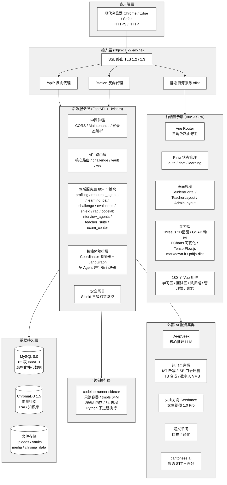
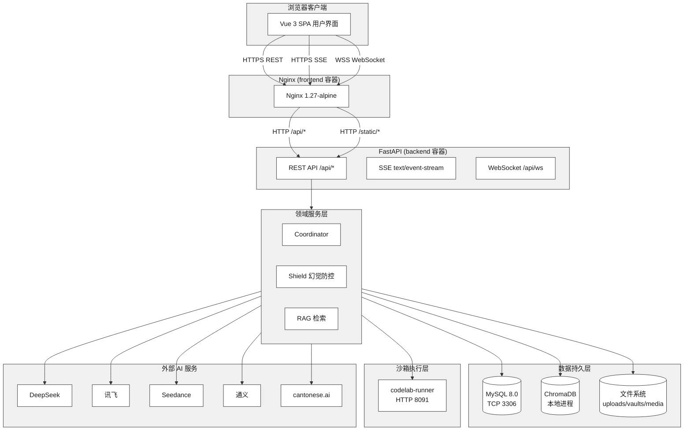
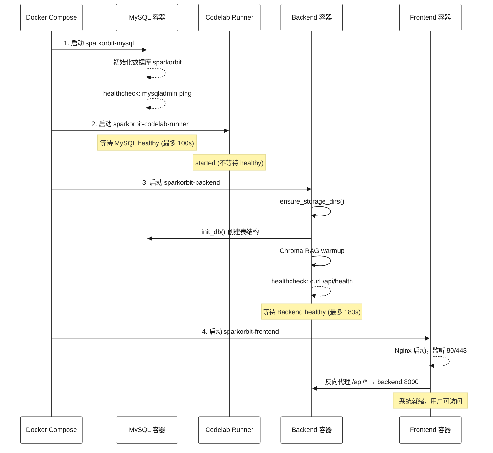
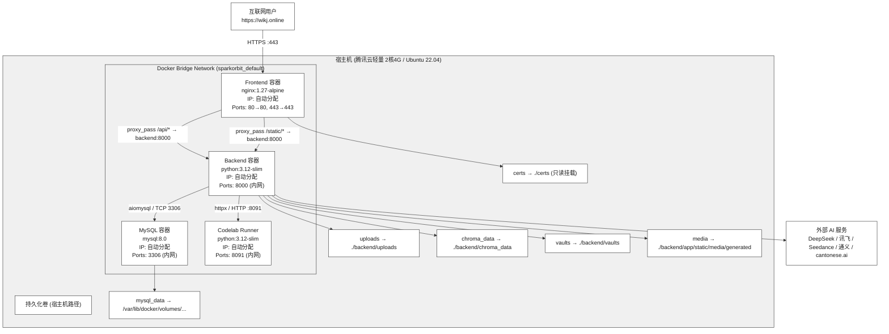

# SparkOrbit 星轨学图 — 概要设计说明书

| 项 | 内容 |
|----|------|
| 项目名称 | SparkOrbit 星轨学图 |
| 文档名称 | 概要设计说明书 |
| 文档编号 | SparkOrbit-C1 |
| 编制者 | SparkOrbit 团队 |
| 编制日期 | 2026-07-31 |
| 版本 | V3.0（工程级完整版） |
| 密级 | 内部 |

---

## 修改记录

| 版本 | 日期 | 修改人 | 说明 |
|------|------|--------|------|
| V1.0 | 2026-07-30 | SparkOrbit 团队 | 初稿，基于作品设计实现方案 Ch2-3 回填 |
| V2.0 | 2026-07-31 | SparkOrbit 团队 | 工程级完整版：新增全部 Mermaid 架构图（灰黑色调）、子系统与模块完整拆分、6 个核心处理流程序列详解、接口全景设计、出错处理冗余策略、部署拓扑与物理结构设计、全部附录 |
| V3.0 | 2026-08-14 | SparkOrbit 团队 | 工程级对齐：服务模块数修正为 80+、表数修正为 82 张、组件数修正为 180、画像修正为八维、密码哈希修正为 PBKDF2-SHA256；新增子系统 9（模拟面试与求职域）、模块对照 M35-M43、面试/求职/考级/SRS 端点 |

---

## 1 引言

### 1.1 编写目的

本说明书依据 GB/T 8567-2006《计算机软件文档编制规范》中概要设计说明书的编制要求，结合面向高等教育场景的 AI 自适应学习路径决策与多智能体伴学系统的实际实现，对 SparkOrbit 星轨学图项目进行系统级的总体设计描述。其核心目的是：

1. **确立系统总体架构**：定义前后端分离的层次化结构、子系统划分原则及模块间依赖关系，为详细设计（C2）和数据库设计（C3）提供宏观骨架
2. **定义内外部接口契约**：明确 HTTP REST、SSE 流式、WebSocket 全双工、第三方 AI 服务等接口的边界、协议与数据格式
3. **规划运行与部署方案**：描述 Docker Compose 四服务编排下的运行模块组合、运行控制流程与性能预期
4. **设计出错处理与冗余策略**：面对 LLM 调用波动、Seedance 异步超时、数据库故障等场景，建立有层次的降级、回退与恢复机制

**预期读者**：

| 读者角色 | 关注重点 |
|----------|----------|
| 系统架构师 | 分层架构的合理性、子系统边界与通信方式、技术决策依据 |
| 后端开发负责人 | 服务层划分、API 端点组织、外部服务集成方式、出错处理策略 |
| 前端开发负责人 | 前后端接口约定、SSE/WebSocket 通信协议、静态资源挂载方案 |
| 运维 / 部署工程师 | Docker Compose 服务编排、容器间网络拓扑、持久化存储挂载 |
| C2 详细设计编写者 | 各程序模块的层次归属、调用链路、接口定义锚点 |
| 竞赛评审专家 | 系统架构的工程完整性、设计思路的清晰度、技术选型的合理性 |

### 1.2 范围

本说明书覆盖 SparkOrbit 星轨学图项目的全部软件构成，范围界定如下：

| 范畴 | 说明 |
|------|------|
| **前端** | Vue 3 + TypeScript + Vite + Tailwind CSS 构建的单页应用（SPA），Nginx 1.27-alpine 承载静态资源与反向代理，含 Three.js 3D 星图、GSAP 高性能动画、TensorFlow.js COCO-SSD 本地推理等能力 |
| **后端** | FastAPI + Uvicorn 异步 Web 服务，包含 REST API 路由层、80+ 个领域服务模块、LangGraph 多智能体编排层（四模式）、Shield 安全网关、WebSocket / SSE 实时通信 |
| **数据层** | MySQL 8.0（结构化数据，82 张表）、ChromaDB 1.5（向量检索 RAG）、文件系统（uploads / vaults / media 三级持久化目录） |
| **沙箱层** | codelab-runner Docker sidecar，Python 3.12-slim 只读容器，供 CodeLab 模块安全执行用户代码 |
| **外部 AI 集成** | DeepSeek（核心 LLM）、火山方舟 Seedance（视频生成）、讯飞全家桶（IAT/ISE/TTS/数字人）、通义千问（图像）、cantonese.ai（粤语） |
| **部署形态** | Docker Compose 四服务编排，支持本地一键启动与腾讯云 HTTPS 公网部署（https://wikj.online） |
| **不涵盖** | 原生 iOS/Android 移动端应用、Kubernetes 集群编排、第三方 SSO 单点登录集成、付费支付系统 |

### 1.3 定义与缩写

| 术语 | 全称 | 含义 |
|------|------|------|
| Coordinator | — | 多智能体资源生成的编排调度器，负责任务分解、Agent 匹配与结果聚合 |
| Shield | — | 内容安全与幻觉防控网关，实施三级防线（前端提示→多模型交叉验证→教师工单） |
| Mirror | — | 学生认知画像系统，采集并持续刷新八维学习特征（专业背景/前置知识/认知风格/易错倾向/学习目标/时间弹性/模态偏好/动机水平） |
| SSE | Server-Sent Events | 服务端到客户端的单向流式数据推送协议，用于资源生成实时反馈 |
| WebSocket | — | 全双工通信协议，用于聊天室实时消息与全局通知推送 |
| RAG | Retrieval-Augmented Generation | 检索增强生成范式——ChromaDB 向量检索结合 LLM 回答生成 |
| RBAC | Role-Based Access Control | 基于角色的访问控制（student / teacher / admin 三角色隔离） |
| SPA | Single Page Application | 单页应用，前端路由由 Vue Router 在客户端接管 |
| Vault | — | 基于 Obsidian 兼容 Markdown 双链的个人知识库系统 |
| ChromaDB | — | 开源向量数据库，持久化于本地文件系统，用于 RAG 语义检索 |
| LangGraph | — | LangChain 生态的多智能体图编排框架，定义 Agent 节点与状态流转 |
| 四闸 | — | 学→练→讲→用四级掌握度验证门禁体系，逐级解锁行星挑战 |
| 星系 / 行星 | — | 隐喻命名体系：一个星系对应一门课程，一颗行星对应一个知识点，行星亮度映射学生掌握度 |
| 星轨领航台 | — | 学生端主界面（StudentPortal），含七大功能分区（学习/星域/树洞/聊天/自习/休闲/面试）的导航与工作区 |
| 演武舱 | AlgoVizLab | 算法可视化学习舱，支持图结构遍历、排序、搜索可视化演练与零幻觉小测 |
| 代码舱 | CodeLab | 沙箱化代码在线编辑与执行环境，通过 Docker sidecar 安全隔离 |
| 时空扭曲沙盘 | TimeWarpSandbox | 教师端基于镜像学生的仿真预演工具，虚拟运行学习路径以预判教学效果 |
| Seedance | — | 火山方舟文生视频模型 doubao-seedance-1-0-pro，用于 AI 教学视频生成 |
| IAT / ISE / TTS | — | 讯飞语音听写 / 口语评测 / 语音合成 |
| VMS | Virtual Man System | 讯飞虚拟人交互平台，提供 3D 数字人形象与播报能力 |
| ORM | Object-Relational Mapping | 对象关系映射，本项目使用 SQLAlchemy 2.0 async |
| sidecar | — | 共享 Docker 网络内的辅助容器，codelab-runner 以 sidecar 模式运行 |

### 1.4 参考资料

| 编号 | 资料名称 | 来源 | 用途 |
|------|----------|------|------|
| [R1] | 《SparkOrbit-B1-软件需求说明书》V2.0 | 项目组 | 设计输入：全部 FR/NFR 需求条目、外部接口定义、用例模型 |
| [R2] | 《SparkOrbit-B2-数据要求说明书》V1.0 | 项目组 | 设计输入：数据域划分、采集规范、文件存储容量估算 |
| [R3] | 《SparkOrbit 作品设计实现方案》V1.0 | 项目组 | 技术架构参考、功能结构、创新点描述 |
| [R4] | 《概要设计说明书编写规范.doc》 | 国标压缩包 | 文档结构与章节要求 |
| [R5] | GB/T 8567-2006 计算机软件文档编制规范 | 国家标准 | 文档编制总纲 |
| [R6] | `docker-compose.yml` | 项目仓库 | 容器编排定义——服务依赖、端口映射、持久化卷 |
| [R7] | `frontend/nginx.conf` | 项目仓库 | Nginx 路由规则与 SSL 终止配置 |
| [R8] | `backend/app/main.py` | 项目仓库 | FastAPI 应用组装——路由注册、中间件链、静态挂载 |
| [R9] | `frontend/src/router/index.ts` | 项目仓库 | Vue Router 路由树——三角色路由守卫与懒加载策略 |
| [R10] | `backend/app/services/` 目录 | 项目仓库 | 全部 80+ 个领域服务模块清单 |
| [R11] | `backend/app/models/` 目录 | 项目仓库 | 全部约 70 个 SQLAlchemy ORM 模型（82 张表） |
| [R12] | `backend/.env.example` | 项目仓库 | 环境变量配置——API Key、模型路由、服务地址 |
| [R13] | 《部署说明书.md》 | 项目组 | 部署流程与运维参考 |
| [R14] | 《服务器部署速查.md》 | 项目组 | 腾讯云轻量服务器部署细则 |

---

## 2 总体设计

### 2.1 需求规定

本节概述 B1 软件需求说明书中与本概要设计直接关联的关键需求，作为后续设计决策的约束条件。完整需求定义详见 B1 文档。

#### 2.1.1 功能需求约束摘要

| 需求编号 | 需求名称 | 设计约束 |
|----------|----------|----------|
| FR-PROF-01 ~ 04 | 对话式八维学习画像采集与动态更新 | 需设计独立的画像服务模块，支持对话流输入、LLM 维度推断、学习事件驱动刷新、教师复核覆盖 |
| FR-RES-01 ~ 04 | 多智能体协同资源生成（>=5 类） | 需设计 Coordinator 编排器 + 专项 Resource Agent 体系，支持 >=7 类资源（文档/导图/习题/阅读/视频/课件/代码），以 SSE 流式反馈生成进度 |
| FR-PATH-01 ~ 03 | 个性化学习路径规划与资源推送 | 需设计基于画像维度与掌握度的路径规划算法，支持评估回灌触发路径重排 |
| FR-TUT-01 ~ 03 | 多模态智能辅导 | 需设计苏格拉底式引导对话和费曼式讲解双模式，集成数字人播报与 RAG 上下文增强 |
| FR-EVAL-01 ~ 02 | 全维度学习效果评估 | 需设计雷达图、掌握度、达成率、热力图等多维度评估指标的计算与可视化输出 |
| FR-GATE-01 ~ 03 | 四闸掌握度门禁体系 | 需设计学→练→讲→用四级状态机，集成记忆衰减算法与复习固化触发 |
| FR-TCH-01 ~ 05 | 教师端学情监控与质量治理 | 需设计班级学情看板、作业考勤、改进复核、星系锻造（PDF→AI 解析→知识图谱）、幻觉工单处理闭环 |
| FR-ADM-01 ~ 03 | 管理端用户/内容/用量管控 | 需设计三角色账户管理、内容审核、API Token 用量监控、维护模式切换 |
| FR-EXT-01 ~ 04 | 拓展创新功能 | 需设计代码舱安全沙箱、演武舱算法可视化、自习督导本地推理、桌宠情感化系统 |

#### 2.1.2 非功能需求约束摘要

| 需求编号 | 需求名称 | 设计约束 |
|----------|----------|----------|
| NFR-P-01 | 常规 API 响应时间 ≤ 500ms（P95） | 采用 FastAPI 异步架构 + aiomysql 非阻塞数据库驱动 + 数据库索引优化 |
| NFR-P-02 | LLM 资源生成首次 SSE 事件 ≤ 3s | Coordinator 快速分发 + 并行 Agent 策略 + SSE 零缓冲推送 |
| NFR-P-03 | WebSocket 并发连接 ≥ 100 | Uvicorn 异步事件循环 + websockets 库支持 |
| NFR-S-01 | 密码 PBKDF2-SHA256 哈希存储 | 后端 auth 模块（`backend/app/services/auth.py`）实现 |
| NFR-S-02 | RBAC 三角色权限隔离 | Vue Router 前端守卫 + FastAPI Depends 后端依赖注入双重控制 |
| NFR-S-03 | 代码舱沙箱安全隔离 | 独立 Docker sidecar 容器 + 只读根文件系统 + tmpfs /tmp + 256M 内存/0.5 CPU/64 进程硬限额 |
| NFR-S-04 | 自习督导隐私保护 | TensorFlow.js 前端本地 COCO-SSD 推理，视频流不离开浏览器，仅标量专注度落库 |
| NFR-C-01 | Docker 一键启动 | docker-compose.yml 编排 4 服务 + healthcheck 依赖链 + .env 环境变量 |
| NFR-C-02 | 支持 SQLite 开发模式兜底 | 当 MySQL 不可用时可通过环境变量切换至 aiosqlite |

### 2.2 运行环境

#### 2.2.1 服务器端运行环境

本系统采用 Docker 容器化部署，运行环境由 Docker 镜像与 Compose 编排文件统一定义：

| 组件 | 运行环境规格 |
|------|-------------|
| **数据库容器** | `mysql:8.0` 官方镜像；字符集 utf8mb4 / utf8mb4_unicode_ci；默认认证插件 mysql_native_password；持久化卷 `mysql_data` |
| **后端容器** | `python:3.12-slim` 基础镜像自构建；Uvicorn 0.51 + FastAPI 0.139；预装 ffmpeg（视频处理）+ curl（healthcheck）；ChromaDB ONNX 模型内置（all-MiniLM-L6-v2）；暴露 8000 端口（内网） |
| **前端容器** | 多阶段构建：`node:22-alpine` 编译静态资源 → `nginx:1.27-alpine` 运行；暴露 80/443 端口（公网）；SSL 证书挂载自宿主机 `./certs` 目录 |
| **沙箱容器** | `python:3.12-slim` 官方镜像；只读根文件系统（read_only: true）；tmpfs /tmp 64M；内存 256M / CPU 0.5 / 进程 64 硬限额；暴露 8091 端口（内网） |
| **宿主机要求** | Docker Desktop 4.x+ 或 Docker Engine 20.x+；可用内存 >= 4GB；端口 80/443 空闲（不冲突） |
| **云部署环境** | 腾讯云轻量应用服务器 2 核 4G；操作系统 Ubuntu 22.04 + Docker29 镜像；防火墙放行 80/443/22 端口；已配置 SSL 证书（wikj.online） |

#### 2.2.2 客户端运行环境

| 项目 | 要求 |
|------|------|
| **浏览器** | Chrome 110+、Edge 110+、Safari 17+（需支持 ES Modules、WebSocket、SSE、WebGL 用于 Three.js 渲染、MediaDevices API 用于自习督导摄像头） |
| **操作系统** | Windows 10+、macOS 12+、Linux（主流发行版） |
| **网络** | HTTPS 连接（公网部署）或 HTTP 连接（本地 localhost 部署）；LLM 生成任务需稳定互联网以访问外部 AI API |
| **摄像头（可选）** | USB 或内置摄像头，用于自习督导专注度检测 |
| **麦克风（可选）** | 用于讯飞 IAT 语音输入和 ISE 口语评测 |

### 2.3 基本设计概念和处理流程

#### 2.3.1 系统架构全景图



> **图 C1-F01：系统架构全景图**。展示了客户端→Nginx 接入→Vue 3 SPA→FastAPI 后端→数据持久层→沙箱层→外部 AI 服务的完整七层架构。

#### 2.3.2 子系统划分与模块结构

```mermaid
%%{init: {'theme':'base','themeVariables':{'primaryColor':'#ffffff','primaryTextColor':'#1a1a1a','primaryBorderColor':'#333333','lineColor':'#333333','secondaryColor':'#e8e8e8','tertiaryColor':'#f5f5f5','background':'#ffffff','mainBkg':'#ffffff','nodeBorder':'#333333','clusterBkg':'#f0f0f0','clusterBorder':'#333333','titleColor':'#1a1a1a','edgeLabelBackground':'#ffffff'}}}%%
flowchart TD
    Root["SparkOrbit 星轨学图<br/>概要设计——子系统与模块结构"]

    Root --> Sub1["子系统 1：前端展示子系统<br/>Vue 3 + Vite + Nginx"]

    Root --> Sub2["子系统 2：API 网关与路由子系统<br/>FastAPI 路由 + 中间件链"]

    Root --> Sub3["子系统 3：身份与系统管理域<br/>认证 / 用户 / 维护模式 / 用量监控"]

    Root --> Sub4["子系统 4：知识宇宙域<br/>星系 / 行星 / 掌握度 / 知识库 / RAG"]

    Root --> Sub5["子系统 5：认知画像域<br/>对话采集 / 维度推断 / 事件刷新 / 复核"]

    Root --> Sub6["子系统 6：智能资源域<br/>Coordinator / 7 类 Agent / 质量评分 / Seedance"]

    Root --> Sub7["子系统 7：学习闭环域<br/>路径 / 四闸 / 辅导 / 评估 / 衰减"]

    Root --> Sub8["子系统 8：社交与激励域<br/>聊天 / 树洞 / 自习 / 桌宠 / 休闲"]

    Root --> Sub9["子系统 9：模拟面试与求职域<br/>面试舱 / 练习舱 / 求职助手 / 教师督导"]

    Sub1 --> S1M1["路由与守卫"]
    Sub1 --> S1M2["状态管理 Pinia"]
    Sub1 --> S1M3["180 个 UI 组件"]
    Sub1 --> S1M4["能力集成层<br/>Three.js / GSAP / ECharts / TF.js"]
    Sub1 --> S1M5["Nginx 反向代理"]

    Sub2 --> S2M1["核心路由 routes.py"]
    Sub2 --> S2M2["挑战路由 challenge_routes.py"]
    Sub2 --> S2M3["知识库路由 vault_routes.py"]
    Sub2 --> S2M4["WebSocket ws.py"]
    Sub2 --> S2M5["CORS 中间件"]
    Sub2 --> S2M6["维护模式中间件"]

    Sub3 --> S3M1["认证服务 auth.py"]
    Sub3 --> S3M2["账户服务 account.py"]
    Sub3 --> S3M3["管理员服务 admin.py"]
    Sub3 --> S3M4["用户信息服务 user_info.py"]

    Sub4 --> S4M1["星系服务 galaxy_service.py"]
    Sub4 --> S4M2["星系锻造 galaxy_forge.py"]
    Sub4 --> S4M3["掌握度关卡 mastery_gates.py"]
    Sub4 --> S4M4["门禁策略 gate_policy.py"]
    Sub4 --> S4M5["知识库服务 vault_service.py"]
    Sub4 --> S4M6["RAG 检索 rag.py"]
    Sub4 --> S4M7["星库服务 starlib.py"]
    Sub4 --> S4M8["记忆衰减 memory_decay.py"]

    Sub5 --> S5M1["画像分析 profiling.py"]
    Sub5 --> S5M2["画像管理 profiles.py"]
    Sub5 --> S5M3["画像刷新 profile_refresh.py"]

    Sub6 --> S6M1["资源智能体 resource_agents.py"]
    Sub6 --> S6M2["资源质量 resource_quality.py"]
    Sub6 --> S6M3["Seedance 视频 seedance_service.py"]
    Sub6 --> S6M4["媒体溯源 media_provenance.py"]
    Sub6 --> S6M5["碎片学习 fragments.py"]
    Sub6 --> S6M6["LLM 统一调用 llm.py"]

    Sub7 --> S7M1["学习路径 learning_path.py"]
    Sub7 --> S7M2["挑战系统 challenge.py"]
    Sub7 --> S7M3["智能辅导 ai_tutor.py"]
    Sub7 --> S7M4["数字人导师 digital_tutor.py"]
    Sub7 --> S7M5["评估服务 assessment.py"]
    Sub7 --> S7M6["评测服务 evaluation.py"]
    Sub7 --> S7M7["学习改进 improvement.py"]

    Sub8 --> S8M1["聊天服务 chat_service.py"]
    Sub8 --> S8M2["树洞服务 tree_hole_service.py"]
    Sub8 --> S8M3["自习服务 study_service.py"]
    Sub8 --> S8M4["伴学宠物 companion.py"]
    Sub8 --> S8M5["专区扩展 zone_extras.py"]
    Sub8 --> S8M6["社交服务 social.py"]

    Sub9 --> S9M1["面试编排 interview_agents.py"]
    Sub9 --> S9M2["面试会话 interview_service.py"]
    Sub9 --> S9M3["多模态评分 interview_scoring.py"]
    Sub9 --> S9M4["练习舱 interview_practice.py"]
    Sub9 --> S9M5["投递看板 interview_applications.py"]
    Sub9 --> S9M6["简历工坊 interview_resume.py / resume_export.py"]
```



> **图 C1-F02：子系统与模块结构图**。系统划分为 9 个子系统，覆盖前端展示、API 路由、身份管理、知识宇宙、认知画像、智能资源、学习闭环、社交激励、模拟面试与求职九大领域。每个子系统内部列出核心模块（共约 60 个关键模块）。

#### 2.3.3 核心闭环处理流程

```mermaid
%%{init: {'theme':'base','themeVariables':{'primaryColor':'#ffffff','primaryTextColor':'#1a1a1a','primaryBorderColor':'#333333','lineColor':'#333333','secondaryColor':'#e8e8e8','tertiaryColor':'#f5f5f5','background':'#ffffff','mainBkg':'#ffffff','nodeBorder':'#333333','clusterBkg':'#f0f0f0','clusterBorder':'#333333','titleColor':'#1a1a1a','edgeLabelBackground':'#ffffff'}}}%%
flowchart LR
    A["1. 采集<br/>对话式画像采集<br/>profiling.py"] --> B["2. 画像<br/>八维认知画像 Mirror<br/>profiles.py"]
    B --> C["3. 生成<br/>多智能体资源生成<br/>resource_agents.py"]
    C --> D["4. 路径<br/>个性化路径规划<br/>learning_path.py"]
    D --> E["5. 验证<br/>四闸掌握度挑战<br/>challenge.py"]
    E --> F["6. 评估<br/>全维度效果评估<br/>evaluation.py"]
    F --> G["7. 回灌<br/>评估触发路径重排<br/>learning_path.py"]
    G --> H["8. 刷新<br/>学习事件驱动画像更新<br/>profile_refresh.py"]
    H --> B

    style A fill:#f0f0f0,stroke:#333,color:#1a1a1a
    style B fill:#e0e0e0,stroke:#333,color:#1a1a1a
    style C fill:#f0f0f0,stroke:#333,color:#1a1a1a
    style D fill:#e0e0e0,stroke:#333,color:#1a1a1a
    style E fill:#f0f0f0,stroke:#333,color:#1a1a1a
    style F fill:#e0e0e0,stroke:#333,color:#1a1a1a
    style G fill:#f0f0f0,stroke:#333,color:#1a1a1a
    style H fill:#e0e0e0,stroke:#333,color:#1a1a1a
```



> **图 C1-F03：核心闭环处理流程图**。系统以 8 步闭环驱动个性化学习循环：采集→画像→生成→路径→验证→评估→回灌→刷新。评估结果回灌至路径规划模块触发重排，学习事件回灌至画像模块触发增量刷新，形成自适应优化闭环。

#### 2.3.4 AI 任务处理流程

系统对 AI 密集型任务（资源生成、路径规划、智能辅导）采用统一的三阶段异步处理模式：

**阶段一：请求受理与快速响应**

客户端发起 AI 任务请求（如 POST `/api/resources/generate`）→ API 路由层校验权限与参数 → 服务层创建任务记录（`AiTaskRecord`）→ 立即返回 HTTP 202 Accepted（含任务 ID）或建立 SSE 连接。此阶段在 50ms 内完成，避免 HTTP 超时。

**阶段二：异步执行与流式推送**

Coordinator / 领域服务通过异步协程调用 LLM → 每产生增量输出即写入 SSE 事件队列 → Uvicorn 通过 `StreamingResponse` 将 `text/event-stream` 数据零缓冲推送至前端。对于 Seedance 等分钟级任务，采用轮询 + 回调模式——异步提交生成请求后周期性检查状态，完成后通过 WebSocket 通知前端。

**阶段三：质量验证与持久化**

生成完成后，Shield 模块对内容进行安全过滤与置信度检查 → 低于阈值则生成幻觉工单 → 资源元数据写入 `GeneratedResource` 表 → 文件实体写入 uploads/media 目录 → 质量评分写入 → 前端通过 SSE `[DONE]` 事件获知完成。

```
客户端请求 → POST /api/resources/generate
    │
    ▼
API 路由层: 参数校验 → 创建 AiTaskRecord → 建立 SSE 连接
    │
    ▼
Coordinator 编排器: 匹配 Resource Agent → 并行/串行调度
    │
    ├──→ Agent 1: 文档生成 → SSE event: {"type":"doc","chunk":"..."}
    ├──→ Agent 2: 导图生成 → SSE event: {"type":"mindmap","chunk":"..."}
    ├──→ Agent 3: 习题生成 → SSE event: {"type":"quiz","chunk":"..."}
    │   ...
    │
    ▼
结果聚合 → Shield 安全过滤 + 置信度检查
    │
    ▼
持久化 → GeneratedResource 表 + 文件系统 → 质量评分
    │
    ▼
SSE event: {"type":"done"} → 前端渲染完成
```

#### 2.3.5 请求处理流程（Nginx → FastAPI → Service → 数据/外部）

```
浏览器请求 (HTTP/HTTPS)
    │
    ▼
Nginx (sparkorbit-frontend 容器)
    ├── /                    → /usr/share/nginx/html/index.html (SPA 入口)
    ├── /api/*               → proxy_pass http://backend:8000/api/*
    │                           ├── 设置 X-Real-IP / X-Forwarded-For / X-Forwarded-Proto
    │                           ├── proxy_buffering off (SSE 零缓冲)
    │                           ├── proxy_read_timeout 3600s (LLM 长任务)
    │                           └── Upgrade + Connection headers (WebSocket)
    ├── /static/*            → proxy_pass http://backend:8000/static/*
    │                           └── 支持 Range 请求 (视频流)
    └── *.mjs                → 静态文件 + Cache-Control: immutable
    │
    ▼
FastAPI (sparkorbit-backend 容器)
    ├── MaintenanceMiddleware
    │   └── 检查维护模式 → 非管理员写入操作返回 503
    ├── CORS Middleware
    │   └── allow_origins=["*"]
    ├── 路由匹配 (4 个 Router)
    │   ├── router            → /api/ (认证/用户/聊天/教师/管理员/社交...)
    │   ├── challenge_router  → /api/ (四闸挑战/提交/评分)
    │   ├── vault_router      → /api/ (知识库 CRUD/搜索)
    │   └── ws_router         → /api/ (WebSocket /ws)
    ├── 依赖注入 (Depends)
    │   ├── get_current_user     → Bearer Token 解析 → User 对象
    │   └── require_role(...)    → RBAC 角色校验
    ├── Service 层调用
    │   ├── llm.py             → 多模型路由 (DeepSeek/豆包/讯飞)
    │   ├── resource_agents.py → Agent 编排
    │   ├── rag.py             → ChromaDB 向量检索
    │   └── shield.py          → 安全过滤
    ├── 数据访问 (SQLAlchemy async Session)
    │   └── MySQL (sparkorbit-mysql:3306)
    └── 外部 HTTP 调用
        ├── DeepSeek API   → https://api.deepseek.com
        ├── 讯飞 API       → IAT / ISE / TTS / VMS
        ├── 火山方舟 API   → 豆包 / Seedance
        ├── 通义 API       → 图像编辑
        └── cantonese.ai   → 粤语 STT
```

### 2.4 结构

#### 2.4.1 层次架构设计

系统采用严格的**六层架构**，自顶向下逐层依赖、单向可见：

| 层次 | 名称 | 技术载体 | 职责 | 依赖方向 |
|------|------|----------|------|----------|
| **L1** | 接入层 | Nginx 1.27-alpine（frontend 容器） | SSL 终止、静态资源、反向代理（/api 和 /static）、WebSocket 升级 | 无上层依赖 |
| **L2** | 前端展示层 | Vue 3 SPA + Pinia + Three.js（浏览器运行时） | 用户界面渲染、3D 星图、SSE 消费、WebSocket 通信、摄像头推理 | 仅调用 L3 |
| **L3** | API 网关层 | FastAPI 路由 + 中间件（backend 容器） | 请求路由分发、认证鉴权、维护模式控制、参数校验、SSE 管理 | 仅调用 L4 |
| **L4** | 领域服务层 | 80+ 个 Python 服务模块（backend 容器） | 业务逻辑实现：画像分析、资源生成编排、路径规划、挑战评分、幻觉防控、面试编排、求职 | 仅调用 L5 |
| **L5** | 数据访问层 | SQLAlchemy ORM + httpx + ChromaDB Client（backend 容器） | 结构化数据持久化、向量检索、文件读写、外部 AI API 调用 | 仅调用 L6 |
| **L6** | 基础设施层 | MySQL 容器 + ChromaDB 本地 + 文件系统 + codelab-runner sidecar | 数据持久化、向量存储、沙箱执行 | 无下层依赖 |

层次间通信原则：

- **L2 → L3**：通过 HTTP REST、SSE、WebSocket（均为标准应用层协议）
- **L3 → L4**：Python 函数调用（同进程内模块导入）
- **L4 → L5**：SQLAlchemy async Session（async/await）、httpx AsyncClient、ChromaDB Client
- **L5 → L6**：TCP/3306（MySQL）、本地文件系统 I/O、HTTP/8091（codelab-runner）

禁止跨层直接调用（如 L3 直接访问 L5 的数据库会话，或 L2 直接调用外部 AI API）。

#### 2.4.2 前端结构设计

前端采用 Vue 3 Composition API + TypeScript 构建，遵循**视图/组件/状态管理/能力库**四层结构：

```
前端代码组织 (frontend/src/)
├── router/                # Vue Router 路由配置
│   └── index.ts           # 路由树 + beforeEach 三角色守卫
├── views/                 # 页面级视图
│   ├── StudentPortal.vue  # 学生端主视图（星轨领航台）
│   ├── StudentDetail.vue  # 学生详情视图（教师端查看）
│   └── admin/             # 管理端页面视图（6 个）
├── components/            # 可复用 UI 组件（107 个）
│   ├── learning/          #   学习区组件（AlgoVizLab / CodeLab / TutorLab 等）
│   ├── interview/         #   模拟面试组件（面试舱 / 练习舱 / 报告 / 画像 / 求职）
│   ├── teacher/           #   教师端组件（30 个，含面试督导）
│   ├── admin/             #   管理端组件
│   ├── pet/               #   桌宠系统组件
│   ├── leisure/           #   休闲区组件（星座 / 游戏）
│   ├── auth/              #   认证组件（TerminalAuthShell）
│   ├── chat/              #   聊天组件
│   ├── study/             #   自习组件（FocusTimer / OrbitExplorer）
│   ├── domain/            #   个人域组件
│   ├── treehole/          #   树洞组件
│   └── common/            #   通用组件（MarkdownView / ZoneDock）
├── stores/                # Pinia 状态管理
│   ├── auth.ts            #   认证状态（user / token / role）
│   ├── chat.ts            #   聊天状态
│   └── learning.ts        #   学习状态
├── api/                   # API 客户端层（21 个模块）
│   ├── auth.ts            #   认证 API（login / register / profile）
│   ├── resources.ts       #   资源 API（generate / list / download）
│   ├── challenge.ts       #   挑战 API（submit / status）
│   ├── tutor.ts           #   辅导 API（chat / stream）
│   ├── sse.ts             #   SSE 连接管理（EventSource 封装）
│   └── ...
├── composables/           # 组合式 API（可复用逻辑）
│   ├── useCameraSupervisor.ts  # 摄像头督导
│   ├── useAvatarVms.ts         # 数字人控制
│   └── ...
└── constants/             # 常量定义
```

#### 2.4.3 后端结构设计

后端采用 FastAPI 异步架构，遵循**路由/服务/数据访问/模型**四层分离：

```
后端代码组织 (backend/app/)
├── main.py                # FastAPI 应用组装（路由注册/中间件/静态挂载/启动事件）
├── api/                   # API 路由层
│   ├── routes.py          #   核心路由（认证/用户/聊天/教师/管理员/社交/资源/辅导/...）
│   ├── challenge_routes.py #   挑战路由
│   ├── vault_routes.py    #   知识库路由
│   ├── interview_routes.py #   模拟面试 + 求职路由
│   ├── exam_routes.py     #   考级中心路由
│   ├── review_routes.py   #   SRS 复习路由
│   └── ws.py              #   WebSocket 路由（ASR / 聊天 / 自习 / 面试）
├── services/              # 领域服务层（80+ 个模块）
│   ├── profiling.py       #   画像分析（对话流→八维推断）
│   ├── profiles.py        #   画像管理（CRUD / 查询）
│   ├── profile_refresh.py #   画像刷新（学习事件→增量更新）
│   ├── resource_agents.py #   多智能体资源生成（Coordinator + 7 类 Agent）
│   ├── resource_quality.py #   资源质量评估
│   ├── seedance_service.py #   Seedance 视频生成服务
│   ├── learning_path.py   #   学习路径规划
│   ├── challenge.py       #   四闸挑战逻辑
│   ├── mastery_gates.py   #   掌握度门禁
│   ├── gate_policy.py     #   门禁策略配置
│   ├── memory_decay.py    #   记忆衰减算法
│   ├── ai_tutor.py        #   智能辅导（苏格拉底/费曼）
│   ├── digital_tutor.py   #   数字人导师
│   ├── evaluation.py      #   学习效果评估
│   ├── assessment.py      #   评测服务
│   ├── improvement.py     #   学习改进建议
│   ├── llm.py             #   LLM 统一调用层（多模型路由）
│   ├── rag.py             #   RAG 检索增强（ChromaDB）
│   ├── shield.py          #   内容安全过滤
│   ├── hallucination_guard.py # 幻觉检测
│   ├── hallucination_tickets.py # 幻觉工单管理
│   ├── codelab.py         #   代码舱主逻辑
│   ├── codelab_runner.py  #   代码执行编排（subprocess / sidecar）
│   ├── galaxy_service.py  #   星系管理
│   ├── galaxy_forge.py    #   星系锻造（PDF→AI 解析→知识图谱）
│   ├── spark.py           #   Spark 核心服务
│   ├── tts_service.py     #   讯飞 TTS 语音合成
│   ├── asr_service.py     #   讯飞 IAT 语音识别
│   ├── ise_service.py     #   讯飞 ISE 口语评测
│   ├── xf_digital_human.py #   讯飞数字人交互
│   ├── avatar_service.py  #   通义图像头像生成
│   ├── ark_vision.py      #   火山方舟视觉识别
│   ├── cantonese_ai_service.py # 粤语 AI 服务
│   ├── chat_service.py    #   聊天服务
│   ├── tree_hole_service.py #  树洞服务
│   ├── study_service.py   #   自习服务
│   ├── companion.py       #   伴学宠物
│   ├── constellation.py   #   学习星座
│   ├── pet_service.py     #   宠物服务
│   ├── admin.py           #   管理员服务
│   ├── account.py         #   账户服务
│   ├── auth.py            #   认证服务
│   ├── teacher.py         #   教师端核心服务
│   ├── teacher_extras.py  #   教师扩展服务
│   ├── teacher_suite.py   #   教师套件（题库/私信/分组/表扬/日历/资源审阅）
│   ├── interview_agents.py #  面试多智能体编排（workflow/handoff/council）
│   ├── interview_service.py # 面试会话/报告/画像/教师审阅
│   ├── interview_scoring.py # 多模态评分（语义/韵律/仪态）
│   ├── interview_practice.py # 练习舱
│   ├── interview_applications.py # 投递看板
│   ├── interview_resume.py  #  简历解析/优化/匹配
│   ├── resume_export.py     #  简历导出
│   ├── exam_center.py       #  考级中心
│   ├── review_queue.py      #  SRS 复习队列
│   ├── simulation.py      #   时空扭曲沙盘
│   ├── social.py          #   社交服务
│   ├── zone_extras.py     #   专区扩展服务
│   ├── vault_service.py   #   知识库服务
│   ├── note_service.py    #   笔记服务
│   ├── starlib.py         #   星库服务
│   ├── upload_service.py  #   上传服务
│   ├── notification_service.py # 通知服务
│   └── ...                #   其他支撑服务
├── models/                # 数据模型层（约 70 个 SQLAlchemy ORM，82 张表）
│   ├── user.py / galaxy.py / planet.py / planet_mastery.py
│   ├── generated_resource.py / learning_path.py / star_asset.py
│   ├── challenge_question.py / chat_*.py / school_class.py
│   ├── hallucination_ticket.py / api_usage_log.py / system_setting.py
│   ├── assignment.py / simulation.py / friendship.py
│   ├── mock_interview.py / exam.py / review.py / teacher_tools.py / ops.py
│   └── ...
├── schemas/               # Pydantic 请求/响应 Schema（出入参校验）
├── middlewares/           # 中间件
│   └── maintenance.py     #   维护模式中间件
├── db/                    # 数据库会话管理
│   └── session.py         #   AsyncSessionLocal + init_db
├── core/                  # 核心配置
│   ├── config.py          #   环境变量读取（Pydantic Settings）
│   └── paths.py           #   路径管理（uploads / vaults / materials）
└── data/                  # 静态数据
    └── viz_traces/        #   演武舱可视化轨迹数据（BFS / DFS / Dijkstra 等）
```

#### 2.4.4 功能需求与程序模块对照表

| 需求簇（来源 B1） | 前端模块 | 后端路由 | 后端核心服务 |
|-------------------|----------|----------|-------------|
| FR-AUTH 认证与权限 | TerminalAuthShell / RegisterGateway | `/api/auth/*` | auth.py / account.py |
| FR-PROF 画像采集 | MirrorDashboard / ProfileChat | `/api/profiles/*` | profiling.py / profiles.py / profile_refresh.py |
| FR-RES 资源生成 | ResourceStudio / SSE 消费组件 | `/api/resources/*` | resource_agents.py / resource_quality.py / seedance_service.py / llm.py / shield.py |
| FR-PATH 路径规划 | LearningPathPanel | `/api/path/*` | learning_path.py |
| FR-TUT 智能辅导 | TutorLab / DigitalTutorView | `/api/tutor/*` | ai_tutor.py / digital_tutor.py / xf_digital_human.py / tts_service.py / asr_service.py / rag.py |
| FR-EVAL 效果评估 | GrowthReport | `/api/evaluation/*` | evaluation.py / assessment.py |
| FR-GATE 四闸挑战 | PlanetPanel / AlgoVizLab | `/api/challenge/*` | challenge.py / mastery_gates.py / gate_policy.py / memory_decay.py / algo_viz.py |
| FR-TCH 教师端 | 30 个 Teacher*Panel 组件（含面试督导/资源审阅） | `/api/teacher/*` | teacher.py / teacher_extras.py / teacher_suite.py / galaxy_forge.py / simulation.py / hallucination_tickets.py |
| FR-ADM 管理端 | 14 个 Admin* 页面（含 Agent 观测） | `/api/admin/*` | admin.py / agent_trace.py |
| FR-EXT 拓展功能 | CodeLab / AlgoVizLab / FocusTimer / PetStage | `/api/codelab/*` `/api/extras/*` | codelab.py / codelab_runner.py / companion.py / constellation.py / zone_extras.py |
| FR-INTV 模拟面试 | MockInterviewZone / InterviewStage / InterviewReport / InterviewPractice / InterviewPortrait | `/api/interview/*` `/ws/interview/{id}` | interview_agents.py / interview_service.py / interview_scoring.py / interview_practice.py / interview_ws.py |
| FR-CAREER 求职助手 | CareerHub / ResumeStudio / ApplicationTracker / CompanyQuestionBank | `/api/interview/career/*` `/api/interview/resume/*` `/api/interview/applications/*` | interview_applications.py / interview_resume.py / resume_export.py |
| FR-EXAM 考级与复习 | ExamCenter / Practice / Mock / Vocab / Listening / Essay / ReviewQueuePanel | `/api/exam/*` `/api/review/*` | exam_center.py / review_queue.py |

### 2.5 功能需求与程序的关系

系统以**功能需求驱动模块划分、程序模块承载需求实现**为设计原则，建立双向追溯关系。下表以需求编号为索引，列出每个 FR 对应的主要程序模块及其实现方式：

| 需求 ID | 需求简述 | 前端程序 | 后端路由/端点 | 后端服务程序 | 数据模型 |
|---------|----------|----------|-------------|-------------|----------|
| FR-AUTH-01 | 学生注册与登录 | TerminalAuthShell.vue / RegisterGateway.vue | POST `/api/auth/register` `/api/auth/login` | auth.py / account.py | User |
| FR-AUTH-02 | 教师/管理员登录 | TerminalAuthShell.vue | POST `/api/auth/login` | auth.py | User |
| FR-AUTH-03 | 三角色路由隔离 | router/index.ts beforeEach 守卫 | — | — | — |
| FR-PROF-01 | 对话式画像采集 | ProfileChat.vue / MirrorDashboard.vue | POST `/api/profiles/extract` | profiling.py (LLM 维度推断) | StudentProfile / ProfileExtraction |
| FR-PROF-02 | 八维画像存储与查询 | MirrorDashboard.vue | GET `/api/profiles/me` | profiles.py | StudentProfile (八个 JSON 维度列) |
| FR-PROF-03 | 缺维追问补齐 | ProfileChat.vue (追问 UI) | POST `/api/profiles/extract` | profiling.py (缺维检测算法) | StudentProfile |
| FR-PROF-04 | 学习事件驱动画像刷新 | —（后端自动触发） | 内部服务调用 | profile_refresh.py | ProfileLearningEvent / StudentProfile |
| FR-RES-01 | 多类型资源生成（>=7 类） | ResourceStudio.vue (选择行星+资源类型) | POST `/api/resources/generate` (SSE) | resource_agents.py (Coordinator + 7 Agent) / llm.py (多模型路由) | GeneratedResource / AiTaskRecord |
| FR-RES-02 | SSE 流式反馈 | ResourceStudio.vue (EventSource 消费) | GET `/api/resources/generate/stream` (SSE) | resource_agents.py (SSE 事件推送) | — |
| FR-RES-03 | 资源质量自动评分 | ResourceStudio.vue (评分展示) | 生成完成后内部调用 | resource_quality.py (rubric 评分) | GeneratedResource (quality_score 字段) |
| FR-RES-04 | 资源溯源标注 | ResourceStudio.vue (溯源面板) | 生成时附带 | media_provenance.py (来源标注) | GeneratedResource (provenance JSON 字段) |
| FR-PATH-01 | 画像驱动路径生成 | LearningPathPanel.vue | GET `/api/path/generate` | learning_path.py | LearningPath |
| FR-PATH-02 | 路径资源推荐 | LearningPathPanel.vue (步骤展开) | GET `/api/path/{id}/steps` | learning_path.py | LearningPath / PathStep / GeneratedResource |
| FR-PATH-03 | 评估回灌路径重排 | LearningPathPanel.vue (重排按钮) | POST `/api/path/{id}/rearrange` | learning_path.py (贝叶斯权重更新) | LearningPath |
| FR-TUT-01 | 苏格拉底引导式辅导 | TutorLab.vue (对话界面) | POST `/api/tutor/chat` (SSE) | ai_tutor.py (苏格拉底 prompt 策略) | ChatSession / ChatMessage |
| FR-TUT-02 | 费曼讲解模式 | TutorLab.vue (模式切换) | POST `/api/tutor/chat` (SSE) | ai_tutor.py (费曼 prompt 策略) | ChatSession / ChatMessage |
| FR-TUT-03 | 数字人播报 | DigitalTutorView.vue | POST `/api/tutor/digital/speak` | digital_tutor.py / xf_digital_human.py / tts_service.py | — |
| FR-EVAL-01 | 成长报告生成 | GrowthReport.vue | GET `/api/evaluation/report` | evaluation.py / assessment.py | PlanetMastery / ProfileLearningEvent |
| FR-EVAL-02 | 雷达图/掌握度/热力图 | GrowthReport.vue (ECharts) | GET `/api/evaluation/metrics` | evaluation.py (指标计算 + 图表数据) | PlanetMastery |
| FR-GATE-01 | 四闸状态管理 | PlanetPanel.vue (闸门进度条) | GET `/api/challenge/gates/{planet_id}` | mastery_gates.py / gate_policy.py | PlanetMastery (gate 标记字段) |
| FR-GATE-02 | 行星挑战题生成 | PlanetPanel.vue (挑战面板) | GET `/api/challenge/questions/{planet_id}` | challenge.py (LLM 出题) | ChallengeQuestion |
| FR-GATE-03 | 提交评分与掌握度更新 | PlanetPanel.vue (提交按钮) | POST `/api/challenge/submit` | challenge.py (评分) / mastery_gates.py (掌握度增量) / memory_decay.py (衰减) | ChallengeQuestion / PlanetMastery |
| FR-TCH-01 | 班级管理与学情看板 | TeacherDashboardPanel.vue / InsightPanel.vue | GET `/api/teacher/dashboard` `/api/teacher/insight` | teacher.py (聚合查询) | SchoolClass / User / PlanetMastery |
| FR-TCH-02 | 作业发布与批改 | AssignmentPanel.vue | POST `/api/teacher/assignments` | teacher.py | Assignment / AssignmentSubmission |
| FR-TCH-03 | 改进复核 | ImprovementReviewPanel.vue | POST `/api/teacher/improvement/review` | improvement.py / teacher.py | — |
| FR-TCH-04 | 星系锻造（PDF→AI→知识图谱） | GalaxyForgePanel.vue | POST `/api/teacher/galaxy-forge` | galaxy_forge.py (PDF 解析 + LLM 结构化 + 星系行星创建) / ark_vision.py | Galaxy / Planet |
| FR-TCH-05 | 幻觉工单处理 | HallucinationTicketPanel.vue | POST `/api/teacher/hallucination/{id}/review` | hallucination_tickets.py | HallucinationTicket |
| FR-ADM-01 | 用户管理 | AdminUsers.vue | GET/POST/PUT/DELETE `/api/admin/users` | admin.py | User |
| FR-ADM-02 | 内容审核 | AdminContent.vue | GET/PUT `/api/admin/content` | admin.py | Galaxy / Planet / GeneratedResource |
| FR-ADM-03 | 维护模式 | AdminMaintenance.vue | POST `/api/admin/maintenance` | admin.py | SystemSetting |
| FR-EXT-01 | 代码舱在线执行 | CodeLab.vue (Monaco Editor + 运行按钮) | POST `/api/codelab/run` | codelab.py / codelab_runner.py (sidecar 调用) | — |
| FR-EXT-02 | 演武舱算法可视化 | AlgoVizLab.vue (Canvas/Three.js 可视化) | GET `/api/algo-viz/traces/{algo}` | algo_viz.py (预置轨迹数据) | —（静态 viz_traces/ 目录） |
| FR-EXT-03 | 自习督导专注检测 | FocusTimer.vue (摄像头 + TF.js) | —（前端本地推理，仅标量结果 POST） | study_service.py (专注度记录) | FocusSession |
| FR-EXT-04 | 桌宠情感化系统 | PetStage.vue / PetPicker.vue | GET/POST `/api/pet/*` | companion.py / pet_service.py | User (pet/points 字段) |

### 2.6 人工处理过程

本系统在设计上尽可能自动化，但仍保留以下需要人工干预的处理环节：

| 处理过程 | 触发者 | 输入 | 输出 | 使用的系统界面 |
|----------|--------|------|------|---------------|
| **教师处理幻觉工单** | 教师 | Shield 自动生成的 HallucinationTicket（含生成内容原文、置信度分数、关联知识点） | 教师覆盖评分（confirm / correct / flag）、反馈评语 | HallucinationTicketPanel.vue |
| **教师复核学生改进** | 教师 | 学生提交的改进计划 / 错题订正 | 教师评分与反馈 | ImprovementReviewPanel.vue |
| **教师锻造课程星系** | 教师 | 上传 PDF 教材 / 课程大纲 | AI 解析生成星系（课程）与行星（知识点），教师审核修改后发布 | GalaxyForgePanel.vue |
| **教师配置门禁策略** | 教师 | 行星 ID + 四闸通过阈值 / 评分标准 | 更新门禁策略配置 | GatePolicyPanel.vue |
| **管理员启停维护模式** | 管理员 | 维护模式开关 + 自定义提示消息 | 系统级写保护启用/禁用 | AdminMaintenance.vue |
| **管理员用户管理** | 管理员 | 创建/禁用/删除用户操作 | 用户状态变更 | AdminUsers.vue |
| **运维执行数据备份** | 运维人员 | 执行 `scripts/backup_data.ps1` 或 `docker exec mysql mysqldump` | 全量备份文件（MySQL dump + 文件压缩包） | 命令行 |
| **运维执行证书更新** | 运维人员 | 更新 `./certs/` 目录下的 SSL 证书文件 | 重启前端容器使新证书生效 | 命令行 |

### 2.7 尚未解决的问题

| 编号 | 问题描述 | 影响范围 | 当前状态 | 计划解决版本 |
|------|----------|----------|----------|-------------|
| U-01 | JWT Token 机制尚未完整实现过期刷新逻辑，当前使用简化的 Bearer Token（token-{user_id} 格式） | 认证安全性 | 功能性可用但安全强度不足，竞赛演示场景可接受 | V1.1（赛后增强） |
| U-02 | Alembic 数据库迁移脚本未建立，数据库表结构变更依赖直接修改 SQLAlchemy Model 后重建 | 数据库版本管理 | 开发阶段可容忍，生产环境需补齐 | V1.1 |
| U-03 | 后端 routes.py 承载过多端点，职责边界逐渐模糊——部分端点可拆分至独立路由模块 | 代码可维护性 | 功能可用但单体化倾向需后续重构 | V1.2（路由拆分重构） |
| U-04 | LangGraph 多智能体编排深度有限，部分 Agent 协同仍以手动流水线（sequential function calls）为主而非完整图节点状态流转 | Agent 编排灵活度 | 当前功能满足竞赛需求，但图节点可进一步细化 | V1.2 |
| U-05 | 自动化 CI/CD 流水线未配置（无 GitHub Actions / Docker 镜像自动构建推送） | 交付效率 | 手动构建与部署可满足当前竞赛场景 | 赛后 |
| U-06 | 画像维度已实现八维（专业背景/前置知识/认知风格/易错倾向/学习目标/时间弹性/模态偏好/动机水平），竞赛要求 >=6 维 | 画像精度 | 八维已实现并持久化于 `student_profiles` | V3.0 |
| U-07 | 跨模块自动化链路（评估→路径重排→资源再生成）需人工触发，未实现完全自动化闭环 | 学习闭环自动化程度 | 手动触发可完整演示闭环流程 | V1.2 |
| U-08 | 原生 iOS/Android 移动端未开发 | 多端覆盖 | 纯 Web SPA，满足竞赛要求但非多端 | 赛后 |

---

## 3 接口设计

### 3.1 用户接口

#### 3.1.1 登录/注册界面

**设计描述**：采用科幻终端风格（TerminalAuthShell），含星空背景（TerminalStarfield Canvas）和几何装饰特效（TerminalGeometry SVG）。登录与注册在同一界面以标签切换，支持演示账号一键填充。

**交互逻辑**：

```
[用户访问 /] → 检测未登录 → 渲染 TerminalAuthShell
    ├── 登录标签: 输入用户名 + 密码 → POST /api/auth/login → 返回 token + user 信息
    │   └── 成功 → Pinia authStore 存储 token → router.push(/student|/teacher|/admin)
    │   └── 失败 → 终端风格错误提示（红色闪烁 + 错误信息）
    ├── 注册标签: 输入用户名 + 密码 + 选择角色 → POST /api/auth/register
    │   └── 成功 → 自动登录 → 跳转对应角色首页
    └── 演示账号按钮: 一键填充 student001 / teacher001 / admin001
```

#### 3.1.2 学生端主界面（星轨领航台）

**设计描述**：学生端采用**星系隐喻导航**，以 ZoneDock 底部六分区导航栏为主入口，中央为 3D 星图（OrbitExplorer Three.js），各分区以宽面板（WidePanel）模式展开。

**六个分区及其界面设计**：

| 分区 | 界面组件 | 交互方式 |
|------|----------|----------|
| **学习区** | ResourceStudio / PlanetPanel / GrowthReport / TutorLab / CodeLab / AlgoVizLab / StarLibrary / LearningPathPanel / DailyTaskList / MistakeBook | 宽面板切换，左侧行星列表 + 右侧工作区 |
| **星域** | MirrorDashboard / AchievementTimeline / MasteryGrowthChart / TitleEquip | 个人主页式布局，画像雷达图 + 时间线 + 称号装备 |
| **树洞** | WormholePostList / WishWall / PostEditor | 瀑布流布局，支持匿名发帖/回帖/点赞 |
| **聊天** | ChatRoomList / ChatMessageList / ChatInput | 左右分栏：聊天室列表 + 消息区，WebSocket 实时推送 |
| **自习区** | OrbitExplorer (3D) / FocusTimer / StudyRoomList | 全屏 3D 星图 + 番茄钟计时器叠加 |
| **休闲区** | PetStage (桌宠动画) / PointsShop / Constellation / MeteorDodgeGame / MemoryMatchGame | 休闲游戏式交互，桌面级桌宠叠加层 |

#### 3.1.3 教师端界面

**设计描述**：教师端采用**工作台布局**（TeacherLayout），左侧功能导航菜单 + 右侧内容区。核心功能面板包括：

| 面板 | 界面组件 | 交互方式 |
|------|----------|----------|
| 首页看板 | TeacherDashboardPanel | 卡片式数据概览：班级数/学生数/风险学生/活跃度 |
| 学情洞察 | InsightPanel | 班级掌握度热力图 + 风险学生列表 + 个体学情详情 |
| 学生名册 | StudentRosterPanel | 表格列表 + 搜索 + 点击进入 StudentDetail |
| 作业管理 | AssignmentPanel | 作业创建表单 + 提交列表 + 在线批改 |
| 考勤管理 | AttendancePanel | 考勤记录表格 + 异常标记 |
| 改进复核 | ImprovementReviewPanel | 学生改进列表 + 在线评分 + 评语 |
| 课堂巡查 | PatrolPanel | 学生实时进度视图 |
| 广播通知 | BroadcastPanel | 消息编辑 + 一键广播 |
| 星系锻造 | GalaxyForgePanel | PDF 上传 + AI 解析进度 + 星系预览 + 审核发布 |
| 门禁策略 | GatePolicyPanel | 行星选择 + 四闸阈值配置表单 |
| 幻觉工单 | HallucinationTicketPanel | 工单列表 + 置信度标签 + 覆盖评分表单 |
| 时空沙盘 | TimeWarpSandbox | 镜像学生选择 + 仿真预演动画 + 效果预测 |

#### 3.1.4 管理端界面

| 页面 | 界面组件 | 交互方式 |
|------|----------|----------|
| 首页概览 | AdminOverview | 仪表盘卡片：用户总数/今日活跃/API 调用量/异常数 |
| 用户管理 | AdminUsers | 搜索 + 列表 + 创建/禁用/删除操作 |
| 内容管理 | AdminContent | 星系/行星/资源审核列表 + 编辑表单 |
| 用量监控 | AdminUsage | API Token 消耗统计图表 + 模型粒度用量 |
| 异常日志 | AdminErrors | 日志列表 + 筛选 + 详情展开 |
| 维护模式 | AdminMaintenance | 开关切换 + 自定义维护消息编辑 |

#### 3.1.5 公共 UI 规范

| 规范项 | 设计约定 |
|--------|----------|
| **主题** | 深色科幻星空主题（Tailwind 自定义配置），全局 background `#0a0a1a`，文字 `#e0e0e0` |
| **Markdown 渲染** | markdown-it + highlight.js，支持代码块语法高亮（Gruvbox Dark 主题） |
| **流式内容展示** | SSE 文本事件 → MarkdownView 组件实时渲染，支持打字机效果 |
| **错误提示** | 统一 error toast 组件，HTTP 4xx/5xx 错误 + 网络断开提示 |
| **加载状态** | 骨架屏（Skeleton）用于列表加载，脉冲动画用于 AI 任务等待 |
| **响应式** | 最小支持 1024px 宽度（桌面优先），表格/图表自适应缩放 |
| **快捷键** | 无全局快捷键（避免与浏览器原生快捷键冲突） |

### 3.2 外部接口

#### 3.2.1 HTTP REST API 接口

**协议**：HTTP/1.1 over TLS（生产）/ HTTP/1.1（本地开发）

**基础 URL**：`https://wikj.online/api`（生产）/ `http://localhost/api`（本地）

**认证方式**：

- 除 `/api/auth/login`、`/api/auth/register`、`/api/health`、`/api/public/*` 外，所有端点要求 `Authorization: Bearer token-{user_id}` 头
- Token 在登录时由服务端生成并返回，存储于前端 Pinia authStore
- 当前为简化 Token 模式（`token-{user_id}`），JWT 升级计划见 2.7 节 U-01

**请求/响应格式**：

- Content-Type: `application/json`
- 成功响应：HTTP 200/201，JSON body 含 `data` 字段
- 错误响应：HTTP 4xx/5xx，JSON body 含 `detail` 字段（错误描述字符串）
- 分页列表：含 `items`、`total`、`page`、`page_size` 字段

**API 端点分类总览**：

| 端点前缀 | 功能域 | 端点数量（估计） | 代表端点 |
|----------|--------|-----------------|----------|
| `/api/auth/*` | 认证授权 | ~5 | POST `/login` `/register` `/profile` |
| `/api/profiles/*` | 学习画像 | ~4 | GET `/me` POST `/extract` |
| `/api/resources/*` | 资源生成 | ~6 | POST `/generate` GET `/list` `/download/{id}` |
| `/api/path/*` | 学习路径 | ~4 | GET `/generate` POST `/{id}/rearrange` |
| `/api/tutor/*` | 智能辅导 | ~5 | POST `/chat` `/digital/speak` |
| `/api/challenge/*` | 四闸挑战 | ~5 | GET `/questions/{planet_id}` POST `/submit` |
| `/api/evaluation/*` | 效果评估 | ~3 | GET `/report` `/metrics` |
| `/api/teacher/*` | 教师端功能 | ~15 | GET `/dashboard` `/insight` POST `/galaxy-forge` `/assignment` |
| `/api/admin/*` | 管理端功能 | ~10 | CRUD `/users` `/content` POST `/maintenance` |
| `/api/chat/*` | 聊天 | ~8 | GET `/sessions` `/rooms` POST `/messages` |
| `/api/vault/*` | 知识库 | ~6 | CRUD `/files` GET `/search` |
| `/api/codelab/*` | 代码舱 | ~2 | POST `/run` |
| `/api/extras/*` | 拓展功能 | ~8 | 星座/树洞/宠物/心愿/任务/自习 |
| `/api/public/*` | 公开端点 | ~2 | GET `/health-capabilities` |
| `/api/health` | 健康检查 | 1 | GET 返回 `{"status":"ok"}` |
| `/api/ws` | WebSocket | 1 | ws:// 连接 |

> 完整的端点定义见 OpenAPI 自动文档，生产环境可通过 `https://wikj.online/api/docs` 访问交互式 Swagger UI。附录 B 列出全部代表性端点。

#### 3.2.2 SSE（Server-Sent Events）接口

**协议**：`text/event-stream`（HTTP 长连接，单向服务端→客户端推送）

**适用场景**：资源生成（7 类 Agent 并行输出）、智能辅导对话（LLM token 级流式）

**连接建立**：

```
客户端:
const eventSource = new EventSource('/api/resources/generate/stream?resource_type=doc&planet_id=xxx');
// 或通过 POST 建立 SSE（使用 fetch + ReadableStream 替代原生 EventSource）

服务端 (FastAPI):
from sse_starlette.sse import EventSourceResponse
async def generate_stream():
    async for chunk in coordinator.generate(...):
        yield {"event": "chunk", "data": json.dumps(chunk)}
    yield {"event": "done", "data": "{}"}
return EventSourceResponse(generate_stream())
```

**SSE 事件格式**：

| 事件类型 | data 内容 | 含义 |
|----------|-----------|------|
| `chunk` | `{"type":"doc","content":"...","agent":"document_agent"}` | 增量内容片段 |
| `meta` | `{"agent":"mindmap_agent","status":"started"}` | Agent 启动通知 |
| `quality` | `{"score":0.92,"rubric":{...}}` | 生成完成后的质量评分 |
| `provenance` | `{"source":"《数据结构》第3章","page":42}` | 溯源标注信息 |
| `error` | `{"agent":"video_agent","message":"Seedance timeout"}` | 某 Agent 生成失败 |
| `done` | `{}` | 全部 Agent 完成，流结束 |

**重连策略**：前端 SSE 客户端在连接断开时自动重连（EventSource 原生行为），重连间隔由浏览器默认（约 3 秒）。对于已完成的生成任务（`done` 事件已发送），前端关闭连接不再重连。

#### 3.2.3 WebSocket 接口

**协议**：WebSocket（RFC 6455）over TLS，通过 HTTP Upgrade 建立

**端点**：`wss://wikj.online/api/ws`（生产）/ `ws://localhost/api/ws`（本地）

**适用场景**：聊天室实时消息、全局通知推送、Seedance 视频生成完成回调通知

**Nginx 配置**（WebSocket 升级支持）：

```nginx
location /api/ {
    proxy_pass http://backend:8000/api/;
    proxy_http_version 1.1;
    proxy_set_header Upgrade $http_upgrade;
    proxy_set_header Connection "upgrade";
    # ...
}
```

**消息格式**（JSON 文本帧）：

```json
{
  "type": "chat_message | notification | seedance_complete | ping",
  "payload": { ... },
  "timestamp": "2026-07-31T10:00:00Z"
}
```

**连接生命周期**：

1. 客户端通过 `new WebSocket('wss://wikj.online/api/ws')` 建立连接
2. 服务端 `ws.py` 接受连接，注册到连接池（按 `user_id` 索引）
3. 对话消息通过 WebSocket 广播至房间内所有在线用户
4. 心跳检测：每 30 秒发送 `{"type":"ping"}`，客户端回复 `{"type":"pong"}`，60 秒无响应则服务端断开
5. 客户端关闭或断开 → 服务端从连接池移除

#### 3.2.4 第三方 AI 服务接口

系统通过后端 httpx AsyncClient 与以下外部 AI 服务通信。所有调用均为服务端→外部服务的出站请求，不直接暴露给前端浏览器。

| 服务 | 接口用途 | 调用方式 | 认证方式 | 超时设置 | 重试策略 |
|------|----------|----------|----------|----------|----------|
| **DeepSeek API** | 核心文本 LLM（画像分析、资源生成、辅导对话、挑战出题） | POST `https://api.deepseek.com/chat/completions` (OpenAI 兼容) | `Authorization: Bearer {DEEPSEEK_API_KEY}` | 连接 10s / 读取 120s | 3 次指数退避（1s/2s/4s） |
| **火山方舟（豆包）** | 备选 LLM + 视觉识别（PDF 解析、错题图像） | POST `https://ark.cn-beijing.volces.com/api/v3/chat/completions` | `Authorization: Bearer {ARK_API_KEY}` | 连接 10s / 读取 120s | 3 次指数退避 |
| **火山方舟 Seedance** | AI 教学视频生成（文生视频） | POST `https://ark.cn-beijing.volces.com/api/v3/video/generations` (异步) | `Authorization: Bearer {ARK_API_KEY}` | 连接 30s / 读取 300s | 2 次重试后降级（GSAP 动画替代） |
| **讯飞 IAT** | 语音听写（ASR） | WebSocket `wss://iat-api.xfyun.cn/v2/iat` | `X-Appid` + `X-CurTime` + `X-Param` + `X-CheckSum` | WebSocket 30s | 不重试（实时流） |
| **讯飞 ISE** | 口语评测 | POST `https://ise-api.xfyun.cn/v2/open-ise` | 同上 | 连接 10s / 读取 30s | 2 次重试 |
| **讯飞 TTS** | 语音合成 | POST `https://tts-api.xfyun.cn/v2/tts` | 同上 | 连接 10s / 读取 30s | 2 次重试 |
| **讯飞 VMS** | 数字人虚拟人交互 | POST `https://vms-api.xfyun.cn/v2/vms` | `X-Appid` + 签名 | 连接 10s / 读取 60s | 2 次重试 |
| **通义千问** | 自拍卡通化/图像编辑 | POST `https://dashscope.aliyuncs.com/api/v1/services/aigc/image2image/image-synthesis` | `Authorization: Bearer {QWEN_API_KEY}` | 连接 10s / 读取 60s | 2 次重试 |
| **cantonese.ai** | 粤语 STT + 发音评分 | POST `https://api.cantonese.ai/v1/stt` | `Authorization: Bearer {CANTONESE_AI_API_KEY}` | 连接 10s / 读取 30s | 2 次重试 |

#### 3.2.5 内部服务接口

| 调用方 | 被调用方 | 接口 | 协议 | 说明 |
|--------|----------|------|------|------|
| Backend (codelab.py) | codelab-runner (sidecar) | POST `http://codelab-runner:8091/run` | HTTP 内网 | 提交代码执行任务，请求体含 code + language，返回 stdout/stderr/exit_code |
| Backend (llm.py) | DeepSeek API | POST `/chat/completions` | HTTPS 公网 | OpenAI 兼容接口，统一 LLM 调用层 |
| Backend (rag.py) | ChromaDB (本地) | ChromaDB Python Client | 本地进程内 | 向量嵌入、相似度检索、集合管理 |
| Backend (service) | MySQL (container) | TCP/3306 | TCP 内网 | aiomysql 异步驱动，SQLAlchemy ORM 封装 |
| Nginx (frontend container) | Backend (backend container) | HTTP/1.1 `/api/*` `/static/*` | HTTP 内网 | 反向代理，Docker 内部 DNS 解析 `backend:8000` |

#### 3.2.6 接口关系全景图



> **图 C1-F04：接口关系全景图**。展示了从浏览器到 Nginx、FastAPI、领域服务、数据层、沙箱层、外部 AI 服务的完整接口调用链路。图中标注了每种连接使用的协议类型。

### 3.3 内部接口

#### 3.3.1 API 层到服务层接口

API 路由层通过直接 Python 函数调用与领域服务层交互，无需序列化/反序列化开销。调用遵循以下约定：

| 约定项 | 规范 |
|--------|------|
| **函数签名** | 服务函数接收 Pydantic Schema 或基本类型参数，返回 Pydantic Schema 或基本类型 |
| **异步模型** | 全部为 async 函数（async def），使用 await 调用 I/O 操作 |
| **会话传递** | 数据库会话（AsyncSession）通过 FastAPI Depends 依赖注入获取，传递给服务函数 |
| **错误传播** | 服务层通过抛出 HTTPException（FastAPI 内置）向上传播错误，路由层不额外捕获 |
| **日志记录** | 使用 Python logging 模块，服务层记录业务日志，路由层记录请求日志 |

#### 3.3.2 服务层到数据访问层接口

| 接口方式 | 适用场景 | 示例 |
|----------|----------|------|
| **SQLAlchemy AsyncSession** | 全部 MySQL CRUD 操作 | `await session.execute(select(User).where(...))` |
| **ChromaDB Client** | 向量嵌入写入、语义相似度检索 | `collection.query(query_embeddings=[...], n_results=5)` |
| **文件系统 I/O** | 上传文件保存、生成资源写入、静态文件读取 | `await aiofiles.open(path, 'wb')` / `shutil.copy` |
| **httpx AsyncClient** | 外部 AI API 调用、codelab-runner sidecar 调用 | `await client.post(url, json=payload)` |

#### 3.3.3 服务间调用接口

服务模块之间通过 Python 函数调用通信，遵循以下依赖规则：

- **允许**：高层服务调用低层服务（如 `learning_path.py` 调用 `llm.py`、`profiles.py`）
- **允许**：同层服务调用（如 `resource_agents.py` 调用 `llm.py`、`shield.py`）
- **禁止**：循环依赖（如 A 调用 B 的同时 B 调用 A）
- **禁止**：服务层直接导入路由层模块

典型服务间调用链：

```
resource_agents.py (Coordinator)
    ├──→ llm.py (统一 LLM 调用)
    ├──→ shield.py (内容安全过滤)
    ├──→ resource_quality.py (质量评分)
    ├──→ media_provenance.py (溯源标注)
    └──→ seedance_service.py (视频生成)

learning_path.py
    ├──→ llm.py (路径建议生成)
    ├──→ profiles.py (读取学生画像)
    └──→ resource_agents.py (推荐资源匹配)

ai_tutor.py
    ├──→ llm.py (辅导对话生成)
    ├──→ rag.py (知识库上下文检索)
    └──→ digital_tutor.py (数字人播报触发)
```

---

## 4 运行设计

### 4.1 运行模块组合

系统支持三种运行模块组合，分别对应不同的使用场景：

#### 4.1.1 组合一：完整生产部署（Docker Compose 四服务）

**启动命令**：`docker compose up -d`

**运行模块**：

| 模块 | 容器名称 | 功能 | 依赖条件 |
|------|----------|------|----------|
| MySQL | sparkorbit-mysql | 数据持久化 | 无（最先启动，healthcheck 通过后下游启动） |
| Backend | sparkorbit-backend | API 服务 + 智能体核心 | MySQL healthy + codelab-runner started |
| Frontend | sparkorbit-frontend | Nginx + Vue SPA | Backend healthy |
| Codelab Runner | sparkorbit-codelab-runner | 代码安全执行沙箱 | 无 |

**适用场景**：公网 HTTPS 部署（wikj.online）、评委本地 Docker 一键启动验收

**端口映射**：

- 宿主机 80 → Frontend:80（HTTP→HTTPS 重定向）
- 宿主机 443 → Frontend:443（SSL 终止 + 反向代理）
- Backend:8000、MySQL:3306、Codelab Runner:8091 仅 Docker 内网可达

#### 4.1.2 组合二：本地开发模式（分离启动）

**前端开发**：

```bash
cd frontend && npm install && npm run dev
# Vite 开发服务器启动于 localhost:5173
# 自动代理 /api 请求至 localhost:8000
```

**后端开发**：

```bash
cd backend && pip install -r requirements.txt && python run.py
# Uvicorn 启动于 localhost:8000
# 默认使用 SQLite（DATABASE_URL=sqlite+aiosqlite:///./sparkorbit.db）
# 不依赖 Docker
```

**MySQL（可选）**：

```bash
docker compose up mysql -d  # 仅启动 MySQL 容器
# 或使用本地已安装的 MySQL 实例
```

**适用场景**：前端热重载开发、后端断点调试、未安装 Docker 时的快速验证

#### 4.1.3 组合三：最小演示组合（仅后端 + 数据库）

**启动命令**：

```bash
docker compose up mysql backend -d
# 或本地: python run.py (SQLite 模式)
```

**适用场景**：后端 API 单独测试、前端未就绪时的 API 调试

### 4.2 运行控制

#### 4.2.1 启动流程



**启动时间估算**（基于腾讯云 2 核 4G）：

| 阶段 | 操作 | 预计耗时 |
|------|------|----------|
| T+0s ~ T+20s | MySQL 容器启动 + 初始化 | 10-20s |
| T+20s ~ T+40s | Backend init_db + Chroma warmup | 15-20s |
| T+40s ~ T+120s | Backend healthcheck 轮询通过（含 120s start_period 缓冲） | 最多 120s |
| T+120s ~ T+130s | Frontend Nginx 启动 | 5-10s |
| **T+130s** | **系统完全就绪** | **约 2 分钟** |

> 首次启动因需要拉取 Docker 镜像与构建层，可能额外增加 3-5 分钟。后续启动仅需上述时间。

#### 4.2.2 停止流程

```bash
docker compose down          # 停止所有容器，保留持久化卷
docker compose down -v       # 停止所有容器 + 删除持久化卷（清除全部数据）
```

停止顺序：Docker Compose 按启动的逆序依次发送 SIGTERM（10s 超时）→ SIGKILL。

#### 4.2.3 维护模式控制

维护模式的启用/禁用通过管理员控制台（AdminMaintenance.vue）操作，后端维护模式中间件实时生效：

- **启用**：管理员点击"开启维护模式"→ `SystemSetting` 表写入 `maintenance_mode = true` + 自定义消息
- **行为**：所有非管理员角色的 POST/PUT/PATCH/DELETE 请求被拦截，返回 HTTP 503 + 维护消息 JSON
- **放行**：GET/HEAD/OPTIONS 请求正常通过（学生可浏览但不可操作）；管理员角色所有请求正常通过
- **禁用**：管理员点击"关闭维护模式"→ `SystemSetting` 表写入 `maintenance_mode = false`

#### 4.2.4 健康检查

| 检查层级 | 命令/端点 | 正常响应 | 用途 |
|----------|-----------|----------|------|
| 容器级 | `docker ps` | STATUS 列显示 "healthy" | Docker Compose 服务依赖判断 |
| API 级 | `GET /api/health` | `{"status":"ok"}` | Backend 容器 healthcheck、负载均衡健康探测 |
| 能力探测 | `GET /api/public/health-capabilities` | `{"deepseek":true,"xf_iat":true,...}` | 检查各外部 AI 服务可达性 |
| 数据库级 | `mysqladmin ping` | "mysqld is alive" | MySQL 容器 healthcheck |

### 4.3 运行时间

#### 4.3.1 典型操作响应时间

| 操作类型 | 目标响应时间 | 瓶颈因素 |
|----------|-------------|----------|
| 登录/注册 | < 200ms | 数据库查询 + PBKDF2-SHA256 验证 |
| 静态页面加载 | < 100ms（首屏 < 2s） | Nginx 静态文件 + 浏览器解析 |
| 简单 CRUD（列表查询/信息更新） | < 300ms | MySQL 查询 + 索引命中 |
| 画像查询/更新 | < 500ms | 数据库 JSON 列读写 + LLM 调用（更新时） |
| 学习路径生成 | 3-10s | LLM 推理时间（DeepSeek 通常 3-5s） |
| 资源生成（单类，如文档） | 5-15s | LLM 生成速度（SSE 流式，首个 token < 3s） |
| 资源生成（7 类并行） | 15-60s | 最长 Agent（视频）决定总耗时，SSE 分步推送 |
| 智能辅导对话 | 1-5s / 轮 | LLM token 生成 + RAG 检索 |
| Seedance 视频生成 | 2-5 分钟（异步） | 火山方舟模型排队 + 渲染时间 |
| 四闸挑战评分 | 2-8s | LLM 评分判断 + 答案比对 |
| 代码舱执行 | 1-10s | 代码复杂度 + codelab-runner 超时 30s |

#### 4.3.2 并发处理能力

| 场景 | 设计容量 | 实现机制 |
|------|----------|----------|
| 并发 HTTP 请求 | 100+ 并发连接 | Uvicorn async event loop + FastAPI 异步架构 |
| 并发 SSE 连接 | 50+ 同时流式生成 | 每个 SSE 连接占用一个 async 协程，内存开销约 2MB/连接 |
| 并发 WebSocket 连接 | 100+ 同时在线 | websockets 库 + async 事件循环 |
| 数据库连接池 | 20 个连接（默认） | SQLAlchemy QueuePool，async 复用 |
| LLM 并发调用 | 受 API Key 速率限制 | DeepSeek 默认 60 RPM，通过 llm.py 内部排队 |

---

## 5 系统数据结构设计

### 5.1 逻辑结构设计要点

系统以**关系型数据库为主、向量数据库与文件系统为辅**的混合存储策略，核心数据域划分如下：

#### 5.1.1 核心数据域

| 数据域 | 核心实体 | 存储方式 | 设计要点 |
|--------|----------|----------|----------|
| **用户与权限域** | User、StudentProfile、SchoolClass、Friendship | MySQL | RBAC 三角色（role 字段枚举），学生画像维度以 JSON 列存储于 StudentProfile 表，支持动态扩展 |
| **知识宇宙域** | Galaxy、Planet、PlanetMastery、GatePolicy、ChallengeQuestion | MySQL | 星系—行星树形结构（Galaxy 1:N Planet），行星含前置依赖自引用关系，掌握度含四闸状态标记与记忆衰减参数 |
| **资源与学习域** | GeneratedResource、LearningPath、AiTaskRecord、StarAsset | MySQL + 文件系统 | 资源类型枚举（doc/mindmap/quiz/reading/media/deck/code），文件实体存于 uploads/media，数据库仅存 URL 路径与元数据 |
| **社交与分区域** | ChatSession、ChatMessage、ChatRoom、ChatRoomMessage、WormholeMessage、WishPost、FocusSession、MistakeRecord、RedeemRecord | MySQL | 聊天消息支持文本与系统消息类型，树洞支持匿名/实名，专注记录仅存标量（非视频流） |
| **教师端域** | Assignment、AssignmentSubmission、AttendanceRecord、TeacherBroadcast | MySQL | 作业含截止日期与附件列表，考勤含状态枚举 |
| **管理与安全域** | HallucinationTicket、ApiUsageLog、Alert、SystemSetting | MySQL | 幻觉工单含置信度分数、关联资源外键、教师处理状态，API 调用日志含模型/端点/Token 用量 |
| **知识库域** | StudentVault、VaultFile、VaultLink | MySQL + 文件系统 + ChromaDB | Vault 文件为 Obsidian 兼容 Markdown，VaultLink 实现双链（[[wiki-link]]），ChromaDB 存储文档向量用于语义检索 |
| **仿真域** | SimulationRun、SimulationEvent | MySQL | 时空扭曲沙盘的仿真记录，含镜像学生参数与虚拟运行结果 |

#### 5.1.2 关键实体关系

```
User (1) ──── (N) StudentProfile          # 一个学生一份画像
User (1) ──── (N) PlanetMastery           # 一个学生对多颗行星的掌握度
User (1) ──── (N) ChatMessage             # 一个用户的多条聊天消息
User (N) ──── (M) SchoolClass             # 学生与班级多对多
User (N) ──── (M) Friendship              # 好友关系多对多（自引用）

Galaxy (1) ──── (N) Planet                # 一个星系包含多颗行星
Planet (1) ──── (N) Planet                # 行星前置依赖（自引用）
Planet (1) ──── (N) PlanetMastery         # 一颗行星被多个学生掌握
Planet (1) ──── (N) ChallengeQuestion     # 一颗行星含多道挑战题
Planet (1) ──── (N) GeneratedResource     # 一颗行星关联多个生成资源

LearningPath (1) ──── (N) PathStep         # 路径含多个步骤
PathStep (N) ──── (1) GeneratedResource   # 步骤推荐一个资源

HallucinationTicket (N) ──── (1) GeneratedResource  # 工单关联一个生成资源
HallucinationTicket (N) ──── (1) User (teacher)     # 工单指派给一位教师

StudentVault (1) ──── (N) VaultFile        # 知识库含多个文件
VaultFile (N) ──── (M) VaultLink           # 文件间双链关系
```

> 完整的实体-关系图（E-R Diagram）、表结构 DDL、字段级数据字典、索引设计详见 **C3 数据库设计说明书**。

### 5.2 物理结构设计要点

#### 5.2.1 数据库物理设计

| 设计项 | 选择 | 理由 |
|--------|------|------|
| **存储引擎** | InnoDB | 支持事务、行级锁、外键约束，MySQL 8.0 默认引擎 |
| **字符集** | utf8mb4 / utf8mb4_unicode_ci | 完整 Unicode 支持（含 emoji 等四字节字符） |
| **主键策略** | 混合：User/Planet/Galaxy 等核心表使用 UUID 字符串（36 字符），部分关联表使用自增整数 | UUID 避免分布式场景主键冲突，整数用于高频写入表减少索引大小 |
| **索引策略** | 主键索引 + 外键索引（user_id、galaxy_id、planet_id）+ 查询热点列复合索引 | 覆盖 JOIN 和 WHERE 条件，平衡查询性能与写入开销 |
| **分区与分表** | 当前未分区 | 竞赛规模数据量预估 < 10 万行/表，单表性能充足 |
| **JSON 列** | StudentProfile.dimension、GeneratedResource.metadata、ChallengeQuestion.answer、LearningPath.steps | 灵活存储半结构化数据，MySQL 8.0 JSON 类型支持索引与路径查询 |

#### 5.2.2 文件存储物理布局

```
backend/
├── uploads/                  # 用户上传文件（教材 PDF、头像图片等）
│   ├── materials/            #   教师上传的教材 PDF
│   └── avatars/              #   用户头像图片
├── chroma_data/              # ChromaDB 向量持久化目录
│   └── {collection_uuid}/    #   各集合的段文件与元数据
├── vaults/                   # 学生知识库（Obsidian 兼容 Markdown）
│   └── {user_id}/            #   按用户隔离
│       └── {vault_id}/       #     按知识库隔离
│           ├── *.md          #       Markdown 笔记文件
│           └── attachments/  #       附件（图片等）
└── app/static/media/
    └── generated/            # AI 生成的媒体文件
        ├── videos/           #   Seedance 生成的 MP4 视频
        ├── decks/            #   生成的 PPTX 课件
        └── images/           #   生成的图表/插图
```

**容量估算**（单实例竞赛场景）：

| 存储类型 | 预估容量 | 增长模型 |
|----------|----------|----------|
| MySQL 数据 | < 500 MB | 随用户数与学习事件积累线性增长 |
| ChromaDB | < 200 MB | 随知识库文档数量增长，embedding 维度 384 (all-MiniLM-L6-v2) |
| 文件存储 | < 2 GB | 视频生成占大头（每个 Seedance 视频约 5-20 MB） |
| Docker 镜像 | < 3 GB | 固定（Python 3.12-slim + Node 22-alpine + Nginx alpine） |
| **总计** | **< 6 GB** | 腾讯云 2 核 4G 服务器 80GB 系统盘足够 |

#### 5.2.3 ChromaDB 集合设计

| 集合名称 | 存储内容 | Embedding 维度 | 用途 |
|----------|----------|---------------|------|
| `vault_docs` | Vault 知识库文档分段向量 | 384 | 学生个人知识库语义检索 |
| `planet_knowledge` | 行星知识点文本向量 | 384 | RAG 增强辅导——根据行星上下文检索相关片段 |
| `course_materials` | 教师上传教材 PDF 解析后分段向量 | 384 | 星系锻造中 PDF→知识点结构化的语义支撑 |

**Embedding 模型**：`all-MiniLM-L6-v2`（ONNX 格式），离线预置在 Docker 镜像中（`/root/.cache/chroma/onnx_models/`），运行时通过 `SPARKORBIT_CHROMA_OFFLINE=1` 环境变量禁止自动下载。

### 5.3 数据结构与程序的关系

| 数据实体（Model） | 写入方（Service） | 读取方（Service） | 访问控制 |
|-------------------|-------------------|-------------------|----------|
| User | auth.py / account.py / admin.py | 几乎所有服务（通过 Depends get_current_user） | RBAC 角色过滤 |
| StudentProfile | profiling.py / profiles.py / profile_refresh.py | learning_path.py / resource_agents.py / evaluation.py | 学生本人 + 教师 + 管理员 |
| Galaxy / Planet | galaxy_service.py / galaxy_forge.py / admin.py | 几乎所有学习相关服务 | 教师写（锻造）/ 管理员写 / 全部读 |
| PlanetMastery | mastery_gates.py / challenge.py / memory_decay.py | evaluation.py / learning_path.py / teacher.py | 学生本人（只读自己）/ 教师 / 管理员 |
| GeneratedResource | resource_agents.py | learning_path.py / starlib.py / teacher.py | 学生读（按行星）/ 教师审核 / 管理员 |
| LearningPath | learning_path.py | learning_path.py（重排）/ evaluation.py（回灌） | 学生本人 / 教师 |
| ChallengeQuestion | challenge.py（生成）+ teacher.py（人工出题） | challenge.py（读取题目） | 学生（按行星读取，不可见答案）/ 教师全量 |
| HallucinationTicket | shield.py / hallucination_guard.py | hallucination_tickets.py / teacher.py | 教师（处理）+ 管理员（查看） |
| ChatMessage / ChatRoomMessage | chat_service.py（通过 WebSocket 推送） | chat_service.py | 聊天参与者 |
| FocusSession | study_service.py（前端 POST 标量） | evaluation.py（评估计算）/ teacher.py（教师看板） | 学生本人 / 教师 |
| ApiUsageLog | 各服务（LLM 调用后写入） | admin.py（统计 + 配额管理） | 管理员 |
| SystemSetting | admin.py（维护模式开关） | maintenance.py（中间件读取） | 管理员写 / 中间件读 |

**写入策略**：

- 每张表由 **唯一拥有者服务** 负责写入（Single Writer Principle），避免并发写入冲突
- 读取通过 SQLAlchemy async Session 共享，无读写分离需求（竞赛场景 SQLite 模式可满足）
- 需要跨表事务的操作（如挑战提交→更新掌握度→写入事件日志）使用 SQLAlchemy async session 的事务管理

---

## 6 系统出错处理设计

### 6.1 出错信息

系统采用统一的错误响应格式，所有 HTTP 错误以 JSON 返回 `{"detail": "错误描述"}`：

#### 6.1.1 HTTP 错误码体系

| HTTP 状态码 | 含义 | 触发场景 | 前端处理 |
|-------------|------|----------|----------|
| **400** Bad Request | 请求参数错误 | Pydantic 校验失败、缺少必填字段 | 表单字段级错误提示 |
| **401** Unauthorized | 未认证或 Token 无效 | Token 缺失、过期、格式错误 | 弹出登录对话框 / 跳转登录页 |
| **403** Forbidden | 权限不足 | 学生访问教师端点、非管理员访问管理端点 | 显示"权限不足" + 跳转角色首页 |
| **404** Not Found | 资源不存在 | 查询不存在的行星/资源/用户 | 显示"资源不存在"提示 |
| **409** Conflict | 资源冲突 | 重复注册用户名、重复加入班级 | 显示冲突原因 + 操作建议 |
| **422** Unprocessable Entity | 语义错误 | 业务规则校验失败（如挑战未通过前闸不可跳闸） | 显示具体业务错误描述 |
| **429** Too Many Requests | 请求频率过高 | LLM API 调用超配额 | 显示"请求频繁，请稍后" + 倒计时 |
| **500** Internal Server Error | 服务端内部错误 | 未预期异常、数据库连接中断 | 显示"服务器内部错误，已记录日志" |
| **502** Bad Gateway | 上游服务不可用 | DeepSeek / 讯飞等外部 API 不可达 | 显示"AI 服务暂时不可用，请稍后重试" |
| **503** Service Unavailable | 服务不可用 | 维护模式启用、数据库未就绪 | 显示维护消息（管理员可自定义） |

#### 6.1.2 前端统一错误拦截

前端通过 Axios / fetch 拦截器统一处理 HTTP 错误：

- **401**：清除 authStore → 弹出登录对话框 → 不丢失当前页面状态（重新登录后恢复）
- **5xx**：全局 error toast 组件显示错误摘要 + "已记录日志"提示
- **网络断开**：检测 `navigator.onLine` 变化 → 显示"网络连接已断开"横幅
- **SSE 连接错误**：EventSource `onerror` 事件 → 自动重连（内置行为）+ 用户可手动重试
- **WebSocket 断开**：ws `onclose` 事件 → 显示"实时连接已断开" → 指数退避重连（1s/2s/4s/8s/... 最长 30s）

### 6.2 补救措施

系统针对关键依赖不可用的场景设计了层次化的降级与回退策略：

#### 6.2.1 外部 AI 服务降级链

| 场景 | 首选方案 | 降级方案一 | 降级方案二 | 用户感知 |
|------|----------|-----------|-----------|----------|
| **LLM 核心推理不可用** | DeepSeek API | → 火山方舟（豆包）作为备选 LLM | → 讯飞星火 4.0 Turbo | 自动切换，响应可能略有延迟 |
| **Seedance 视频生成超时/失败** | 火山方舟 Seedance 1.0 Pro | → 返回提示信息 + GSAP 动画缓释片段替代 | → 仅提供文本描述（降级为阅读材料） | 资源列表中标注"视频生成失败，已提供替代内容" |
| **讯飞 TTS 不可用** | 讯飞 TTS | → 浏览器原生 Web Speech API 兜底 | → 仅显示文本（无语音） | 数字人播报降级为纯文本显示 |
| **讯飞数字人 VMS 不可用** | 讯飞 VMS | → 静态图片 + TTS 音频（或 Web Speech） | → 降级为文本对话模式 | 数字人形象不可用，功能不中断 |
| **通义图像生成不可用** | 通义千问 API | → 返回预设默认头像 | — | 头像定制功能临时不可用 |
| **cantonese.ai 不可用** | cantonese.ai API | → 降级为普通话 TTS | — | 粤语功能临时关闭 |

#### 6.2.2 基础设施降级

| 场景 | 降级方案 | 恢复方式 |
|------|----------|----------|
| **MySQL 不可用** | 开发模式：切换 DATABASE_URL 至 `sqlite+aiosqlite:///./sparkorbit.db` | `docker compose restart mysql` 或重启后自动恢复 |
| **ChromaDB 向量检索不可用** | RAG 功能降级为纯 LLM 无上下文模式（回答不含知识库参考） | 重启 backend 容器 → Chroma warmup 自动恢复 |
| **codelab-runner sidecar 不可用** | 代码执行降级为本地 subprocess 模式（仅 Python 语言，安全限制减弱） | `docker compose restart codelab-runner` |
| **Nginx / Frontend 容器不可用** | 前端可通过 Vite 开发服务器 localhost:5173 直接访问（开发模式） | `docker compose restart frontend` |
| **SSL 证书过期** | Nginx 回退到 HTTP 80 端口（仅本地测试，生产需及时续期） | 更新 `./certs/` 目录证书文件 + 重启 frontend |

#### 6.2.3 数据库故障恢复

| 故障类型 | 恢复措施 |
|----------|----------|
| **MySQL 数据损坏** | 从最新 `mysqldump` 备份恢复：`docker exec -i sparkorbit-mysql mysql -uroot -p${MYSQL_ROOT_PASSWORD} sparkorbit < sparkorbit.sql` |
| **文件系统数据丢失** | 从备份压缩包解压恢复 `uploads/`、`vaults/`、`chroma_data/` 目录到宿主机对应挂载路径 |
| **误删用户/数据** | 无软删除机制（当前设计）→ 从备份恢复特定记录 |
| **主键冲突** | UUID 生成策略天然避免，自增主键冲突由 MySQL auto_increment 机制处理 |

### 6.3 系统维护设计

#### 6.3.1 日志与审计

| 日志类型 | 记录位置 | 内容 | 保留策略 |
|----------|----------|------|----------|
| **应用日志** | Backend 容器 stdout/stderr（通过 `docker compose logs` 查看） | 请求路径、耗时、错误堆栈、LLM 调用记录 | 容器运行期间 |
| **API 调用审计** | `api_usage_logs` 表（MySQL） | 用户 ID、端点路径、模型名称、Token 消耗量、时间戳 | 持久保留（数据库） |
| **幻觉工单记录** | `hallucination_tickets` 表（MySQL） | 生成内容、置信度、关联资源、教师处理结果 | 持久保留 |
| **Nginx 访问日志** | Frontend 容器 stdout | 客户端 IP、请求路径、状态码、响应大小 | 容器运行期间 |

#### 6.3.2 健康检查

| 检查类型 | 端点/命令 | 监控方式 |
|----------|-----------|----------|
| Backend 存活 | `curl http://127.0.0.1:8000/api/health` | Docker healthcheck（10s 间隔） |
| MySQL 存活 | `mysqladmin ping` | Docker healthcheck（5s 间隔） |
| 外部 AI 可达性 | `GET /api/public/health-capabilities` | 管理员手动触发或定时任务 |
| 磁盘空间 | `df -h` | 运维定期检查（建议设置 80% 告警阈值） |

#### 6.3.3 备份策略

| 备份项 | 方法 | 频率建议 | 存储位置 |
|--------|------|----------|----------|
| MySQL 全量备份 | `docker exec sparkorbit-mysql mysqldump -uroot -p${MYSQL_ROOT_PASSWORD} sparkorbit > sparkorbit_backup_$(date +%Y%m%d).sql` | 每日 | 宿主机 + 外部存储 |
| 文件全量备份 | `tar -czf files_backup_$(date +%Y%m%d).tar.gz uploads/ vaults/ chroma_data/` | 每日 | 宿主机 + 外部存储 |
| ChromaDB 数据 | 包含在文件备份中（chroma_data/ 目录） | 每日 | — |
| Docker 镜像 | `docker save` 导出关键镜像 | 版本发布时 | 宿主机 / 镜像仓库 |

备份脚本：`scripts/backup_data.ps1`（Windows）/ `scripts/backup_data.sh`（Linux）。

#### 6.3.4 日常运维操作

| 操作 | 命令 |
|------|------|
| 查看所有容器状态 | `docker compose ps` |
| 查看 Backend 日志 | `docker compose logs -f backend` |
| 查看 MySQL 日志 | `docker compose logs -f mysql` |
| 重启单个服务 | `docker compose restart backend` |
| 重新构建镜像 | `docker compose build --no-cache backend` |
| 进入 Backend 容器调试 | `docker compose exec backend bash` |
| 进入 MySQL 客户端 | `docker compose exec mysql mysql -uroot -p${MYSQL_ROOT_PASSWORD} sparkorbit` |
| 查看资源使用 | `docker stats` |
| 清理未使用的资源 | `docker system prune -a` |

---

## 附录

### 附录 A 模块—服务对照表

| 逻辑模块 | 编号 | 归属子系统 | 后端核心服务 | 前端核心组件 |
|----------|------|-----------|-------------|-------------|
| 身份认证 | M1 | 子系统 3：身份与系统管理 | auth.py / account.py | TerminalAuthShell.vue / RegisterGateway.vue |
| 用户管理 | M2 | 子系统 3 | admin.py / user_info.py | AdminUsers.vue |
| 维护模式 | M3 | 子系统 3 | admin.py / maintenance.py（中间件） | AdminMaintenance.vue |
| 用量监控 | M4 | 子系统 3 | admin.py | AdminUsage.vue / AdminErrors.vue |
| 星系管理 | M5 | 子系统 4：知识宇宙 | galaxy_service.py | AdminContent.vue |
| 星系锻造 | M6 | 子系统 4 | galaxy_forge.py / ark_vision.py | GalaxyForgePanel.vue |
| 行星管理 | M7 | 子系统 4 | galaxy_service.py | PlanetPanel.vue |
| 掌握度门禁 | M8 | 子系统 4 | mastery_gates.py / gate_policy.py | PlanetPanel.vue / GatePolicyPanel.vue |
| 知识库 Vault | M9 | 子系统 4 | vault_service.py / rag.py | VaultEditor.vue |
| 星库 | M10 | 子系统 4 | starlib.py | StarLibrary.vue |
| 记忆衰减 | M11 | 子系统 4 | memory_decay.py | —（后端自动） |
| 画像采集 | M12 | 子系统 5：认知画像 | profiling.py | ProfileChat.vue |
| 画像管理 | M13 | 子系统 5 | profiles.py / profile_refresh.py | MirrorDashboard.vue |
| 资源生成编排 | M14 | 子系统 6：智能资源 | resource_agents.py / llm.py | ResourceStudio.vue |
| 资源质量 | M15 | 子系统 6 | resource_quality.py | ResourceStudio.vue |
| 视频生成 | M16 | 子系统 6 | seedance_service.py | ResourceStudio.vue |
| 媒体溯源 | M17 | 子系统 6 | media_provenance.py | ResourceStudio.vue |
| 学习路径 | M18 | 子系统 7：学习闭环 | learning_path.py | LearningPathPanel.vue |
| 四闸挑战 | M19 | 子系统 7 | challenge.py | PlanetPanel.vue |
| 智能辅导 | M20 | 子系统 7 | ai_tutor.py / rag.py | TutorLab.vue |
| 数字人 | M21 | 子系统 7 | digital_tutor.py / xf_digital_human.py | DigitalTutorView.vue |
| 语音服务 | M22 | 子系统 7 | asr_service.py / ise_service.py / tts_service.py | —（UI 嵌入各模块） |
| 效果评估 | M23 | 子系统 7 | evaluation.py / assessment.py | GrowthReport.vue |
| 学习改进 | M24 | 子系统 7 | improvement.py | ImprovementReviewPanel.vue |
| Shield 防控 | M25 | 子系统 7 | shield.py / hallucination_guard.py / hallucination_tickets.py | HallucinationTicketPanel.vue |
| 聊天 | M26 | 子系统 8：社交与激励 | chat_service.py | ChatRoomList.vue / ChatMessageList.vue |
| 树洞 | M27 | 子系统 8 | tree_hole_service.py | WormholePostList.vue / WishWall.vue |
| 自习督导 | M28 | 子系统 8 | study_service.py | FocusTimer.vue / OrbitExplorer.vue |
| 桌宠 | M29 | 子系统 8 | companion.py / pet_service.py | PetStage.vue / PetPicker.vue |
| 休闲与激励 | M30 | 子系统 8 | constellation.py / zone_extras.py / social.py | Constellation.vue / PointsShop.vue / MeteorDodgeGame.vue |
| 代码舱 | M31 | 子系统 7 | codelab.py / codelab_runner.py | CodeLab.vue |
| 演武舱 | M32 | 子系统 7 | algo_viz.py | AlgoVizLab.vue |
| 时空沙盘 | M33 | 子系统 7 | simulation.py | TimeWarpSandbox.vue |
| 教师综合 | M34 | 子系统 3/7 | teacher.py / teacher_extras.py | TeacherDashboardPanel.vue / InsightPanel.vue / StudentRosterPanel.vue |
| 模拟面试编排 | M35 | 子系统 9：模拟面试 | interview_agents.py / interview_scoring.py | MockInterviewZone.vue / InterviewStage.vue |
| 面试会话与报告 | M36 | 子系统 9 | interview_service.py / interview_transcript.py | InterviewReport.vue / InterviewPortrait.vue |
| 面试练习舱 | M37 | 子系统 9 | interview_practice.py | InterviewPractice.vue |
| 求职助手 | M38 | 子系统 9 | interview_applications.py / interview_resume.py / resume_export.py | CareerHub.vue / ResumeStudio.vue / ApplicationTracker.vue / CompanyQuestionBank.vue |
| 教师面试督导 | M39 | 子系统 9 | teacher_suite.py / interview_service.py | InterviewReviewPanel.vue |
| 考级中心 | M40 | 子系统 7 | exam_center.py | ExamCenter.vue / Practice.vue / Mock.vue / Vocab.vue |
| SRS 复习 | M41 | 子系统 7 | review_queue.py | ReviewQueuePanel.vue |
| 教师套件 | M42 | 子系统 3/7 | teacher_suite.py | QuestionBankPanel.vue / GroupsPanel.vue / PraisePanel.vue / CalendarPanel.vue |
| Agent 观测 | M43 | 子系统 3 | agent_trace.py | AdminAgents.vue / AgentActivityPanel.vue |


### 附录 B API 端点总览表

下表列出各功能域的代表性端点（非完整枚举，完整端点见 OpenAPI 文档 `https://wikj.online/api/docs`）：

| 方法 | 端点 | 功能 | 认证 | 流式 |
|------|------|------|------|------|
| POST | `/api/auth/login` | 用户登录 | 否 | 否 |
| POST | `/api/auth/register` | 用户注册 | 否 | 否 |
| GET | `/api/auth/profile` | 获取当前用户信息 | 是 | 否 |
| GET | `/api/health` | 健康检查 | 否 | 否 |
| GET | `/api/public/health-capabilities` | 外部服务能力探测 | 否 | 否 |
| GET | `/api/profiles/me` | 获取我的画像 | 是 | 否 |
| POST | `/api/profiles/extract` | 对话式画像提取 | 是 | 否 |
| POST | `/api/resources/generate` | 多智能体资源生成 | 是 | **SSE** |
| GET | `/api/resources/list` | 资源列表查询 | 是 | 否 |
| GET | `/api/resources/download/{id}` | 资源文件下载 | 是 | 否 |
| GET | `/api/path/generate` | 生成学习路径 | 是 | 否 |
| POST | `/api/path/{id}/rearrange` | 路径重排 | 是 | 否 |
| POST | `/api/tutor/chat` | 智能辅导对话 | 是 | **SSE** |
| POST | `/api/tutor/digital/speak` | 数字人播报 | 是 | 否 |
| GET | `/api/challenge/questions/{planet_id}` | 获取挑战题 | 是 | 否 |
| POST | `/api/challenge/submit` | 提交挑战答案 | 是 | 否 |
| GET | `/api/evaluation/report` | 获取成长报告 | 是 | 否 |
| GET | `/api/evaluation/metrics` | 获取评估指标 | 是 | 否 |
| GET | `/api/teacher/dashboard` | 教师首页看板 | 教师/管理员 | 否 |
| GET | `/api/teacher/insight` | 学情洞察 | 教师/管理员 | 否 |
| POST | `/api/teacher/galaxy-forge` | 星系锻造 | 教师/管理员 | **SSE** |
| POST | `/api/teacher/assignments` | 发布作业 | 教师/管理员 | 否 |
| POST | `/api/teacher/hallucination/{id}/review` | 幻觉工单处理 | 教师/管理员 | 否 |
| GET | `/api/admin/users` | 用户列表 | 管理员 | 否 |
| POST | `/api/admin/maintenance` | 维护模式开关 | 管理员 | 否 |
| GET | `/api/admin/usage` | API 用量统计 | 管理员 | 否 |
| POST | `/api/chat/messages` | 发送聊天消息 | 是 | **WS** |
| GET | `/api/chat/rooms` | 聊天室列表 | 是 | 否 |
| POST | `/api/vault/files` | 创建知识库文件 | 是 | 否 |
| GET | `/api/vault/search` | 知识库语义搜索 | 是 | 否 |
| POST | `/api/codelab/run` | 代码执行 | 是 | 否 |
| GET | `/api/algo-viz/traces/{algo}` | 演武舱轨迹数据 | 是 | 否 |
| GET | `/api/interview/job-roles` | 面试岗位角色库 | 是 | 否 |
| POST | `/api/interview/sessions` | 创建面试会话 | 是 | 否 |
| GET | `/api/interview/sessions/{id}/prep/stream` | 面试准备阶段编排 | 是 | **SSE** |
| GET | `/api/interview/reports/{id}` | 面试报告 | 是 | 否 |
| GET | `/api/interview/portrait` | 面试能力画像 | 是 | 否 |
| POST | `/api/interview/practice/answer` | 练习舱提交 | 是 | 否 |
| POST | `/api/interview/resume/optimize` | 简历优化 | 是 | 否 |
| POST | `/api/interview/resume/match` | 岗位匹配 | 是 | 否 |
| GET | `/api/interview/applications` | 投递看板列表 | 是 | 否 |
| GET | `/api/interview/career/portals` | 校招门户 | 是 | 否 |
| GET | `/api/teacher/interview/overview` | 教师面试督导总览 | 教师/管理员 | 否 |
| POST | `/api/teacher/interview/reports/{id}/review` | 面试报告点评 | 教师/管理员 | 否 |
| GET | `/api/exam/meta` | 考级中心元信息 | 是 | 否 |
| POST | `/api/exam/practice/check` | 练习判题 | 是 | 否 |
| GET | `/api/review/queue` | SRS 复习队列 | 是 | 否 |
| GET | `/api/admin/agent-runs` | Agent 运行观测 | 管理员 | 否 |
| GET | `/api/ws/interview/{session_id}` | 面试实时语音/评分 | 是 | **WS** |
| GET | `/api/ws` | WebSocket 连接 | 是 | **WS** |


### 附录 C 技术术语表（扩展版）

| 术语 | 英文/全称 | 定义 |
|------|-----------|------|
| **Coordinator** | — | 多智能体资源生成的编排调度器，负责任务分解、Agent 匹配、并行/串行执行决策与结果聚合 |
| **Shield** | — | 内容安全与幻觉防控网关，实施"前端提示→多模型交叉验证→教师低置信工单"三级防线 |
| **Mirror** | — | 学生认知画像系统，通过对话式采集与学习事件驱动刷新，构建八维学习特征模型 |
| **四闸** | Four Gates | 学→练→讲→用四级掌握度验证门禁体系，逐级解锁行星挑战，确保学生从浅层浏览逐步达到深度掌握 |
| **SSE** | Server-Sent Events | 服务器向客户端推送实时数据的单向通信协议，基于 HTTP 长连接，原生支持自动重连 |
| **RAG** | Retrieval-Augmented Generation | 检索增强生成范式——先通过向量数据库检索相关知识片段，再作为上下文注入 LLM 的 Prompt 中生成回答 |
| **Vault** | — | 基于 Obsidian 兼容 Markdown 的个人知识库系统，支持双链（[[wiki-link]]）、语义搜索与知识图谱可视化 |
| **星系 / 行星** | Galaxy / Planet | 项目核心隐喻：星系 = 一门课程，行星 = 一个知识点，行星亮度 = 学生对该知识点的掌握度 |
| **星轨领航台** | Orbit Command Center | 学生端主界面的统称，包含学习区、星域、树洞、聊天、自习、休闲六大功能分区 |
| **演武舱** | AlgoVizLab | 算法可视化学习舱，支持图结构遍历、排序算法、搜索算法的分步可视化演练与零幻觉交互式小测 |
| **代码舱** | CodeLab | 沙箱化代码在线编辑与执行环境，通过 Docker sidecar 容器安全隔离用户代码执行 |
| **时空扭曲沙盘** | TimeWarp Sandbox | 教师端仿真预演工具，基于镜像学生（Mirror 画像克隆）虚拟运行学习路径以预判教学效果和潜在瓶颈 |
| **Seedance** | — | 火山方舟文生视频模型（doubao-seedance-1-0-pro），用于生成 AI 教学讲解视频 |
| **IAT** | iFlytek Automatic Transcription | 讯飞语音听写服务，将音频流实时转写为文本 |
| **ISE** | iFlytek Speech Evaluation | 讯飞口语评测服务，对英语/普通话发音进行多维度评分（准确度、流利度、完整度） |
| **TTS** | Text-To-Speech | 语音合成服务，将文本转换为自然语音音频 |
| **VMS** | Virtual Man System | 讯飞虚拟人交互平台，提供 3D 数字人形象生成、肢体动作驱动与语音口型同步能力 |
| **LangGraph** | — | LangChain 生态的多智能体图编排框架，以有向图定义 Agent 节点与状态流转，支持条件分支与循环 |
| **ChromaDB** | — | 开源向量数据库，用于 RAG 场景下的文档向量嵌入存储与语义相似度检索 |
| **ORM** | Object-Relational Mapping | 对象关系映射技术，本项目使用 SQLAlchemy 2.0 异步模式将 Python 对象映射至 MySQL 关系表 |
| **SPA** | Single Page Application | 单页应用，前端路由由 Vue Router 在客户端完全接管，仅通过 API 与后端交互 |
| **Pinia** | — | Vue 3 官方推荐的状态管理库，替代 Vuex，支持 TypeScript 类型推导和模块化 Store 组织 |
| **sidecar** | — | 共享 Docker 网络内的辅助容器模式，codelab-runner 以 sidecar 形式提供代码安全执行能力 |
| **认知孪生** | Cognitive Twin | 通过多维数据持续构建的学生认知状态数字映射，是 Mirror 画像系统的理论基础 |
| **InnoDB** | — | MySQL 默认事务型存储引擎，支持行级锁定、外键约束、崩溃恢复和多版本并发控制（MVCC） |
| **依赖注入** | Dependency Injection | FastAPI 的 Depends 机制，通过函数参数声明自动解析并注入数据库会话、当前用户等依赖 |
| **ONNX** | Open Neural Network Exchange | 开放神经网络交换格式，本项目用于将 all-MiniLM-L6-v2 嵌入模型打包为跨平台可执行格式 |


### 附录 D 部署拓扑图



> **图 C1-F05：部署拓扑图**。展示了 Docker Compose 四服务在腾讯云主机上的完整部署拓扑，包括容器间内部网络通信、持久化卷挂载、公网 HTTPS 入口与外部 AI 服务出站调用。


### 附录 E 文档质量检查清单

| 检查项 | 状态 | 备注 |
|--------|------|------|
| 文档头信息（项目名称/文档编号/版本/日期/密级）完整 | ✅ | |
| 修改记录表完整 | ✅ | V1.0 → V2.0 |
| 术语定义完整且与 A1/B1 一致 | ✅ | 含 30+ 术语定义 |
| 系统架构图已嵌入（C1-F01） | ✅ | Mermaid 灰黑色调 |
| 模块结构图已嵌入（C1-F02） | ✅ | 8 个子系统 50+ 模块 |
| 核心闭环流程图已嵌入（C1-F03） | ✅ | 8 步闭环流程 |
| 接口关系全景图已嵌入（C1-F04） | ✅ | 完整协议标注 |
| 部署拓扑图已嵌入（C1-F05） | ✅ | Docker 容器+卷+网络 |
| 需求与程序对照表完整 | ✅ | 全部 FR 映射至前后端模块 |
| 出错处理覆盖主要故障场景 | ✅ | 外部 AI 降级 + 基础设施降级 + 数据库恢复 |
| 人工处理过程说明清晰 | ✅ | 8 类人工干预 |
| 尚未解决问题记录 | ✅ | 8 项待解决 |
| 运行模块组合完整 | ✅ | 3 种组合 |
| 运行控制流程清晰 | ✅ | 启动/停止/维护/健康检查 |
| 运行时间估算合理 | ✅ | 含启动时间和典型操作耗时 |
| 接口设计覆盖 REST/SSE/WebSocket/外部 AI | ✅ | 含事件格式与重试策略 |
| 附录完整（模块对照/端点总览/术语/拓扑/质量检查） | ✅ | 5 个附录 |

---

> **版本**：V2.0（工程级完整版）  
> **编制日期**：2026-07-31  
> **编制团队**：SparkOrbit 团队  
> **文档编号**：SparkOrbit-C1  
> **下一文档**：SparkOrbit-C2 详细设计说明书  
> **引用文档**：SparkOrbit-B1（软件需求说明书）、SparkOrbit-B2（数据要求说明书）、SparkOrbit-A1（可行性研究报告）  
> **说明**：本文档为概要设计说明书正式稿，作为详细设计（C2）和数据库设计（C3）的设计基线。全部 Mermaid 图采用严格灰黑色调，符合竞赛文档的学术与工程规范。
