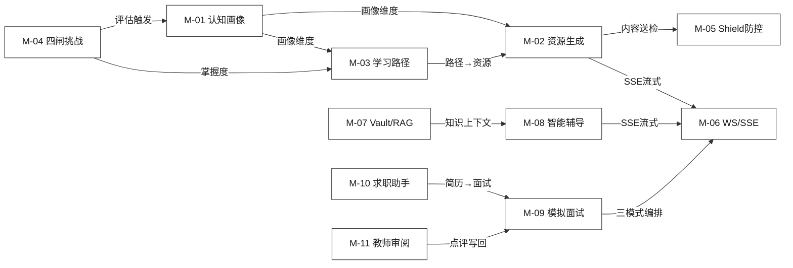
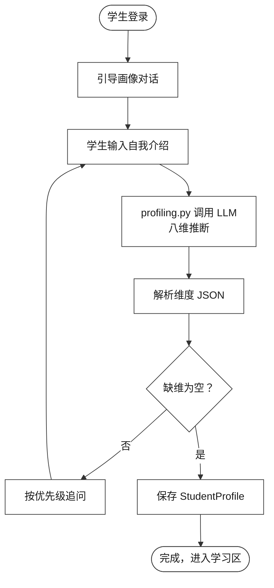
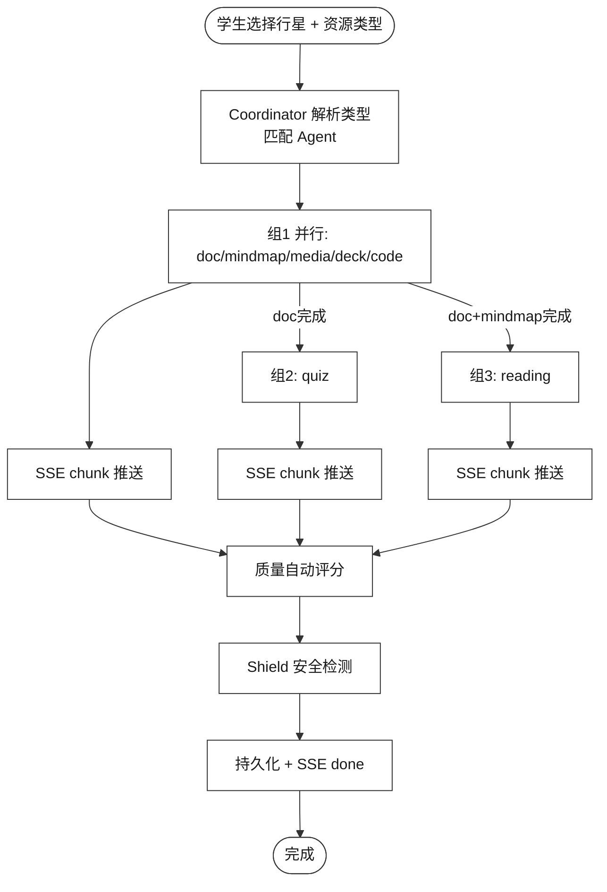
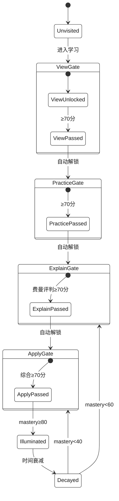
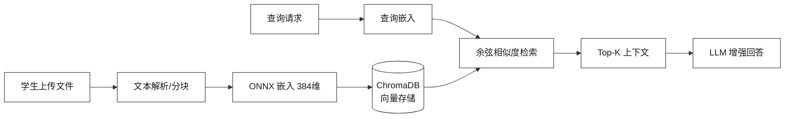
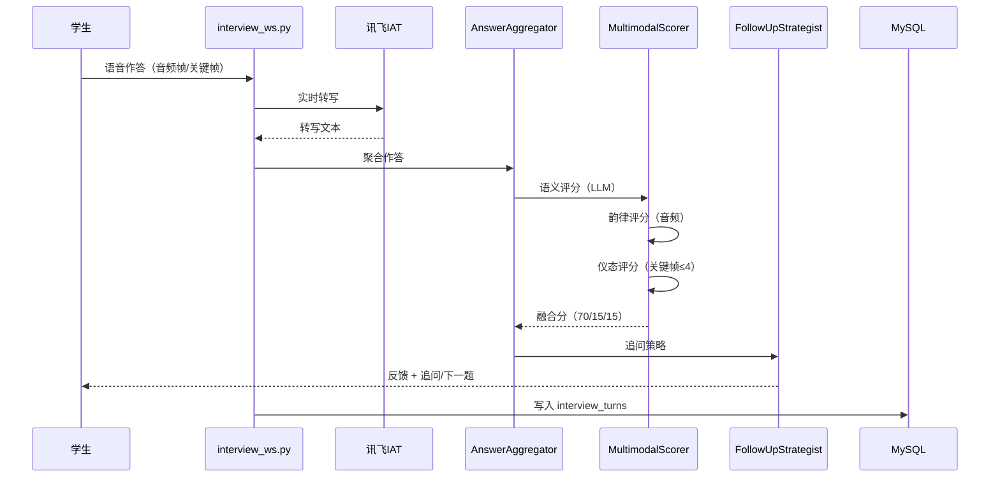
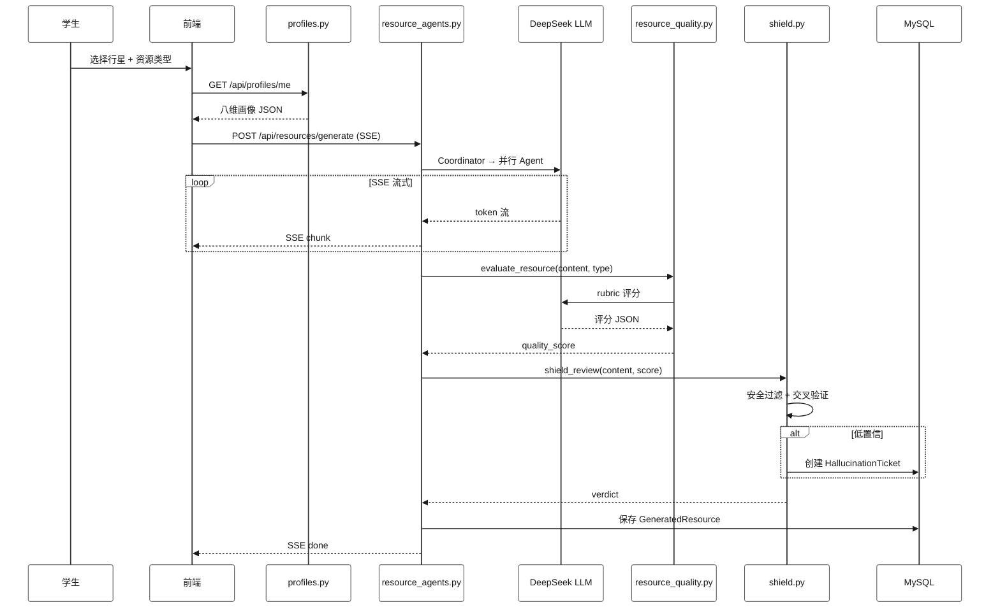
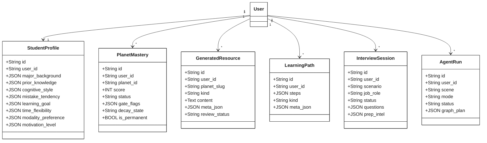

# SparkOrbit 星轨学图 — 详细设计说明书

| 项 | 内容 |
|----|------|
| 项目名称 | SparkOrbit 星轨学图 |
| 文档名称 | 详细设计说明书 |
| 文档编号 | SparkOrbit-C2 |
| 编制者 | SparkOrbit 团队 |
| 编制日期 | 2026-07-31 |
| 版本 | V3.0（工程级完整版） |
| 密级 | 内部 |

---

## 修改记录

| 版本 | 日期 | 修改人 | 说明 |
|------|------|--------|------|
| V1.0 | 2026-07-31 | SparkOrbit 团队 | 工程级完整版（3037 行、8 模块全量展开） |
| V2.0 | 2026-08-01 | SparkOrbit 团队 | 竞赛精简版：压缩至约 700 行，每模块 6 小节，保留关键算法与流程图 |
| V3.0 | 2026-08-14 | SparkOrbit 团队 | 工程级对齐：画像修正为八维；新增 M-09~M-12 四模块（模拟面试/求职/教师审阅/考级·SRS）；补评分融合/韵律评分/记忆衰减/复习固化/SRS 梯度伪代码；修正附录 B 类图为实际字段 |

---

## 1 引言

### 1.1 编写目的

本说明书在 C1 概要设计基础上，对 8 个核心模块进行程序级设计描述，供开发、测试与竞赛评审使用。每模块按 **描述 → 输入输出 → 算法要点 → 流程 → 关键接口 → 限制与测试** 六节展开。

### 1.2 范围

| 范畴 | 覆盖 | 不涵盖 |
|------|------|--------|
| 后端核心服务 | 画像、资源多智能体、路径、四闸、Shield、SSE/WS、Vault/RAG、辅导 | 账户/社交/桌宠/星座（见 D1） |
| 数据存储 | 各模块关联表与字段 | 完整 DDL（见 C3） |

### 1.3 术语

沿用 C1 附录 C。本文档新增/强调：**八维画像、缺维检测、Coordinator、四闸、SSE、LangGraph、Shield**。

### 1.4 参考资料

| 编号 | 资料 | 用途 |
|------|------|------|
| [R1] | SparkOrbit-C1 概要设计说明书 | 架构、子系统划分、接口基线 |
| [R2] | SparkOrbit-B1 软件需求说明书 | FR 条目与验收标准 |
| [R3] | SparkOrbit-C3 数据库设计说明书 | 表结构、索引 |
| [R4] | `backend/app/services/`、`models/`、`routes.py` | 源程序 |
| [R5] | 详细设计说明书编写规范.doc | 文档结构规范 |

---

## 2 程序系统结构

### 2.1 层次结构

前端 Vue 3（视图→组件→API 客户端）↔ HTTP/SSE/WebSocket ↔ 后端 FastAPI（路由→服务→数据访问）→ MySQL / ChromaDB / 文件系统 / 外部 AI。

> 完整层次结构图见 C1-F01，本文档不再重复。

### 2.2 核心模块清单

| 编号 | 模块 | 后端核心文件 | 前端核心组件 | 章节 |
|------|------|-------------|-------------|------|
| M-01 | 认知画像 | profiling.py / profiles.py / profile_refresh.py | ProfileChat.vue | §3.1 |
| M-02 | 多智能体资源生成 | resource_agents.py / resource_quality.py / seedance_service.py | ResourceStudio.vue | §3.2 |
| M-03 | 个性化学习路径 | learning_path.py | LearningPathPanel.vue | §3.3 |
| M-04 | 四闸挑战 | challenge.py / mastery_gates.py / gate_policy.py / memory_decay.py | PlanetPanel.vue | §3.4 |
| M-05 | Shield 幻觉防控 | shield.py / hallucination_guard.py / hallucination_tickets.py | HallucinationTicketPanel.vue | §3.5 |
| M-06 | WebSocket / SSE 通信 | api/ws.py + routes.py(SSE 端点) | sse.ts / ws 连接管理 | §3.6 |
| M-07 | Vault / RAG 知识库 | vault_service.py / rag.py | VaultEditor.vue | §3.7 |
| M-08 | 智能辅导 | ai_tutor.py / digital_tutor.py | TutorLab.vue | §3.8 |
| M-09 | 模拟面试 | interview_agents.py / interview_scoring.py / interview_service.py / interview_ws.py | MockInterviewZone.vue / InterviewStage.vue / InterviewReport.vue | §3.9 |
| M-10 | 求职助手 | interview_applications.py / interview_resume.py / resume_export.py | CareerHub.vue / ResumeStudio.vue / ApplicationTracker.vue | §3.10 |
| M-11 | 教师审阅 | teacher_suite.py / interview_service.py / improvement.py | InterviewReviewPanel.vue / ResourceReviewPanel.vue | §3.11 |
| M-12 | 考级与 SRS 复习 | exam_center.py / review_queue.py | ExamCenter.vue / ReviewQueuePanel.vue | §3.12 |

**模块间调用关系**：



---

## 3 各模块设计说明

### 3.1 认知画像模块

#### 3.1.1 描述

通过对话式交互采集八维特征（专业背景/前置知识/认知风格/易错倾向/学习目标/时间弹性/模态偏好/动机水平），由 `profiling.py`（LLM 推断）、`profiles.py`（CRUD）、`profile_refresh.py`（事件驱动刷新）三个子程序协同。

#### 3.1.2 输入输出

| 输入 | 来源 | 输出 | 去向 |
|------|------|------|------|
| 对话文本 | ProfileChat.vue SSE | 八维画像 JSON | StudentProfile.dimension |
| 历史画像 | StudentProfile 表 | 缺维列表 + 追问 | 前端展示 |
| 学习事件 | 后端各服务 | 雷达图数据 | MirrorDashboard |
| 教师复核 | 教师接口 | 增量更新画像 | StudentProfile |

#### 3.1.3 算法要点

- **LLM 推断**：temperature=0.3，JSON 模式强制输出，八维值域按 Schema 校验
- **缺维排序**：前置知识(权重10) > 学习目标(9) > 认知风格(7) > 易错倾向(6) > 时间弹性(5) > 专业背景(4)
- **事件刷新**：planet_passed→追加前置知识、evaluation_completed→更新易错倾向

#### 3.1.4 流程

画像采集核心闭环：对话输入 → LLM 推断 → JSON 解析 → 缺维检测 → 追问 → 学生回答 → 重新推断，直至八维完整。



#### 3.1.5 关键接口

| 方法 | 端点 | 功能 | 鉴权 |
|------|------|------|------|
| POST | `/api/profiles/extract` | 对话式画像提取 | student |
| GET | `/api/profiles/me` | 获取我的画像 | student |
| GET | `/api/profiles/radar` | 雷达图数据 | student |
| GET | `/api/teacher/profiles/{id}` | 教师查看学生画像 | teacher/admin |
| POST | `/api/teacher/profiles/{id}/review` | 教师复核覆盖 | teacher/admin |

#### 3.1.6 限制与测试

| 限制 | 缓解 | 关键测试用例 |
|------|------|-------------|
| 依赖 LLM 可用性 | 降级：预置默认画像 | 首次对话完整采集八维 |
| 冷启动缺维率 80%+ | 引导式开场白 | 缺维检测准确性 |
| 画像精度受对话质量限制 | 教师复核兜底 | 事件触发刷新正确性 |

---

### 3.2 多智能体资源生成模块

#### 3.2.1 描述

Coordinator 编排器 + 7 类专项 Agent：文档/导图/习题/阅读/视频(Seedance)/课件/代码。SSE 流式推送生成进度，完成后自动质量评分与溯源标注。

#### 3.2.2 输入输出

| 输入 | 来源 | 输出 | 去向 |
|------|------|------|------|
| 行星 ID + 资源类型列表 | ResourceStudio | SSE 事件流 | 前端 EventSource |
| 学生画像 JSON | profiles.py | 生成内容（Markdown/Mermaid/Latex/MP4 URL/PPTX） | GeneratedResource 表 + 文件系统 |
| 个性化偏好 | 请求参数 | 质量评分 JSON | quality_score 字段 |
| Seedance 参数 | 前端配置 | 溯源标签 | provenance 字段 |

SSE 事件类型：`meta` / `chunk` / `quality` / `provenance` / `error` / `done`。

#### 3.2.3 算法要点

- **Coordinator 调度**：资源类型 → Agent 匹配 → 分三组执行（组1: doc/mindmap/media/deck/code 并行；组2: quiz 等 doc 完成；组3: reading 等 doc+mindmap 完成）
- **质量评分 Rubric**：准确性(0.40)/完整性(0.25)/适应性(0.20)/可读性(0.15)，按资源类型微调权重
- **Seedance 异步**：提交任务→轮询状态→回调通知，超时 5 分钟降级为文本描述

#### 3.2.4 流程



#### 3.2.5 关键接口

| 方法 | 端点 | 功能 |
|------|------|------|
| POST | `/api/resources/generate` | SSE 流式资源生成 |

#### 3.2.6 限制与测试

| 限制 | 缓解 | 关键测试用例 |
|------|------|-------------|
| Seedance 2-5 分钟 | 超时降级文本 | >=5 类资源生成正确性 |
| 并发 Agent 数上限 | asyncio.gather 并行 | SSE 流式完整性 |
| LLM API 重试 | 3 次指数退避 | 幻觉率统计 |

---

### 3.3 个性化学习路径模块

#### 3.3.1 描述

基于画像维度与行星掌握度的路径规划算法，评估完成后触发路径重排。每步关联推荐资源，支持可解释性（显示推荐理由）。

#### 3.3.2 输入输出

| 输入 | 输出 |
|------|------|
| 八维画像 JSON | 路径步骤列表 JSON（含每步资源推荐、预计耗时） |
| 行星掌握度 | 重排后路径 |
| 学习目标、时间预算 | |

#### 3.3.3 算法要点

- **初排**：画像维度 × 掌握度 × 知识点难度 → 优先级排序
- **重排**：评估反馈 → 贝叶斯更新权重 → 弱项提前
- **推荐匹配**：认知风格决定资源类型偏好（视觉型→视频/导图，动手型→代码/习题）

#### 3.3.4 接口

| 方法 | 端点 | 功能 |
|------|------|------|
| GET | `/api/path/{galaxy_id}` | 获取学习路径 |
| POST | `/api/path/{galaxy_id}/refresh` | 触发路径重排 |

#### 3.3.5 限制与测试

| 限制 | 关键测试 |
|------|----------|
| 重排需用户主动触发评估 | 路径匹配度评估 |
| 冷启动依赖初始画像 | before/after 对比 |

---

### 3.4 四闸挑战模块

#### 3.4.1 描述

学闸(View)→练闸(Practice)→讲闸(Explain)→用闸(Apply) 四级掌握度门禁。每闸通过阈值 70%，全部通过后行星点亮(mastery≥80)。支持记忆衰减（spaced repetition）触发复习。

#### 3.4.2 输入输出

| 输入 | 输出 |
|------|------|
| 行星 ID、学生 ID、提交答案 | 通过/未通过判定、得分、掌握度增量 |
| | 下一闸门解锁状态 |

#### 3.4.3 算法要点

- **通过阈值**：学闸/练闸按 `gate_policies` 班级策略（默认 `practice_min_correct=4/5`）；讲闸 `explain_pass_threshold=0.7`；用闸 `apply_required_default=true`
- **掌握度增量**：`Δ = 0.2 × (score - 50)/50`，得分越高增量越大
- **记忆衰减**（`memory_decay.py`）：行星 `lit → fading → meteor → dim` 四级衰减，按 `DECAY_STAGES = [(3,"fading"),(7,"meteor"),(14,"dim")]` 天数阈值降级

**记忆衰减伪代码**（`compute_decay_state`）：

```
DECAY_STAGES = [(3,"fading"), (7,"meteor"), (14,"dim")]  # 天 → 下一状态

function compute_decay_state(mastery, decay_days):
    if mastery.is_permanent or mastery.status != "lit":
        return mastery.decay_state          # 已永久固化或非点亮态不变
    days = utcnow - (mastery.last_reviewed_at or mastery.lit_at)
    for (threshold, stage) in DECAY_STAGES:
        if days >= threshold: return stage
    return "lit"
```

**复习固化伪代码**（`review_planet`）：

```
function review_planet(user, planet_id, correct):
    if correct:                              # 超新星固化
        mastery.is_permanent = true; mastery.status = "lit"
        mastery.score += 10; user.points += 15; user.mood = "celebrate"
    else:                                    # 复习失败
        mastery.decay_state = "meteor"; user.mood = "confused"
```

#### 3.4.4 流程



#### 3.4.5 关键接口

| 方法 | 端点 | 功能 |
|------|------|------|
| POST | `/api/challenge/submit` | 提交挑战答案与评分 |
| GET | `/api/mastery/{planet_id}` | 获取行星掌握度 |

#### 3.4.6 限制与测试

| 限制 | 关键测试 |
|------|----------|
| 讲闸依赖数字人/TTS | 四闸状态流转正确性 |
| 用闸依赖代码舱 | 掌握度衰减曲线验证 |

---

### 3.5 Shield 幻觉防控模块

#### 3.5.1 描述

三级防线：① 前端 System Prompt 约束 → ② 后端多模型交叉验证（生成内容送第二模型校验）→ ③ 低置信工单推送教师复核。Shield 处理流水线：内容输入 → 安全过滤 → 置信度检查 → 低于阈值生成工单 → 教师复核 → 结果回灌。

#### 3.5.2 输入输出

| 输入 | 输出 |
|------|------|
| LLM 生成内容 + 置信度分数 | pass/flag/block 判定 |
| 上下文知识点 | 低置信工单 JSON（含内容快照、交叉验证结果） |

#### 3.5.3 算法要点

- **交叉验证**：同一知识点送第二模型（豆包/通义），输出一致性≥0.8 为 pass
- **置信度阈值**：单模型 confidence<0.6 → flag；交叉验证不一致 → block
- **工单优先级**：按涉及知识点重要性 + 学生规模排序

#### 3.5.4 限制与测试

| 限制 | 缓解 | 关键测试 |
|------|------|----------|
| 交叉验证增加 API 成本 | 仅低置信触发二验 | 幻觉注入测试 |
| 教师处理及时性 | 工单按优先级排序 | 低置信阈值敏感性 |

---

### 3.6 WebSocket / SSE 通信模块

#### 3.6.1 描述

WebSocket 用于实时聊天/通知推送；SSE 用于资源生成/AI 辅导等流式内容推送。断线重连策略：WS 指数退避 1s/2s/4s/8s；SSE 自动重连（EventSource 原生支持）。

#### 3.6.2 接口

| 协议 | 端点 | 功能 |
|------|------|------|
| WebSocket | `ws://host/ws` | 实时聊天、通知推送 |
| SSE | `/api/resources/generate` 等 | 资源生成/AI 辅导流式推送 |

#### 3.6.3 限制与测试

| 限制 | 关键测试 |
|------|----------|
| 并发 WS 连接上限（单机 ~1000） | 并发连接数测试 |
| SSE 丢帧（网络波动） | 断线重连恢复测试 |

---

### 3.7 Vault / RAG 知识库模块

#### 3.7.1 描述

Vault：Obsidian 兼容 Markdown 知识库，正文落盘、库内仅存元数据与双链索引。RAG：ChromaDB 向量检索（ONNX all-MiniLM-L6-v2, 384 维），用于资源生成上下文增强与辅导问答。

#### 3.7.2 输入输出

| 输入 | 输出 |
|------|------|
| 学生上传文档/教材 PDF | Vault 文件索引 + Chroma 向量嵌入 |
| 查询文本 | Top-K 语义匹配文本片段 |

#### 3.7.3 流程



#### 3.7.4 限制与测试

| 限制 | 关键测试 |
|------|----------|
| 嵌入模型精度有限 | RAG 检索准确率 |
| 大文件分块策略影响召回 | 碎片化文档检索测试 |

---

### 3.8 智能辅导模块

#### 3.8.1 描述

双模式辅导：**苏格拉底引导式**（反问而非直接给答案）与**费曼讲解式**（教别人检验掌握度）。支持多模态：文本 + 讯飞 TTS 语音 + 讯飞数字人虚拟形象。

#### 3.8.2 输入输出

| 输入 | 输出 |
|------|------|
| 学生问题文本 | SSE 流式辅导回答 |
| 行星/知识点上下文 | 数字人分镜视频 |
| 辅导模式选择 | |

#### 3.8.3 算法要点

- **苏格拉底模式**：System Prompt 约束——禁止直接给答案，用反问引导学生推理（如"你试过用两个指针同时遍历吗？"）
- **费曼模式**：让学生用自己的话解释概念 → LLM 评判理解程度 → 指出疏漏 → 学生修正

#### 3.8.4 关键接口

| 方法 | 端点 | 功能 |
|------|------|------|
| POST | `/api/tutor/chat` | SSE 流式辅导对话 |
| POST | `/api/tutor/digital` | 数字人视频生成请求 |

#### 3.8.5 限制与测试

| 限制 | 缓解 | 关键测试 |
|------|------|----------|
| 数字人生成延迟 30-60s | 异步任务 + 文本先行展示 | >=5 个答疑案例验证 |
| 苏格拉底模式可能令学生困惑 | 提供"直接讲解"切换按钮 | 引导式问题准确性 |

---

### 3.9 模拟面试模块

#### 3.9.1 描述

覆盖求职（job）/ 升学（academic）双场景模拟面试全流程，采用**三模式多智能体编排**（对齐 `AGENTS.md` 编排模式）：

- **准备阶段（workflow）**：`JobAnalyst ∥ ProfileParser` → `QuestionPlanner` → `Q-*` 四类出题官，组内 `asyncio.gather` 真并行出题，产出岗位情报/考察主题/候选人画像（写入 `interview_sessions.prep_intel`）。
- **单轮评分（handoff）**：`AnswerAggregator → MultimodalScorer → FollowUpStrategist`，LangGraph `StateGraph + astream` 真流式，异常回退 `_score_legacy`。
- **总评（council）**：求职三官（技术官/HR官/业务官）或升学三官（学科导师/综合素质官/科研潜力官）`asyncio.gather` 并行 → `CouncilSummarizer` 汇总。

三类编排均写入 `agent_runs` / `agent_steps`，管理端 `/admin/agents` 可回放。

#### 3.9.2 输入输出

| 输入 | 来源 | 输出 | 去向 |
|------|------|------|------|
| 场景/岗位/难度/轮数 | InterviewSetup.vue | 面试会话 + 准备情报 | `interview_sessions.prep_intel` |
| 简历文件 | 简历上传解析 | 候选人画像 | 准备阶段 |
| 作答语音/文本 | WebSocket / 表单 | 转写文本 | `interview_turns.transcript` |
| 摄像头关键帧 | 浏览器采集 | 仪态评分 | `interview_turns.visual_score` |

#### 3.9.3 算法要点

- **评分融合**：语义 70% + 韵律 15% + 仪态 15%，缺失模态自动降级并标记 `degraded_modalities`。
- **语义评分**：LLM 依据 STAR/岗位要点给分；**韵律评分**：音频静音段占比、语速；**仪态评分**：视觉模型仅取每轮前 4 帧关键帧（有 `FRAME_BUDGET_PER_TURN` 帧预算）。
- **追问策略**：`probe`（追问）/ `challenge`（挑战）/ `next`（下一题）三种。
- **弱项闭环**：报告弱项（<70 分维度）一键回流到资源生成/练习舱（`interview_closed_loop.py`）。

**评分融合伪代码**（`interview_scoring.fuse_scores`）：

```
SEMANTIC_WEIGHT = 0.70, PROSODY_WEIGHT = 0.15, VISUAL_WEIGHT = 0.15

function fuse_scores(semantic, prosody, visual):
    total_w = 0; weighted = 0; degraded = []
    for (score, weight) in [(semantic,0.70),(prosody,0.15),(visual,0.15)]:
        if score is None: degraded.append(label)      # 缺失模态
        else: weighted += score * weight; total_w += weight
    if total_w == 0: return (0, degraded)              # 全缺 → 0 分
    return (weighted / total_w, degraded)              # 缺模态归一化，不补 0 分
```

**韵律评分伪代码**（`analyze_prosody`）：

```
char_count = 去空白字符数
speech_rate = char_count / duration_sec        # 字/秒
pause_ratio = silence_sec / duration_sec       # 静音占比
filler_count = 正则计数(嗯/啊/呃/那个/然后/um/uh/like...)

rate_score = 分段评分(speech_rate, 3.0~6.0 为优=90)
pause_score = 分段评分(pause_ratio, <0.28 为优=88)
filler_score = 分段评分(filler_count, <4 为优=90)
prosody = rate*0.45 + pause*0.25 + filler*0.30
```

#### 3.9.4 流程（单轮评分时序）



#### 3.9.5 关键接口

| 方法 | 端点 | 功能 |
|------|------|------|
| GET | `/api/interview/job-roles` | 岗位角色库 |
| POST | `/api/interview/sessions` | 创建面试会话 |
| GET | `/api/interview/sessions/{id}/prep/stream` | 准备阶段编排（SSE） |
| GET | `/api/interview/reports/{id}` | 面试报告 |
| GET | `/api/interview/portrait` | 能力画像 |
| POST | `/api/interview/practice/answer` | 练习舱提交 |
| WS | `/api/ws/interview/{session_id}` | 实时语音/评分 |

#### 3.9.6 限制与测试

| 限制 | 缓解 | 关键测试 |
|------|------|----------|
| 多模态依赖外部服务 | 模态缺失降级 + 标记 | 降级标记正确性 |
| 视觉评分依赖关键帧 | 帧预算 + 授权采集 | 仪态评分一致性 |
| 语音转写延迟 | 讯飞流式 IAT | 转写准确性 |

---

### 3.10 求职模块

#### 3.10.1 描述

面向高校求职场景的职业规划工具集：校招门户（`data/career_portals.py`）、简历工坊（4 套模板 + 解析/优化/匹配/导出）、投递看板（六列状态机）、企业面经题库（`data/career_questions.py`）。

#### 3.10.2 输入输出

| 输入 | 来源 | 输出 | 去向 |
|------|------|------|------|
| 简历文件（PDF/DOCX/图片） | ResumeStudio.vue 上传 | 解析后的简历字段 | `interview_resume.py` |
| 目标岗位/JD | 表单输入 | 匹配分/覆盖/缺口 | 前端展示 |
| 投递状态操作 | ApplicationTracker.vue | 投递记录状态 | `interview_applications` 表 |

#### 3.10.3 算法要点

- **简历解析**：LLM 提取教育经历/项目/技能/荣誉等结构化字段。
- **简历优化**：评分 + 问题列表 + 重写 Markdown（可回填）。
- **岗位匹配**：简历与 JD 匹配分/覆盖/缺口，一键开面试舱。
- **投递状态机**：`wishlist → applied → oa → interview → offer → rejected`。

#### 3.10.4 关键接口

| 方法 | 端点 | 功能 |
|------|------|------|
| POST | `/api/interview/resume` | 上传解析简历 |
| POST | `/api/interview/resume/optimize` | 简历优化 |
| POST | `/api/interview/resume/match` | 岗位匹配 |
| POST | `/api/interview/resume/export` | 简历导出 |
| GET/POST | `/api/interview/applications` | 投递看板 |
| GET | `/api/interview/career/portals` | 校招门户 |

---

### 3.11 教师审阅模块

#### 3.11.1 描述

教师对 AI 产出物的三级人工审阅：面试报告点评（写回 `teacher_comment`/`teacher_score`/`review_status`）、生成资源审阅/推荐（`generated_resources` 审核列）、改进计划覆盖（`improvement.py`）。

#### 3.11.2 关键接口

| 方法 | 端点 | 功能 |
|------|------|------|
| GET | `/api/teacher/interview/overview` | 面试督导总览 |
| GET | `/api/teacher/interview/sessions/{id}` | 会话详情 |
| POST | `/api/teacher/interview/reports/{id}/review` | 报告点评写回 |
| GET | `/api/teacher/generated-resources` | 生成资源列表 |
| POST | `/api/teacher/generated-resources/{id}/review` | 资源审阅 |
| POST | `/api/teacher/generated-resources/{id}/recommend` | 资源推荐 |
| POST | `/api/teacher/improvement/{id}/override` | 改进计划覆盖 |

---

### 3.12 考级与 SRS 复习模块

#### 3.12.1 描述

考级中心（题库/试卷/模考/练习/词书/精听/作文批改/打卡，`exam_center.py`）与 SRS 间隔重复复习（复习队列/闪卡/学习日历/周报，`review_queue.py`）。

**SRS 间隔重复伪代码**（`review_queue.py`，固定梯度，无 ease 因子）：

```
INTERVAL_DAYS = [1, 3, 7, 14]               # 固定梯度
RESULTS = ("remember", "fuzzy", "forgot")
POINTS = {remember: 5, fuzzy: 2, forgot: 0}

function _advance(interval_index, result):
    if result == "remember": return min(interval_index + 1, 3)  # 封顶 3
    if result == "fuzzy":    return interval_index               # 保持不变
    if result == "forgot":   return 0                            # 归零重来

function _next_review_at(interval_index):
    return now + INTERVAL_DAYS[clamp(interval_index, 0, 3)] days
```

#### 3.12.2 关键接口

| 方法 | 端点 | 功能 |
|------|------|------|
| GET | `/api/exam/meta` | 考级元信息 |
| POST | `/api/exam/generate` | AI 出题 |
| POST | `/api/exam/practice/check` | 练习判题 |
| POST | `/api/exam/mock/submit` | 模考提交 |
| POST | `/api/exam/essay/grade` | 作文批改 |
| GET | `/api/review/queue` | 复习队列 |
| POST | `/api/review/submit` | 复习提交 |
| GET | `/api/review/cards` | 闪卡 |

---

## 附录 A：核心模块调用时序（资源生成全链路）



## 附录 B：核心服务类关系



---

> **版本**：V3.0（工程级完整版）  
> **编制日期**：2026-08-14  
> **编制团队**：SparkOrbit 团队  
> **文档编号**：SparkOrbit-C2  
> **说明**：本版覆盖 12 个核心模块（M-01~M-12），每模块含描述/输入输出/算法要点（含伪代码）/流程/接口/存储/限制与测试；核心算法（评分融合、韵律评分、记忆衰减、复习固化、SRS 梯度）附伪代码；与 C3 字段字典对齐。
