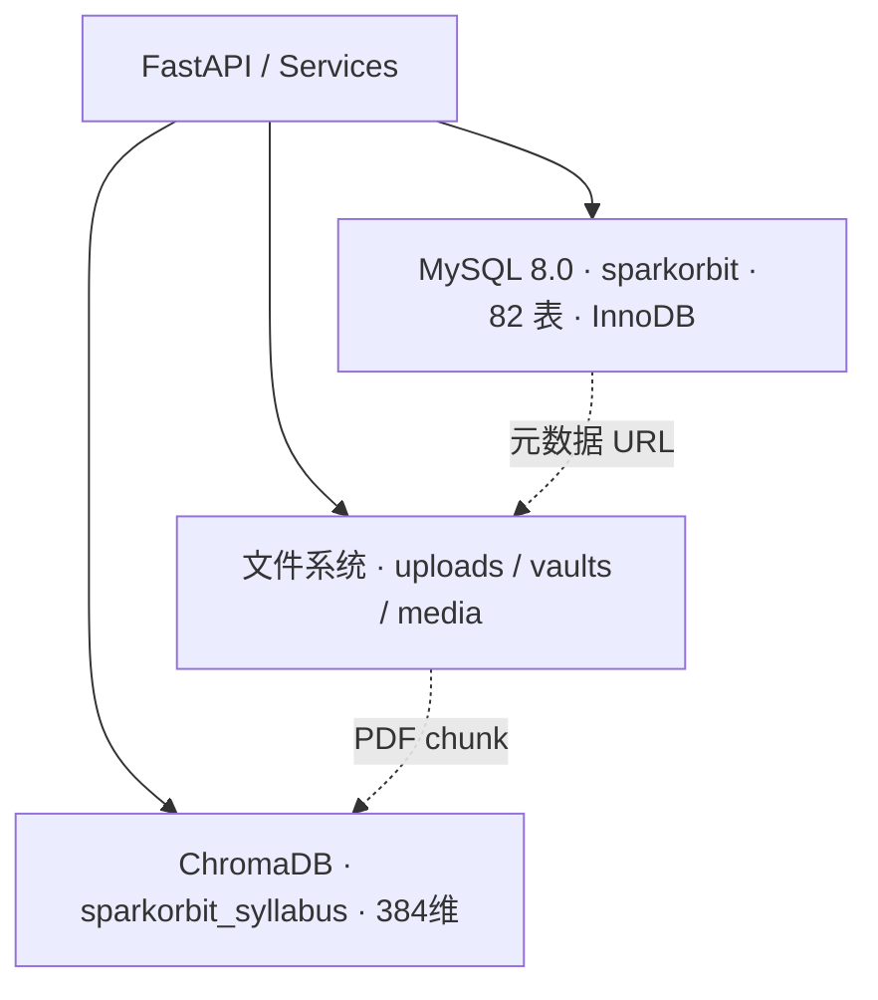
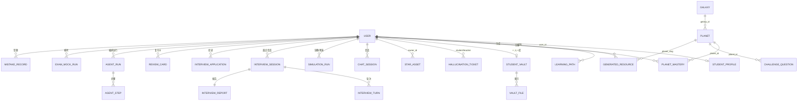

# SparkOrbit 星轨学图 — 数据库设计说明书

| 项 | 内容 |
|----|------|
| 项目名称 | SparkOrbit 星轨学图 |
| 文档名称 | 数据库设计说明书 |
| 文档编号 | SparkOrbit-C3 |
| 编制者 | SparkOrbit 团队 |
| 编制日期 | 2026-08-14 |
| 版本 | V3.0（工程级完整版） |
| 密级 | 内部 |

---

## 修改记录

| 版本 | 日期 | 修改人 | 说明 |
|------|------|--------|------|
| V1.0 | 2026-07-31 | SparkOrbit 团队 | 工程级完整版（1046 行，56 表全量展开） |
| V2.0 | 2026-08-01 | SparkOrbit 团队 | 竞赛精简版：压缩至约 450 行，核心表族 + E-R + 索引策略 |
| V3.0 | 2026-08-14 | SparkOrbit 团队 | 工程级对齐：表数修正为 82 张，全部表族补字段级数据字典；补面试/求职族、考级复习族、教师套件运营族、Agent 观测族完整 DDL；对齐 ORM 模型实际字段 |

---

## 1 引言

### 1.1 编写目的

在 B2 数据要求说明书与 C1/C2 设计基础上，给出 SparkOrbit 的**三层存储边界**、**82 张表全字段字典**、关键表族 DDL 与索引策略。供实现、测试与竞赛评审对照。完整字段以 `backend/app/models/` 为权威源。

### 1.2 背景

| 项 | 说明 |
|----|------|
| 主库 | MySQL 8.0，库名 `sparkorbit`，字符集 `utf8mb4` / `utf8mb4_unicode_ci` |
| ORM | SQLAlchemy 2.0，`backend/app/models/`（34 个模型文件，约 70 个模型，82 张物理表） |
| 辅存 | 文件系统 `uploads/` / `vaults/` / `media/`；向量 `chroma_data/` |
| 部署 | Docker Compose volumes：mysql_data / backend_uploads / backend_chroma / backend_media_generated |
| 公网 | https://wikj.online |

### 1.3 术语与约定

| 术语 | 含义 |
|------|------|
| PK | 主键，核心业务表统一 `String(36)` UUID（应用层 `uuid4()` 生成） |
| LFK | 逻辑外键——以 `xxx_id` + INDEX 表达关联，**不建物理外键约束**（全库无 `ForeignKey`） |
| JSON 列 | MySQL JSON，存画像维度、路径步骤、闸门状态等可扩展结构 |
| BLOB 禁令 | 大文件只存 URL/路径；二进制落盘或外链 |
| ChromaDB | 向量库：`sparkorbit_syllabus`，余弦相似度，384 维 all-MiniLM-L6-v2 |
| Vault | Obsidian 兼容 Markdown 知识库，正文在磁盘，库内元数据 + 双链索引 |

### 1.4 参考资料

| 编号 | 资料 | 用途 |
|------|------|------|
| [R1] | SparkOrbit-B2 数据要求说明书 | 数据域、采集分级基线 |
| [R2] | SparkOrbit-C1 / C2 | 架构与模块对存储的依赖 |
| [R3] | `backend/app/models/*.py` | 表结构权威源 |
| [R4] | `docs/storage-and-backup.md` | 备份/恢复约定 |

---

## 2 存储架构

### 2.1 三层存储总览



### 2.2 分层职责

| 层 | 职责 | 禁令 |
|----|------|------|
| MySQL | 结构化业务数据（用户、画像、课程、资源、挑战、面试、求职、工单） | 不存 PDF/视频 BLOB |
| 文件系统 | 上传 PDF/星库文件/Vault 正文/生成媒体/面试音频关键帧 | — |
| ChromaDB | RAG 语义检索上下文 | 不存原始文档 |

---

## 3 概念结构

### 3.1 全局 E-R 图



---

## 4 表族设计（82 张表全字段字典）

> 字段字典格式：`字段名(类型, 约束)`。约束缩写：PK=主键 / UQ=唯一 / IDX=索引 / NN=非空 / D=默认值 / LFK=逻辑外键（软外键，仅索引）。类型：S36=String(36)、S64=String(64)、S128=String(128)、TXT=Text、JSON=JSON 列、INT=Integer、FLT=Float、BOOL=Boolean、DT=DateTime(timezone)、ENUM 值以 `=` 标注。

### 4.1 用户与画像族（4 表）

| 表 | 字段字典 |
|----|----------|
| `users` | id(S36,PK,D=uuid4) · username(S64,UQ,IDX,NN) · password_hash(S256,NN) · role(S32,NN,D=student,枚举 student/teacher/admin) · display_name(S128,NN) · avatar(S512) · avatar_cartoon_url(S1024) · avatar_model_url(S1024,废弃保留) · class_id(S36,LFK→school_classes,IDX) · teacher_id(S36,LFK→users,IDX) · pet_slug(S64) · pet_affinity(INT,D=0) · equipped_title(S128) · study_theme(S64) · points(INT,D=0) · mood(S32,D=calm) · streak_days(INT,D=0) · is_active(BOOL,D=true) · created_at(DT) · updated_at(DT) |
| `student_profiles` | id(S36,PK) · user_id(S36,LFK,IDX,NN) · student_name(S128) · summary(TXT) · major_background(JSON) · prior_knowledge(JSON) · cognitive_style(JSON) · mistake_tendency(JSON) · learning_goal(JSON) · time_flexibility(JSON) · modality_preference(JSON) · motivation_level(JSON) · raw_evidence(JSON) · missing_dimensions(JSON,D=[]) · follow_up_questions(JSON,D=[]) · dimension_floors_json(JSON) · warnings_json(JSON,D=[]) · update_source(S32,D=profiler) · created_at(DT) · updated_at(DT) |
| `school_classes` | id(S36,PK) · name(S128,NN) · teacher_id(S36,LFK,IDX) · invite_code(S32,UQ,IDX) · created_at(DT) |
| `profile_extractions` | id(S36,PK) · student_name(S128) · summary(TXT) · source(S64,D=profiler) · created_at(DT) |

> 画像八维对应 `PROFILE_DIMENSIONS` 常量（`backend/app/models/student_profile.py`），每维独立 JSON 列，含 `confidence` 置信度。

### 4.2 课程与知识宇宙族（5 表）

| 表 | 字段字典 |
|----|----------|
| `galaxies` | id(S36,PK) · slug(S64,UQ,IDX,NN) · name(S128,NN) · description(TXT) · color(S16,D=#2779a7) · orbit_radius(FLT,D=12.0) · sort_order(INT) · is_active(BOOL,D=true) · created_at(DT) · updated_at(DT) |
| `planets` | id(S36,PK) · galaxy_id(S36,LFK,IDX,NN) · slug(S64,UQ,IDX,NN) · name(S128) · description(TXT) · difficulty(S16,D=medium,枚举 easy/medium/hard) · orbit_index(INT,D=1) · angle_deg(FLT) · radius_offset(FLT) · prerequisites(JSON,D=[]) · question_tags(JSON,D=[]) · sort_order(INT) · created_at(DT) |
| `planet_mastery` | id(S36,PK) · user_id(S36,LFK,IDX,NN) · planet_id(S36,LFK,IDX,NN) · status(S16,D=dim,枚举 dim/lit/fading/meteor) · mastery_phase(S24,D=dim,枚举 dim/exploring/practicing/explaining/applying/lit) · gate_flags(JSON,D={}) · learn_evidence(JSON,D=[]) · score(INT,D=0) · attempts(INT,D=0) · correct_count(INT,D=0) · last_wrong_tags(JSON,D=[]) · fragments(JSON,D=[]) · lit_at(DT,NULL) · last_reviewed_at(DT,NULL) · decay_state(S16,D=lit,枚举 lit/fading/meteor/dim) · is_permanent(BOOL,D=false) · updated_at(DT) |
| `challenge_questions` | id(S36,PK) · user_id(S36,LFK,IDX,NN) · planet_id(S36,LFK,IDX,NN) · question(TXT) · options(JSON,D=[]) · answer_key(S8) · explanation(TXT) · difficulty(S16,D=medium) · tags(JSON,D=[]) · meta_json(JSON,D={}) · answered(BOOL,D=false) · correct(BOOL,D=false) · selected_key(S8) · created_at(DT) |
| `gate_policies` | id(S36,PK) · class_id(S36,LFK,IDX) · galaxy_slug(S64,IDX) · practice_questions(INT,D=5) · practice_min_correct(INT,D=4) · explain_pass_threshold(FLT,D=0.7) · apply_required_default(BOOL,D=true) · learn_evidence_min(INT,D=1) · decay_days(JSON,D={fading:7,meteor:14,dim:30}) · created_at(DT) · updated_at(DT) |

### 4.3 资源与路径族（4 表）

| 表 | 字段字典 |
|----|----------|
| `generated_resources` | id(S36,PK) · user_id(S36,LFK,IDX,NN) · planet_slug(S128,IDX) · planet_name(S256) · kind(S32,IDX,枚举 doc/mindmap/quiz/reading/media/deck/code) · title(S256) · content(TXT) · meta_json(JSON,D={}) · review_status(S16,D=,枚举 空/approved/rejected/recommended) · review_comment(TXT) · reviewed_by(S36) · reviewed_at(DT,NULL) · created_at(DT) |
| `profile_learning_events` | id(S36,PK) · user_id(S36,LFK,IDX,NN) · event_type(S64,NN) · summary(TXT) · payload_json(JSON,D={}) · processed(BOOL,D=false) · created_at(DT) |
| `learning_paths` | id(S36,PK) · user_id(S36,LFK,IDX,NN) · title(S128) · steps(JSON,D=[]) · status(S32,D=active) · kind(S16,D=standard,枚举 standard/sprint) · meta_json(JSON,D={}) · created_at(DT) |
| `star_assets` | id(S36,PK) · title(S256) · asset_type(S32,D=pdf,枚举 book/pdf/problem_doc/video_local/video_bilibili/note_pack) · galaxy_slug(S128,IDX) · planet_slug(S128) · file_url(S1024,禁 BLOB) · bilibili_bvid(S64) · description(TXT) · page_count(INT,D=0) · chunk_count(INT,D=0) · status(S24,D=ready,枚举 parsing/ready/failed) · owner_id(S36,LFK,IDX) · class_id(S36,LFK,IDX) · meta_json(JSON) · created_at(DT) |

### 4.4 Vault 与笔记族（5 表）

| 表 | 字段字典 |
|----|----------|
| `student_vaults` | id(S36,PK) · user_id(S36,LFK,UQ,IDX,NN) · vault_name(S128) · revision(INT,D=0) · last_synced_at(DT,NULL) · last_analyzed_at(DT,NULL) · meta_json(JSON) · created_at(DT) · updated_at(DT) |
| `vault_files` | id(S36,PK) · user_id(S36,LFK,IDX,NN,参与复合唯一) · path(S512,NN,参与复合唯一 `uq_vault_file_user_path`) · title(S256) · content_hash(S64) · word_count(INT,D=0) · tags_json(JSON,D=[]) · frontmatter_json(JSON) · created_at(DT) · updated_at(DT) |
| `vault_links` | id(S36,PK) · user_id(S36,LFK,IDX,NN) · from_path(S512,IDX) · to_path(S512,IDX) · to_exists(INT,D=0) · link_type(S24,D=wiki,枚举 wiki/embed/tag) |
| `notes` | id(S36,PK,无默认需应用层传) · user_id(S36,LFK,IDX,NN) · planet_slug(S128) · galaxy_slug(S128,IDX) · title(S256) · content(TXT) · attachment_url(S1024) · blocks_json(JSON,D=[]) · source(S64,D=manual) · session_id(S64) · created_at(DT) · updated_at(DT) |
| `lesson_resources` | id(S36,PK,无默认) · teacher_id(S36,LFK,IDX,NN) · class_id(S36,LFK,IDX) · galaxy_slug(S128) · title(S256) · file_url(S1024) · resource_kind(S32,D=other,枚举 book/deck/quiz/plan/other) · promoted_asset_id(S36,LFK→star_assets) · created_at(DT) |

### 4.5 会话与社交族（10 表）

| 表 | 字段字典 |
|----|----------|
| `chat_sessions` | id(S36,PK) · user_id(S36,LFK,IDX,NN) · title(S128) · status(S32,D=active) · created_at(DT) |
| `chat_messages` | id(S36,PK) · session_id(S36,LFK,IDX,NN) · user_id(S36,LFK,IDX,NN) · role(S16,D=user) · content(TXT) · created_at(DT) |
| `chat_rooms` | id(S36,PK) · room_type(S16,D=class,枚举 class/private) · title(S255) · class_id(S36,LFK,IDX) · created_by(S36) · created_at(DT) |
| `chat_room_members` | id(S36,PK) · room_id(S36,LFK,IDX,NN) · user_id(S36,LFK,IDX,NN) · joined_at(DT) |
| `chat_room_messages` | id(S36,PK) · room_id(S36,LFK,IDX,NN) · sender_id(S36,LFK,IDX,NN) · content(TXT) · created_at(DT) |
| `chat_message_reactions` | id(S36,PK) · message_id(S36,LFK,IDX,NN) · user_id(S36,LFK,IDX,NN) · emoji(S16,D=👍) · created_at(DT) |
| `friendships` | id(S36,PK) · user_id(S36,LFK,IDX,NN) · friend_id(S36,LFK,IDX,NN) · status(S16,D=accepted) · created_at(DT) |
| `wormhole_messages` | id(S36,PK) · sender_id(S36,LFK,IDX,NN) · receiver_id(S36,LFK,IDX,NN) · content(TXT) · created_at(DT) |
| `study_rooms` | id(S36,PK) · constellation(S32,IDX,NN) · name(S128,NN) · size(S16,NN,枚举 large/small) · capacity(INT,D=6) · created_at(DT) |
| `user_notifications` | id(S36,PK,无默认) · user_id(S36,LFK,IDX,NN) · kind(S32,D=system) · title(S128) · body(TXT) · link(S256) · is_read(BOOL,D=false) · created_at(DT) |

### 4.6 作业与考勤族（4 表）

| 表 | 字段字典 |
|----|----------|
| `assignments` | id(S36,PK) · teacher_id(S36,LFK,IDX,NN) · class_id(S36,LFK,IDX) · title(S256) · description(TXT) · galaxy_slug(S128) · questions_json(JSON,D=[]) · source_resource_id(S36) · due_at(DT,NULL) · created_at(DT) |
| `assignment_submissions` | id(S36,PK) · assignment_id(S36,LFK,IDX,NN) · student_id(S36,LFK,IDX,NN) · content(TXT) · attachment_url(S1024) · score(INT,NULL) · feedback(TXT) · status(S32,D=pending) · submitted_at(DT,NULL) · graded_at(DT,NULL) |
| `attendance_records` | id(S36,PK) · class_id(S36,LFK,IDX,NN) · student_id(S36,LFK,IDX,NN) · teacher_id(S36,LFK,IDX,NN) · record_date(S10,IDX,NN) · status(S16,D=present) · created_at(DT) |
| `teacher_broadcasts` | id(S36,PK) · teacher_id(S36,LFK,IDX,NN) · class_id(S36,LFK,IDX) · title(S256) · body(TXT) · recipient_count(INT,D=0) · created_at(DT) |

### 4.7 面试与求职族（5 表，8/13-8/14 新增）

| 表 | 字段字典 |
|----|----------|
| `interview_sessions` | id(S36,PK) · user_id(S36,LFK,IDX,NN) · class_id(S36,LFK,IDX) · scenario(S24,D=job,枚举 job/academic) · job_role(S64) · difficulty(S16,D=medium) · question_count(INT,D=4) · status(S24,D=preparing,IDX,枚举 preparing/ready/running/scoring/completed/failed) · overall_score(FLT,NULL) · dimension_scores(JSON,D={}) · resume_url(S1024) · resume_profile(JSON,D={}) · questions(JSON,D=[]) · prep_intel(JSON,D={}) · assignment_id(S36,LFK,IDX) · prep_run_id(S64) · current_turn(INT,D=0) · consent_at(DT,NULL) · created_at(DT) · finished_at(DT,NULL) |
| `interview_turns` | id(S36,PK) · session_id(S36,LFK,IDX,NN) · turn_index(INT,D=0) · question(TXT) · question_kind(S32) · transcript(TXT) · audio_url(S1024) · frame_urls(JSON,D=[]) · semantic_score(FLT,NULL) · prosody_score(FLT,NULL) · visual_score(FLT,NULL) · fused_score(FLT,NULL) · prosody_detail(JSON,D={}) · feedback(TXT) · followup_of(S36) · followup_strategy(S32,D=next) · duration_sec(FLT,D=0.0) · created_at(DT) · finished_at(DT,NULL) |
| `interview_practice_records` | id(S36,PK) · user_id(S36,LFK,IDX,NN) · scenario(S24,D=job) · job_role(S64) · kind(S32) · question(TXT) · transcript(TXT) · score(FLT,NULL) · feedback(TXT) · star_hit(JSON,D={}) · created_at(DT) |
| `interview_applications` | id(S36,PK) · user_id(S36,LFK,IDX,NN) · company(S128) · role(S128) · portal_url(S1024) · status(S24,D=wishlist,IDX,枚举 wishlist/applied/oa/interview/offer/rejected) · notes(TXT) · applied_at(DT,NULL) · created_at(DT) · updated_at(DT) |
| `interview_reports` | id(S36,PK) · session_id(S36,LFK,IDX,UQ,NN) · dimension_scores(JSON,D={}) · key_issues(JSON,D=[]) · suggestions(JSON,D=[]) · resource_refs(JSON,D=[]) · council_views(JSON,D={}) · teacher_comment(TXT) · teacher_score(FLT,NULL) · review_status(S24,D=pending) · degraded_modalities(JSON,D=[]) · summary(TXT) · created_at(DT) |

### 4.8 考级与复习族（7 表，8/13 新增）

| 表 | 字段字典 |
|----|----------|
| `exam_questions` | id(S36,PK) · exam_type(S24,IDX,NN,枚举 cet4/cet6/ielts/cantonese) · section(S24,IDX,NN,枚举 listening/reading/cloze/translation/writing/vocab) · question(TXT) · options(JSON,D={}) · answer(TXT) · analysis(TXT) · audio_text(TXT) · difficulty(S16,D=medium) · source(S16,D=ai,枚举 ai/import) · created_by(S36) · created_at(DT) |
| `exam_papers` | id(S36,PK) · exam_type(S24,IDX,NN) · title(S256) · structure(JSON,D=[]) · duration_minutes(INT,D=60) · source(S16,D=ai) · created_at(DT) |
| `exam_mock_runs` | id(S36,PK) · user_id(S36,LFK,IDX,NN) · paper_id(S36,LFK,IDX,NN) · exam_type(S24) · answers(JSON,D={}) · score(FLT,D=0.0) · section_scores(JSON,D={}) · status(S16,D=ongoing,枚举 ongoing/done) · started_at(DT) · finished_at(DT,NULL) |
| `exam_practice_logs` | id(S36,PK) · user_id(S36,LFK,IDX,NN) · exam_type(S24) · section(S24) · activity(S24,D=practice,枚举 practice/typing/dictation/essay) · total(INT,D=0) · correct(INT,D=0) · meta_json(JSON,D={}) · created_at(DT) |
| `exam_word_entries` | id(S36,PK) · exam_type(S24,IDX,NN) · word(S128,IDX,NN) · phonetic(S128) · meaning(TXT) · example(TXT) · freq_rank(INT,D=0) · created_at(DT) |
| `challenge_campaigns` | id(S36,PK) · user_id(S36,LFK,IDX,NN) · name(S128,D=21 天备考挑战) · exam_type(S24,D=cet4) · days_total(INT,D=21) · daily_goal(JSON,D={}) · checkins(JSON,D=[]) · status(S16,D=active,枚举 active/done/failed) · started_at(DT) · finished_at(DT,NULL) |
| `review_cards` | id(S36,PK) · user_id(S36,LFK,IDX,NN) · kind(S16,D=card,枚举 word/card) · source_id(S128,去重来源) · front(TXT) · back(TXT) · extra(TXT) · interval_index(INT,D=0) · review_count(INT,D=0) · last_result(S16) · next_review_at(DT,NULL,IDX) · created_at(DT) |

### 4.9 教师套件与运营族（11 表，8/13-8/14 新增）

| 表 | 字段字典 |
|----|----------|
| `question_bank_items` | id(S36,PK) · teacher_id(S36,LFK,IDX,NN) · class_id(S36,LFK,IDX) · stem(TXT) · kind(S24,D=choice,枚举 choice/short/judge) · options(JSON,D=[]) · answer(TXT) · explanation(TXT) · difficulty(S16,D=medium) · galaxy_slug(S128,IDX) · planet_slug(S128) · tags(JSON,D=[]) · source(S32,D=manual,枚举 manual/ai/assignment) · created_at(DT) · updated_at(DT) |
| `direct_messages` | id(S36,PK) · teacher_id(S36,LFK,IDX,NN) · student_id(S36,LFK,IDX,NN) · sender_role(S16,D=teacher) · body(TXT) · is_read(BOOL,D=false) · created_at(DT) |
| `student_groups` | id(S36,PK) · teacher_id(S36,LFK,IDX,NN) · class_id(S36,LFK,IDX) · name(S128) · member_ids(JSON,D=[]) · note(S256) · created_at(DT) |
| `praise_records` | id(S36,PK) · teacher_id(S36,LFK,IDX,NN) · student_id(S36,LFK,IDX,NN) · class_id(S36,LFK,IDX) · badge(S64) · points(INT,D=0) · message(TXT) · created_at(DT) |
| `teacher_calendar_events` | id(S36,PK) · teacher_id(S36,LFK,IDX,NN) · class_id(S36,LFK,IDX) · title(S256) · event_date(S10,IDX) · kind(S24,D=custom,枚举 custom/exam/lesson/meeting) · note(S512) · created_at(DT) |
| `audit_logs` | id(S36,PK) · user_id(S36,LFK,IDX) · username(S64) · action(S64,IDX) · target_type(S64) · target_id(S128) · detail(JSON,D={}) · ip(S64) · user_agent(S256) · created_at(DT,IDX) |
| `login_logs` | id(S36,PK) · user_id(S36,LFK,IDX) · username(S64,IDX) · success(BOOL,D=true) · reason(S128) · ip(S64) · user_agent(S256) · created_at(DT,IDX) |
| `system_alerts` | id(S36,PK) · level(S16,IDX,D=info,枚举 info/warning/critical) · category(S64,IDX,枚举 llm_failure/token_quota/agent_failure/login_security/manual) · title(S256) · detail(TXT) · status(S32,IDX,D=open,枚举 open/acked/resolved/false_positive) · triage_verdict(S32,枚举 true_positive/false_positive/uncertain) · triage_note(TXT) · created_at(DT,IDX) · resolved_at(DT,NULL) |
| `security_reports` | id(S36,PK) · report_date(S10,UQ,IDX,NN) · summary(JSON,D={}) · markdown_content(TXT) · generated_by(S16,D=rule,枚举 rule/llm) · created_at(DT) |
| `feedbacks` | id(S36,PK) · user_id(S36,LFK,IDX) · user_name(S128) · role(S32,D=student) · category(S32,IDX,D=suggestion,枚举 bug/suggestion/content) · content(TXT) · status(S32,IDX,D=open,枚举 open/processing/closed) · reply(TXT) · created_at(DT,IDX) · updated_at(DT) |
| `setting_entries` | key(S64,PK,字符串主键) · value(TXT) · updated_at(DT) |

### 4.10 编排观测与安全族（8 表）

| 表 | 字段字典 |
|----|----------|
| `agent_runs` | id(S36,PK) · user_id(S36,LFK,IDX) · user_name(S128) · scene(S64,IDX) · mode(S32,IDX,D=workflow,枚举 handoff/workflow/supervisor/council) · status(S32,IDX,D=running) · topic(S256) · graph_plan(JSON,D={}) · current_step(INT,D=0) · current_agent(S64) · error_message(TXT) · created_at(DT) · finished_at(DT,NULL) |
| `agent_steps` | id(S36,PK) · run_id(S36,LFK,IDX,NN) · step_index(INT,D=0) · agent_role(S64) · status(S32,D=pending) · parallel_group(S64) · summary(TXT) · payload(JSON,D={}) · started_at(DT,NULL) · finished_at(DT,NULL) · created_at(DT) |
| `hallucination_tickets` | id(S36,PK) · student_id(S36,LFK,IDX) · teacher_id(S36,LFK,IDX) · class_id(S36,LFK,IDX) · challenge_id(S36,LFK,IDX) · planet_slug(S128) · planet_name(S128) · knowledge_point_id(S128) · cited_knowledge_point_id(S128) · confidence(FLT,D=0.0) · reason(S255) · question_preview(TXT) · status(S32,D=pending,枚举 pending/resolved) · resolved(BOOL,D=false) · created_at(DT) |
| `remediation_plans` | id(S36,PK) · user_id(S36,LFK,IDX) · simulation_run_id(S36,LFK,IDX) · target_dimension(S64) · topic(S256) · root_cause(TXT) · steps_json(JSON,D=[]) · status(S32,D=open) · created_at(DT) · updated_at(DT) |
| `improvement_submissions` | id(S36,PK) · plan_id(S36,LFK,IDX) · user_id(S36,LFK,IDX) · reflection(TXT) · evidence_bundle(JSON,D={}) · ai_grade(S32) · ai_feedback(TXT) · ai_delta_json(JSON,D={}) · teacher_grade(S32,NULL) · teacher_feedback(TXT) · final_grade(S32) · applied_delta(INT,D=0) · warning_text(TXT) · teacher_reviewed(BOOL,D=false) · created_at(DT) · applied_at(DT,NULL) |
| `simulation_outcome_links` | id(S36,PK) · user_id(S36,LFK,IDX) · planet_id(S36,LFK,IDX) · planet_slug(S128,IDX) · sim_run_id(S64,IDX) · predicted_weaknesses(JSON,D={}) · real_challenge_id(S36) · real_correct(BOOL,NULL) · agreement_score(FLT,D=0.0) · created_at(DT) · updated_at(DT) |
| `simulation_runs` | id(S36,PK) · user_id(S36,LFK,IDX) · profile_id(S36,LFK,IDX) · topic(S256) · mode(S32,D=mirror) · status(S32,D=running) · created_at(DT) |
| `simulation_events` | id(S36,PK) · run_id(S36,LFK,IDX,NN) · role(S32,D=System) · event_type(S32,D=info) · content(TXT) · payload(JSON,D={}) · created_at(DT) |
| `alerts` | id(S36,PK) · user_id(S36,LFK,IDX) · student_id(S36,LFK,IDX) · alert_type(S32,D=review_task) · alert_level(S16,D=info) · message(TXT) · resolved(BOOL,D=false) · created_at(DT) |
| `resource_forum_posts` | id(S36,PK) · author_id(S36,LFK,IDX) · class_id(S36,LFK,IDX) · title(S256) · body(TXT) · kind(S16,D=note,枚举 note/link/file) · file_url(S1024) · source_type(S32,枚举 local/vault/workshop/video) · source_id(S512) · like_count(INT,D=0) · promoted_asset_id(S36,LFK→star_assets) · created_at(DT) |

### 4.11 扩展与游戏化族（14 表）

| 表 | 字段字典 |
|----|----------|
| `focus_sessions` | id(S36,PK) · user_id(S36,LFK,IDX,NN) · minutes(INT,D=25) · source(S32,D=pomodoro,枚举 pomodoro/study_room) · room_id(S36) · created_at(DT) |
| `mistake_records` | id(S36,PK) · user_id(S36,LFK,IDX,NN) · question(TXT) · student_answer(TXT) · correct_answer(TXT) · subject(S64) · note(TXT) · next_review_at(DT,NULL) · interval_index(INT,D=0) · review_count(INT,D=0) · last_result(S16) · created_at(DT) |
| `wish_posts` | id(S36,PK) · user_id(S36,LFK,IDX,NN) · display_name(S128) · content(TXT) · likes(INT,D=0) · created_at(DT) |
| `wish_likes` | id(S36,PK) · wish_id(S36,LFK,IDX,NN) · user_id(S36,LFK,IDX,NN) · created_at(DT) |
| `redeem_records` | id(S36,PK) · user_id(S36,LFK,IDX,NN) · item_id(S64,NN) · item_name(S128) · cost(INT,D=0) · created_at(DT) |
| `daily_tasks` | id(S36,PK) · user_id(S36,LFK,IDX,NN) · title(S255) · task_type(S32,D=learn) · done(BOOL,D=false) · points(INT,D=5) · created_at(DT) · completed_at(DT,NULL) |
| `sign_in_records` | id(S36,PK) · user_id(S36,LFK,IDX,NN) · day(S16,IDX,NN) · streak(INT,D=1) · points_awarded(INT,D=0) · created_at(DT) |
| `game_challenges` | id(S36,PK) · challenger_id(S36,LFK,IDX,NN) · target_id(S36,LFK,IDX,NN) · game(S64,D=memory) · challenger_score(INT,D=0) · target_score(INT,D=0) · status(S16,D=pending) · created_at(DT) |
| `achievement_milestones` | id(S36,PK) · user_id(S36,LFK,IDX,NN) · achievement_id(S64,IDX,NN) · achievement_name(S128) · unlocked_at(DT) |
| `mood_diaries` | id(S36,PK,无默认) · user_id(S36,LFK,IDX,NN) · mood(S32,D=calm) · content(TXT) · image_url(S1024) · created_at(DT) |
| `tree_hole_posts` | id(S36,PK,无默认) · user_id(S36,LFK,IDX,NN) · content(TXT) · image_url(S1024) · like_count(INT,D=0) · reaction_summary(TXT,D={}) · created_at(DT) |
| `tree_hole_comments` | id(S36,PK,无默认) · post_id(S36,LFK,IDX,NN) · user_id(S36,LFK,IDX,NN) · content(TXT) · emoji(S16) · created_at(DT) |
| `tree_hole_reactions` | id(S36,PK,无默认) · post_id(S36,LFK,IDX,NN) · user_id(S36,LFK,IDX,NN) · emoji(S16,D=❤️) |
| `tree_hole_likes` | id(S36,PK,无默认) · post_id(S36,LFK,IDX,NN) · user_id(S36,LFK,IDX,NN) |
| `ai_task_records` | id(S36,PK) · user_id(S36,LFK,IDX,NN) · task_type(S32,NN,枚举 similar/grade) · input_text(TXT) · result_json(JSON,D={}) · created_at(DT) |
| `system_settings` | id(S36,PK) · maintenance_enabled(BOOL,D=false) · maintenance_message(TXT) · updated_at(DT) |
| `api_usage_logs` | id(S36,PK) · user_id(S36,LFK,IDX) · endpoint(S128,IDX) · model(S64) · prompt_tokens(INT,D=0) · completion_tokens(INT,D=0) · total_tokens(INT,D=0) · latency_ms(INT,D=0) · success(BOOL,D=true) · error_message(TXT) · created_at(DT,IDX) |

---

## 5 关键表族 DDL

> 仅列出 8/13-8/14 新增的面试求职、考级复习、教师套件、编排观测四族 DDL；其余表族 DDL 以 `backend/app/models/` 为权威源。DDL 与 ORM 一致：主键 `VARCHAR(36)`、无物理外键、JSON 列、软删除不启用。

### 5.1 面试与求职族 DDL

```sql
CREATE TABLE interview_sessions (
    id VARCHAR(36) PRIMARY KEY,
    user_id VARCHAR(36) NOT NULL,
    class_id VARCHAR(36) DEFAULT '',
    scenario VARCHAR(24) DEFAULT 'job',
    job_role VARCHAR(64) DEFAULT '',
    difficulty VARCHAR(16) DEFAULT 'medium',
    question_count INT DEFAULT 4,
    status VARCHAR(24) DEFAULT 'preparing',
    overall_score FLOAT NULL,
    dimension_scores JSON,
    resume_url VARCHAR(1024) DEFAULT '',
    resume_profile JSON,
    questions JSON,
    prep_intel JSON,
    assignment_id VARCHAR(36) DEFAULT '',
    prep_run_id VARCHAR(64) DEFAULT '',
    current_turn INT DEFAULT 0,
    consent_at DATETIME NULL,
    created_at DATETIME,
    finished_at DATETIME NULL,
    INDEX idx_ivs_user (user_id),
    INDEX idx_ivs_class (class_id),
    INDEX idx_ivs_status (status),
    INDEX idx_ivs_assignment (assignment_id)
);

CREATE TABLE interview_turns (
    id VARCHAR(36) PRIMARY KEY,
    session_id VARCHAR(36) NOT NULL,
    turn_index INT DEFAULT 0,
    question TEXT,
    question_kind VARCHAR(32) DEFAULT '',
    transcript TEXT,
    audio_url VARCHAR(1024) DEFAULT '',
    frame_urls JSON,
    semantic_score FLOAT NULL,
    prosody_score FLOAT NULL,
    visual_score FLOAT NULL,
    fused_score FLOAT NULL,
    prosody_detail JSON,
    feedback TEXT,
    followup_of VARCHAR(36) DEFAULT '',
    followup_strategy VARCHAR(32) DEFAULT 'next',
    duration_sec FLOAT DEFAULT 0.0,
    created_at DATETIME,
    finished_at DATETIME NULL,
    INDEX idx_ivt_session (session_id)
);

CREATE TABLE interview_reports (
    id VARCHAR(36) PRIMARY KEY,
    session_id VARCHAR(36) NOT NULL UNIQUE,
    dimension_scores JSON,
    key_issues JSON,
    suggestions JSON,
    resource_refs JSON,
    council_views JSON,
    teacher_comment TEXT,
    teacher_score FLOAT NULL,
    review_status VARCHAR(24) DEFAULT 'pending',
    degraded_modalities JSON,
    summary TEXT,
    created_at DATETIME,
    INDEX idx_ivr_session (session_id)
);

CREATE TABLE interview_practice_records (
    id VARCHAR(36) PRIMARY KEY,
    user_id VARCHAR(36) NOT NULL,
    scenario VARCHAR(24) DEFAULT 'job',
    job_role VARCHAR(64) DEFAULT '',
    kind VARCHAR(32) DEFAULT '',
    question TEXT,
    transcript TEXT,
    score FLOAT NULL,
    feedback TEXT,
    star_hit JSON,
    created_at DATETIME,
    INDEX idx_ivp_user (user_id)
);

CREATE TABLE interview_applications (
    id VARCHAR(36) PRIMARY KEY,
    user_id VARCHAR(36) NOT NULL,
    company VARCHAR(128) DEFAULT '',
    role VARCHAR(128) DEFAULT '',
    portal_url VARCHAR(1024) DEFAULT '',
    status VARCHAR(24) DEFAULT 'wishlist',
    notes TEXT,
    applied_at DATETIME NULL,
    created_at DATETIME,
    updated_at DATETIME,
    INDEX idx_iva_user (user_id),
    INDEX idx_iva_status (status)
);
```

### 5.2 考级与复习族 DDL

```sql
CREATE TABLE exam_questions (
    id VARCHAR(36) PRIMARY KEY,
    exam_type VARCHAR(24) NOT NULL,
    section VARCHAR(24) NOT NULL,
    question TEXT,
    options JSON,
    answer TEXT,
    analysis TEXT,
    audio_text TEXT,
    difficulty VARCHAR(16) DEFAULT 'medium',
    source VARCHAR(16) DEFAULT 'ai',
    created_by VARCHAR(36) DEFAULT '',
    created_at DATETIME,
    INDEX idx_exq_type (exam_type),
    INDEX idx_exq_section (section)
);

CREATE TABLE exam_papers (
    id VARCHAR(36) PRIMARY KEY,
    exam_type VARCHAR(24) NOT NULL,
    title VARCHAR(256) DEFAULT '',
    structure JSON,
    duration_minutes INT DEFAULT 60,
    source VARCHAR(16) DEFAULT 'ai',
    created_at DATETIME,
    INDEX idx_exp_type (exam_type)
);

CREATE TABLE exam_mock_runs (
    id VARCHAR(36) PRIMARY KEY,
    user_id VARCHAR(36) NOT NULL,
    paper_id VARCHAR(36) NOT NULL,
    exam_type VARCHAR(24) DEFAULT '',
    answers JSON,
    score FLOAT DEFAULT 0.0,
    section_scores JSON,
    status VARCHAR(16) DEFAULT 'ongoing',
    started_at DATETIME,
    finished_at DATETIME NULL,
    INDEX idx_exr_user (user_id),
    INDEX idx_exr_paper (paper_id)
);

CREATE TABLE review_cards (
    id VARCHAR(36) PRIMARY KEY,
    user_id VARCHAR(36) NOT NULL,
    kind VARCHAR(16) DEFAULT 'card',
    source_id VARCHAR(128) DEFAULT '',
    front TEXT,
    back TEXT,
    extra TEXT,
    interval_index INT DEFAULT 0,
    review_count INT DEFAULT 0,
    last_result VARCHAR(16) DEFAULT '',
    next_review_at DATETIME NULL,
    created_at DATETIME,
    INDEX idx_rc_user (user_id),
    INDEX idx_rc_next (next_review_at)
);
```

### 5.3 教师套件与运营族 DDL

```sql
CREATE TABLE question_bank_items (
    id VARCHAR(36) PRIMARY KEY,
    teacher_id VARCHAR(36) NOT NULL,
    class_id VARCHAR(36) DEFAULT '',
    stem TEXT,
    kind VARCHAR(24) DEFAULT 'choice',
    options JSON,
    answer TEXT,
    explanation TEXT,
    difficulty VARCHAR(16) DEFAULT 'medium',
    galaxy_slug VARCHAR(128) DEFAULT '',
    planet_slug VARCHAR(128) DEFAULT '',
    tags JSON,
    source VARCHAR(32) DEFAULT 'manual',
    created_at DATETIME,
    updated_at DATETIME,
    INDEX idx_qbi_teacher (teacher_id),
    INDEX idx_qbi_class (class_id),
    INDEX idx_qbi_galaxy (galaxy_slug)
);

CREATE TABLE audit_logs (
    id VARCHAR(36) PRIMARY KEY,
    user_id VARCHAR(36) DEFAULT '',
    username VARCHAR(64) DEFAULT '',
    action VARCHAR(64) DEFAULT '',
    target_type VARCHAR(64) DEFAULT '',
    target_id VARCHAR(128) DEFAULT '',
    detail JSON,
    ip VARCHAR(64) DEFAULT '',
    user_agent VARCHAR(256) DEFAULT '',
    created_at DATETIME,
    INDEX idx_al_user (user_id),
    INDEX idx_al_action (action),
    INDEX idx_al_created (created_at)
);

CREATE TABLE system_alerts (
    id VARCHAR(36) PRIMARY KEY,
    level VARCHAR(16) DEFAULT 'info',
    category VARCHAR(64) DEFAULT '',
    title VARCHAR(256) DEFAULT '',
    detail TEXT,
    status VARCHAR(32) DEFAULT 'open',
    triage_verdict VARCHAR(32) DEFAULT '',
    triage_note TEXT,
    created_at DATETIME,
    resolved_at DATETIME NULL,
    INDEX idx_sa_level (level),
    INDEX idx_sa_category (category),
    INDEX idx_sa_status (status),
    INDEX idx_sa_created (created_at)
);
```

### 5.4 编排观测族 DDL

```sql
CREATE TABLE agent_runs (
    id VARCHAR(36) PRIMARY KEY,
    user_id VARCHAR(36) DEFAULT '',
    user_name VARCHAR(128) DEFAULT '',
    scene VARCHAR(64) DEFAULT '',
    mode VARCHAR(32) DEFAULT 'workflow',
    status VARCHAR(32) DEFAULT 'running',
    topic VARCHAR(256) DEFAULT '',
    graph_plan JSON,
    current_step INT DEFAULT 0,
    current_agent VARCHAR(64) DEFAULT '',
    error_message TEXT,
    created_at DATETIME,
    finished_at DATETIME NULL,
    INDEX idx_ar_user (user_id),
    INDEX idx_ar_scene (scene),
    INDEX idx_ar_mode (mode),
    INDEX idx_ar_status (status)
);

CREATE TABLE agent_steps (
    id VARCHAR(36) PRIMARY KEY,
    run_id VARCHAR(36) NOT NULL,
    step_index INT DEFAULT 0,
    agent_role VARCHAR(64) DEFAULT '',
    status VARCHAR(32) DEFAULT 'pending',
    parallel_group VARCHAR(64) DEFAULT '',
    summary TEXT,
    payload JSON,
    started_at DATETIME NULL,
    finished_at DATETIME NULL,
    created_at DATETIME,
    INDEX idx_as_run (run_id)
);
```

---

## 6 物理设计

### 6.1 索引策略

- **唯一索引**：`users.username`、`galaxies.slug`、`planets.slug`、`school_classes.invite_code`、`student_vaults.user_id`、`vault_files(user_id, path)`、`interview_reports.session_id`、`security_reports.report_date`
- **二级索引**：所有查询谓词中的 `user_id`、`class_id`、`galaxy_id`、`planet_id`、`session_id`、`created_at`（日志）、`status`（状态机）、`next_review_at`（复习调度）、`exam_type`/`section`（题库）均建 INDEX
- **软外键**：所有 `xxx_id` 关联列仅建索引、不建物理 `FOREIGN KEY` 约束，避免级联删除与锁开销

### 6.2 容量规划

| 规模 | 策略 |
|------|------|
| 竞赛演示（10² 用户） | 不分区、不分表，InnoDB 单库 |
| 未来增长 | `api_usage_logs` 按月归档或 RANGE 分区；`agent_steps`/`audit_logs` 按时间归档 |

### 6.3 文件存储布局

| 路径 | 内容 |
|------|------|
| `backend/uploads/` | 用户上传、星库 PDF/视频、简历、口语音频 |
| `backend/app/static/media/` | 生成媒体、面试音频/关键帧 |
| `backend/vaults/<user_id>/` | Vault Markdown 正文 |
| `backend/chroma_data/` | ChromaDB 持久化 |

备份范围：MySQL dump + uploads + media + chroma_data + vaults 五者齐全。

### 6.4 ChromaDB 设计

| 项 | 值 |
|----|-----|
| 集合 | `sparkorbit_syllabus` |
| 距离 | cosine |
| 嵌入 | all-MiniLM-L6-v2 ONNX，384 维 |
| 分块 | chunk_size=400，overlap=80 |
| 元数据 | galaxy / planet_slug / source / book_id / page_no |
| 降级 | `SPARKORBIT_CHROMA_OFFLINE=1` → 回退行星描述文本 |

---

## 7 安全

| 项 | 措施 |
|----|------|
| 密码 | PBKDF2-SHA256 加盐哈希（`backend/app/services/auth.py`），不存明码 |
| RBAC | role 字段 student/teacher/admin 三级隔离 |
| SQL 注入 | SQLAlchemy 2.0 参数化 + async session |
| BLOB 禁令 | 禁止将 PDF/视频写入主库 |
| 删除 | 不启用 ON DELETE CASCADE；删用户前应用层评估匿名化 |
| 答案 | `challenge_questions.answer_key` / `exam_questions.answer` 仅服务端可见，不落前端 |
| 面试隐私 | 音频流不落盘（讯飞 IAT 实时转写）；仪态仅关键帧（FRAME_BUDGET_PER_TURN=4） |

---

## 附录 A：ORM 模型文件清单

| 文件 | 主要表 |
|------|--------|
| `user.py` | users |
| `student_profile.py` | student_profiles |
| `school_class.py` | school_classes |
| `profile.py` | profile_extractions |
| `galaxy.py` | galaxies, planets |
| `mastery.py` | planet_mastery, challenge_questions |
| `gate_policy.py` | gate_policies |
| `generated_resource.py` | generated_resources, profile_learning_events |
| `learning.py` | learning_paths |
| `hallucination.py` | hallucination_tickets |
| `star_asset.py` | star_assets |
| `vault.py` | student_vaults, vault_files, vault_links |
| `chat.py` / `chat_room.py` | chat_sessions, chat_messages, chat_rooms, chat_room_members, chat_room_messages, chat_message_reactions |
| `social.py` | friendships, wormhole_messages |
| `note.py` | notes, lesson_resources |
| `assignment.py` | assignments, assignment_submissions, attendance_records, teacher_broadcasts |
| `simulation.py` | simulation_runs, simulation_events |
| `simulation_outcome.py` | simulation_outcome_links |
| `remediation.py` | remediation_plans, improvement_submissions |
| `system.py` | system_settings, api_usage_logs |
| `mock_interview.py` | interview_sessions, interview_turns, interview_reports, interview_practice_records, interview_applications |
| `exam.py` | exam_questions, exam_papers, exam_mock_runs, exam_practice_logs, exam_word_entries, challenge_campaigns |
| `review.py` | review_cards |
| `teacher_tools.py` | question_bank_items, direct_messages, student_groups, praise_records, teacher_calendar_events |
| `ops.py` | audit_logs, login_logs, security_reports, system_alerts, feedbacks, setting_entries |
| `agent_trace.py` | agent_runs, agent_steps |
| `tree_hole.py` | mood_diaries, tree_hole_posts, tree_hole_comments, tree_hole_reactions, tree_hole_likes |
| `zone_extras.py` | focus_sessions, mistake_records, wish_posts, wish_likes, redeem_records, daily_tasks, sign_in_records, game_challenges, achievement_milestones |
| `notification.py` | user_notifications |
| `study_room.py` | study_rooms |
| `ai_task.py` | ai_task_records |
| `alert.py` | alerts |
| `resource_forum.py` | resource_forum_posts |

> 完整 DDL 以 `backend/app/models/*.py` 为准。本文档固化 82 张表的字段级设计，关键表族（面试求职/考级复习/教师套件/编排观测）附完整 DDL。

---

> **版本**：V3.0（工程级完整版）  
> **编制日期**：2026-08-14  
> **编制团队**：SparkOrbit 团队  
> **文档编号**：SparkOrbit-C3  
> **前序文档**：SparkOrbit-C2 详细设计说明书  
> **说明**：本版基于 `backend/app/models/` 34 个模型文件（82 张表）的逐字段读取，修正 V2.0 精简版的表数偏差（56→82），补齐面试求职、考级复习、教师套件、编排观测四族新表的字段级数据字典与 DDL。
