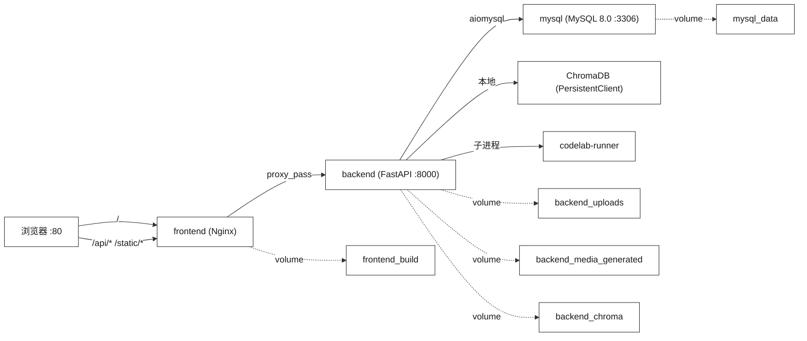

# SparkOrbit 星轨学图 — 操作手册

| 项 | 内容 |
|----|------|
| 项目名称 | SparkOrbit 星轨学图 |
| 文档名称 | 操作手册 |
| 文档编号 | SparkOrbit-D3 |
| 编制者 | SparkOrbit 团队 |
| 编制日期 | 2026-08-14 |
| 版本 | V3.0 |
| 密级 | 内部 |

---

## 修改记录

| 版本 | 日期 | 修改人 | 说明 |
|------|------|--------|------|
| V1.0 | 2026-08-01 | SparkOrbit 团队 | 升格自部署说明书 |
| V2.0 | 2026-08-01 | SparkOrbit 团队 | 补充 Docker 架构图、完整环境变量表、容器健康检查、ChromaDB 离线配置、远程操作 |
| V3.0 | 2026-08-14 | SparkOrbit 团队 | 工程级对齐：程序与文件结构补面试/求职/教师套件/考级/SRS 模块说明（均运行于 backend 容器，新增 mock_interview/exam/review/teacher_tools/ops 表） |

---

## 1 引言

### 1.1 编写目的

本文档面向系统运维人员与竞赛评审，提供 SparkOrbit 星轨学图从安装部署到日常运维的完整操作指南，包括环境准备、一键启动、运行监控、备份恢复、故障处理与远程操作。

### 1.2 参考资料

| 编号 | 资料 | 用途 |
|------|------|------|
| [R1] | 部署说明书.md | 一键启动与演示账号 |
| [R2] | 服务器部署速查.md | 腾讯云迁移与远程操作 |
| [R3] | docker-compose.yml | 容器编排配置 |
| [R4] | storage-and-backup.md | 备份恢复策略 |
| [R5] | 操作手册编写规范.doc | 文档结构规范 |

---

## 2 软件概述

### 2.1 程序与文件结构

| 程序/服务 | 技术栈 | 容器 | 说明 |
|-----------|--------|------|------|
| frontend | Nginx + Vue 3 SPA | `frontend:80` | 静态文件服务 + API 反向代理 |
| backend | FastAPI + Uvicorn | `backend:8000` | 业务逻辑 + AI 智能体 + ChromaDB |
| mysql | MySQL 8.0 | `mysql:3306` | 结构化数据存储 |
| codelab-runner | Python 子进程 | (sidecar) | 代码沙箱执行环境 |

> 8/13–8/14 新增的模拟面试、求职助手、教师套件、考级中心、SRS 复习等模块均运行于 `backend` 容器内（`interview_agents.py` / `interview_service.py` / `exam_center.py` / `review_queue.py` / `teacher_suite.py`），不引入额外容器或部署步骤；数据落于既有 MySQL 库新增表（`mock_interview.py` / `exam.py` / `review.py` / `teacher_tools.py` / `ops.py`）。

### 2.2 Docker 架构图



### 2.3 关键文卷

| 文件 | 用途 |
|------|------|
| `.env` | 环境变量（API Key、DB 密码、Chroma 模式） |
| `.env.example` | 环境变量模板 |
| `docker-compose.yml` | 四服务容器编排 |
| `start.bat` / `start.sh` | Windows/macOS-Linux 一键启动 |
| `stop.bat` / `stop.sh` | 停止容器 |
| `sparkorbit.sql` | MySQL 全库导出备份 |
| `backend/.env.example` | 后端完整环境变量说明 |

---

## 3 安装与初始化

### 3.1 环境要求

| 项 | 要求 |
|----|------|
| Docker | Desktop 4.x+ 或 Engine + Compose v2 |
| 内存 | 建议 >=4 GB |
| 端口 | 本机 80 端口未被占用 |
| 磁盘 | >=5 GB 空闲（含镜像+数据卷） |
| 首次构建 | 约 5-15 分钟（拉取基础镜像 + 编译前端） |

### 3.2 一键启动

**Windows**：
1. 解压安装包到任意目录（路径不含中文）
2. 确认 Docker Desktop 已启动（状态栏图标为绿色）
3. 双击 `start.bat`
4. 浏览器打开 `http://localhost`

**macOS / Linux**：
```bash
chmod +x start.sh stop.sh
./start.sh
```

**手动命令**：
```bash
cp .env.example .env       # 仅首次
docker compose up -d --build
```

### 3.3 完整环境变量表

编辑 `.env` 文件（由 `.env.example` 复制）：

| 变量 | 必需 | 默认值 | 说明 |
|------|------|--------|------|
| `MYSQL_ROOT_PASSWORD` | 是 | `sparkorbit` | MySQL root 密码 |
| `MYSQL_DATABASE` | 是 | `sparkorbit` | 数据库名 |
| `DEEPSEEK_API_KEY` | 推荐 | — | 核心 LLM API Key |
| `DOUBAO_API_KEY` | 可选 | — | 豆包模型（交叉验证） |
| `SPARK_APP_ID` | 可选 | — | 讯飞语音 AppID |
| `SPARK_API_KEY` | 可选 | — | 讯飞语音 APIKey |
| `SPARK_API_SECRET` | 可选 | — | 讯飞语音 APISecret |
| `VOLCANO_ARK_API_KEY` | 可选 | — | 火山方舟 Seedance |
| `SPARKORBIT_CHROMA_OFFLINE` | 推荐 | `1` | Chroma 离线模式（见 §5.4） |
| `SECRET_KEY` | 是 | 自动生成 | JWT 签名密钥 |

修改后重建 backend：
```bash
docker compose up -d --force-recreate backend
```

---

## 4 运行说明

### 4.1 服务端口与健康检查

| 服务 | 访问地址 | 健康检查 |
|------|----------|----------|
| 前端 | http://localhost | HTTP 200 |
| API | http://localhost/api/health | `{"status":"ok","version":"1.0.0"}` |
| OpenAPI | http://localhost/docs | Swagger UI |
| MySQL | 容器内部 :3306 | `docker compose exec mysql mysqladmin ping -uroot -psparkorbit` |

**容器健康检查**（docker-compose.yml 内置）：
- MySQL：`mysqladmin ping`，间隔 10s，重试 5 次
- Backend：依赖 MySQL 健康状态，启动后额外等待 10s 执行 seed

### 4.2 演示账号

| 角色 | 用户名 | 密码 |
|------|--------|------|
| 学生 | `student001` | `123456` |
| 教师 | `teacher001` | `123456` |
| 管理员 | `admin001` | `123456` |

首次启动自动 seed 演示用户与课程。

### 4.3 停止与清理

```bash
# 停止容器（保留数据卷）
docker compose down

# 清理数据卷（删除 MySQL 演示数据）
docker compose down -v
```

### 4.4 云端访问

公网部署地址：**https://wikj.online**（腾讯云轻量 2C4G）。

---

## 5 非常规过程

### 5.1 数据库备份与恢复

**导出全库**：
```bash
docker compose exec mysql mysqldump -uroot -psparkorbit sparkorbit > sparkorbit.sql
```

**导入**：
```bash
# Windows PowerShell
Get-Content .\sparkorbit.sql -Raw | docker compose exec -T mysql mysql -uroot -psparkorbit sparkorbit

# macOS / Linux
docker compose exec -T mysql mysql -uroot -psparkorbit sparkorbit < sparkorbit.sql
```

**备份范围**（完整备份需五者齐全）：
1. MySQL dump (`sparkorbit.sql`)
2. `backend/uploads/`（用户上传 + 星库 PDF）
3. `backend/app/static/media/`（生成媒体）
4. `backend/chroma_data/`（向量持久化）
5. `backend/vaults/<user_id>/`（知识库正文）

### 5.2 Docker 数据卷

| Volume | 挂载路径 | 内容 |
|--------|----------|------|
| `mysql_data` | `/var/lib/mysql` | MySQL 数据文件 |
| `backend_uploads` | `/app/uploads` | 用户上传文件 |
| `backend_chroma` | `/app/chroma_data` | ChromaDB 向量 |
| `backend_media_generated` | `/app/app/static/media` | AI 生成媒体 |
| `frontend_build` | `/usr/share/nginx/html` | 前端构建产物 |

### 5.3 维护模式

通过管理员界面或 SQL 启用：
```sql
UPDATE system_settings SET maintenance_enabled = 1, maintenance_message = '系统维护中，预计30分钟后恢复';
```

恢复：
```sql
UPDATE system_settings SET maintenance_enabled = 0;
```

### 5.4 ChromaDB 离线配置

项目默认启用离线模式，避免运行时下载 ONNX 模型：

```env
SPARKORBIT_CHROMA_OFFLINE=1
```

Docker 构建时预置模型到容器内。若需在线模式（首次初始化），临时设为 0。

### 5.5 日志查看

```bash
# 查看所有服务日志
docker compose logs -f

# 仅 backend
docker compose logs -f backend

# 最近 100 行
docker compose logs --tail=100 backend
```

### 5.6 常见故障处理

| 故障 | 排查步骤 |
|------|----------|
| 80 端口被占用 | 修改 `docker-compose.yml` 中 frontend ports 为 `"8080:80"` |
| 构建失败 | `docker compose build --no-cache`；检查 Docker 镜像加速配置 |
| 接口 502 | `docker compose logs backend` 检查是否在等待 MySQL 就绪 |
| AI 功能不可用 | 检查 `.env` 中 `DEEPSEEK_API_KEY` 是否已填写；`docker compose up -d --force-recreate backend` 重建 |
| ChromaDB 初始化失败 | 检查 `chroma_data/` 权限；确认 `SPARKORBIT_CHROMA_OFFLINE=1` 时模型已预置 |
| 容器启动顺序错误 | `docker compose down -v` 清理后重新 `docker compose up -d --build` |

---

## 6 远程操作

### 6.1 腾讯云 SSH 连接

详见 `服务器部署速查.md`。

主要操作：
```bash
ssh -i sparkorbit-key.pem root@<公网IP>
cd /opt/sparkorbit
docker compose logs -f
```

### 6.2 证书更新

Let's Encrypt SSL 证书自动续期（certbot）：
```bash
certbot renew --dry-run  # 测试
certbot renew             # 执行
```

---

> **版本**：V3.0 | **编制日期**：2026-08-14 | **文档编号**：SparkOrbit-D3 | **编制团队**：SparkOrbit 团队
