# SparkOrbit 星轨学图 — 作品设计实现方案

## 摘要

SparkOrbit「星轨学图」是一套面向**高等教育个性化学习**、以**认知孪生**与**星系隐喻**为核心的沉浸式智能学习平台。系统将学科知识组织为「星系—行星」图谱，通过对话式六维画像构建学生数字镜像，并以多智能体协同预演（Teacher → Mirror → Evaluator → PathPlanner）在真实作答前暴露认知误区、生成个性化补救路径。平台面向学生、教师、管理员三种角色：学生端以星轨领航台组织学习区、我的星域、星语树洞、聊天区、自习区、休闲区六大分区；教师端提供学情看板、作业考勤、画像改进复核、PDF 星系锻造与时空扭曲沙盘；管理端负责用户、内容、Token 用量与维护模式。

技术上，后端基于 FastAPI + SQLAlchemy（MySQL）构建 RESTful API、WebSocket 实时通道与 SSE 流式推演；采用 **多模型协同矩阵** 按任务路由：DeepSeek 负责核心推理，讯飞星火 X2/4.0 Turbo 负责中文长文本与多轮对话，讯飞 IAT/ISE 负责语音听写与口语评测，通义千问（Qwen）负责数字分身图生图，cantonese.ai 负责粤语 STT 与发音评分；多模态资源侧已开通火山方舟 **Seedance 1.0 Pro Fast**（经推理接入点调用），由 MediaAgent 生成可播放教学短视频，失败时降级 GSAP 分镜或本地缓存片，并集成 ChromaDB 校本 RAG、资源质量自动评分与前端 TensorFlow.js（coco-ssd）自习督导。系统强调**人机协同**与**可解释反馈**，将 AI 建议与教师复核结合，避免黑箱替代式决策。

**关键词**：认知孪生；多智能体协同；个性化资源生成；学习画像；高等教育；多模型协同

---

## 目录

- [第一章 项目概述](#第一章-项目概述)
- [第二章 核心技术](#第二章-核心技术)
- [第三章 系统架构与实现](#第三章-系统架构与实现)
- [第四章 技术和功能创新](#第四章-技术和功能创新)
- [第五章 系统功能测试](#第五章-系统功能测试)
- [第六章 总结与展望](#第六章-总结与展望)

---

## 第一章 项目概述

### 1.1 背景与目标

#### 1.1.1 项目背景

数字化教育与在线学习平台快速普及，但多数系统仍停留在「资源搬运 + 进度记录」层面：同一套课件、同一条路径面向全体学习者，难以刻画个体差异；教师面对大班教学时，难以及时定位风险学生与认知短板；学习者在情绪波动、专注力下降时也缺乏低门槛的支持通道。与此同时，大语言模型、多智能体编排、语音与视觉多模态能力的成熟，使「以学生认知状态为中心」的自适应学习成为可落地的工程方向。本赛题（第十五届"中国软件杯"A3）明确要求以**某一具体专业课程（人工智能、计算机、电子信息相关）为切入点**，构建多智能体协同的个性化资源生成与学习系统，切实满足高等教育个性化变革需求。

在产品形态上，SparkOrbit 进行了隐喻重构：将传统树状知识点降维映射为可点亮、可衰减、可复习固化的「行星」，以六维认知画像构建学生「数字镜像」，并通过多智能体预演在正式学习前完成诊断—试错—归因—规划闭环。产品以科幻星轨 UI 降低学习门槛，以游戏化机制维持长期动机，以教师工作台保证人工专业判断不被算法取代。

#### 1.1.2 国内外研究现状（简述）

- **自适应学习与知识图谱**：国际主流平台（如部分 ITS / 自适应练习系统）已采用知识点依赖图与掌握度模型，但交互形态偏工具化，情感与社交支持较弱。
- **多智能体教育应用**：近年 LLM Agent 被用于出题、批改、答疑与学伴对话；编排式「诊断—作答—评价—规划」流水线仍以实验室原型居多。
- **国内实践**：智慧课堂、学情大屏偏管理侧；个性化路径与可解释画像在中小规模班级场景仍需更强的工程闭环（采集—建模—干预—复核）。

本项目在上述趋势上强调三点落地：**可持久化的六维画像**、**可流式观察的多智能体预演**、**与班级治理打通的人机协同**。

#### 1.1.3 痛点分析

1. **画像缺失或粗粒度**：仅记录对错与分数，无法表达认知风格、易错倾向、时间弹性等教学决策所需维度。
2. **路径千人一面**：推荐多为热门资源或静态大纲，缺少与画像、掌握度、遗忘状态联动的动态规划。
3. **补救滞后**：错题堆积后才干预，缺乏「作答前预演暴露误区」的机制。
4. **教师干预成本高**：风险学生难筛、改进计划难复核、课程内容难快速结构化为可练习图谱。
5. **情绪与专注被忽视**：学习系统很少同时覆盖情绪疏导、专注督导与轻量激励，导致坚持性不足。
6. **解释性不足**：纯 LLM 评分易成黑箱，师生难以追溯「为何这样推荐」。

#### 1.1.4 项目目标

**（1）技术目标**

- 建立可抽取、可更新、可缺维追问的六维学生画像（Mirror）。
- 实现星系—行星知识组织、挑战点亮、艾宾浩斯风格衰减与超新星固化。
- 实现 Teacher / Mirror / Evaluator / PathPlanner 多智能体流式协同预演，以及 Multiverse / TimeWarp 对照推演。
- 打通文本、语音（ASR/口语评测）、视觉（分身生成、自习目标检测）等多模态辅助通道。

**（2）应用目标**

- 学生获得沉浸、可导航的个性化学习闭环：探索 → 挑战 → 画像 → 预演 → 路径 → 评估。
- 教师以较低成本完成学情监控、作业考勤、改进复核与课程星系锻造。
- 管理端提供多租户运维、算力资产（Token）大盘监控及系统熔断机制。

**（3）创新目标**

- 「认知孪生 + 星轨隐喻」统一产品语言与数据模型。
- 预演式多智能体诊断先于正式练习，降低无效刷题成本。
- AI 建议与教师覆盖评分并存，形成可解释的人机协同评估。

#### 1.1.5 落地场景与部署形态

本平台设计兼容多种教育信息化落地场景：

**B2B2C 智慧校园部署**：为公立学校或教培机构提供"专属星系"。支持私有化部署或 VPC 隔离，接入学校现有教务系统（LMS/排课系统），教师通过"星系锻造"将本校私域教案转化为校本练习图谱。

**B2C 个性化自主学习**：面向 C 端学生提供 SaaS 服务。通过基础星图免费、高级多智能体预演（消耗大量算力）与增值语料库（如高级发音测评、数字分身生成）按月/按 Token 订阅的模式实现商业化闭环。

**高等教育专业课程切入点**：按赛题要求，本系统以人工智能、计算机、电子信息相关专业课程为首批落地学科。教师通过"星系锻造"将《机器学习》《数据结构》等课程讲义转化为校本练习图谱，系统围绕该专业课程生成讲解文档、思维导图、题库、教学视频、代码实操等多模态资源，形成"因材施教"的数字化落地闭环。

### 1.2 功能概述

#### （1）学生端：星轨领航台与六大分区

| 分区 | 功能要点 |
|------|----------|
| 学习区 | Three.js 星系探索、行星挑战答题、AI 伴学、教案、SOS、镜像/多元宇宙预演、学习路径、资源工坊、错题本、测验等 |
| 我的星域 | 成长总览、六维画像、掌握度全景、称号/里程碑/成就、桌宠图鉴 |
| 星语树洞 | AI 陪伴、心情日记、匿名动态与评论互动 |
| 聊天区 | 班级/话题/群聊/私聊（WebSocket）、星愿墙与社交 |
| 自习区 | 3D 选房、专注计时、排行、环境音；摄像头 + coco-ssd 分心/离开提醒 |
| 休闲区 | 小游戏、签到、商城、好友挑战、桌宠养成 |

#### （2）教师端：班级治理与内容锻造

学情看板与风险学生、作业/成绩/考勤/巡查、消息广播、教学资料、学生名册与详情、AI 教案、画像改进复核、**星系锻造**（PDF → 星系/行星）、**时空扭曲沙盘**（调分后仿真推演）。

#### （3）管理端：系统控制台

用户管理、内容（星系）管理、LLM Token 用量监控、接口异常、维护模式开关。

#### （4）安全、合规与隐私基线

针对未成年人教育场景，系统在数据流转全生命周期实控：

- **数据最小化采集**：自习区督导采用前端 TensorFlow.js 本地实时推理（coco-ssd），视频流不上传服务器，仅将「分心时间 / 离开次数」等标量落库，降低音视频隐私面（非宣称「零泄露」）。
- **内容风控网关（Shield）**：敏感词过滤 + 可选 LLM 审核，对星语树洞、聊天区及 Agent 生成内容做价值观与攻击性诱导拦截。
- **权限隔离**：RBAC 三角色分流；Token 用量与关键操作可在管理端查看。完整「不可篡改审计日志库」与监护人明示同意流程仍属合规增强项，见第六章。

**图 1.1 产品角色与功能总览**

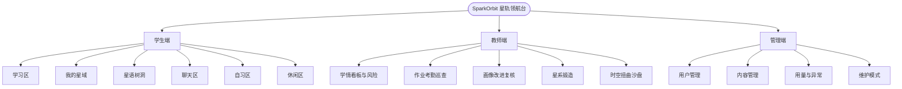

---

## 1.3 赛题需求对应

本系统按 A3 赛题五大功能需求与非功能性需求逐项落地，对应关系如下。

**表 1.1 赛题功能需求对应**

| 赛题功能需求 | 本系统对应模块 | 关键代码锚点 |
|--------------|----------------|--------------|
| 对话式学习画像自主构建（≥6 维，随学随新） | Mirror 六维画像 + 对话抽取 + 事件刷新 | `profiling.py` / `profiles.py` / `profile_refresh.py` |
| 多智能体协同资源生成（≥5 种类型） | Coordinator + 6 类 Resource Agent（含 Seedance 短视频），SSE 流式 + 质量评分 | `resource_agents.py` / `seedance_service.py` / `resource_quality.py` |
| 个性化学习路径规划与资源推送 | LearningPath 步骤化 + 画像驱动推荐 + 评估回灌 | `learning_path.py` / `evaluation.py` |
| 智能辅导（可选加分项） | Companion / 苏格拉底 Tutor / 费曼模式 + RAG | `companion.py` / `rag.py` |
| 学习效果评估（可选加分项） | 多维成长评估报告 + 一键回灌重排路径 | `evaluation.py` |

**表 1.2 赛题非功能性需求对应**

| 赛题非功能性需求 | 本系统落地方式 |
|------------------|----------------|
| 界面美观、流式输出、Markdown 渲染、多模态卡片化 | Vue3 + Three.js 星轨 UI；SSE 流式；markdown-it + highlight.js |
| 鼓励优先使用开源项目前端 | Vue3/Vite/Tailwind/Three.js 均为开源栈 |
| AI 代码/框架须标注名称、来源及协作要求 | 附录 B 列明 AI 工具与框架来源 |
| 数据安全、画像真实、内容无违规 | Shield 风控网关 + RBAC + 1.2(4) 隐私基线 |
| 响应时间合理、流式渐进呈现避免空白等待 | SSE 流式 + 3.6 降级排队机制 |

---

## 第二章 核心技术

平台竞争力来自五类核心能力的工程化整合：**认知画像、多智能体仿真、星系知识图谱、学习路径与评估、多模态交互**。

**图 2.1 核心能力数据流总览**

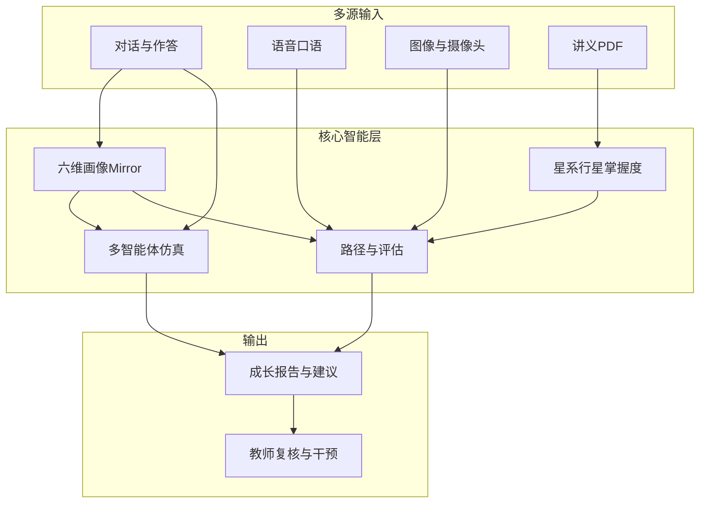

### 2.1 认知画像（Mirror）

#### 2.1.1 内容概述

Mirror 模块负责从学生对话与学习行为中提取并维护六维认知画像，作为后续仿真、路径规划与资源生成的统一上下文。六维定义与数据模型一致：

| 维度键 | 中文标签 | 教学含义 |
|--------|----------|----------|
| `major_background` | 专业背景 | 学科方向与背景约束 |
| `prior_knowledge` | 前置知识 | 已掌握相关基础 |
| `cognitive_style` | 认知风格 | 图像化/推导式/案例式/实践式等偏好 |
| `mistake_tendency` | 易错倾向 | 常见误区与失败模式 |
| `learning_goal` | 学习目标 | 短期目标与动机 |
| `time_flexibility` | 时间弹性 | 可投入时间与节奏 |

画像支持缺维标记（`missing_dimensions`）与追问问题（`follow_up_questions`），并保留 `raw_evidence` 便于追溯。

**图 2.2 六维画像抽取与更新流程**

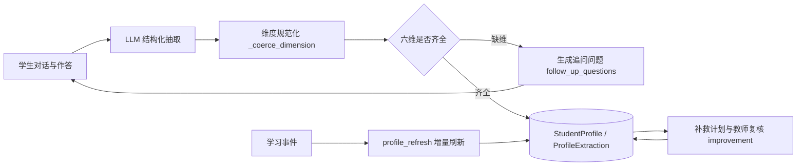

**图 2.3 六维画像维度构成**

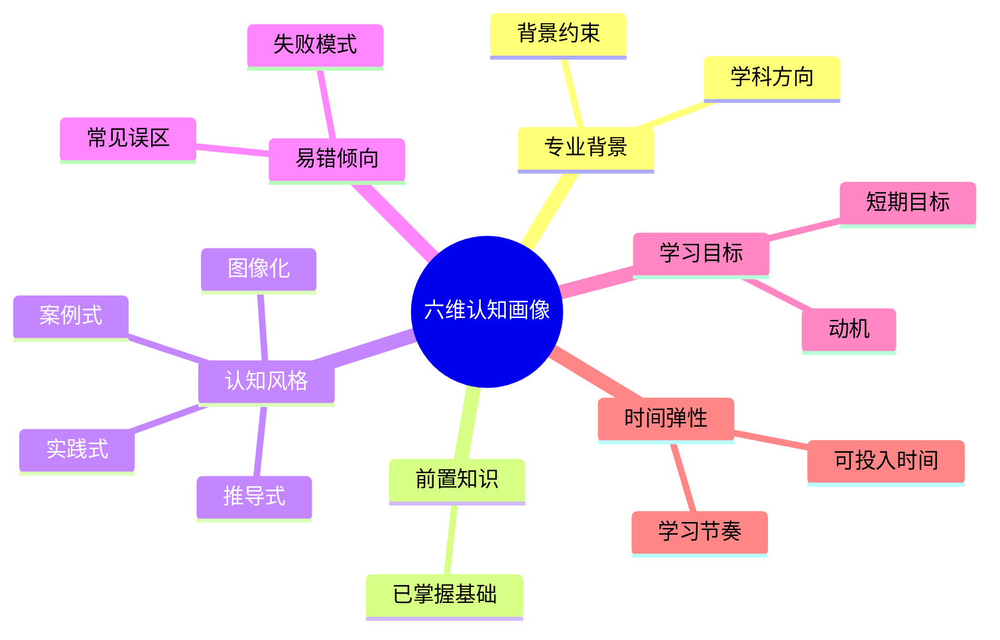

#### 2.1.2 核心技术

1. **LLM 结构化抽取**：`profiling.py` 通过提示词约束输出 JSON，将自由对话映射为六维结构；维度字段经 `_coerce_dimension` 规范化。
2. **启发式兜底**：当模型输出不完整时，基于关键词与规则补全部分维度，保证链路可用。
3. **持久化与时间线**：`StudentProfile` / `ProfileExtraction` 存储当前画像与抽取历史；支持流式抽取接口便于前端实时展示。
4. **事件驱动刷新**：学习事件（挑战、路径完成等）可触发 `profile_refresh` 增量更新，避免一次性静态问卷。
5. **补救与改进闭环**：`improvement.py` 支持补救计划 → 学生反思提交 → AI 三档评分调整维度分 → **教师可覆盖**，形成人机协同校准。

#### 2.1.3 创新点与优势

- 六维设计直接服务教学决策，而非泛化「兴趣标签」。
- 缺维追问机制降低冷启动失败率。
- 教师复核入口避免纯算法改写学生画像的伦理与准确性风险。

### 2.2 多智能体仿真（Simulation）

#### 2.2.1 内容概述

仿真模块基于 **LangGraph StateGraph** 编排 Teacher → Mirror → Evaluator → PathPlanner 四角色协同预演：在真实刷题前，用「学生数字孪生体」试错，提前暴露误区并生成补救路径。前端通过 SSE 流式渲染各 Agent 事件，形成可观察的思维链。

**图 2.4 多智能体协同预演时序**

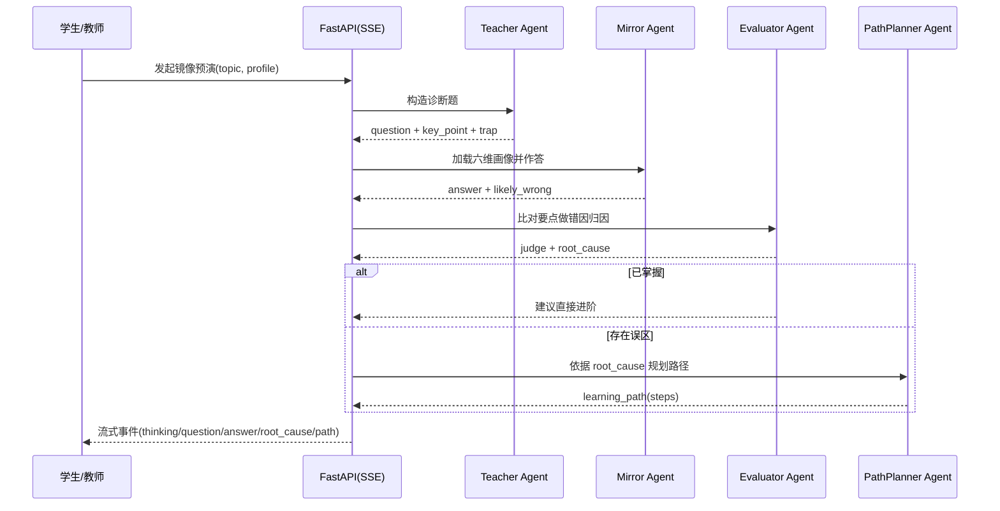

#### 2.2.2 核心技术

**流水线（`simulation.py`）**

1. **Teacher**：围绕知识点构造诊断题，标注考察核心与常见陷阱。
2. **Mirror**：加载六维画像，以孪生体人格作答（可标记 `likely_wrong`）。
3. **Evaluator**：评估对错并做错因归因（`root_cause`）。
4. **PathPlanner**：输出分步个性化补救路径；若已掌握则建议进阶。

**扩展模式**

- **Multiverse（多元宇宙）**：对画像维度施加对照扰动，比较不同认知状态下的预演结果。
- **TimeWarp（时空扭曲）**：教师端可覆盖维度分数后启动沙盘推演，用于干预策略推演与学情研讨。

事件通过 `SimulationRun` / `SimulationEvent` 持久化，支持回放与审计。

#### 2.2.3 创新点与优势

- 「先预演、后练习」缩短无效试错路径。
- 流式多角色互评增强可解释性（师生可见 Teacher 陷阱设计、Evaluator 归因、Planner 步骤）。
- 与班级教学场景打通（教师沙盘），而非仅学生自助玩具。

### 2.3 星系知识图谱与掌握度

#### 2.3.1 内容概述

系统将课程内容映射为：

- **Galaxy（星系）** ≈ 学科/课程单元  
- **Planet（行星）** ≈ 知识点  
- **点亮 / 衰减 / 超新星** ≈ 掌握、遗忘、复习固化  
- **星座** ≈ 关联知识点簇成就  

学生在 Orbit 星图中探索并挑战答题；教师可通过星系锻造从 PDF 讲义生成结构化星系。

**图 2.5 挑战点亮闭环**

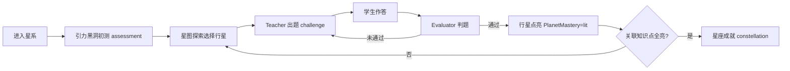

**图 2.6 行星记忆衰减状态机（艾宾浩斯启发）**

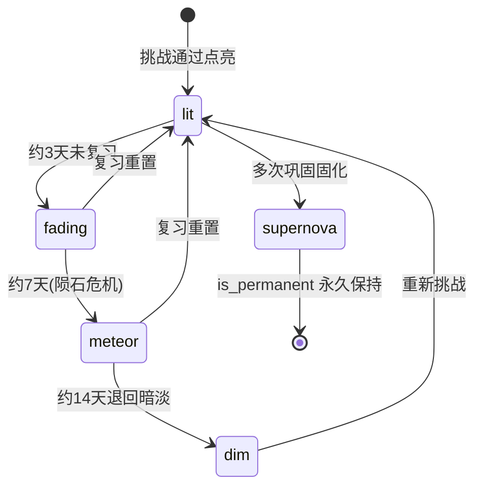

#### 2.3.2 核心技术

1. **挑战闭环（`challenge.py`）**：Teacher 出题 → 学生作答 → Evaluator 判题 → 更新 `PlanetMastery` 点亮状态。
2. **初测引力黑洞（`assessment.py`）**：进入新星系时以少量诊断题估计起点。
3. **记忆衰减（`memory_decay.py`）**：基于艾宾浩斯启发的阶段阈值——点亮后约 3 天 `fading`、7 天 `meteor`（陨石危机）、14 天 `dim`；复习可重置，永久固化标记 `is_permanent`（超新星）。
4. **知识碎片与伴学（`fragments.py` / `companion.py`）**：Companion 对话可授予碎片；Tutor 默认苏格拉底模式（先问后讲，可切换普通讲解），并支持**费曼模式**（学生先讲解，Tutor 挑漏洞并追问，回写学习事件）；回复可附依据来源。
5. **星系锻造（`galaxy_forge.py`）**：解析 PDF 文本，经 LLM 结构化生成星系与行星节点，降低建课成本。
6. **校本 RAG（`rag.py`）**：ChromaDB 灌入 seed 行星大纲，为 Tutor / 判题提供检索上下文；无命中时回退行星描述伪源（演示不空，非页码级强制引用）。

#### 2.3.3 创新点与优势

- 游戏化隐喻与掌握度状态机一致，降低抽象概念理解成本。
- 衰减机制把「复习」做成显性危机与奖励，而非后台静默分数。
- 教师侧 PDF→星系缩短从课件到可练习图谱的路径。

### 2.4 学习路径、评估与资源多智能体

#### 2.4.1 内容概述

在画像与掌握度之上，系统生成可打卡学习路径、多维成长报告，并按需调用资源生成多智能体生产讲解文档、思维导图、题库、阅读、**Seedance 1.0 Pro Fast 教学短视频**（失败降级 GSAP 分镜/缓存片）、代码实操等材料；生成后经 DeepSeek **质量自动评分**（准确性/画像贴合/完整性/幻觉风险），低分可重试。成长评估建议可通过接口回灌 PathPlanner 动态重排路径。

#### 2.4.2 核心技术

1. **个性化路径（`learning_path.py`）**：综合画像维度、行星掌握与目标，生成步骤化路径；支持完成打卡与推荐跃迁到对应行星。
2. **成长评估（`evaluation.py`）**：聚合掌握率、错题、专注会话、资源使用等，输出结构化成长报告。
3. **资源多智能体（`resource_agents.py`）**：Coordinator 编排 Doc / Mind / Quiz / Read / Media / Code 六类 Agent，SSE 流式产出并落库 `GeneratedResource`。
4. **AI 辅导工具（`ai_tutor.py`）**：相似题举一反三、作业/作答批改。
5. **教案生成（`lesson_plan.py`）**：按行星生成结构化教案，服务教师备课与学生预习。

**表 2.1 赛题要求的 5+ 种资源类型与 Agent 对应**

| 赛题资源类型 | 本系统 Agent | 实现要点 |
|--------------|--------------|----------|
| 专业课程讲解文档 | DocAgent | Markdown 生成 + 前端富文本渲染 |
| 知识点思维导图 | MindAgent | Markmap 将 Markdown 转交互导图 |
| 不同类型练习题目 | QuizAgent | 选择/填空/编程/案例分析多题型 |
| 拓展阅读材料 | ReadAgent | 推荐链接 + 摘要 + 难度标注 |
| 多模态教学视频/动画 | MediaAgent | **已实现**：已开通火山方舟 Seedance 1.0 Pro Fast，生成可播放教学短视频并本地下载；失败降级 GSAP 分镜或精确 slug 缓存片 |
| 代码类实操案例 | CodeAgent | 带注释可运行示例 + 执行说明 |

系统满足赛题"至少 5 种"的硬性要求，实际覆盖 6 种资源类型，且各 Agent 由 Coordinator 统一编排，支持流式渐进呈现。

#### 2.4.3 创新点与优势

- 路径—资源—评估闭环，避免「只推荐不验证」。
- 多 Agent 分工生成降低单一提示词堆砌导致的质量不稳。
- 报告维度与学生 Zone 工具条能力对齐，便于前端一体化呈现。

### 2.5 多模态交互

#### 2.5.1 内容概述

在文本智能之外，平台提供语音听写、口语评测、粤语发音、卡通分身生成、自习视觉督导等能力，丰富练习形态并支撑专注管理。

#### 2.5.2 核心技术

| 能力 | 实现要点 |
|------|----------|
| 实时 ASR | WebSocket `/api/ws/asr` 转发讯飞 IAT；`asr_service.py` 鉴权与转写 |
| 口语评测 | 讯飞 ISE；`oral_practice.py` 串联多语种口语/听力 Agent |
| 粤语 | `cantonese_ai_service.py`：STT + 发音评分 |
| 音频预处理 | `audio_preprocess.py` + ffmpeg：webm→ogg/pcm 等 |
| 数字分身 | `avatar_service.py`：自拍 → DeepSeek 提示 → 通义千问图生图 |
| 自习督导 | 前端 TensorFlow.js + coco-ssd：检测人/手机等，分心或离开提醒 |
| 错题 OCR | 错题本支持拍照识别辅助录入 |

#### 2.5.3 创新点与优势

- 多引擎按场景组合（普通话 / 英语走讯飞 IAT·ISE，粤语走 cantonese.ai），贴近真实口语教学需求。
- 视觉督导在浏览器端本地推理，降低敏感视频上传压力。
- 分身与星轨世界观一致，增强归属感与长期留存。

---

## 第三章 系统架构与实现

### 3.1 项目整体架构

#### 3.1.1 逻辑架构

系统采用前后端分离：

- **前端**：Vue 3 + Vite + TypeScript，三角色门户；学生端以 Zone 状态机切换六大分区。
- **后端**：FastAPI 应用（`app.main:app`），统一前缀 `/api`；REST + WebSocket + SSE。
- **数据层**：SQLAlchemy Async + MySQL（可切换 SQLite/PostgreSQL）。
- **智能层**：多模型协同矩阵——DeepSeek（推理/质量评分）、讯飞星火（生成/对话）、讯飞 IAT/ISE（普通话 / 英语语音）、通义千问 Qwen（视觉分身）、cantonese.ai（粤语）、火山方舟 Seedance 1.0 Pro Fast（教学短视频，接入点调用；降级 GSAP/缓存片）、LangGraph（仿真编排）。

**图 3.1 系统总体架构**

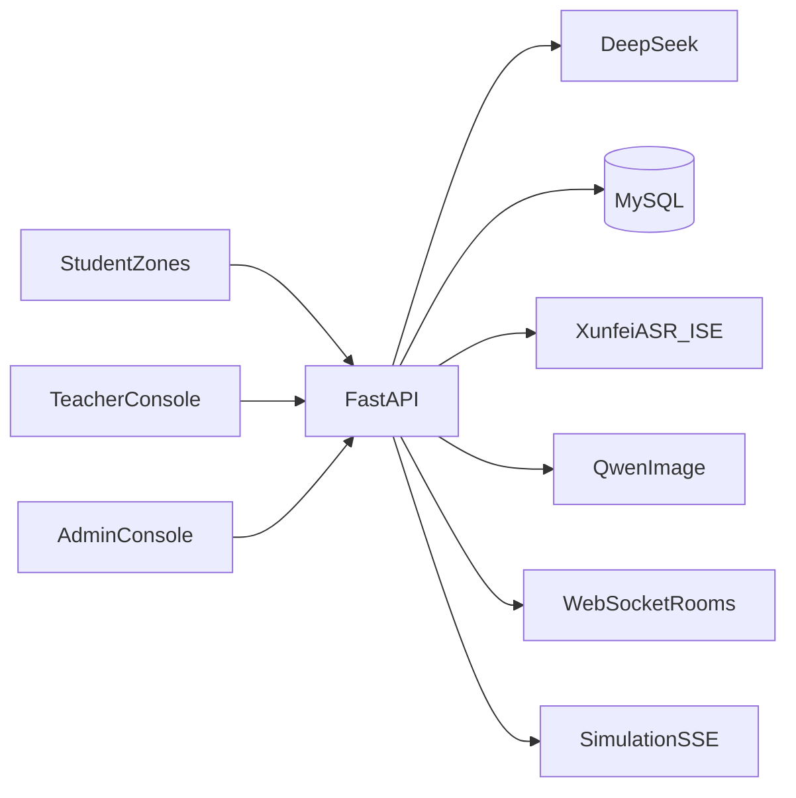

**核心业务闭环**：星系探索 → 行星挑战 → 画像更新 → 镜像预演 → 路径打卡 → 成长报告 →（教师）复核干预。

#### 3.1.2 模块化组件

| 模块 | 主要职责 | 关键实现 |
|------|----------|----------|
| 认证与账号 | 登录注册、角色校验、班级绑定 | `auth.py` / `account.py` |
| 星系宇宙 | 星系行星、掌握度、轨道快照 | `galaxy_service.py` |
| 挑战与评估 | 出题判题、初测、遗忘 | `challenge.py` / `assessment.py` / `memory_decay.py` |
| 画像与改进 | 抽取、刷新、补救复核 | `profiling.py` / `improvement.py` |
| 仿真推演 | 镜像/多元宇宙 SSE | `simulation.py` |
| 学习区扩展 | 路径、资源、日任务、错题专注 | `learning_path.py` / `zone_extras.py` |
| 社交与聊天 | 好友虫洞、聊天室 WS | `social.py` / `chat_service.py` |
| 教师/管理 | 班级治理、用量维护 | `teacher*.py` / `admin.py` |
| 安全 | 输出审核 | `shield.py` |

### 3.2 前端界面

#### 3.2.1 前端架构与功能描述

前端采用 Vue 3 + Vite + TypeScript 单仓多角色架构，所有角色共用同一构建产物，通过路由守卫与状态机分流，保证视觉与交互一致性。

**（1）路由与权限守卫**

- 基于 `vue-router` 的路由表为每条路由配置 `meta.role` 字段，全局前置守卫在导航前校验当前用户角色与目标路由角色是否匹配，越权访问被重定向或拒绝。
- 公开路由仅含登录（`ACCESS_GATE`）与注册页，其余路由按 `student` / `teacher` / `admin` 三类角色隔离，避免角色间界面互窜。
- 学生端主界面为单页 Zone 切换架构（非深子路由），通过组件内状态机管理分区切换，降低路由跳转开销并保持沉浸感。

**（2）状态管理**

- 采用 Pinia 作为全局状态层，集中管理用户信息、班级归属、通知、桌宠状态、画像缓存等跨组件共享数据。
- Zone 局部状态由组件内 `ref` / `reactive` 管理，避免全局 store 膨胀；切换分区时按需挂载与卸载，控制内存占用。

**（3）视觉与动效体系**

- Tailwind CSS 提供原子化样式基础，配合 PostCSS 处理兼容性，保证三角色界面色彩与间距一致。
- GSAP 负责过渡与微交互动效（如黑洞塌缩切换、行星点亮脉冲、桌宠悬浮），Three.js 渲染三维星图与自习室 3D 选房场景，营造星轨世界观。
- ECharts 承担数据可视化：六维雷达图、掌握度趋势线、班级热力图、专注会话统计等，均以星轨配色统一风格。

**（4）内容渲染与流式呈现**

- markdown-it + highlight.js 负责 AI 长文与代码块的渲染，支持公式、表格、代码高亮，使 Agent 生成的讲解文档与代码实操可读性接近本地 IDE。
- SSE 流式输出通过 EventSource 接收后端事件，前端逐字渲染伴学对话、仿真预演、资源生成等长文本，避免长等待空白。
- WebSocket 通道用于聊天室实时消息、自习室状态同步与 ASR 转写，保证双向实时交互体验。

**图 3.2 前端角色路由与守卫**

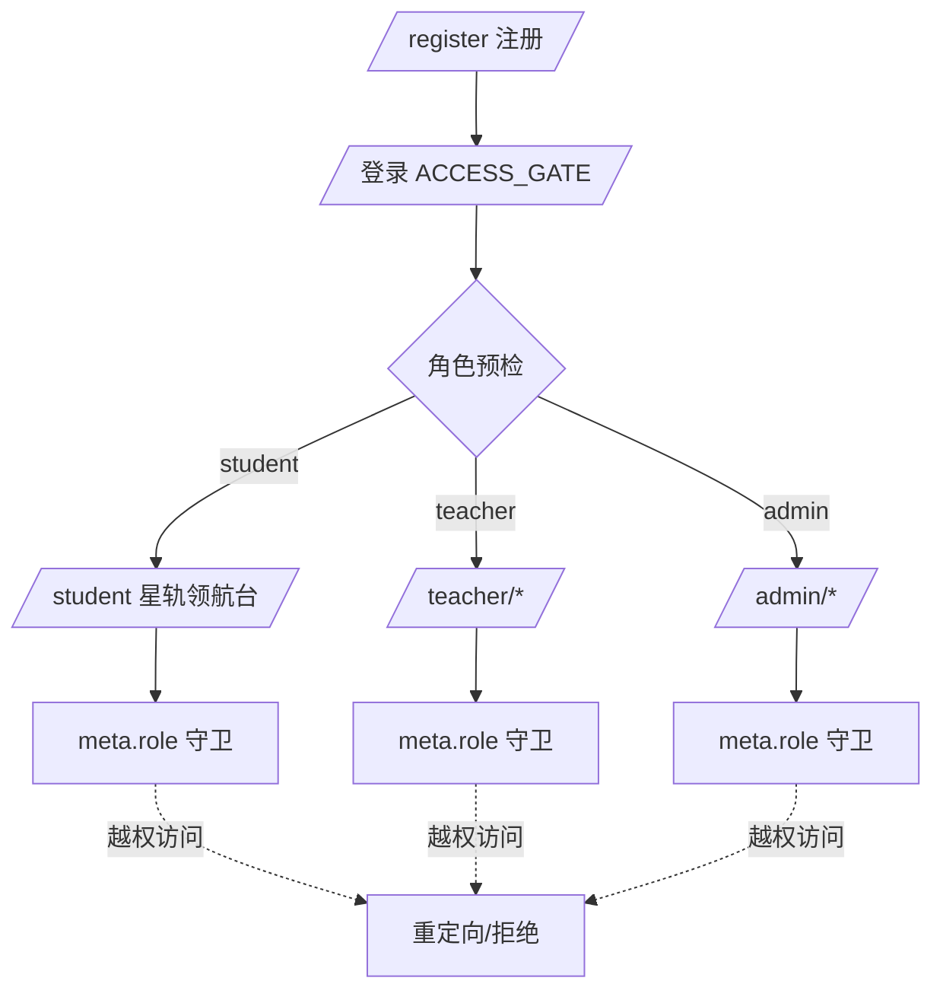

#### 3.2.2 学生角色界面

学生端为单页 Zone 切换架构（`StudentPortal`）：登录后进入星轨领航台，再分流至六大功能区。顶栏提供通知铃铛、数字分身徽章与桌宠入口；各区共用星空背景与返回领航台导航。

**（1）登录接入与星轨领航台（Hub）**

- 终端风 ACCESS_GATE 登录页，文案「接入认知孪生系统」，角色预检后进入学生门户。
- **ZoneHub**：六区星空散点入口（学习区 / 我的星域 / 星语树洞 / 聊天区 / 自习区 / 休闲区），黑洞塌缩动画切换分区，降低功能密度压迫感。

**（2）学习区（Learn）——核心学习闭环**

学习区是学生主战场，由三维星图 + 行星面板 + 左侧 ZoneDock 工具条组成：

| 界面模块 | 功能要点 |
|----------|----------|
| OrbitExplorer | Three.js 星系/行星星图探索，点亮状态与衰减可视化，跃迁定位 |
| BlackHoleAssessment | 新星系「引力黑洞」初测，估计学习起点 |
| PlanetPanel | 单知识点：挑战答题、AI 伴学（Companion/Tutor）、教案、SOS、镜像/多元宇宙预演入口 |
| SimulationConsole | Teacher→Mirror→Evaluator→PathPlanner 多 Agent SSE 流式预演可视化 |
| AvatarBadge / 进度看板 | 积分、连续打卡、周活跃等状态摘要 |

**ZoneDock 学习工具条（17 项）**：

| 工具 | 界面能力 |
|------|----------|
| 画像 | MirrorDashboard：六维雷达、对话抽取、历史趋势、缺维追问、补救计划提交 |
| 资源工坊 | ResourceStudio：多 Agent 生成讲解文档/导图/题库/阅读/媒体/代码，流式展示 |
| 学习路径 | LearningPathPanel：画像驱动步骤生成、打卡、推荐跃迁到对应行星 |
| 成长评估 | GrowthReport：掌握率、错题、专注、资源使用等多维报告 |
| 任务 / 作业 | 每日任务列表、教师布置作业查看与提交 |
| 星链 | KnowledgeGraph：知识点关联图谱浏览 |
| 搭子 | BuddyMatcher：学习伙伴匹配 |
| 智能工具 | AiToolsPanel：相似题、批改、OCR 错题拍照、语音输入等 |
| 智能测验 | AiQuizPanel：AI 出题测验 |
| 错题本 / 笔记 | MistakeBook、NoteBook：错题归档与学习笔记 |
| 番茄钟 | FocusTimer：专注计时与休息节奏 |
| 恒星档案馆 | StellarArchive：学习档案沉淀 |
| 流星雨试炼 | AsteroidChallenge：试炼挑战玩法 |
| 星轨导航仪 | OrbitNavigator：跨星系定位与快速跃迁 |
| 星际通讯舱 | InterstellarComms：通讯/通知类交互 |

**（3）我的星域（Domain）——个人指挥舱**

DomainZone 侧栏导航覆盖：桌宠图鉴、成长总览（含 Mirror 画像与掌握度）、全景数据、称号装备、里程碑时间轴、成就墙；可从星域拉起 Simulation 预演，形成「画像—预演—成长」一体化复盘。

**（4）星语树洞（TreeHole）——情绪与心理支持**

TreeHoleZone 提供：AI 陪伴聊天（CompanionChat）、心情日记（翻页书形态）、匿名树洞动态（发帖/评论/表情反应/图片上传）。与学习区能力解耦，降低情绪门槛。

**（5）聊天区（Chat）——社交与协作**

ChatZone 支持班级房、话题房、群聊、私聊；WebSocket 实时消息；星愿墙与社交面板；通知铃铛可一键跳转到对应会话。

**（6）自习区（Study）——专注与督导**

StudyZone 流程为：StudyGalaxy3D 选星座房间 → 进入自习室。房间内支持：专注/休息/求助状态同步（WebSocket）、专注计时、成员排行、环境音（雨声/星云等）、主题装备；**智能小老师**基于摄像头 + TensorFlow.js coco-ssd 本地推理，检测分心/离开并提醒（视频不上传服务器）。

**（7）休闲区（Leisure）——激励与养成**

LeisureZone 游戏中心包含：星球记忆翻牌、陨石躲避、星座连线、每日星轨轮盘；以及签到、逗桌宠、好友挑战、成就墙、积分商城、运势等。与桌宠亲密度、积分体系联动，维持长期动机。

**（8）跨区公共组件**

- **桌宠**：PetStage / PetPicker / PetActionMenu，与积分、连续打卡、亲密度联动，可在多区悬浮展示。
- **通知**：NotificationBell / NotificationToast，作业、消息、风险提醒等统一入口。
- **数字分身**：自拍经通义千问图生图生成卡通分身，展示于徽章与个人区。

#### 3.2.3 教师角色界面

教师端采用左侧固定导航栏（`TeacherSidebar`）+ 右侧内容面板的统一布局，导航项按「治理 → 内容 → 干预」三类组织，每个面板顶部均使用 `TeacherPageHeader` 输出标题与副标题，并配 `TeacherStatCard` 关键指标卡，形成一致的视觉与交互范式。

**（1）学情看板（`/teacher/dashboard`）**

班级治理的中枢，由 `TeacherDashboardPanel` 实现：

- **概览指标卡**：班级学生数、知识行星总数、平均掌握率、高风险学生数四项关键指标实时呈现。
- **掌握度热力图**：按星系—行星二维矩阵渲染班级整体掌握率热力，鼠标悬停显示具体行星名与掌握率，帮助教师快速定位薄弱知识点群。
- **班级画像矩阵**：聚合全班六维画像均值，输出 `class_tendency_label`（如「图像化偏好 / 易错推导」），辅助教师把握班级整体认知风格。
- **引力陷阱（Gravity Wells）**：识别掌握率显著偏低的「重力陷阱」知识点，提示需重点复习或重讲。
- **风险学生列表**：按高 / 中 / 稳定三档分级，支持筛选；每条记录可一键跳转至学生详情，形成「看板 → 个体」的下钻路径。

**（2）作业 / 成绩 / 考勤 / 巡查 / 消息 / 资料（`/teacher/assignments` 等）**

班级日常治理工具集，分别由 `AssignmentPanel`、成绩册、考勤、巡查、消息通知、教学资料面板承担：

- **作业管理**：教师按班级布置作业（标题 + 内容 + 截止时间），查看学生提交并逐条批改；学生端「任务 / 作业」工具条同步可见。
- **成绩册**：聚合挑战、测验、作业得分，支持按学生 / 按知识点两种视角排序与导出。
- **考勤**：记录学生登录活跃、自习专注会话等行为型考勤数据。
- **巡查**：教师可巡视在线自习室，查看成员状态（专注 / 休息 / 求助），必要时进入房间督导。
- **消息通知**：向班级或指定学生广播通知，学生端通知铃铛实时接收。
- **教学资料**：上传与分发课件、PDF 讲义、补充阅读材料，与「星系锻造」衔接。

**（3）学生名册与详情（`/teacher/students`）**

班级花名册列表，点击进入学生详情页：展示该生六维画像雷达、行星掌握度全景、近期挑战与错题、专注会话统计、补救计划与改进提交历史，是教师进行个体干预的事实依据。

**（4）画像改进复核（`/teacher/improvement`）**

由 `ImprovementReviewPanel` 实现，是人机协同评估的关键落地点：

- 列出所有「待复核」的学生补救提交，显示目标维度、学生反思文本、AI 三档预评（优秀 / 合格 / 不合格）。
- 教师可查看提交详情与分步计划，对 AI 评分进行覆盖（上调或下调），系统据此重算该生对应维度分数。
- 覆盖动作落库并可追溯，避免算法单方面改写学生画像后无记录可查。

**（5）AI 教案（`/teacher/lesson-plan`）**

按行星（知识点）生成结构化教案：教学目标、重难点、讲解思路、例题、课后练习建议，服务教师备课与学生预习，降低从知识图谱到可讲授教案的转化成本。

**（6）星系锻造（`/teacher/galaxy-forge`）**

由 `GalaxyForgePanel` 实现，是教师侧内容生产的核心创新：

- 教师上传课程讲义 PDF，填写星系标题，点击锻造。
- 后端 `galaxy_forge.py` 解析 PDF 文本，经 LLM 结构化抽取知识点，生成 `Galaxy` 与 `Planet` 节点，并为每个行星自动生成挑战题。
- 锻造产物发布到星图后，学生即可探索与挑战点亮，形成「讲义 → 可练习知识宇宙」的闭环。

**（7）时空扭曲沙盘（TimeWarpSandbox）**

教师端独有推演工具：选择某学生，手动覆盖其六维画像中的若干维度分数（模拟「假如该生认知风格改变 / 前置知识补齐」等假设），启动镜像预演，对比默认画像下的预演结果差异，用于教研讨论与干预策略设计。该模块把多智能体仿真能力从学生自助工具升级为教师教研工具。

#### 3.2.4 管理员角色界面

管理端定位为系统运维与合规控制台，采用与教师端一致的左侧导航 + 右侧面板布局，按「概览 → 用户 → 内容 → 用量 → 异常 → 维护」组织六个功能模块：

- **系统概览（`AdminOverview`）**：呈现平台整体状态仪表盘，包括注册用户数、活跃学生 / 教师数、在线自习室数、当日 Token 消耗总量、LLM 调用成功率等关键运维指标，帮助管理员一眼掌握系统健康度。
- **用户管理（`AdminUsers`）**：用户列表支持按角色（学生 / 教师 / 管理员）、班级、状态筛选；支持新建、编辑、停用账号，重置密码，调整角色与班级归属。所有写操作受 RBAC 约束并写入审计日志。
- **内容管理（`AdminContent`）**：对全平台星系、行星及生成式资源（`GeneratedResource`）进行审核、上下架与删除；可对违规或低质 AI 生成内容做屏蔽处理，配合 `shield` 风控形成「自动 + 人工」双重内容治理。
- **Token 用量监控（`AdminUsage`）**：按模型（DeepSeek / 讯飞星火 / 通义千问 / cantonese.ai 等）、按用户、按时间维度统计 Token 消耗与成本，支持阈值告警，为 3.6 节成本控制策略提供数据依据。
- **接口异常（`AdminErrors`）**：聚合后端 `ApiUsageLog` 中的错误记录，按错误码、接口路径、用户聚类展示，辅助定位 LLM 超时、鉴权失败、第三方服务抖动等线上问题。
- **维护模式（`AdminMaintenance`）**：一键开启维护模式后，`MaintenanceMiddleware` 将对所有非管理员写操作返回 503，前端展示维护提示页，便于版本发布或故障应急期间冻结业务写入；关闭后系统自动恢复。

#### 3.2.5 交互与合规设计要点

- 角色预检：登录所选角色必须与账号真实角色一致。
- 沉浸式分区降低功能密度压迫感；关键学习决策仍提供数据面板。
- 树洞匿名与情绪支持分区，与学习区能力解耦。
- 自习视觉检测优先本地推理，减少原始视频外传。

### 3.3 后端服务集成

#### 3.3.1 服务形态

后端以 FastAPI 单应用（`app.main:app`）统一承载全部角色与通道，所有业务接口统一前缀 `/api`，按传输形态划分为四类服务：

**（1）HTTP JSON API（REST 风格）**

承担绝大多数业务读写，包括认证、星系宇宙、挑战作答、画像抽取、学习路径、教师治理、管理运维等。接口按资源分组组织（见 3.3.2），返回 Pydantic 校验后的结构化 JSON，便于前端类型推导与错误处理。

**（2）WebSocket 实时通道**

用于需要双向实时推送的场景：

- `/api/ws/chat/{room_id}`：聊天室消息收发，支持班级房、话题房、群聊、私聊。
- `/api/ws/study/{room_id}`：自习室成员状态同步（专注 / 休息 / 求助），多人在线感知。
- `/api/ws/asr`：实时语音听写，前端采集音频帧转发讯飞 IAT，转写文本流式回传。

**（3）SSE 流式事件**

用于单向长文本生成的渐进式呈现：

- 仿真预演：Teacher → Mirror → Evaluator → PathPlanner 多 Agent 事件按角色流式推送。
- 资源生成：Doc / Mind / Quiz / Read / Media / Code 六类 Agent 的生成过程逐段回传，前端边接收边渲染。

SSE 相比 WebSocket 更轻量，适合「服务端推、客户端只读」的生成场景，避免双向通道的资源浪费。

**（4）静态资源服务**

- `/static/uploads`：用户上传文件（头像、PDF 讲义、口语音频等）。
- `/static/assets`：前端构建产物与图标资源。

**（5）中间件层**

- **CORS**：允许前端开发与跨域部署访问。
- **MaintenanceMiddleware**：维护模式开启后拦截非管理员写操作并返回 503，配合管理端一键开关实现应急冻结。

#### 3.3.2 主要 API 分组（节选）

后端路由按业务域分组，所有接口统一挂载于 `/api` 前缀下，主要分组与代表路径如下：

| 分组 | 代表路径 | 说明 |
|------|----------|------|
| 健康 | `GET /api/health` | 探活，供前端与运维监控调用 |
| 认证 | `/api/auth/*` | 预检、登录、注册、当前用户、用户名查重 |
| 星系 | `/api/galaxies`、`/api/planets/*`、`/api/orbit` | 宇宙浏览、行星掌握、轨道快照 |
| 挑战 | `/api/planets/{slug}/challenge`、`/api/challenges/submit` | 出题与判题点亮闭环 |
| Agent | `/api/agents/companion`、`/api/agents/oral*` | 伴学对话与口语练习 |
| 画像 | `/api/profiles/*` | 抽取、时间线、流式抽取、补救计划 |
| 仿真 | `/api/simulations/*` | mirror / multiverse / stream 预演 |
| 学习 | `/api/learn/*` | 路径、图谱、日任务、成长报告 |
| 教师 | `/api/teacher/*` | 班级治理、作业、考勤、巡查、锻造、沙盘 |
| 管理 | `/api/admin/*` | 用户、内容、用量、异常、维护模式 |
| 聊天/自习 | `/api/chat/*`、`/api/study/*` | 社交与专注会话 |
| 社交 | `/api/social/*` | 好友、虫洞、SOS、排行榜 |
| 作业 | `/api/assignments/*` | 学生端作业查看与提交 |

**分组设计要点**：

- **角色隔离**：`/api/teacher/*` 与 `/api/admin/*` 在路由层即按角色守卫，非对应角色调用直接返回 403，与前端 `meta.role` 守卫形成双层防护。
- **流式与同步分离**：长耗时生成（仿真、资源、伴学流式）走 SSE 端点，普通读写走同步 JSON，避免阻塞 FastAPI 事件循环。
- **资源命名一致性**：路径按资源名词复数组织（`/galaxies`、`/planets`、`/profiles`），符合 REST 习惯，降低前后端协作成本。
- **教师与管理员分治**：教师端聚焦班级治理与教学干预，管理员端聚焦平台运维与合规，两者 API 前缀清晰隔离，避免权限越界。

#### 3.3.3 数据库核心实体

数据层基于 SQLAlchemy Async ORM 映射 MySQL（可切换 SQLite / PostgreSQL），核心实体按业务域组织，覆盖账号、知识图谱、画像、仿真、学习、社交、运维七大类：

| 实体 | 作用 |
|------|------|
| `User` / `SchoolClass` | 账号、角色、班级归属，是所有业务数据的归属主体 |
| `Galaxy` / `Planet` | 知识宇宙结构，星系对应课程单元，行星对应知识点 |
| `PlanetMastery` / `ChallengeQuestion` | 学生对行星的掌握状态与题目池 |
| `StudentProfile` / `ProfileExtraction` | 六维画像当前快照与抽取历史，支持时间线回溯 |
| `LearningPath` | 个性化路径 JSON 步骤，记录生成与打卡状态 |
| `SimulationRun` / `SimulationEvent` | 多智能体预演的运行记录与事件流，支持回放审计 |
| `RemediationPlan` / `ImprovementSubmission` | 补救计划与学生反思提交，承载人机协同评估闭环 |
| `GeneratedResource` | 六类 Resource Agent 的生成物（文档 / 导图 / 题库 / 阅读 / 媒体 / 代码） |
| `ChatSession` / `ChatMessage` | 聊天会话与消息，支撑班级房、群聊、私聊 |
| `FocusSession` / `MistakeRecord` / `StudyRoom` | 专注会话、错题归档、自习室定义 |
| `Assignment` / `AssignmentSubmission` / `AttendanceRecord` | 作业、提交、考勤记录 |
| `TreeHolePost` / `MoodDiary` | 树洞匿名动态与心情日记 |
| `Alert` / `UserNotification` | 风险提醒与用户通知 |
| `ApiUsageLog` / `SystemSetting` | Token 用量日志与系统配置（含维护模式开关） |

**实体关系设计要点**：

- **以 `User` 为核心枢纽**：画像、路径、掌握度、仿真、补救、资源、专注、错题等均通过外键关联到 `User`，便于按学生聚合全维度数据，支撑教师端学生详情下钻与成长报告生成。
- **知识图谱与掌握度分离**：`Galaxy` / `Planet` 描述全局知识结构，`PlanetMastery` 描述个体掌握状态，二者解耦使知识图谱可被多学生共享，掌握度按个体独立维护。
- **仿真事件流独立持久化**：`SimulationRun` 与 `SimulationEvent` 为一对多关系，完整保存多 Agent 事件序列，支持回放、审计与 TimeWarp 对照推演。
- **运维数据分表**：`ApiUsageLog` / `SystemSetting` 与业务数据分表，降低用量写入对主链路查询的影响。完整 WORM/不可篡改审计库为合规增强项，当前未宣称已达等保级审计标准。

认证令牌为轻量 `Bearer token-{user_id}`（非 JWT），适合教学演示场景的快速鉴权；密码采用 pbkdf2 加盐存储（兼容历史 sha256），保证账号安全。

**图 3.3 核心数据实体关系（ER）**

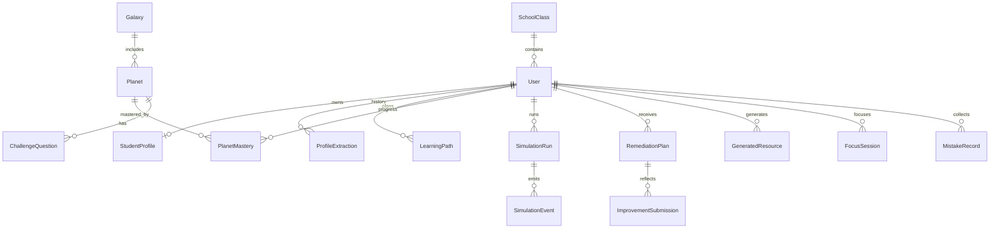

### 3.4 智能分析与决策链路

智能分析与决策链路是平台从「原始行为」到「教学干预」的核心转换通道，按「采集 → 建模 → 决策 → 反馈 → 安全」五段闭环组织，每一段均定义了明确的数据契约与工程边界：

**（1）采集层（多源异构数据接入）**

系统从五类源头持续采集学生行为与学习数据：

- **对话与作答**：六维画像对话、行星挑战作答、伴学聊天等文本交互。
- **语音口语**：通过 `/api/ws/asr` 与口语评测接口采集普通话 / 英语 / 粤语音频及评测结果。
- **视觉督导**：自习区前端 TensorFlow.js 本地推理产生的「分心时间 / 离开次数」等标量事件（原始视频不上传）。
- **PDF 讲义**：教师星系锻造上传的课件文本，经解析后作为知识图谱与 RAG 的来源。
- **专注与社交**：自习专注会话、聊天室活跃、好友互动等过程性数据。

**（2）建模层（结构化认知表征）**

原始数据被映射为三类可计算的结构化模型：

- **画像 JSON**：六维认知画像（`StudentProfile`）+ 抽取历史（`ProfileExtraction`），支持缺维追问与事件驱动增量刷新。
- **掌握度状态机**：`PlanetMastery` 记录每个行星的点亮 / 衰减 / 超新星状态，由 `memory_decay.py` 按艾宾浩斯启发阈值驱动状态迁移。
- **仿真事件流**：`SimulationRun` / `SimulationEvent` 持久化多智能体预演的完整事件序列，支持回放与审计。

**（3）决策层（AI 驱动的教学推理）**

基于上述模型，系统产出四类决策结果：

- **路径步骤**：`learning_path.py` 综合画像维度、行星掌握与学习目标，生成可打卡的步骤化学习路径。
- **资源编排**：`resource_agents.py` 的 Coordinator 按需调度 Doc / Mind / Quiz / Read / Media / Code 六类 Agent，SSE 流式产出。
- **补救建议**：Evaluator 错因归因 + PathPlanner 补救路径，写入 `RemediationPlan`。
- **风险列表**：教师端看板基于掌握率下滑、专注异常、改进未通过等信号输出风险学生分级。

**（4）反馈层（可解释的人机协同输出）**

决策结果以可解释形态回传师生：

- **成长报告**：`evaluation.py` 聚合掌握率、错题、专注、资源使用等多维指标输出结构化报告。
- **可视化**：前端以 ECharts 雷达图、趋势图、热力图呈现画像与掌握度变化。
- **流式 Agent 日志**：仿真与资源生成的 SSE 事件角色化推送，师生可观察 Teacher 陷阱设计、Evaluator 归因、Planner 步骤等思维链。
- **教师覆盖评分**：AI 对改进提交的三档预评可被教师在 `ImprovementReviewPanel` 中覆盖，形成「AI 建议 + 人类裁决」的双层反馈。

**（5）安全层（输出审核与熔断）**

- `shield.py` 对 Agent 输出做敏感词与可选 LLM 审核双重过滤。
- 维护模式中间件在应急期间冻结非管理员写操作，保证系统可控降级。
- Token 消耗写入 `ApiUsageLog`；沙盘调分与改进覆盖有业务落库可追溯。不宣称已建成独立「不可篡改审计日志库」。

### 3.4.1 多模型协同矩阵与多模态集成

系统采用 **多模型协同矩阵**，按任务类型路由到最合适的引擎，兼顾赛题"优先使用科大讯飞相关工具"的建议、核心推理质量与多语种/多模态覆盖：

| 能力域 | 选型 | 职责 |
|--------|------|------|
| 核心推理 | DeepSeek | Evaluator 错因归因、PathPlanner 路径规划、画像结构化抽取 |
| 中文长文本/多轮对话 | 讯飞星火 X2 / 4.0 Turbo | DocAgent/QuizAgent 文档与题库生成、Companion 伴学 |
| 普通话 / 英语语音听写 | 讯飞 IAT | 实时 ASR（WebSocket；`zh_cn` / `en_us`） |
| 普通话 / 英语口语评测 | 讯飞 ISE | 发音评分（`cn` / `en`；英语舱位如四六级/雅思/日常英语） |
| 粤语 STT / 发音评分 | cantonese.ai | 粤语听写与口语测评，补齐方言场景 |
| 数字分身图生图 | 通义千问 Qwen（DashScope） | 自拍 → 提示增强 → 卡通分身生成 |
| 教学视频/动画 | 火山方舟 Seedance 1.0 Pro Fast（已开通） | MediaAgent 经接入点生成短视频并落盘；失败降级 GSAP/缓存 |
| 本地向量检索 | ChromaDB | RAG 溯源、Tutor 依据来源与判题上下文 |

路由策略呼应 3.6 节：核心评估与资源质量评分优先走 DeepSeek；长文本与日常伴学走讯飞星火以控制成本；视觉分身走通义千问；普通话与英语语音走讯飞 IAT/ISE，粤语走 cantonese.ai；教学短视频走已开通的 Seedance 1.0 Pro Fast 接入点，失败再降级 GSAP/缓存片。

### 3.5 技术栈详解

#### 3.5.1 前端

| 类别 | 技术 |
|------|------|
| 框架 | Vue 3、Vite、TypeScript、vue-router、Pinia |
| 样式 | Tailwind CSS、PostCSS |
| 3D | Three.js |
| 可视化 | ECharts |
| 动画 | GSAP |
| 前端 ML | TensorFlow.js、coco-ssd |
| 文档渲染 | markdown-it、highlight.js |

#### 3.5.2 后端

| 类别 | 技术 |
|------|------|
| Web | FastAPI、Uvicorn、WebSockets、SSE |
| ORM/DB | SQLAlchemy Async、aiomysql（MySQL）、可选 aiosqlite/asyncpg |
| 校验配置 | Pydantic Settings、python-dotenv |
| LLM | DeepSeek + 讯飞星火 X2/4.0 Turbo（多模型协同矩阵·文本推理/生成） |
| 语音 | 讯飞 IAT/ISE（普通话 / 英语）、cantonese.ai（粤语）、ffmpeg |
| 视觉云 | 通义千问 Qwen 图生图；火山方舟 Seedance 1.0 Pro Fast（教学短视频）；Pillow；本地缓存片（static/media） |
| RAG | ChromaDB（启动 seed 校本大纲） |
| 其它 | httpx、python-multipart、python-docx |

配置项见 `backend/app/core/config.py`：`DEEPSEEK_*`、`QWEN_*`、`XF_*`、`CANTONESE_AI_*`、`FFMPEG_PATH`、`shield_use_llm` 等。

### 3.6 成本控制与并发降级策略

多智能体预演（Simulation）与资源生成高度依赖 LLM。当前仓库**已落地**的是按任务分流的多模型路由；语义缓存与消息队列削峰列为**规划中**，避免文档超前于代码。

**已实现**

- **大小模型 / 多模态任务路由**：评估与错因归因、资源质量评分等偏推理任务优先走 DeepSeek；伴学闲聊与长文本生成可走讯飞星火 / 通义千问轻量接口；语音走讯飞 IAT/ISE 或 cantonese.ai；视觉分身走通义千问图生图；教学短视频走 Seedance 1.0 Pro Fast（接入点异步生成并本地下载，失败降级 GSAP/缓存）。路由实现见各服务对模型客户端的选用，而非宣称「已保证最强推理」。

**规划中**

- **语义缓存（Semantic Cache）**：按六维画像 + 行星相似度命中历史预演轨迹，减少重复 LLM 调用（拟 Redis / 向量索引）。
- **限流与排队削峰**：晚自习等高并发时段用限流器 + 消息队列（如 Redis Stream）对多 Agent 请求削峰；超水位时暂停流式多角色互评、降级为单次判题（UI 可提示「引力波干扰，预演精简中」）。

---

## 第四章 技术和功能创新

### 4.1 项目优势分析

#### 4.1.1 对比维度（示意）

| 对比维度 | 常见网课/题库平台 | 一般 AI 答疑机器人 | SparkOrbit 星轨学图 |
|----------|-------------------|--------------------|---------------------|
| 学习者建模 | 进度/正确率 | 弱或会话级 | 持久六维画像 + 教师复核 |
| 知识组织 | 章节列表 | 无结构 | 星系—行星—星座 + 衰减 |
| 诊断方式 | 练后统计 | 单次问答 | 多智能体作答前预演 |
| 教师角色 | 发公告/批改 | 基本缺位 | 看板、锻造、TimeWarp、改进覆盖 |
| 多模态 | 少 | 文本为主 | 语音口语 + 可播短视频样例 + 本地视觉督导 + 分身 |
| 动机设计 | 弱 | 弱 | 分区沉浸 + 桌宠/休闲/成就 |

#### 4.1.2 技术创新摘要

1. **认知孪生工程化**：画像不只是展示雷达图，而是驱动仿真人格、路径与资源编排的同一数据源。
2. **可观察多智能体流水线**：SSE 事件角色化，支持教学演示与过程审计。
3. **遗忘显性化状态机**：fading / meteor / dim 与复习固化写入产品叙事。
4. **人机协同评分**：改进提交 AI 评分可被教师覆盖，避免黑箱终裁。

### 4.2 智能对话与伴学引擎

平台以「对话」作为人机交互的统一入口，构建了覆盖学习闭环全过程的智能对话与伴学引擎，由 `companion.py`、`ai_tutor.py`、`oral_practice.py` 等服务协同实现：

**（1）Companion / Tutor 双模式伴学**

- **Companion 模式**：以学习伙伴人格出现，侧重情感陪伴、碎片授予与轻量激励，对话中可触发知识碎片奖励，强化长期留存。路由至讯飞星火或通义千问轻量接口，兼顾成本与中文表达自然度。
- **Tutor 苏格拉底模式（默认）**：先问后讲，禁止首轮直接给最终答案；结合 RAG / 行星描述给出知识点 ID 边界与依据来源；可切换为普通讲解模式便于对比演示。
- **费曼模式（`mode=feynman`）**：学生用自己的话讲解知识点，Tutor 复述正确点、指出漏洞并追问；讲解事件写入学习行为并触发画像增量刷新。
- 两种模式共享流式 SSE 输出，前端逐字渲染，避免长等待空白。

**（2）挑战链路内嵌的 Teacher / Evaluator 分工**

挑战答题环节由 Teacher Agent 与 Evaluator Agent 角色隔离：Teacher 出题时输出考察点、`expected_key_points`、陷阱与 `knowledge_point_id`（行星 slug）；Evaluator **独立**产出 `cited_knowledge_point_id` 与置信度（禁止抄出题 ID 自证）。低置信度、引用不一致或逻辑矛盾时生成教师端「待人审」工单，前端不以低置信结果作权威终裁（详见 4.6 节）。

**（3）听说读写多通道练习**

口语 Agent 将讯飞 IAT / ISE（普通话 / 英语）与 cantonese.ai（粤语）的 ASR 转写、发音评分结果并入辅导上下文，使伴学引擎可针对发音薄弱点给出针对性练习建议，形成「听 → 说 → 评 → 练」闭环，而非仅文本问答。

**（4）相似题举一反三与作业批改**

`ai_tutor.py` 支持基于当前错题生成同考点变式题，帮助学生举一反三；同时支持作业与作答批改，输出结构化批改意见，减轻教师重复性批改负担。

### 4.3 多样化学习体验分区

不同于多数学习平台将所有功能堆叠在单一「课程页」的做法，SparkOrbit 将学生端拆解为六大功能分区，分别对应学习者不同维度的需求，以「沉浸式分区 + 星轨隐喻」降低长时间在线学习的倦怠与孤岛感：

- **认知维度（学习区 / 我的星域）**：承担核心学习闭环与个人成长复盘，三维星图与雷达图提供数据化反馈（**赛题主链路**）。
- **情绪维度（星语树洞）**：与学习区能力解耦的匿名情绪出口（**体验增强，非赛题必选**）。
- **社交维度（聊天区）**：班级房、话题房、群聊、私聊与星愿墙（**体验增强，非赛题必选**）。
- **专注维度（自习区）**：3D 选房 + 专注计时 + 排行 + 环境音 + 本地视觉督导，服务过程性数据（热力图等）。
- **激励维度（休闲区）**：小游戏、签到、商城、好友挑战、桌宠养成（**体验增强，非赛题必选**；答辩话术中 10 秒带过）。

各分区共用星空背景、桌宠、通知与数字分身等跨区公共组件，保证世界观一致的同时，通过 Zone 状态机实现「功能密度分散、体验连贯统一」，避免单一界面信息过载。

### 4.4 教师侧内容与推演创新

- **星系锻造**：讲义 PDF → 可练习知识宇宙，缩短备课结构化成本。
- **时空扭曲沙盘**：假设性调分后预演，服务教研与干预策略讨论。
- **风险看板 + 改进复核**：把 AI 产出纳入班级治理流程。

**图 4.1 星系锻造：从讲义到可练习知识宇宙**

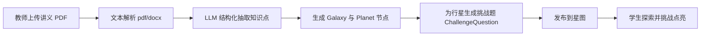

### 4.5 教育理念融合

SparkOrbit 并非纯技术堆砌，而是将多项成熟教育理念嵌入产品数据模型与交互流程，使 AI 能力服务于教学规律而非取代之：

- **因材施教**：六维画像（专业背景、前置知识、认知风格、易错倾向、学习目标、时间弹性）刻画个体差异，学习路径步骤与画像维度绑定，支撑差异化推送（演示见 `docs/evidence/path_cases.md`），而非宣称已达工业级「千人千面」精度。
- **苏格拉底式学习**：Tutor 默认苏格拉底模式——先提问引导、禁止首轮直接给最终答案，迫使学生自行推理后再给线索。
- **费曼学习法**：行星面板提供费曼模式开关——学生先讲、系统挑错追问，巩固「会说才会」的掌握标准，并回写易错/行为事件。
- **形成性评价**：成长报告、错题本、专注会话、挑战事件等连续采集过程性数据，评价重心从「期末一锤定音」转向「过程持续诊断」，教师可基于过程数据及时干预。
- **掌握学习（Mastery Learning）+ 间隔复习**：行星点亮代表掌握，衰减状态机（fading / meteor / dim）把遗忘显性化为「陨石危机」，鼓励学生在遗忘临界点及时复习；多次巩固后标记为「超新星」永久固化，呼应掌握学习理论中「达标后再进阶」的理念。
- **安全学习氛围**：星语树洞与 AI 陪伴提供低门槛情绪出口，督导提醒侧重自我管理（「检测到你离开镜头了」）而非惩罚，构建心理安全的学习环境。
- **人机协同而非替代**：教师始终保有画像覆盖、改进复核、TimeWarp 推演与低置信判题工单裁决权，AI 提供建议与初评，但终裁由人类教师完成。

### 4.6 当前工程防幻觉机制（已实现 / 规划中）

在教育场景中，"教错"比"不教"的危害更大。SparkOrbit 不以「已完美互锁」自居，而是落地可演示、可审计的工程约束：

**已实现**

- **Agent 角色隔离**：Teacher 出题与 Evaluator 判题分 Prompt / 分职责，出题携带 `knowledge_point_id`、`expected_key_points`、`traps`、`source_refs`。
- **Evaluator 独立引用**：判题侧独立产出 `cited_knowledge_point_id` 与置信度（禁止抄出题 ID 自证）；前端展示「依据知识点」。
- **低置信 / 矛盾转教师**：`confidence < 0.55`、引用不一致或 Teacher/Evaluator 逻辑矛盾时，写入教师可见「待人审」工单，不以低置信结果作权威终裁。
- **RAG 校本溯源**：ChromaDB 灌入 seed 行星大纲；Tutor / 判题注入检索上下文，并返回 `sources`（无检索命中时回退行星描述伪源，保证演示不空）。
- **资源质量自动评分**：六类资源生成后 DeepSeek 打分（准确性/画像贴合/完整性/幻觉风险），低分可自动重试。
- **内容安全 Shield**：敏感词与可选 LLM 审核，拦截有害输出（属内容安全，非事实幻觉）。

**规划中**

- PDF 页码级强制引用与补救路径页码绑定。
- Redis 语义缓存与消息队列削峰（见 §3.6）。

### 4.6.1 能力对照表（避免现场口径漂移）

| 能力 | 状态 | 说明 |
|------|------|------|
| 六维对话画像 + 事件刷新 | 已实现 | `profiling` / `profile_refresh`；挑战/费曼后增量更新 |
| 6 类 Resource Agent | 已实现 | Doc/Mind/Quiz/Read/Media/Code |
| Seedance 1.0 Pro Fast 教学短视频 | 已实现 | 已开通；接入点异步生成并落盘 `static/media/generated/` |
| GSAP 分镜 / 缓存片降级 | 已实现 | Seedance 失败或未配置时回退 |
| 资源质量自动评分 | 已实现 | A/P/C/H 四维；低分重试 |
| 苏格拉底 Tutor | 已实现 | 默认开启，可切换普通讲解 |
| 费曼模式 Tutor | 已实现 | 行星面板勾选；讲解事件回写画像 |
| LangGraph 仿真编排 | 已实现 | Teacher→Mirror→Evaluator→PathPlanner |
| 评估回灌路径 | 已实现 | `POST /api/learn/evaluation-report/apply-to-path` |
| 知识点 ID + 低置信/矛盾工单 | 已实现 | Evaluator 独立引用；可勾选强制低置信演示 |
| 校本 RAG（Chroma seed） | 已实现 | 无命中回退伪源；非页码强制 |
| PDF 页码强制引用 | 规划中 | — |
| Redis 语义缓存 / 队列削峰 | 规划中 | 见 §3.6；勿写成已上线 |

### 4.7 赛题评分要点覆盖说明

本系统按赛题评分权重逐项设计，确保关键得分点覆盖。

**表 4.1 评分要点覆盖**

| 评分项 | 占比 | 本系统覆盖方式 |
|--------|------|----------------|
| 创新性 | 20% | Agent 协作可视化（SSE）、画像可解释性（六维雷达 + raw_evidence）、知识点 ID / RAG 溯源（呼应 4.6） |
| 实用性 | 15% | 以 AI/计算机专业课程为切入点，星系锻造将本校讲义转化为校本练习图谱 |
| 核心功能完成度 | 25% | 画像 ≥6 维、资源 ≥5 种（含 Seedance 短视频）、路径规划、苏格拉底/费曼辅导、评估雷达/热力与回灌路径 |
| 技术实现质量 | 15% | FastAPI + SSE、模块化服务、多模型协同矩阵（DeepSeek / 讯飞 / 通义千问 / cantonese.ai） |
| 功能创新 | 5% | Mirror 镜像预演、TimeWarp、星系锻造等拓展智能体 |
| 配套文档 | 10% | 本设计实现方案 + `docs/evidence` 评分证据包 + 附录 B |
| 演示视频/PPT | 10% | `docs/evidence/demo_script.md` 实操脚本（系统演示 ≥60%） |

---

## 第五章 系统功能测试

本章采用核心链路（Happy Path）走查与边缘异常注入测试，确保主业务数据状态机流转闭环；指标以可演示流程与预期行为为准，不编造未在工程中测定的准确率。

### 5.1 学生面试式主流程（学习闭环）

**图 5.1 学生学习闭环主流程**

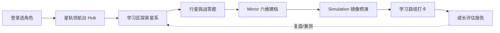

#### 5.1.1 前置准备

1. 打开前端登录页，选择角色 **student**，使用有效账号或注册学生账户。
2. 进入 `/student` 星轨领航台，确认六区入口可见。
3. （可选）在画像面板通过对话完成六维信息采集，直到缺维列表减少。

**预期**：角色校验通过；Hub 动效与分区切换正常；画像接口返回结构化六维 JSON。

#### 5.1.2 自动化学习交互

1. 进入学习区，选择星系与未点亮行星。
2. 发起挑战：系统出题 → 作答提交 → 查看判题反馈。
3. 对薄弱知识点打开 SimulationConsole，启动镜像预演，观察 Teacher/Mirror/Evaluator/PathPlanner 事件流。
4. 在学习路径面板生成/打卡步骤，并跃迁到推荐行星。
5. 打开成长评估，查看报告中的掌握与建议摘要。

**预期**：掌握度状态更新；仿真 SSE 连续推送且可完成收尾；路径步骤状态变化；报告可打开。

#### 5.1.3 分区辅助体验抽检

| 场景 | 操作要点 | 预期 |
|------|----------|------|
| 星语树洞 | 发心情日记/匿名帖 | 内容可见，互动可用 |
| 聊天区 | 进入班级房发送消息 | WS 实时送达 |
| 自习区 | 加入房间、开专注；开摄像头督导 | 状态同步；分心提醒可触发 |
| 休闲区 | 签到/小游戏/商城 | 积分或成就变化合理 |

### 5.2 教师评分与干预

本用例验证教师端班级治理与内容锻造链路的完整性，是「人机协同」落地的关键走查。

**测试步骤**

1. 教师账号登录，角色预检通过后进入 `/teacher/dashboard` 学情看板，确认概览指标卡、掌握度热力图、引力陷阱、风险学生列表均正常加载。
2. 在作业管理面板按班级布置一份作业（标题 + 内容 + 截止时间），切换到学生端验证「任务 / 作业」工具条可见该作业。
3. 进入画像改进复核面板，选择一条待复核的补救提交，查看学生反思文本与 AI 三档预评，执行「覆盖评分」操作（上调或下调），确认系统重算维度分数并写入日志。
4. 使用星系锻造上传一份 PDF 课件，填写星系标题后点击锻造，等待 LLM 解析完成，确认星系列表中出现新生成的星系及其下属行星与挑战题。
5. 打开 TimeWarp 时空扭曲沙盘，选择某学生，手动调整其若干维度分数后启动推演，对比默认画像与假设画像下的预演事件流差异。

**预期结果**

- 班级数据仅对所属教师可见，跨班级访问被拒绝（RBAC 隔离生效）。
- 复盖评分动作回写 `ImprovementSubmission` 并反映到该生画像维度分。
- 锻造产物正确写入 `Galaxy` / `Planet` / `ChallengeQuestion`，学生端星图可探索新行星。
- TimeWarp 沙盘事件流完整，与默认预演结果存在可观察差异，证明假设性推演链路可用。

### 5.3 多模态能力

本用例验证文本之外的语音、视觉、图像生成等多模态通道，确保赛题「多模态卡片化」要求落地。

**测试步骤**

1. **实时 ASR**：在前端开启麦克风，建立 `/api/ws/asr` WebSocket 连接，说话后观察转写文本是否实时回传（需配置讯飞 IAT 密钥）。
2. **口语评测**：通过口语练习页面上传或录制一段口语音频，确认返回发音评分与辅导反馈；可切换英语舱位（四六级/雅思/日常英语）验证讯飞 ISE `en`，切换粤语模式验证 cantonese.ai。
3. **数字分身生成**：在个人区上传一张自拍，触发 `avatar_service`，确认通义千问图生图返回卡通分身并展示于徽章。
4. **自习视觉督导**：进入自习室并允许浏览器摄像头权限，刻意遮挡镜头或离开画面，观察前端 TensorFlow.js + coco-ssd 是否触发分心 / 离开提醒，并确认视频帧未上传服务器（仅标量事件落库）。

**预期结果**

- 未配置对应密钥时，各多模态接口返回明确降级或错误提示，而非静默失败。
- 配置齐全时主路径可跑通：ASR 实时转写、口语评分、分身生成、督导提醒均按预期触发。
- 自习督导全程本地推理，网络面板无视频流上传，验证隐私最小化采集设计。

### 5.4 管理与运维

本用例验证管理端运维控制台的核心功能，确保平台可运营、可审计、可应急。

**测试步骤**

1. 管理员账号登录，进入系统概览页，确认注册用户数、活跃用户、在线自习室、当日 Token 消耗、LLM 调用成功率等指标正常加载。
2. 进入用户管理，按角色与班级筛选用户列表，执行新建、编辑、停用账号与重置密码操作，验证 RBAC 权限约束与审计日志写入。
3. 进入内容管理，对某条 AI 生成资源执行下架或删除，确认学生端对应内容不再可见。
4. 进入 Token 用量监控页，按模型与时间维度查看消耗统计与成本，验证阈值告警是否在模拟超限时触发。
5. 进入接口异常页，确认能按错误码与接口路径聚类查看历史错误记录。
6. 开启维护模式，使用学生 / 教师账号尝试写操作（如提交作业、发消息），验证返回 503 且前端展示维护提示；关闭维护模式后写操作恢复。

**预期结果**

- 权限隔离正确：管理员可访问全部模块，非管理员访问 `/admin/*` 被拒绝。
- 关键运维写操作可追溯（用量日志 / 系统设置）；不以「全量不可篡改审计」作为本用例通过标准。
- 维护模式行为符合 `MaintenanceMiddleware` 设计：非管理员写操作被冻结，读操作不受影响，关闭后自动恢复。

### 5.5 质量与安全抽检

本用例针对内容安全、权限隔离与长耗时接口稳定性进行边缘异常注入测试，验证系统在异常输入与越权场景下的鲁棒性。

**测试步骤**

1. **内容风控**：向伴学对话、星语树洞动态、聊天区消息分别输入明显违规诱导内容（如攻击性言论、不当价值观诱导），观察 `shield` 风控网关是否拦截、改写或拒绝下发。
2. **越权访问**：以学生账号尝试直接访问 `/admin` 路由与教师专属 API（如 `/api/teacher/*`），以教师账号尝试访问 `/api/admin/*`，验证角色守卫与后端 RBAC 双层拦截。
3. **流式稳定性**：对仿真预演与资源生成等长耗时接口持续观察，确认 SSE 心跳保持、前端不假死、断网重连后可恢复或优雅终止。
4. **降级验证**：模拟 LLM 超时或第三方服务不可用，确认系统按 3.6 节策略降级（如多 Agent 仿真降级为单次判题），核心答题链路不中断。
5. **防幻觉演示**：提交挑战后检查结果是否展示 `cited_knowledge_point_id` 与置信度；构造低置信或引用不一致/矛盾场景，确认教师端出现「待人审」工单并由人类接管裁决。

**预期结果**

- 违规内容被 `shield` 拦截或改写，不展示给终端学生。
- 越权访问在前端路由守卫与后端接口层均被拒绝，返回明确 403 / 重定向。
- 长耗时接口流式渐进呈现，无空白等待与前端卡死。
- 降级路径生效，核心学习闭环在异常条件下仍可用。
- 判题带知识点引用与置信度；低置信工单出现在教师端，由人类接管裁决。

---

## 第六章 总结与展望

### 6.1 系统总结

SparkOrbit 星轨学图围绕「**认知孪生驱动的个性化学习**」完成了从产品隐喻到工程实现的贯通：

1. **建模层**：六维画像持久化、缺维追问、事件刷新与教师复核。
2. **知识层**：星系—行星图谱、挑战点亮、遗忘衰减与复习固化。
3. **决策层**：多智能体预演、路径规划、资源多 Agent、成长评估。
4. **体验层**：六大沉浸分区 + 三维星图 + 游戏化激励。
5. **治理层**：教师班级工具与管理员运维监控，保证可运营、可干预。

相对「单聊式 AI 学伴」或「静态题库」，本系统的关键差异在于：**画像—预演—路径—掌握度**形成闭环，并且教师始终保有覆盖权。

### 6.2 技术与社会影响

**教学效率层面**

- 多智能体预演在学生正式刷题前即暴露认知误区，配合自动生成的个性化补救路径，可显著减少盲目刷题与重复练习的低效投入。
- 星系锻造将教师讲义 PDF 自动拆解为可练习的知识宇宙，大幅降低从课件到可练习图谱的结构化成本，使教师能快速将本校私域教案转化为校本练习。
- 风险学生看板与改进复核流程把 AI 产出纳入班级治理，帮助教师在大班教学中精准定位需干预的个体，缓解「一对多」教学中的关注稀释问题。

**公平与关怀层面**

- 六维画像驱动的个性化路径为不同认知风格、不同基础的学生提供差异化学习入口，避免「一刀切」教学对弱势学生的隐性排斥。
- 星语树洞与 AI 陪伴为青少年提供低门槛的情绪出口，在学业压力下构建心理安全的学习氛围。
- 自习视觉督导采用前端本地推理，强调自我管理提醒而非惩罚性监控，兼顾专注管理与学生尊严。

**风险与合规层面**

- 平台涉及未成年人音视频与行为画像，需持续关注《个人信息保护法》要求：当前已实现自习督导视频流本地处理、标量落库、RBAC 三角色隔离与管理端用量查看；完整脱敏规范、不可篡改审计库、数据保留周期与监护人明示同意仍需后续补强。
- LLM 不可避免地存在幻觉风险，可能给出错误补救路径或误判作答，当前已通过 Agent 隔离、Evaluator 独立引用、RAG 校本溯源、低置信/矛盾转教师、资源质量自动评分等机制（详见 4.6 节）加以缓解；PDF 页码级强制引用仍在规划中，需持续校准阈值与扩充校本知识库。
- 算法建议可能存在偏差或误导，教师覆盖评分机制是当前的核心兜底，长期需引入更系统的算法审计与效果回测机制。

### 6.3 未来轨迹

**近期（6 个月内）**

- **RAG 与讲义对齐增强**：扩充校本知识库，提升出题与判题对课程内容的忠实度，降低跨章节幻觉；为每个行星节点建立更严格的引用边界。
- **遗忘参数班级可配置化**：将艾宾浩斯启发的衰减阈值（3 / 7 / 14 天）开放为教师可调参数，并实现复习任务的自动派发与提醒，让间隔复习真正进入教学流程。
- **移动端轻量访问**：针对自习督导与三维星图在移动端的性能与权限限制，提供降级方案（如星图切换为 2D 模式、督导改为基于陀螺仪与触摸事件的轻量方案），扩大使用场景。

**中期（6–18 个月）**

- **LMS / 教务系统对接**：与学校现有 LMS、排课、成绩管理系统打通花名册与成绩回写，降低部署期数据初始化成本，使平台真正嵌入学校教学流程而非旁路存在。
- **仿真与真实作答对照评估**：建立「预演结果 vs 真实作答结果」的对照数据集，量化多智能体预演的诊断准确率，形成自适应校准闭环，持续优化画像与路径模型。
- **更细粒度可解释报告**：将 Agent 事件流与掌握度状态变化对齐展示，让学生与教师不仅看到「推荐了什么」，还能看到「为什么推荐、基于哪些证据」，提升 AI 决策的可信度。

**长期（18 个月以上）**

- **跨校知识宇宙共享与教师共创市场**：在隐私合规前提下，支持多校共享优质星系图谱，构建教师共创与分发市场，让优质校本教案跨校复用，缓解教育资源不均。
- **多模态场景深化**：在口语测评、实验课、编程实操等场景深化「练习—评测—补救」闭环，引入更多模态（如手写公式识别、实验操作视频分析）扩展诊断维度。
- **隐私计算与本地化部署**：面向对数据主权敏感的机构（如公立校、政府培训），探索基于联邦学习或可信执行环境的本地化部署方案，使画像与行为数据不出校，兼顾个性化与合规。

---

## 附录 A 关键代码索引

| 主题 | 路径 |
|------|------|
| 后端入口 | `backend/app/main.py` |
| 路由聚合 | `backend/app/api/routes.py` |
| 配置 | `backend/app/core/config.py` |
| 画像抽取 | `backend/app/services/profiling.py` |
| 仿真编排（LangGraph） | `backend/app/services/simulation.py` |
| Seedance 短视频 | `backend/app/services/seedance_service.py` |
| 资源质量评分 | `backend/app/services/resource_quality.py` |
| 防幻觉守卫 | `backend/app/services/hallucination_guard.py` |
| 记忆衰减 | `backend/app/services/memory_decay.py` |
| 资源多 Agent | `backend/app/services/resource_agents.py` |
| 学习路径 | `backend/app/services/learning_path.py` |
| 成长评估 | `backend/app/services/evaluation.py` |
| 苏格拉底 / 费曼伴学 | `backend/app/services/companion.py` |
| 校本 RAG | `backend/app/services/rag.py` |
| 六维模型 | `backend/app/models/student_profile.py` |
| 前端路由 | `frontend/src/router/index.ts` |
| 学生门户 | `frontend/src/views/StudentPortal.vue` |

---

## 附录 B 配套文档与 AI 工具说明

赛题要求提供开发说明书、测试说明书、部署说明书等标准文档，本系统配套材料清单如下。

**表 B.1 配套文档清单**

| 文档类型 | 交付状态 | 说明 |
|----------|----------|------|
| 设计实现方案 | 本文档 | 系统架构、技术选型、多智能体协作机制、大模型应用方案、数据处理流程 |
| 测试说明书 | 第五章 | 核心链路功能走查与异常场景抽检 |
| 部署说明 | 随源码仓库 | 后端 uvicorn、前端 Vite、环境变量 `.env`；可选容器化构建（见 `frontend/Dockerfile`） |
| API 文档 | 随系统自动生成 | 服务启动后访问 `/docs`（OpenAPI） |
| 评分证据包 | `docs/evidence/` | 运行截图、资源/路径/辅导/评估案例表、演示脚本与答辩话术 |
| 演示视频 | 另行提交 | 建议时长 8–12 分钟，系统实操画面占比不低于 60%；分镜脚本见 `docs/evidence/demo_script.md` |
| 演示 PPT | 另行提交 | 大纲见 `demo_script.md`（应用价值、架构、技术栈、防幻觉对照、创新点、演示账号） |

**表 B.2 AI 代码/框架使用说明（赛题第 6 项要求）**

| 名称 | 来源 | 用途 | 协作要求 |
|------|------|------|----------|
| DeepSeek | DeepSeek API | 核心推理 LLM | 需 API Key，遵守其使用协议 |
| 讯飞星火 X2/4.0 Turbo | 科大讯飞开放平台 | 中文长文本/多轮对话 | 需 AppID/Key，赛题建议优先 |
| 讯飞 IAT/ISE | 科大讯飞开放平台 | 普通话 / 英语语音听写与口语评测 | WebSocket 鉴权；英语舱走 `en_us` / `en` |
| cantonese.ai | cantonese.ai | 粤语 STT + 发音评分 | 需 API Key |
| 通义千问 Qwen | 阿里云 DashScope | 数字分身图生图；轻量文本备选 | 需 API Key |
| 火山方舟 Seedance 1.0 Pro Fast | 火山引擎方舟 | MediaAgent 教学短视频生成 | 已开通；`ARK_API_KEY` + 接入点 ID |
| GSAP 分镜 / 本地缓存片 | 本仓库 `static/media` | Seedance 失败时的可播降级 | 精确 slug 缓存或分镜脚本 |
| LangGraph | LangChain 生态 | 仿真四角色 StateGraph 编排 | 见 `simulation.py` |
| TensorFlow.js + coco-ssd | Google 开源 | 前端自习督导目标检测 | 浏览器本地推理，视频流不上传服务器 |
| Vue3 / Vite / Three.js / Tailwind | 开源社区 | 前端框架与可视化 | 遵循各自开源协议 |
| FastAPI / SQLAlchemy / ChromaDB | 开源社区 | 后端与向量检索 | 遵循各自开源协议 |
| Cursor / Claude Code | AI 辅助编程工具 | 编码与重构辅助 | 用于提升开发效率；架构设计、核心业务逻辑与答辩材料由团队负责，遵循工具使用规范 |

---

## 参考文献

（著录格式参考 GB/T 7714—2015；电子文献标注访问日期。）

[1] Bloom B S. Learning for Mastery[J]. Evaluation Comment, 1968, 1(2): 1-12.

[2] Ebbinghaus H. Memory: A Contribution to Experimental Psychology[M]. New York: Dover Publications, 1885/1913.

[3] Black P, Wiliam D. Assessment and Classroom Learning[J]. Assessment in Education: Principles, Policy & Practice, 1998, 5(1): 7-74.

[4] Corbett A T, Anderson J R. Knowledge Tracing: Modeling the Acquisition of Procedural Knowledge[J]. User Modeling and User-Adapted Interaction, 1995, 4(4): 253-278.

[5] VanLehn K. The Relative Effectiveness of Human Tutoring, Intelligent Tutoring Systems, and Other Tutoring Systems[J]. Educational Psychologist, 2011, 46(4): 197-221.

[6] Paul R, Elder L. The Thinker's Guide to the Art of Socratic Questioning[M]. Dillon Beach: Foundation for Critical Thinking, 2006.

[7] Lewis P, Perez E, Piktus A, et al. Retrieval-Augmented Generation for Knowledge-Intensive NLP Tasks[C]//Advances in Neural Information Processing Systems, 2020, 33: 9459-9474.

[8] Yao S, Zhao J, Yu D, et al. ReAct: Synergizing Reasoning and Acting in Language Models[C]//International Conference on Learning Representations (ICLR), 2023.

[9] Wu Q, Bansal G, Zhang J, et al. AutoGen: Enabling Next-Gen LLM Applications via Multi-Agent Conversation[EB/OL]. arXiv:2308.08155, 2023.

[10] DeepSeek-AI. DeepSeek-V3 Technical Report[EB/OL]. (2024)[2026-07-18]. https://github.com/deepseek-ai/DeepSeek-V3.

[11] 科大讯飞股份有限公司. 讯飞开放平台开发者文档（星火大模型 / 语音听写 IAT / 口语评测 ISE）[EB/OL]. [2026-07-18]. https://www.xfyun.cn/doc/.

[12] 阿里云计算有限公司. 通义千问 / DashScope 开发者文档[EB/OL]. [2026-07-18]. https://help.aliyun.com/zh/model-studio/.

[13] Chroma. Chroma Documentation[EB/OL]. [2026-07-18]. https://docs.trychroma.com/.

[14] FastAPI. FastAPI Documentation[EB/OL]. [2026-07-18]. https://fastapi.tiangolo.com/.

[15] Vue.js. Vue 3 Documentation[EB/OL]. [2026-07-18]. https://vuejs.org/.

[16] 教育部. 教育信息化 2.0 行动计划[Z]. 教技〔2018〕6号, 2018.

[17] 教育部等六部门. 关于推进教育新型基础设施建设构建高质量教育支撑体系的指导意见[Z]. 教发〔2021〕2号, 2021.

[18] 中华人民共和国第十五届“中国软件杯”大学生软件设计大赛组委会. A3 赛题说明：多智能体协同的个性化资源生成与学习系统[Z]. 2026.

[19] 崔允漷. 有效教学[M]. 上海: 华东师范大学出版社, 2009.

[20] 祝智庭, 魏非. 教育信息化 2.0: 智能教育启程, 智慧教育领航[J]. 电化教育研究, 2018, 39(9): 5-16.

---

*文档版本：与 SparkOrbit 当前仓库实现对齐。能力边界（已实现 / 规划中）见 §3.6、§4.6 及 §4.6.1；运行证据见 `docs/evidence/`。*
