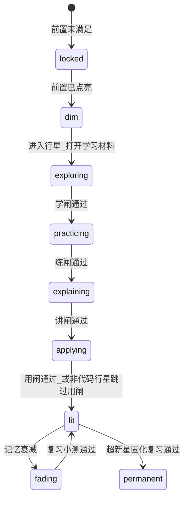
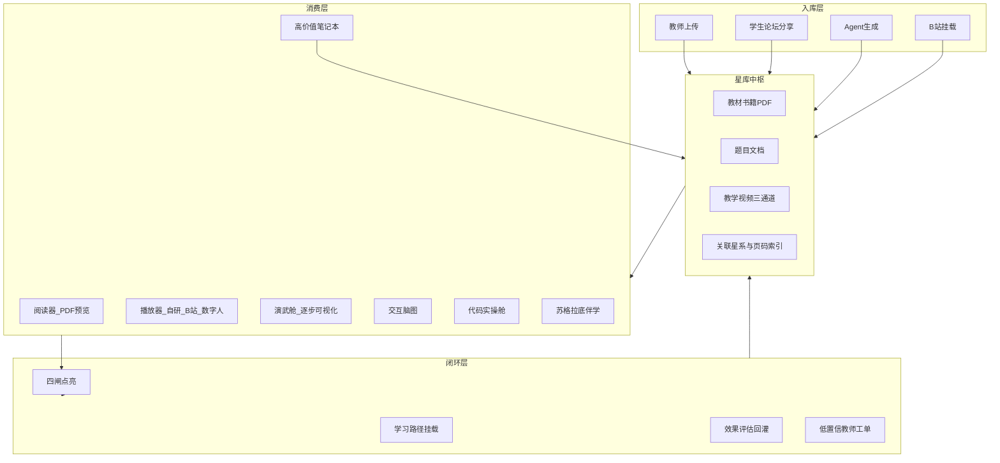

# SparkOrbit 挑战赛冲刺计划（v4）

> 已落盘：[`docs/挑战赛冲刺计划_v4.md`](docs/挑战赛冲刺计划_v4.md)  
> 实施状态（2026-07-29）：P0 主干已合入；P1/P2 主缺口已合入（资料站、路径挂载、GatePolicy、B 站、数字人面板、划词/沙箱等）。本次收口：行星数字人入口、DFS 演武、predict 扩种、成长报告热力图、deck 验收与文案对齐。

## 0. 战略判断

你们已是国三，主链路（六维画像 → 多智能体资源 → 路径 → Tutor → 评估）和星轨叙事已够用；再堆「更多小功能」不如把评委一眼能懂的缺口补成**产品级能力**：

| 评分点 | 赛题/细则原文信号 | 当前短板 | 本轮定案 |
|--------|-------------------|----------|----------|
| 附加分 5.1 | **私有知识库创建**、可扩展、讯飞 | PDF 只锻造，不能「像看视频一样看书」 | **星库 = 可浏览多模态中枢** |
| 1.2 / 防幻觉 | 资源幻觉防控、教育理念 | 页码引用仍「规划中」 | **强制 citation 贯穿生成与答疑** |
| 2.2.2 | ≥5 类资源含视频/代码 | 脑图弱；代码只能看不能跑；视频质量一般 | **交互脑图 + 代码舱 + 视频三通道** |
| 2.2.4 加分 | 多模态答疑、苏格拉底 | 有文本/语音，缺「讲给人看」 | **数字人讲解**（赛题点名 D-ID 类） |
| 2.3 创新 | **明确写「如数字人等」** | 仅有静态数字分身图 | 升级为**可讲解虚拟讲师** |
| 1.1 实用 | 贴合大学生真实场景 | 缺资料共享、缺可运行实操 | **论坛分享 + 在线跑代码** |
| **1.2 学习闭环** | 完整闭环 + 费曼/苏格拉底等教育理念 | **3 题答对 2 即 lit，甚至单题兼容点亮** | **多闸门掌握协议（学→练→讲→用）** |
| **2.2.2 / 多模态** | 代码实操 + 视频/动画；交互卡片化 | 代码只能看不能跑；缺逐步可视化 | **演武舱逐步可视化 + 代码舱真跑** |
| **笔记本价值** | 过程性学习数据进评估 | 现笔记仅私有文本框，几乎不进闭环 | **剪藏演武步骤 + AI 随堂笔记 + 闸门证据** |
| 对标学枢 3:14 | 代码高亮步进 + 数组柱状可视化 + 生成随堂笔记 | 无对等能力 | **同构能力用星轨隐喻落地（树/图/数组）** |

**明确不做**：Electron 双端大改、整站换成学枢米色仪表盘、休闲区继续扩功能；点亮流程**不加花活 UI**，改判定与阶段本身。

---

## 1. 点亮星系流程重构（多闸门掌握协议）——P0

### 1.1 现状问题（代码事实）

[`challenge.py`](backend/app/services/challenge.py) 当前口径：

- `CHALLENGE_QUESTIONS_PER_PLANET = 3`，`MIN_CORRECT_TO_LIT = 2` → **答对 2/3 选择题就 `status=lit`**
- 更糟：无会话时 **「答对单题即可点亮」** 兼容分支仍在
- 已有但未串进点亮门槛：费曼/苏格拉底 Tutor、资源工坊、记忆衰减/`is_permanent` 超新星固化、前置行星锁定

结果：星图点亮像「闯关游戏通关」，不像「学会了」——与细则 1.2「覆盖完整学习闭环、与传统方式明显区分」直接冲突。

### 1.2 定案：阶段状态机（仍叫点亮，但 lit 变贵）

`PlanetMastery.status` 扩展（或用 `mastery_phase` 字段，对外展示映射）：

| 阶段 | 含义 | 进入下一阶段条件（定案） |
|------|------|--------------------------|
| `dim` / locked | 未开/锁定 | 前置 lit |
| `exploring` | 在学 | **学闸**：有效学习证据 ≥1（见下） |
| `practicing` | 在练 | **练闸**：综合小测达标 |
| `explaining` | 在讲 | **讲闸**：费曼或口述讲解过关 |
| `applying` | 在用 | **用闸**：代码/应用题（可按行星类型豁免） |
| `lit` | 已点亮 | 四闸（或三闸）全部通过 |
| `permanent` | 超新星 | 沿用现有衰减复习固化 |

前端星图可用已有明暗/特效区分 phase，**不重做 UI 皮肤**；行星面板用步骤条展示「学/练/讲/用」进度即可。

### 1.3 四道闸门（流程，不是换皮）

**闸门 A · 学（Explore）** — 禁止「空枪上阵刷题」

至少完成下列 **1 项**（推荐组合 2 项才算稳，答辩可调教师策略）：

- 打开关联星库教材/讲义并停留或翻页 ≥ 阈值（或划词提问 ≥1）
- 观看本知识点教学视频（自研 / B 站挂载 / 数字人）有效时长达标
- 生成并打开讲解文档或思维导图（资源工坊），且有浏览事件
- **演武舱完整步进/播放**本知识点可视化轨迹（强烈推荐，答辩主路径）
- **有效笔记**（含 ≥1 条剪藏或 AI 随堂笔记）

写入 `mastery.learn_evidence[]`（asset_id / resource_id / seconds）。无证据则挑战按钮置为「先完成学习」并引导星库/工坊。

**闸门 B · 练（Practice）** — 废除「2/3 选择题」

- 题量与题型升级：默认 **5 题**，覆盖易→难；类型混合：**概念选择 + 对比辨析 + 情景应用**（至少 2 种）；有代码标签的行星插入 1 道「读代码选输出」
- 通过标准：**正确率 ≥ 80%（4/5）**，且 **不得出现「核心陷阱标签」连续错**；否则进入错题补救环（只重练错因标签题），补救通过才算练闸过
- **删除**「无会话单题答对即 lit」分支
- 出题必须吃星库 citation（与防幻觉一节打通）；低置信题不计入点亮进度

**闸门 C · 讲（Explain）** — 教育理念显性化（吃 1.2）

- 强制一次 **费曼讲解**（学生用自己的话讲清该行星；Tutor 按 rubrics 打分：完整性/准确性/举例）或等价的 **苏格拉底三问全过**
- 通过阈值：Tutor 结构化评分 ≥ 及格档；失败则给补学建议（回星库页码 / 回看视频），不点亮
- 可选用数字人「先示范讲一遍」降低挫败，但 **学生讲** 才算过闸

**闸门 D · 用（Apply）** — 真学会

- `planet` 带 `code` / 实操标签，或难度 hard：**代码舱至少 1 道微习题测例全绿**（或非代码课：简答题/案例决策题由 Evaluator 判）
- 纯概念行星可配置 `apply_required=false`，由教师/锻造元数据决定，避免所有人文概念硬写代码

**全部通过 → `lit` + `lit_at`**；触发路径刷新、评估回灌、星座成就（现有 constellation 可保留）。

### 1.4 与衰减、初测的关系（避免两套口径打架）

- **黑洞初测**（[`assessment.py`](backend/app/services/assessment.py)）：改为只点亮「探索权」或给予 `exploring` 起步分，**不再直接批量 `lit`**（或仅允许 1 颗示范行星 lit 方便演示，正式逻辑与闸门一致，演示模式可开关）
- **衰减 `fading/meteor`**：复习不再「随便一题回 lit」，改为 **缩短版练闸**（2–3 题针对错因/核心要点）通过才恢复 `lit`
- **超新星 `is_permanent`**：保持「间隔复习通过 → 永久」，作为真正「学进去了」的终态叙事

### 1.5 教师可配与答辩话术

- 班级策略：闸门开关、练闸题数、是否强制费曼、是否强制代码（写入教师面板，默认全开）
- 话术：对标「传统刷两道选择题 vs 星轨四闸掌握」；直接服务细则 **个性化学习闭环 + 费曼/苏格拉底**
- 演示：选一颗行星完整走完学→练→讲→用再点亮（比连点亮 5 颗空壳更有杀伤力）

### 1.6 主要改动面

- 后端：`challenge.py` 会话与 lit 条件；`PlanetMastery` 增 `mastery_phase` / `gate_flags` / `learn_evidence`；事件埋点；`assessment.py` 初测口径；`memory_decay.py` 复习口径
- 前端：`PlanetPanel.vue` 挑战状态机改为四步进度；挑战入口与 Tutor/星库/代码舱深链
- 不改 Three.js 星图美术，只消费新 status/phase

---

## 2. 交互演武舱（算法逐步可视化）——对标学枢 3:14

**你的意思对齐**：不是再放一段讲解视频，而是像学枢「查找与排序实战」那样——**代码当前行高亮 + 数据结构实时图画 + 步进/播放/调速 + 变量与调用栈 + 旁白解释**。二叉树就要能看见插入/遍历时节点怎么走，而不是只读文字。

### 2.1 产品形态

- 学习区 Dock / 行星面板入口：**演武舱**（`AlgoVizLab`）
- 布局（对标学枢，星轨皮肤）：
  - 左：示范代码（只读或可改参数后重生成轨迹）
  - 右：可视化画布（数组柱 / **树节点连线** / 图顶点边）
  - 上：Reset · 上一步 · 播放/暂停 · 下一步 · 跳到末 · 倍速
  - 下：本步讲解文案 + 控制台输出
  - 侧：变量表、调用栈
- 顶栏动作：**智能讲解**（数字人/Tutor 讲当前步）、**生成随堂笔记**（写入笔记本）、**送入代码舱改着跑**

### 2.2 技术定案（可演示、可控幻觉）

不做通用「任意 Python 自动可视化」（工程黑洞）。定案：

1. **轨迹协议**：统一 `VizTrace` JSON  
   `{ structure: "tree"|"array"|"graph", initial, steps:[{ line, action, highlight_nodes|bars, vars, stack, narrate, source_pages? }] }`
2. **轨迹来源（双通道）**  
   - **种子演武包**（答辩主路径）：为课程核心行星预制 6–10 个高质量轨迹（二叉树插入/中序遍历、冒泡/二分、Dijkstra 等），零幻觉、必稳  
   - **Agent 生成**：`VizAgent` 根据行星 + 星库 citation 生成轨迹，经 Schema 校验 + 可选「解释与代码行一致性」质检；失败回退种子包
3. **前端渲染器**：`TreeVizRenderer` / `ArrayVizRenderer` / `GraphVizRenderer`（SVG/Canvas）；步进引擎与学枢同构
4. **与闸门**：完整播放 ≥80% 步骤或手动步进完，计 **学闸证据**；若带「预测下一状态」小测通过，可折抵部分 **用闸**（非代码行星尤其有用）

### 2.3 和代码舱、视频的分工（避免功能打架）

| 能力 | 演武舱 | 代码舱 | Seedance 视频 |
|------|--------|--------|----------------|
| 看懂流程 | 主战场 | 辅 | 感性预览 |
| 自己改代码真跑 | 参数级 | 主战场 | 无 |
| 防幻觉 | 种子包+校验 | 测例 | 事实卡分镜 |

答辩话术：**「视频建立直觉，演武看清每一步，代码舱自己跑通」**——三角多模态，压学枢单点可视化。

---

## 3. 笔记本高价值化（从「记事本」变成学习中枢附件）

### 3.1 现状

[`NoteBook.vue`](frontend/src/components/learning/NoteBook.vue) = 私有标题+正文+附件 + 教师资料 Tab，**不进点亮、不进评估、不进分享**，价值接近零。

### 3.2 定案：笔记 = 「学习证据与知识沉淀层」

让笔记成为连接演武 / 代码 / 伴学 / 星库 / 闸门的胶水，而不是又一个输入框。

**A. 一键剪藏（最高频）**

- 演武舱当前步 →「收入笔记」：自动带上代码行、可视化缩略描述、旁白、行星 slug、页码 citation  
- 代码舱 AC/失败点 →「错因卡片」进笔记  
- 伴学/费曼对话 →「精华摘录」  
- 星库 PDF 划词 →「引用卡片」（书名+页码+原文）

**B. AI 随堂笔记（对标学枢「生成随堂笔记」）**

- 一键根据「本行星本次学习会话」生成结构化 Markdown：目标 / 要点 / 演武关键步 / 错题 / 待复习  
- 必须带 citation；可编辑后保存  
- 生成结果默认挂当前 `planet_slug`

**C. 进闭环（否则仍是摆设）**

- 学闸：有效笔记（非空且关联行星，或含 ≥1 条剪藏）可计证据  
- 讲闸前：展示「你的笔记要点」辅助费曼  
- 成长评估：笔记数量、剪藏来源分布进过程性指标  
- 资料站：笔记可「发布分享」；教师可收录进星库（与论坛打通）

**D. 轻量复习**

- 笔记内「待复习」标记 → 进入衰减复习队列或路径提醒（与 memory_decay 弱绑定即可）

### 3.3 改动面

- 模型：`Note` 增加 `blocks_json`（卡片数组：viz_clip / quote / code / chat / ai_summary）、`source`、`session_id`
- API：`POST /notes/clip`、`POST /notes/ai-summary`
- 前端：笔记改为卡片流；演武/代码/PDF/Tutor 各挂「收入笔记」；保留简单自由文本作为一种 block

---

## 4. 目标产品形态：星轨「四层」

答辩一句话：**「教材进星库 → 演武看清每一步 → 笔记沉淀 → 四闸真掌握 → 代码真跑 → 教师兜底」**。

---

## 5. 星库（核心）：可浏览的私有知识库

### 5.1 产品定义（相对 v1 的升级）

不是「只能检索的向量库」，而是对学生可见的**资源中心**（对标学枢资源中心 + 你提的「像视频一样有一个知识库」）：

- **入口**：学生学习区 Dock「星库」+ 教师端「星库治理」；可按关联星系筛选
- **资产类型**（统一 `StarAsset`）：
  - `book` / `pdf`：教材与讲义（可翻页阅读）
  - `problem_doc`：题目集 / 试卷 PDF 或 Markdown
  - `video_local`：系统 Seedance / 数字人生成片
  - `video_bilibili`：B 站 BV 链接挂载
  - `note_pack`：从论坛收录的学生资料
- **关联星系**：资产可绑定 1 个 galaxy（+ 可选 planet 标签）；锻造星系可「从星库一书生成」
- **权限**：教师上传默认班级可见；学生论坛资料默认同学可见，**教师一键收录进官方星库**后升格为校本可信源

### 5.2 阅读与播放体验

- PDF：`pdf.js` 阅读器，支持页码跳转、划词「问伴学」「加入脑图节点」
- 题目文档：列表 + 预览；可「导入代码舱出题」
- 视频：统一播放页，底部 Tab：`自研短片` | `B站精选` | `数字人讲解`
- 当前打开的资产 **自动成为问答上下文**（学枢最强话术，必须复刻）：伴学气泡显示「正在依据：《书名》p.12 / BV1xxx」

### 5.3 技术落点

- 新建：`backend/app/services/starlib.py`、`models/star_asset.py`、`/api/starlib/*`
- 增强：[`rag.py`](backend/app/services/rag.py) 分页切块 + `book_id/page_no/asset_id` metadata；`retrieve` 返回结构化 citation
- 增强：[`galaxy_forge.py`](backend/app/services/galaxy_forge.py) 全量分页（取消只取前 30 页硬限制，大文件可异步任务）
- 前端：`StarLibrary.vue`（网格+筛选）、`PdfReader.vue`、`VideoHub.vue`

---

## 6. 视频三通道（质量 + 防幻觉 + 附加叙事）

赛题原文点名 **SeeDance** 与 **D-ID 数字人**；细则要求多模态实际生成、幻觉防控。

### 6.1 通道 A：自研 Seedance 提质（已有 → 必须变好）

现状：[`resource_agents.py`](backend/app/services/resource_agents.py) MediaAgent + 字幕烧录，质量不稳、易飘题。

定案优化：

1. **脚本先于画面**：先用 RAG citation 生成「分镜教案 JSON」（概念→例子→易错点→小结），每镜绑定 `source_pages[]`；再生成无片内文字的画面 prompt（沿用现有约束）
2. **事实清单闸门**：质量评分增加「与 citation 冲突率」；冲突高则禁止出片、降级 GSAP，并开教师工单
3. **片长与结构**：固定 4–6 镜教学结构（对标学枢「均子—概念—例子—总结」），字幕必须覆盖关键定义句（从教材原句改写，非自由发挥）
4. **跨模态一致性**：同一 `planet` 的 doc/mindmap/quiz/video 共享同一份「知识点事实卡」再分支生成

### 6.2 通道 B：B 站联网 + AI 推荐

- 教师/学生可粘贴 BV 号或链接入库（`video_bilibili`）
- **AI 推荐**：根据当前行星 / 打开教材章节，调用检索（B 站开放搜索或关键词爬取接口 + LLM 重排）给出 3–5 条「相关视频」卡片：标题、UP 主、理由（贴合薄弱点维度）、一键挂载星库
- 前端用官方播放器 iframe / bilibili embed；推荐理由写入路径推送记录（服务 2.2.3 推荐案例）

### 6.3 通道 C：数字人讲解（吃 2.3 创新分）

复用已有 [`avatar_service.py`](backend/app/services/avatar_service.py) 分身图，升级为**讲解态**：

- **定案实现**（可控、可演示，不赌商用数字人额度）：
  - 虚拟讲师形象（班级默认星轨讲师 / 学生数字分身）
  - 讯飞 TTS 朗读「溯源后的讲解稿」
  - 前端数字人面板：形象 + 口型/波形动画 + 字幕 + citation 侧栏（评委观感 ≈ 数字人课）
- 进阶（时间够再加）：短片合成（形象静帧/轻量驱动 + 旁白音轨 mux），作为 `video_local` 入库
- 叙事对齐赛题推荐栈「D-ID / HeyGen」，文档写清「同等产品形态 + 国产 TTS/讯飞链路」

伴学升级：苏格拉底回答可一键「请数字人讲一遍」，形成多模态答疑（2.2.4）。

---

## 7. 思维导图优化

- 独立 [`MindmapCanvas.vue`](frontend/src/components/learning/MindmapCanvas.vue)：全屏、缩放拖拽、展开折叠、导出 Markdown（对齐赛题 Markmap 建议，底层可仍用 ECharts tree 或 markmap 二选一落地，**定案：ECharts 交互底座 + Markdown 导出**，避免大依赖风险）
- MindAgent 输出带 `planet_slug`、`source_pages[]`
- 节点动作：生成习题 / 加入路径 / 苏格拉底追问 / 打开星库页码
- 容器从 `h-64` 提升为可用的主工作区高度

---

## 8. 学习区 · 代码实操舱（硬缺口）

赛题推荐「CodeAgent + 代码执行沙箱」；学枢有 AI 教练诊断；你们 CodeAgent **只生成文本不能跑**。

### 8.1 产品

- 学习区 Dock「代码舱」：Monaco 编辑器 + 语言选择（先 Python，答辩足够）
- 能力：运行查看 stdout/stderr；内置测例；AI 三个按钮——**出题 / 提示（不直接给答案）/ 讲解（苏格拉底）**
- 与星库联动：从 `problem_doc` 或 QuizAgent 编程题「发送到代码舱」
- 与画像联动：提示强度随认知风格/薄弱点变化

### 8.2 技术定案

- **浏览器侧优先**：Pyodide 跑 Python（免服务器逃逸风险，演示稳）
- 后端保留 `/api/codelab/ai/*`：出题、提示、评测反馈、写入错题本
- 安全：若后续加服务端执行，必须 Docker 沙箱；本轮答辩以 Pyodide 为主叙事

---

## 9. 聊天区 · 星轨资料站（学生论坛）

在现有 [`ChatZone.vue`](frontend/src/components/chat/ChatZone.vue) 增 Dock「资料站」（保留班级群聊）：

- 发帖：标题、简介、附件（PDF/MD/ZIP/代码）、关联课程/行星标签
- 互动：点赞、评论、下载计数
- 治理：敏感词走现有 Shield；教师可下架；**「收录星库」**后进入官方可信源并触发 RAG 入库
- 价值叙事：UGC + 校本知识库双循环（实用性 1.1 + 附加分私有库）

---

## 10. 路径挂载与跨模态一致

- 星库资产 / 脑图节点 / 代码题 / B 站视频均可「挂载到学习路径节点」（学枢「挂载到学习路径」直接对标）
- PathPlanner 推送时展示匹配理由（画像维度可解释——赛题得分策略原文建议）
- 同一知识点生成六类资源前共享「事实卡」，降低文档与视频互相矛盾（赛题「跨模态一致性」建议）

---

## 11. 与赛题必选能力的对照（防跑偏）

冲刺增量必须服务必选，而不是另起炉灶：

| 必选 | 增量如何服务 |
|------|----------------|
| 对话画像 ≥6 维 | 星库使用、代码舱行为、论坛下载反哺 `profile_refresh` |
| 五类+资源 Agent | 脑图/视频/代码质量上升；星库成为 Agent 工具 |
| 路径规划与推送 | 挂载星库与 B 站推荐；点亮后才推进路径节点 |
| 辅导加分 | citation + 数字人；**讲闸费曼/苏格拉底** |
| 评估加分 | 闸门进度、代码测例、星库时长进成长报告 |

Agent 扩展（可写进 2.3）：**StarlibAgent**、**DigitalTutorAgent**、**CodeLabCoachAgent**、**MasteryGateAgent（闸门编排）**——与主智能体关联。

---

## 12. 实施优先级与节奏（约 3 周）

### P0（必须上车，决定能否拉开国三）

1. **多闸门点亮协议**（学→练→讲→用）
2. **演武舱**（种子轨迹包：树/数组/图逐步可视化 + 步进播放）
3. **笔记本升维**（剪藏 + AI 随堂笔记 + 计入学闸证据）
4. 星库浏览中枢 + 分页 RAG citation
5. 交互脑图
6. Seedance 分镜溯源提质
7. 代码舱（Pyodide + AI 出题/提示/讲解）——「用」闸
8. 演示脚本与证据重做

### P1（强烈建议，冲线下观感）

9. VizAgent 轨迹生成（种子包之外的扩展）
10. B 站挂载 + AI 相关推荐
11. 数字人讲解面板
12. 聊天区资料站 + 教师收录星库
13. 路径挂载与推荐理由可视化
14. 教师可配闸门策略 + 初测/衰减口径对齐

### P2（有余力）

15. 数字人讲解片 mux 入库
16. 服务端 Docker 代码沙箱
17. 演武「预测下一状态」小测折抵用闸
18. 划词即问、学习热力图进评估

### 建议排期

| 周次 | 交付 |
|------|------|
| W1 | 四闸状态机；星库+citation；演武舱种子包（≥1 树 + 1 数组）MVP；笔记剪藏 API |
| W2 | 练/讲/用闸打通；代码舱；脑图；AI 随堂笔记；Seedance 提质 |
| W3 | Viz 扩图算法；B站/数字人/资料站/路径；录屏 PPT 文档 |

---

## 13. 演示剧本（挑战赛向，系统操作 ≥60%）

1. 教师上传教材进星库并关联星系  
2. 点亮对比：旧「两道选择题」vs 四闸  
3. **学闸**：打开二叉树行星 → **演武舱**步进看插入/遍历（对标学枢 3:14）→ **一键收入笔记 / 生成随堂笔记**  
4. 练闸：混合小测 + 错因补救  
5. 讲闸：费曼（可先看笔记要点）  
6. 用闸：代码舱跑通 → **点亮**  
7. 短片 + B 站推荐；数字人可选  
8. 笔记发布到资料站 → 教师收录；工单兜底  
9. 休闲 ≤10 秒  

60 秒 pitch：**星库溯源 + 演武看懂流程 + 笔记沉淀 + 四闸掌握 + 代码真跑**。

---

## 14. 文档与附加分话术

- 将方案 §4.6「PDF 页码强制引用：规划中」改为已实现；新增「星库 / 数字人 / 代码舱 / 资料站」章节与架构图  
- 附加分清单逐条勾：讯飞 TTS/星火、私有知识库、幻觉防控、可扩展 API（`/api/starlib` 开放检索）、AI Coding 说明  
- 准备测试知识库数据集：1–2 本公开教材 PDF + 若干题库文档 + 预挂 B 站链接（提交物要求）

---

## 15. 关键文件（实施时优先改）

- 后端：`challenge.py`、`assessment.py`、`memory_decay.py`、`rag.py`、`galaxy_forge.py`、`resource_agents.py`、`media_captions.py`、`companion.py`、`avatar_service.py`、`note_service.py`；新建 `starlib.py` / `codelab.py` / `bilibili_recommend.py` / `digital_tutor.py` / `mastery_gates.py` / `algo_viz.py`
- 前端：`PlanetPanel.vue`、`NoteBook.vue`；新建 `AlgoVizLab.vue`、`viz/TreeVizRenderer.vue` 等、`StarLibrary.vue`、`MindmapCanvas.vue`、`CodeLab.vue`、`VideoHub.vue`、`DigitalTutorPanel.vue`；扩展 `ChatZone.vue`
- 数据：`backend/app/data/viz_traces/` 种子轨迹 JSON（二叉树、排序、图算法）
- 文档：`docs/作品设计实现方案.md`、`docs/evidence/*`
